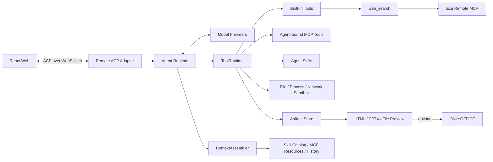

# Models Kindergarten｜模型幼儿园

Models Kindergarten 是一个面向模型、Agent 与上下文效果验证的 AI 实验与创作工作台。

当前开发和验收阶段使用本机 Web、Remote、Ollama 与 `qwen3:8b`，这只是便于低成本验证完整链路的本地测试分支，不是产品的部署定位。正式上线目标是由线上部署的 Web、Remote、模型服务、Skills/MCP 与 Artifact 服务共同提供能力，不要求用户在本机运行模型或基础设施。

“模型幼儿园”最终想解决的问题，是让同一个任务在不同模型、Agent 和上下文配置下重复运行、观察和比较，帮助人理解模型为什么表现不同，以及怎样组合提示词、工具、Skills、MCP 和历史上下文才能得到更好的结果。

上下文实验是项目的长期核心方向，但当前交互和评估方式仍在调研，产品入口暂时标记为“功能调研中”。现阶段已经可完整使用的是一条更基础、也更容易验证的产物生成闭环：

> 选择模型和 Agent → 生成 HTML 或 PPTX → 发布为 Artifact → 预览、下载、修改和跨会话复用。

## 当前推荐体验

### 1. 生成 HTML

从首页选择“网站开发”，系统会填入一份包含前端设计 Skill 安装要求的完整任务。Agent 在隔离的 Session Workspace 中编写页面与资源，再把结果显式发布为 HTML Bundle Artifact。

发布后的 HTML Bundle：

- 可以直接在浏览器内预览；
- 可以下载为包含完整资源的 ZIP；
- 不依赖 Session 临时目录；
- 同一会话可以覆盖当前内容；
- 跨会话修改时可以发布为新的可见版本。

### 2. 生成 PPTX

从首页选择“PPT 制作”，系统会填入 `http://127.0.0.1:7342/skills/pptx` Skill 和示例任务。Agent 激活 Skill 后，通过受控工具链生成可编辑 `.pptx`，再发布为 Artifact。

PPTX 支持两级预览：

- **静态预览**：浏览器解析并展示每一页，不依赖 ONLYOFFICE；
- **动画播放**：按需使用 ONLYOFFICE DocumentServer。原始 `.pptx` 始终来自 Artifact Blob Store，DocumentServer 不是业务事实来源。

本机可先拉取固定版本镜像：

```bash
docker pull --platform linux/arm64 onlyoffice/documentserver:9.4.0
```

没有启动 ONLYOFFICE 时，静态预览和原文件下载仍然可用。配置与安全边界见 [.env.example](.env.example) 和 [在线部署与 PPTX 方案](docs/ONLINE_DEPLOYMENT_RESEARCH_TRD.md)。

### 3. 复用 Artifact

Artifact 是已经发布、可以稳定引用的产物，不等同于 Session Workspace 中的临时文件。

在首页输入框键入 `@`，可以从“我的 Artifacts”中选择已有 HTML、PPTX 或其他文件，把它作为只读引用带入新会话。Agent 需要修改时，会先把内容读取到当前 Workspace，再发布覆盖结果或新版本。

## 模型、Agent 与能力

- **ModelStudent**：实际完成推理的模型，可在创建 Session 时选择模型和推理档位；
- **Agent**：保存系统提示词、内置 Tool、Skills、MCP 绑定、历史条数和权限策略；
- **Skills**：为 Agent 提供任务说明和按需读取的参考资料；
- **MCP**：为 Agent 提供远程 Tool 和 Resource；只有已安装并绑定给 Agent 的能力才会进入该轮 Runtime；
- **Artifact**：经过显式发布、可预览、下载和复用的稳定产物。

## Agent Tool 完整目录

以下是当前代码中实现的全部 Agent Tool。每一轮只会向模型暴露当前 Agent 已启用、已绑定且满足动态条件的部分。

| 类别 | Tool | 当前边界 |
| --- | --- | --- |
| 文件 | `list_files`、`read_file`、`write_file` | 只访问当前 Session Workspace；写入不会自动发布 |
| 网页与交互 | `web_search`、`web_fetch`、`ask_user` | 搜索和网页读取有网络与大小限制；`ask_user` 使用 ACP Elicitation |
| 终端 | `run_command` | 实现代码仍保留，但当前构建全局不向 Agent 暴露 |
| Artifact | `read_artifact`、`publish_artifact`、`publish_artifact_version`、`rollback_artifact` | 负责稳定产物的读取、发布、版本化和明确回滚 |
| PPTX | `build_pptx` | 在受控构建环境中执行 PptxGenJS 源码并生成可编辑 `.pptx`；生成后仍需发布 |
| Skills | `ensure_agent_skills`、`activate_skill`、`read_skill_resource` | 安装 Tool 只在用户消息包含允许的 Skill 来源时出现；另外两个 Tool 只针对当前 Agent 已绑定 Skill 出现 |
| MCP | `mcp__<server>__<tool>`、`read_mcp_resource` | 名称和数量来自当前 Agent 已绑定的 MCP Tool 与 Resource，属于动态 Tool；当前“添加远程 MCP”页面只支持 Streamable HTTP，Remote 底层仍保留受控 stdio 配置能力 |

`web_search` 是唯一需要额外说明的特殊情况：它对 Agent 表现为内置 Tool，但默认搜索上游是 `https://mcp.exa.ai/mcp` 的 Exa Remote MCP，并调用远端 `web_search_exa`。它不是“我的 MCPs”中的安装记录，也不使用 Agent 的 MCP binding；上游地址可以通过 `WEB_SEARCH_ENDPOINT` 替换。

## MCP

用户可以安装远程 MCP，再把发现到的 Tool 或 Resource 绑定给具体 Agent。当前“添加远程 MCP”页面只提供最小安装链路：

- **传输方式**：只支持远程 Streamable HTTP，不支持从页面配置或启动 stdio MCP；
- **鉴权方式**：只支持无鉴权连接，页面目前不能录入 Bearer Token、API Key 或完成 OAuth 授权；
- **网络地址**：正式服务必须使用 HTTPS。开发环境额外允许 loopback HTTP，即只指向当前机器自身的 `http://localhost`、`http://127.0.0.1` 或 `http://[::1]`；不包括 `192.168.x.x`、`10.x.x.x` 等局域网地址，也不允许公网明文 HTTP。

MCP Tool 调用通过 `McpToolProvider` 进入 ToolRuntime；模型主动读取 MCP Resource 时也会经过受控能力边界。预加载 Resource 由 ContextAssembler 组装进模型上下文。

[config/mcp.example.json](config/mcp.example.json) 是 Remote 底层配置模板，能力比页面安装流程更宽：可以配置已经安装好的受控 stdio MCP，也可以为远程 Streamable HTTP MCP 配置 **Bearer Token**。Bearer Token 通过 `authProfile` 引用环境变量或 macOS Keychain 中的 Secret，运行时再交给 MCP SDK，不会把明文写入 MCP 配置、Session 或 Trace。底层还允许用 SecretRef 注入非 `Authorization` 的自定义 Header，例如服务端约定的 `X-API-Key`。

Bearer Token 与 HTTP Basic Auth 是两种不同方式。本项目底层支持 Bearer Token，不支持把用户名和密码写进 URL，也不支持通过通用 Header 绕过 `authProfile` 设置 `Authorization`。虽然类型中预留了 `oauth`，但当前没有完整的浏览器授权、Token 刷新和客户端注册流程，因此 README 不把 OAuth 标记为已支持。上述底层配置能力不代表都能通过当前页面安装；内置 `web_search` 使用的 Exa MCP 也不属于这条管理链。

## 为什么还叫“模型幼儿园”

当前的 HTML、PPTX 和 Artifact 链路不是最终产品定位，而是上下文实验所需要的基础设施：真实模型、真实 Agent、真实 Tool 调用、权限交互和可检查产物必须先稳定，后续比较不同上下文配置才有意义。

上下文实验的实现代码目前仍保留，但首页、顶部导航、“我的”和对话内入口暂不开放。当前阶段不把它描述为已经完成的产品能力。

## 系统结构



主要边界：

- Browser 与 Remote 只通过官方 ACP 通信；
- 一个浏览器页面只有一个 ACP connection owner；
- Runtime 状态保留在 Remote，Web 只保存 UI 投影；
- MCP Tool、文件、终端、网络与脚本执行经过 ToolRuntime、权限策略和对应沙箱；
- MCP/Skill 配置、Secret、运行状态和能力快照分离，Secret 不进入日志、Session 或评测 Trace；
- 每个 Session 同时最多执行一个 Prompt。

## 本地测试分支启动

以下配置只用于当前本地开发和验收分支。`qwen3:8b` 是低成本的本地测试模型，不是正式上线版本的默认模型。要求 Node.js 22+、pnpm 11+、Ollama，以及可以运行该模型的内存。

```bash
ollama serve
ollama pull qwen3:8b
pnpm install
pnpm dev
```

本地测试地址：

- 主 Web：`http://127.0.0.1:5173`；
- Remote / Control API：`http://127.0.0.1:7331`；
- ACP：`ws://127.0.0.1:7331/acp`；
- Evaluation Web：`http://127.0.0.1:5175`；
- Evaluation API：`http://127.0.0.1:7441`；
- PPTX Skill 资源服务：`http://127.0.0.1:7342`；
- 可选 ONLYOFFICE：`http://127.0.0.1:8080`。

环境变量模板见 [.env.example](.env.example)。

## 验证

```bash
pnpm typecheck
pnpm test
pnpm build
```

## 进一步阅读

- [技术方案](docs/TECHNICAL_PLAN.md)
- [架构说明](docs/ARCHITECTURE.md)
- [ModelStudent 入园设计](docs/MODEL_ADMISSION.md)
- [Model Reasoning Policy](docs/REASONING_POLICY.md)
- [MCP / Skills 能力接入设计](docs/MCP_SKILLS.md)
- [ACP 兼容说明](docs/ACP_COMPAT.md)
- [Turn Evaluation 设计](docs/TURN_EVALUATION.md)
