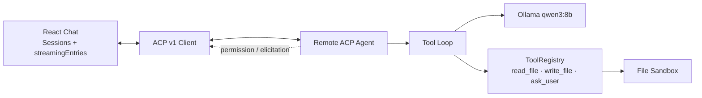

# Models Kindergarten｜模型幼儿园

完整的当前边界、技术模块和后续路线见 [完整技术方案与演进路线](docs/TECHNICAL_PLAN.md)。

React Web 通过 ACP WebSocket 连接 Remote Agent，Remote 使用本地 `qwen3:8b` 完成流式回答、沙箱文件工具和 AskUser。



## 当前能力

- 左侧 Session，右侧连续消息流与底部输入框；
- `entries` 保存稳定历史，`streamingEntries` 聚合当前 Prompt/Load；
- Message、Thought、Tool 都按第一次出现的位置固定，按 ID 原位更新；
- 本地 `qwen3:8b`，支持 thinking、流式文本和并行 `tool_calls`；
- `read_file`：读取沙箱内 UTF-8 文本；
- `write_file`：用户通过 ACP `session/request_permission` 授权后写入沙箱；
- `ask_user`：通过 ACP `elicitation/create` 在当前 Turn 内等待用户回答；
- Tool Loop 最多 8 次模型调用，同批 Tool 先全部显示，再并行执行；
- 稳定历史持久化 Message、Thought、Tool，刷新后通过 `session/load` 原序回放；
- V1 会话文件自动迁移到 V2，不丢失已有对话。

## 沙箱边界

默认沙箱为 `apps/remote/.data/sandbox`。Tool 只接受相对 POSIX 路径，并拒绝：

- 绝对路径；
- `.`、`..`、空路径段和反斜杠路径；
- 符号链接及其真实路径逃逸；
- 超过 256 KiB 的单文件读取或写入。

写操作需要逐次授权；读操作不修改状态，可直接执行。

## 本地启动

要求 Node.js 22+、pnpm 11+、Ollama，并确保机器有足够内存运行 8B Q4 模型。

```bash
ollama serve
ollama pull qwen3:8b
pnpm install
pnpm dev
```

Web 默认地址为 [http://127.0.0.1:5173](http://127.0.0.1:5173)，端口占用时 Vite 会选择下一个端口。Remote：

- ACP：`ws://127.0.0.1:7331/acp`
- Health：`http://127.0.0.1:7331/health`
- 配置：`.env.example`

## 验证

```bash
pnpm typecheck
pnpm test
pnpm build
```

测试覆盖聊天归约、Tool 乱序、Session 隔离、Cancel、WebSocket、沙箱逃逸、写入授权、AskUser、读写 Tool Loop 和 Tool 历史回放。

## 仍不进入当前版本

Java/RCS、EventBus、第二套 RuntimeEvent、Shell Tool、网络 Tool、Artifact、Memory、课程系统、多 Agent、自动重连以及 AgentVersion 管理。

协议依据：[ACP Tool Calls](https://agentclientprotocol.com/protocol/v1/tool-calls)、[ACP Elicitation](https://agentclientprotocol.com/protocol/v1/elicitation)、[Ollama Tool Calling](https://docs.ollama.com/capabilities/tool-calling)。
