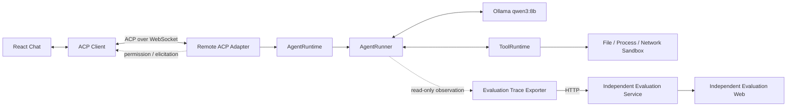

# Models Kindergarten｜模型幼儿园

V1.5 是一条可运行的常规单 Agent 最小完整链路：React Web 通过 ACP WebSocket 连接 Remote Agent，Remote 使用本地 `qwen3:8b` 进行流式推理、权限交互和受控工具循环。每次 Prompt Turn 完成后，独立 Evaluation Service 会保存 Runtime Trace 并计算最小客观评分集。

完整设计见 [技术方案](docs/TECHNICAL_PLAN.md)，评测边界见 [Turn Evaluation 设计](docs/TURN_EVALUATION.md)，ACP 边界见 [ACP 兼容说明](docs/ACP_COMPAT.md)。



## 当前能力

- `sessionEntries + streamingSessionEntries` 是 Remote 唯一 Session 事实源；
- `historyChatEntries + streamingChatEntries` 是 Web UI 投影；
- `modelMessages` 由 ContextBuilder 从同一事实源生成；
- 多轮 user/assistant/tool 上下文，Thought 不回填模型；
- 原生 Structured Tool Calling 和并行 Tool 聚合；
- `list_files`、`read_file`、`write_file`、`run_command`、`web_search`、`web_fetch`、`ask_user`；
- 写文件需要 ACP Permission，终端每次都需要 Permission；
- `ask_user` 使用 ACP Elicitation；
- Tool 参数校验、结构化 ToolOutcome、精确重复调用拦截；
- ToolCallLedger 精确去重，并向模型返回先前结构化结果；
- 分布式错误识别、ACP 详细错误文案和 Web PromptTurnState 集中归约；
- Ollama 与 Web 外部依赖有限重试、熔断；
- 文件路径/大小/符号链接沙箱；macOS 终端写入与网络沙箱；网页 SSRF 和大小限制；
- Session V1/V2 自动迁移到 V3，Prompt 事实批量原子提交；
- `load` 完整回放、`resume` 零回放、单 Session 单 Prompt、Cancel 传播。
- 独立 Turn Evaluation Service/Web，按 `sessionId + turnId` 查看 Runtime 执行树和 13 项最小客观指标；
- Evaluation 上传失败与 Agent 主链隔离，不改变 Prompt Turn 的完成结果。

V1.5 完全不实现 Plan、`update_plan`、Planner/Executor 或 Workflow/DAG。

## 本地启动

要求 Node.js 22+、pnpm 11+、Ollama，以及可以运行 `qwen3:8b` 的内存。

```bash
ollama serve
ollama pull qwen3:8b
pnpm install
pnpm dev
```

默认地址：

- Web：`http://127.0.0.1:5173`，端口占用时 Vite 自动选择下一端口；
- ACP：`ws://127.0.0.1:7331/acp`；
- Health：`http://127.0.0.1:7331/health`；
- Evaluation Web：`http://127.0.0.1:5175`（从完成后的聊天 Turn 跳转）；
- Evaluation API：`http://127.0.0.1:7441`；
- 配置模板：[.env.example](.env.example)。

## 验证

```bash
pnpm typecheck
pnpm test
pnpm build
```

自动测试覆盖 ACP Session、真实 WebSocket、流式 UI 归约、Tool 乱序、权限、AskUser、Session 恢复、重复调用去重、历史 Tool Result 上下文、终端沙箱、私网 URL 拦截，以及 Trace 聚合、最小评分、Evaluation HTTP 存取和 Runtime Tree 顺序。

## 暂不进入 V1.5

Plan、通用 Runtime Event Store、长期记忆、RAG、多 Agent、MCP 管理平台、云容器、多租户、语义相似判重、批量 Dataset Benchmark、LLM-as-Judge 和模型横向对比。
