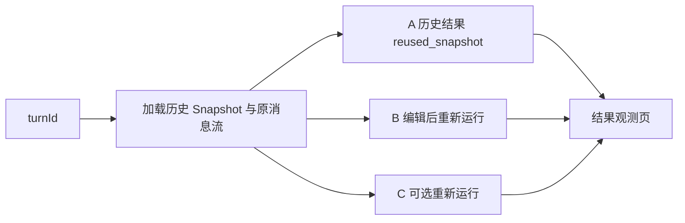
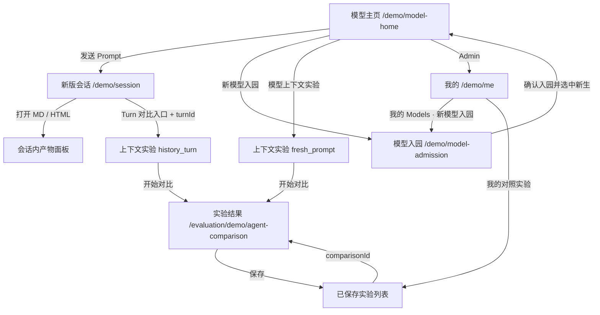
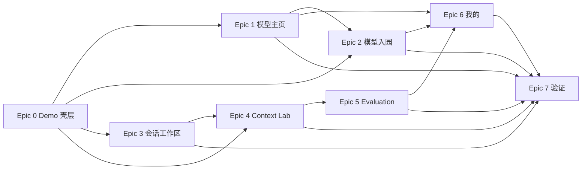

# Models Kindergarten 新版前端 Demo App Spec

> 来源：2026-08-10 用户需求、三张标注截图、当前聊天与 Evaluation Demo 源码。  
> 目标：为新版产品方向提供可交互、全写死数据的前端 Demo；不改造现有真实 ACP 会话页面。  
> 版本：1.2（2026-08-11 增补 ModelStudent 入园 Demo）

## 0. 结论与关键决策

### 0.1 Demo 路由与代码边界

| 页面 | Route | 代码目录 | 数据来源 |
|---|---|---|---|
| 模型主页 | `/demo/model-home` | `apps/web/src/demo/model-home/` | 写死 |
| 新模型入园 | `/demo/model-admission` | `apps/web/src/demo/model-admission/` | 写死检测 + `sessionStorage` 模拟，禁止保存 Key |
| 新版会话页 | `/demo/session` | `apps/web/src/demo/session/` | 写死 |
| 模型上下文实验页 | `/demo/context-lab` | `apps/web/src/demo/context-lab/` | 写死 |
| Agent 编辑页 | `/demo/agent-editor` | `apps/web/src/demo/agent-editor/` | `sessionStorage` 模拟 |
| 我的 | `/demo/me` | `apps/web/src/demo/me/` | 写死 |
| 对比实验结果观测页 | `/evaluation/demo/agent-comparison` | `apps/evaluation-web/src/demo/agent-evaluation/` | 写死 |

- Web Demo 共享壳层、Mock 数据和通用组件全部放在 `apps/web/src/demo/`。
- Evaluation Demo 的新增代码继续放在现有 `apps/evaluation-web/src/demo/`。
- 真实聊天 `apps/web/src/App.tsx`、ACP Client、Store、ChatEntry reducer 和真实会话组件不承担 Demo 状态。
- Web 入口只增加一个按 `/demo/*` 分流的薄路由门；非 Demo Route 仍挂载原来的 `App`。
- Demo 不请求 Remote、Evaluation Service 或 Ollama，不创建第二个 ACP connection owner。

### 0.2 视觉基线

- 继承当前聊天的白色/暖灰、细分割线、紧凑字号、Lucide 线性图标。
- 消息流仍以用户气泡为 Turn 锚点，上下文、思考、工具按首次出现顺序排列。
- 不使用黑色 Inspector、渐变、发光、悬浮指标卡或 Runtime Timeline。
- Evaluation Demo 从当前浅色样式继续演进，不恢复旧的深色标注面板。
- 新页面的主要信息层级由留白、字重和分割线建立，不依赖彩色卡片。

### 0.3 本期范围

**包含：** 当前 Web/Evaluation Demo 页面、三入口 ModelStudent 入园流程、两种上下文实验模式、MD/静态 HTML 产物预览、可拖动分栏、实验保存交互和我的页面资源列表。

**不包含：** 真实 Provider 请求、SecretStore、Remote 模型管理 API、入园即评分、真实登录、真实 Context API、真实实验运行、长期记忆后端、真实保存与搜索、HTML 脚本执行。

### 0.4 需求清单

| # | 能力 | 用户动作 | 主要对象 | 优先级 |
|---|---|---|---|---|
| 1 | 模型主页 | 选择示例、输入 Prompt、查看历史、进入实验 | ModelStudent、最近会话 | P0 |
| 2 | 新版会话工作区 | 切换会话、收起侧栏、打开/关闭产物、拖动分栏 | DemoSession、DemoArtifact、DemoTurn | P0 |
| 3 | Context Lab | 编辑 Prompt、切换/添加版本、裁剪上下文、开始对比 | ExperimentDraft、ContextVersion | P0 |
| 4 | 实验结果观测 | 切换实验、展开消息流、标注、保存 | ComparisonRecord、DemoStreamItem | P0 |
| 5 | 我的 | 搜索/分页实验、查看 Models/MCPs/Skills | AdminProfile、ResourceList | P1 |
| 6 | ModelStudent 入园 Demo | 选择 Ollama、硅基流动或自定义 Responses，模拟连接与能力体检后入园 | ProviderConnection、ModelStudent View Model | P0 |

### 0.5 角色与平台约束

- 当前只有写死的 `Admin` 账号；所有 Demo 页面均视为 Admin 已登录。
- 未登录、普通用户、共享与权限管理不在本期实现，但保存记录必须预留 `ownerId` 归属语义。
- 桌面是主要展示面；分栏完整体验目标宽度为 1024px 以上。
- 320–1023px 提供不溢出的降级布局，不强行在窄屏并排两个 300px 面板。
- 所有按钮、折叠、Tab、分割线需有键盘焦点；拖动分割线需提供键盘替代操作。

---

## 1. 上下文实验编辑的两种模式

不建议让两种入口共用一个模糊的“Context Draft”状态。它们共享编辑器，但基线来源和运行规则不同，应明确为两个模式：

| 维度 | 历史 Turn 对照模式 | 新 Prompt 策略模式 |
|---|---|---|
| 内部模式名 | `history_turn` | `fresh_prompt` |
| 入口 | 会话 Turn 下方“进行上下文编辑对比实验” | 模型主页“模型上下文实验” |
| URL | `/demo/context-lab?mode=turn&turnId=turn-demo-731` | `/demo/context-lab?mode=new` |
| Prompt | 历史用户气泡，只读 | 多行输入框，可编辑 |
| A 版本 | 历史原始上下文，锁定 | 标准上下文策略，可编辑 |
| B 版本 | 从历史上下文复制出的可编辑策略 | 对照策略，可编辑，初始复制 A |
| C 版本 | 可选，可编辑 | 可选，可编辑 |
| 最少/最多 | 2 / 3 | 2 / 3 |
| 原结果 | 直接复用，不重新执行 | 无原结果 |
| 新版本 | B/C 重新执行 | A/B/C 全部重新执行 |

### 1.1 历史 Turn 对照模式

#### 入口与加载

- 会话 Demo 的上下文提要行内增加文字按钮“进行上下文编辑对比实验”。
- Route 只携带 `turnId`；不把 Prompt、上下文 JSON 或回答塞进 URL。
- 未来生产版由后端按 `turnId` 返回：用户 Prompt、原始 Context Snapshot、原始消息流结果、模型与 Token 事实。
- 如果某个历史 Turn 没有 Context Snapshot 或完整结果，入口禁用并解释“该历史 Turn 未保存实验所需快照”，不得静默重新跑 A 版本。

#### 页面初始状态

- 顶部展示历史用户气泡和时间、模型、Turn 短 ID；气泡不可编辑。
- 左侧至少存在两个版本：
  - **A · 历史原始上下文**：锁定、不可重命名、不可删除、不可修改。
  - **B · 对照策略**：从 A 的结构化策略复制，可编辑。
- 可添加 **C · 对照策略 2**；达到 3 个后隐藏添加按钮。
- B 默认复制 A，而不是恢复全局默认策略。这样第一次修改只产生一个可解释变量，比较更可信。

#### 运行规则



- A Lane 的状态必须标注“历史结果 · 未重跑”。
- B/C Lane 标注“本次运行”。
- A 直接载入保存的上下文、思考、工具、回答和 Token 事实；模型调用数为 0。
- B/C 使用同一 Prompt 与同一 ModelStudent，只改变 Context 策略。
- 若 B 与 A 完全相同，“开始对比实验”禁用，并提示至少修改一项策略；避免无意义重跑。

### 1.2 新 Prompt 策略模式

#### 页面初始状态

- 顶部为可编辑多行 Prompt 输入框。
- 初始直接创建两个版本，满足“至少两种才能对比”：
  - **A · 标准策略**：可编辑。
  - **B · 对照策略**：初始复制 A，可编辑。
- 最多添加 C；仅当有 3 个版本时允许删除 C，始终保持至少 2 个版本。
- A/B 初始相同，因此按钮先提示“请修改至少一个策略差异”。

#### 运行规则

- Prompt 非空、版本数为 2–3、每个版本通过校验、至少存在一个策略差异后，按钮可用。
- A/B/C 全部是新运行，不存在复用 Lane。
- 结果页将每种策略显示为一栏，并保留每栏完整的消息流投影。

### 1.3 共用策略编辑器

第一版采用“结构化模块 + 少量裁剪选项”，不做任意拖拽排序或复杂规则语言。

| 模块 | 默认 | 第一版编辑能力 | 说明 |
|---|---:|---|---|
| 系统提示 | 开 | 开关；编辑文本 | 历史 A 只读 |
| 工具说明 | 开 | 开关；勾选工具 | 显示工具数与预计 Token |
| Skills 索引 | 开 | 开关；勾选已 Ready Skill | Context Lab 不提供安装入口；安装入口位于“我的 Skills”和 Agent 编辑页 |
| 长期记忆 | 关 | Demo 开关与 Top K 占位 | 真实 V1.6 尚不接入，只表达未来界面 |
| 聊天历史 | 开 | 开关；最近 N 轮；Token 上限 | `N` 与 Token 上限二选一为主裁剪策略 |
| 当前 Prompt | 必带 | 不可关闭 | 新模式可编辑 Prompt；历史模式只读 |

编辑区结构：

```text
┌───────────────┬──────────────────────────────────────────┐
│ A 标准策略     │ 策略名称                 约 1.2k tokens │
│ B 对照策略 ●   │──────────────────────────────────────────│
│ C 对照策略     │ [开] 系统提示             [展开编辑]     │
│               │ [开] 工具说明  6 项         [选择]       │
│ + 添加版本     │ [开] Skills    4 项         [选择]       │
│ 2–3 个版本     │ [关] 长期记忆               [Demo]       │
│               │ [开] 聊天历史  最近 6 轮     [裁剪]       │
│               │──────────────────────────────────────────│
│               │ 模型输入预览（只读折叠，Ollama JSON）    │
└───────────────┴──────────────────────────────────────────┘
```

- 每个模块可以展开；编辑控件在同一层，不做卡片套卡片。
- “模型输入预览”复用当前 ModelStudent 的适配层格式，默认收起，用于验证策略结果，不作为主要编辑入口。
- 历史 A 的模块仍可展开查看，但控件使用只读样式和锁图标。

### 1.4 “开始对比实验”按钮位置与状态

- 固定在 Prompt/历史气泡下方、版本 Tab 上方，符合用户指定位置。
- 按钮右侧显示“2 个版本”或“3 个版本”，历史模式额外显示“1 个历史结果将复用”。

| 状态 | 按钮行为 |
|---|---|
| Prompt 为空 | 禁用，“请输入实验问题” |
| 版本少于 2 | 禁用，“至少需要两个版本” |
| 版本超过 3 | UI 不允许产生该状态 |
| 策略完全相同 | 禁用，“至少修改一个策略差异” |
| 历史 Snapshot 缺失 | 禁用，“历史快照不可用” |
| 有未保存编辑 | 可运行；离开页面时提示丢弃 |
| 校验通过 | 跳转结果页，显示 Demo 运行过渡态 |

---

## 2. 页面与导航总览



### 2.1 全局 Demo 导航

- 顶部左侧：ModelStudent；已有内置模型显示静态示例分数，新入园模型显示“待评测”。
- 顶部主入口：模型主页、会话 Demo、模型上下文实验。
- 顶部右侧：Admin 头像/文字入口，点击进入“我的”。
- “新模型入园”进入 `/demo/model-admission`；“我的 Models”中的同名入口进入相同页面，不复制第二套流程。
- 当前页面使用浅灰底或字重区分，不使用高饱和导航色。

---

## 3. 页面规格

## 3.1 模型主页

- **Route：** `/demo/model-home`
- **目标：** 展示 ModelStudent 能力与最近会话，并发起新会话或上下文实验。
- **约束：** 没有左侧会话列表；不是聊天页。

### 布局

```text
┌──────────────────────────────────────────────────────────┐
│ ModelStudent  53分  我的模型也要入学      Admin           │
├──────────────────────────────────────────────────────────┤
│                         毕业帽                           │
│                 今天想让模型学习什么？                   │
│     [小说创作]       [网站开发]       [模型上下文实验]    │
│                 ┌────────────────────┐                   │
│                 │ 贴近主视图的输入框 │ [发送]             │
│                 └────────────────────┘                   │
│                                                          │
│ 最近会话                                      查看更多    │
│ 会话 1                                                    │
│ 会话 2                                                    │
│ 会话 3                                                    │
└──────────────────────────────────────────────────────────┘
```

### 核心规则

- 删除截图中的模型说明段落，降低重复信息。
- 输入框放在三个能力入口正下方，不吸底、不做 fixed composer。
- “小说创作”点击后填充 Prompt 示例；“网站开发”直接覆盖输入框已有内容，填入包含三个公开 Skill URL、`ensure_agent_skills` 与静态网站任务的完整可编辑模板。两者都不自动发送。
- “模型上下文实验”直接进入 `mode=new`。
- “新模型入园”直接进入 `/demo/model-admission`，不再切换占位提示。
- 发送按钮进入 `/demo/session?draft=home-prompt`；会话 Demo 消费主页保存的 Prompt、ModelStudent 和 Agent。网站开发模板会触发纯前端安装状态演示，不请求真实 Remote。
- 最近会话默认 3 条；“查看更多”在原位置展开到 6 条，再变为“收起”。
- 点击历史记录进入 `/demo/session?sessionId=demo-session-x`。

### 状态

| 状态 | 表现 |
|---|---|
| 默认 | 三个能力入口、空输入框、3 条历史 |
| 已选示例 | 输入框被对应 Prompt 替换并保持可编辑；网站开发模板允许长 URL 换行 |
| 输入为空 | 发送禁用 |
| 展开历史 | 显示 6 条，按钮变“收起” |

## 3.2 新模型入园 Demo

- **Route：** `/demo/model-admission`
- **目标：** 让小白通过选择来源、配置连接和能力体检，把一个新 ModelStudent 加入当前 Demo。
- **约束：** 只模拟前端交互；不请求 Remote、Ollama、硅基流动或自定义 Base URL，不创建 ACP connection owner。

### 三个入口

| 入口 | 协议语义 | 默认字段 | 模型选择 |
|---|---|---|---|
| 本地 Ollama | `ollama_native` | 服务地址，默认 `http://127.0.0.1:11434`；无 Key | 模拟读取本地模型列表 |
| 硅基流动 | `openai_chat_completions` | API Key；Base URL 固定且默认隐藏 | 模拟读取文字聊天模型目录 |
| 自定义 Responses | `openai_responses` | 连接名称、HTTPS Base URL、API Key、模型 ID | 模型 ID 手填，目录发现仅为未来增强 |

页面不展示其他服务商，不提供任意协议自动识别，也不把硅基流动与自定义 Responses 合并为一个模糊的“OpenAI Compatible”。

### 布局

```text
┌──────────────────────────────────────────────────────────┐
│ TopNav                                                   │
├──────────────────────────────────────────────────────────┤
│ ← 返回   新模型入园             1 选择 · 2 连接 · 3 体检  │
│                                                          │
│ ┌──────────────────────────────┐ ┌─────────────────────┐ │
│ │ 来源卡 / 连接表单 / 模型选择 │ │ 状态、能力与安全说明 │ │
│ │                              │ │                     │ │
│ │ [上一步]             [继续]  │ │ 连接与体检结果       │ │
│ └──────────────────────────────┘ └─────────────────────┘ │
└──────────────────────────────────────────────────────────┘
```

- 桌面使用左主右辅结构，延续暖白、细灰边线和深灰主按钮。
- `< 760px` 时变为单列，状态说明位于表单之后；最小 320px 不产生横向滚动。
- Stepper 使用可读文字，不只依赖颜色；失败信息使用 `role="alert"`，异步阶段使用 `aria-live="polite"`。

### 页面流程与状态

```text
selecting_provider
  → editing_connection
  → testing_connection
  → selecting_model
  → probing_capabilities
  → ready
  → saving
  → 返回模型主页
```

- 修改任何连接字段都使旧检测结果失效并返回 `editing_connection`。
- Demo 使用确定性短延迟模拟 testing/probing；输入包含 `invalid` 时进入可重试失败态。
- 连接失败保留来源与字段，但错误摘要不得回显 Key。
- Key 只存在于页面 React 内存；不得写入 URL、`demo-data.ts`、`localStorage` 或 `sessionStorage`，离页及确认入园后清空。
- 确认入园只持久化不含 Key 的 ModelStudent 与非敏感连接摘要，并把新生设为当前选中模型。

### 能力体检与完成态

- 就近展示流式输出、Tool Calling、Token Usage、推理输出四项状态：支持、不支持或未验证。
- Tool Call 不支持时仍可入园，但标记“仅聊天”；体检不能调用真实文件、网络、MCP 或其他 Tool。
- 体检不是模型评分。新生的 `score` 为 `null`，UI 显示“待评测”，不得显示“0 分”。
- 确认入园后回到 `/demo/model-home?admitted=1`，模型选择器自动选中新生；“我的 Models”同步出现该记录。

完整生产边界、领域模型和后续 Adapter 计划见 [ModelStudent 入园设计](MODEL_ADMISSION.md)。

## 3.3 新版会话页 Demo

- **Route：** `/demo/session`
- **目标：** 演示 Admin 会话、完整消息流和产物工作区。
- **约束：** 不复用真实会话状态，不发 ACP 请求。

### 默认布局

```text
┌──────────────┬───────────────────────────────────────────┐
│ Admin 会话栏  │                 聊天宽屏                  │
│ [收起]        │                                           │
│ + 新对话      │ 用户气泡                                  │
│ 会话列表      │ 上下文提要 · 进行上下文编辑对比实验        │
│ ...           │ 思考 / Tool / 回答                        │
│ Admin         │                                  Composer │
└──────────────┴───────────────────────────────────────────┘
```

### 产物打开布局

```text
┌──────────┬─────────────────────────┬─┬────────────────────┐
│ 会话栏    │ README.md            × │↔│ 聊天（min 300px）  │
│ 可收起    │─────────────────────────│ │ 消息流              │
│          │ Markdown 渲染内容       │ │ Composer            │
│          │ （min 300px）           │ │                     │
└──────────┴─────────────────────────┴─┴────────────────────┘
```

### 会话栏

- 展开宽度建议 248px；收起后保留 56px 图标 Rail，含展开按钮和 Admin 头像。
- 列表为 Admin 的写死历史，选中态与真实聊天一致。
- 收起/展开不改变当前会话、文件打开状态和分栏比例。

### 产物面板

- 从聊天中的产物链接打开；Demo 提供 `README.md` 和 `landing.html` 两个示例。
- 顶栏左侧显示完整文件名及后缀，超长时中段省略并保留 title。
- 顶栏右侧只有关闭按钮；关闭后恢复聊天宽屏，并保留聊天滚动位置。
- Markdown 使用与聊天一致的 Streamdown/Markdown 渲染语义。
- HTML 使用 `iframe srcDoc`，必须使用禁止脚本和外部导航的 sandbox；只展示静态产物。

### 分栏拖动

- Artifact 与 Chat 各自最小 300px。
- 拖动只改变两者比例，不改变会话栏宽度。
- 当容器刚好达到 600px 时停止继续拖动。
- 分割线支持鼠标、触控和键盘左右键；双击恢复 56/44 默认比例。
- 桌面宽度不足以同时满足 300 + 300 时，不继续压缩：切换为 Artifact 主视图，Chat 成为可打开的侧层。

### 消息流

- Demo Stream 至少包含：用户气泡、上下文提要、思考、2 个工具调用、Markdown 回答、MD/HTML 产物链接、Token 小字。
- “进行上下文编辑对比实验”仅插入 Demo 的上下文提要行；真实 `ContextSummaryEntryView` 不改。
- 入口点击携带 `turnId`，进入历史 Turn 对照模式。

## 3.4 模型上下文实验页

- **Route：** `/demo/context-lab?mode=new|turn&turnId=...`
- **目标：** 配置 2–3 种上下文策略并启动对比。
- **布局：** 顶栏 → Prompt/历史气泡 → 主 CTA → 左侧竖向版本 Tab + 右侧编辑区。

### 响应式

| 宽度 | 行为 |
|---|---|
| `>= 1024px` | 240px 版本栏 + 自适应编辑区 |
| `768–1023px` | 版本栏缩为 184px，编辑区保持单列 |
| `< 768px` | 版本 Tab 改为横向滚动条，编辑区在下方 |

### 页面状态

| 状态 | 表现 |
|---|---|
| `new / default` | 可编辑 Prompt，A/B 可编辑 |
| `turn / loaded` | Prompt 气泡，A 锁定，B 可编辑 |
| `turn / missing` | 快照不可用说明，开始按钮禁用 |
| `invalid` | 左侧版本显示问题标记，问题定位到模块行 |
| `ready` | 开始按钮可用，显示将运行/复用的 Lane 数 |
| `leaving_dirty` | 弹出“放弃本次策略编辑？” |

## 3.5 对比实验结果观测页

- **Route：** `http://127.0.0.1:5175/evaluation/demo/agent-comparison`
- **目标：** 对比 2–3 个完整 Agent 消息流、继续人工标注，并选择性保存结果。

### 页面结构

```text
┌───────────────┬──────────────────────────────────────────┐
│ 已保存实验列表 │ ←  上下文对比实验          [保存本次结果] │
│ 搜索/日期      │ 用户任务 + 回答模式 / 标注模式             │
│ ● 当前选中     │──────────────────────────────────────────│
│ 实验 09        │ Lane A        Lane B        Lane C        │
│ 实验 08        │ Context       Context       Context       │
│ ...            │ Thought       Thought       Thought       │
│                │ Tool          Tool          Tool          │
│                │ Answer        Answer        Answer        │
└───────────────┴──────────────────────────────────────────┘
```

### Answer Mode 修正

当前源码把每个 Agent 的 `answerSections` 合并为 `.answer-copy` 纯文本。新版改成每栏独立的 `DemoChatStream`：

1. 策略/来源 Header；
2. 折叠上下文提要，可展开模块与 Token；
3. 折叠思考；
4. 一个或多个 Tool Call，展示输入、输出与状态；
5. Markdown 最终回答；
6. 每栏输入/输出 Token 小字。

- 不在每栏重复全局用户 Prompt。
- 事件按首次出现顺序展示，不能按工具完成顺序重排。
- 历史 A Lane 显示“历史结果 · 未重跑”；新 Lane 显示“本次运行”。
- 现有标注模式、需求理解、规划、输出、执行和总结 Tab 保留。

### 左侧实验列表

- 列表只包含已经保存的实验。
- 从 Context Lab 新进入的未保存结果只显示在右侧主视图，Header 标记“未保存”；左侧列表不产生临时项，也没有选中项。
- 未保存离开后再次进入，该结果不存在。
- 点击保存后，结果作为正式记录插入列表第一条并成为选中项。
- 从“我的对照实验”携带 `comparisonId` 进入时，自动选中该项；如果位置靠后，列表容器自动调整滚动位置，保证选中项完整可见。

### 保存按钮

- 删除右上角 `Mock Data` 与 `UI Demo` 两个 Badge。
- 替换为“保存本次对照实验结果”。
- 状态：`可保存 → 保存中 → 已保存`；已保存状态不可重复创建。
- Demo 仅在浏览器本次生命周期模拟保存；生产版再接持久化 API。

## 3.6 我的页面

- **Route：** `/demo/me?tab=experiments|agents|models|mcps|skills`
- **目标：** 展示 Admin 身份及个人资源入口。

### 布局与 Tab

- 左侧个人信息：头像 A、昵称 Admin、账号说明“本地 Demo 账号”。
- 右侧 Tab：我的对照实验、我的 Agents、我的 Models、我的 MCPs、我的 Skills。
- 默认打开“我的对照实验”。

| Tab | Demo 内容 | 交互 |
|---|---|---|
| 我的对照实验 | 搜索框、10 条/页、分页、状态/日期/版本数 | 点击行进入结果页并携带 `comparisonId` |
| 我的 Agents | 当前可编辑 Agent 列表 | 点击进入同一 Agent 的编辑页；没有 Version/Revision 页面 |
| 我的 Models | 内置模型与本次入园的新生列表 | 显示 Provider、模型 ID、能力标签和“待评测”；提供“新模型入园”入口 |
| 我的 MCPs | 4 条 MCP 列表示例 | 显示连接类型与静态状态 |
| 我的 Skills | 用户级 Skill 列表与 URL 安装框 | 模拟 queued/fetching/validating/publishing/ready；只入库，不修改 Agent |

### 搜索与分页

- 搜索对名称、Prompt 摘要和模型名做前端包含匹配。
- 每页 10 条；无结果时显示“没有匹配的对照实验”。
- 点击实验行进入 `...agent-comparison?comparisonId=cmp-demo-009`。

---

## 4. Demo 数据对象

这些是前端 Demo View Model，不是生产 API Schema。

```ts
type DemoProviderPresetId = "ollama" | "siliconflow" | "custom_responses";
type DemoProviderProtocol = "ollama_native" | "openai_chat_completions" | "openai_responses";
type DemoAdmissionPhase =
  | "editing"
  | "testing"
  | "selecting_model"
  | "probing"
  | "ready"
  | "saving"
  | "failed";

interface DemoModelStudent {
  id: string;
  name: string;
  model: string;
  provider: string;
  protocol: DemoProviderProtocol;
  baseUrl: string;
  credentialHint?: string;
  capabilities: {
    streaming: "supported" | "unsupported" | "unverified";
    toolCalls: "supported" | "unsupported" | "unverified";
    usage: "supported" | "unsupported" | "unverified";
    reasoning: "supported" | "unsupported" | "unverified";
  };
  score: number | null;
  state: "在读" | "旁听" | "待评测" | "不可用";
}

type ContextExperimentMode = "fresh_prompt" | "history_turn";
type VersionRunPolicy = "run" | "reuse_snapshot";

interface DemoContextVersion {
  id: "a" | "b" | "c";
  name: string;
  locked: boolean;
  runPolicy: VersionRunPolicy;
  modules: DemoContextModule[];
  estimatedTokens: number;
}

interface DemoExperimentDraft {
  id: string;
  mode: ContextExperimentMode;
  turnId?: string;
  prompt: string;
  model: "qwen3:8b";
  versions: DemoContextVersion[];
}

interface DemoStreamItem {
  id: string;
  type: "context" | "thought" | "tool" | "assistant";
  status: "pending" | "running" | "completed" | "failed";
  payload: unknown;
}

interface DemoComparisonRecord {
  id: string;
  title: string;
  prompt: string;
  saved: boolean;
  createdAt: string;
  selectedVersionId: string;
  lanes: Array<{
    version: DemoContextVersion;
    stream: DemoStreamItem[];
  }>;
}
```

### 不变量

- `versions.length` 只能是 2 或 3。
- `history_turn` 的 A 必须是 `locked: true` 与 `runPolicy: reuse_snapshot`。
- `fresh_prompt` 的所有版本必须是 `runPolicy: run`。
- 每个 Lane 内 `DemoStreamItem` 顺序固定，不按完成时间排序。
- `saved: false` 的结果不能出现在“我的对照实验”和左侧已保存列表。
- 入园持久化数据不能包含 `apiKey`、Authorization Header、完整 credential 或自定义 Header。
- `score === null` 必须投影为“待评测”，不能转换成 0。

---

## 5. 共用组件清单

| 组件 | 使用页面 | 关键行为 |
|---|---|---|
| `DemoTopNav` | 主页、模型入园、Context Lab、我的 | 统一 ModelStudent/Admin 导航 |
| `DemoSessionRail` | 会话 | 展开/收起、Admin 会话列表 |
| `DemoPromptComposer` | 主页、Context Lab | 主页紧邻能力入口；Context Lab 多行输入 |
| `ProviderCards` | 新模型入园 | 只显示 Ollama、硅基流动、自定义 Responses 三个来源 |
| `ConnectionForm` | 新模型入园 | 按来源显示字段；字段改变即使旧检测失效 |
| `CapabilityProbePanel` | 新模型入园 | 就近显示连接、流式、Tool、Usage 与推理状态 |
| `ModelStudentList` | 主页、我的 Models | 合并内置模型和本次生命周期入园的新生，正确显示待评测 |
| `DemoChatStream` | 会话、Evaluation Answer Mode | Context/Thought/Tool/Answer 顺序投影 |
| `DemoContextDisclosure` | 会话、Evaluation | 折叠模块与 Token；会话变体带实验入口 |
| `DemoArtifactPanel` | 会话 | MD/HTML 两种 Renderer 与关闭顶栏 |
| `DemoSplitPane` | 会话 | 两侧 min 300px、拖动与键盘调整 |
| `ContextVersionRail` | Context Lab | 2–3 个版本、锁定、添加、删除 |
| `ContextModuleEditor` | Context Lab | 模块开关、编辑、裁剪、只读变体 |
| `ComparisonListRail` | Evaluation | 保存列表、选中 Focus、滚动可见 |
| `AdminResourceList` | 我的 | 搜索、分页和四种列表变体 |

---

## 6. 关键交互与边界状态

| 场景 | 处理 |
|---|---|
| 会话栏收起时打开 Artifact | 保持收起；Artifact 使用释放出的空间 |
| 打开第二个 Artifact | 替换当前 Artifact 内容，不叠加多 Tab |
| 关闭 Artifact | Chat 恢复宽屏与原滚动位置 |
| HTML 含脚本 | 不执行；静态 iframe sandbox |
| 分栏宽度不足 600px | 切换单主视图，不违反两侧 300px 下限 |
| Context 版本达到 3 | 添加按钮隐藏/禁用 |
| Context 版本只剩 2 | 删除按钮禁用 |
| 历史 A | 永远不可编辑、删除或重跑 |
| 两个策略完全一致 | 禁止开始，定位差异提示 |
| 未保存结果离开 | 不进入已保存列表；再次进入不存在 |
| 从“我的”打开靠后的结果 | 选中并调整左栏滚动，使其完整可见 |
| 超长文件名/会话名 | 单行省略，title 提供完整文本 |
| 入园过程中修改 Base URL、Key 或模型 ID | 清除旧连接与体检成功状态，回到编辑阶段 |
| 入园检测失败 | 保留当前非敏感字段并原地重试；不回显 Key |
| 离开或完成入园 | 清空 React 内存中的 Key；持久化对象不含 Secret |
| 新生尚未评分 | 主页选择器与我的 Models 都显示“待评测” |

---

## 7. Demo 开发任务规划

### Epic 0：Demo 壳层与隔离路由（P0）

1. 新建 `apps/web/src/demo/` 与 `DemoApp` 路由分发。
2. 建立 `demo/shared/`、`demo/data/`、统一暖灰 Token 和 Lucide 图标约束。
3. Web 入口按 `/demo/*` 加载 DemoApp；其他路径仍加载真实 App。
4. 为全部 Web Demo Route 提供互相可达的导航。

**完成标准：** 打开 Demo 不建立 ACP WebSocket；打开 `/` 仍是原真实聊天。

### Epic 1：模型主页（P0）

1. 实现无侧栏首页壳层。
2. 实现三个能力入口与就近 Composer。
3. 实现 3 条历史/查看更多/收起。
4. 实现首页到 Session、Context Lab、我的导航。

**完成标准：** Composer 不吸底；“模型上下文实验”进入 `mode=new`。

### Epic 2：新模型入园 Demo（P0）

1. 定义三种来源、独立协议语义、状态机和确定性模拟数据。
2. 实现 `/demo/model-admission` 的三步表单、错误重试、能力体检和响应式布局。
3. 把主页静态入口改为路由，并为“我的 Models”增加同一入口。
4. 只持久化无 Secret 的 Demo ModelStudent；主页与我的列表复用同一读取逻辑。
5. 为状态迁移、字段变更失效、Key 不落盘和待评测投影增加测试。

**完成标准：** 三个入口均可走完；页面不请求 Remote/Provider；存储中没有 Key；新生回到主页后被选中并显示“待评测”。

### Epic 3：新版会话与 Artifact 工作区（P0）

1. 实现可收起 Admin Session Rail。
2. 构造完整写死消息流和 Turn 对比入口。
3. 实现 Artifact 开/关与聊天滚动位置保持。
4. 实现 Markdown Renderer 与静态 HTML sandbox Renderer。
5. 实现 min 300/300 的 SplitPane、键盘调整和窄屏降级。

**完成标准：** MD/HTML 都可从消息流打开；关闭后回到聊天宽屏；真实 Chat 组件零改动。

### Epic 4：上下文实验编辑器（P0）

1. 实现 `fresh_prompt` 与 `history_turn` 两套初始化器。
2. 实现 2–3 个竖向版本 Tab 与锁定/添加/删除规则。
3. 实现系统、工具、Skills、记忆占位、历史裁剪模块。
4. 实现差异检测、预计 Token、错误定位和离开保护。
5. 实现“开始对比实验”导航参数。

**完成标准：** 历史 A 不可修改且标记 `reuse_snapshot`；新模式所有 Lane 标记 `run`。

### Epic 5：Evaluation Answer Mode 与保存列表（P0）

1. 扩展 Demo Agent 数据为 Context/Thought/Tool/Answer 流。
2. 用 `DemoChatStream` 替换 Answer Mode 的纯文本 `.answer-copy`。
3. 增加左侧已保存实验列表；未保存结果仅存在于主视图。
4. 删除 `Mock Data`/`UI Demo`，增加保存状态按钮。
5. 实现 `comparisonId` 选中与列表滚动可见。
6. 保持现有 Annotation Mode 功能可切换。

**完成标准：** 每栏可独立展开上下文、思考和工具；历史 Lane 明确未重跑；未保存项刷新不进入列表。

### Epic 6：我的页面（P1）

1. 实现 Admin Profile 区与五个 Tab。
2. 实现对照实验搜索、10 条分页和详情跳转。
3. Models 合并本次入园的新生并提供入园入口；MCPs 显示静态状态；Skills 增加用户级 URL 安装、进度和状态列表。
4. 从结果页和主页补齐进入“我的”的路径。

**完成标准：** 指定 `comparisonId` 跳转后 Evaluation 左栏选中对应项并可见。

### Epic 7：整体验证（P0）

1. TypeScript 类型检查和两个 Web App 构建。
2. Demo 路由逐页点击验证，无死链。
3. SplitPane 在宽屏、临界 600px 主区域和窄屏验证。
4. Markdown、HTML sandbox、折叠项、版本上下限、保存语义验证。
5. 验证入园三入口、失败重试、Key 不落盘、待评测和窄屏布局。
6. 检查 `/` 真实聊天、ACP、AskUser、Tool 和现有 Evaluation Route 无回归。

---

## 8. 推荐实施顺序与依赖



建议切片：

1. **Slice A：** Demo 壳层 + 模型主页 + 新模型入园三步流程。
2. **Slice B：** 新版会话默认聊天 + Artifact 面板 + 分栏拖动 + MD/HTML。
3. **Slice C：** 两种 Context Lab 模式 + 版本编辑。
4. **Slice D：** Evaluation 完整消息流 + 保存列表。
5. **Slice E：** 我的页面 + ModelStudent 列表同步 + 全链路 Focus 与回归验证。

---

## 9. 需求追踪

| 用户需求 | 页面/任务 |
|---|---|
| 首页无会话栏、Composer 就近、3 条历史 | 模型主页 / Epic 1 |
| 三入口模型入园与小白配置引导 | Model Admission / Epic 2 |
| 入园只做前端模拟、Key 不落盘 | Model Admission / Epic 2、7 |
| 新生自动选中并显示待评测 | 模型主页、我的 Models / Epic 2、6 |
| 会话栏可收起、Artifact 推动聊天 | 会话 Demo / Epic 3 |
| MD 与静态 HTML | Artifact Panel / Epic 3 |
| 两侧最小 300px、可拖动 | SplitPane / Epic 3 |
| Turn 入口携带上下文 | `turnId` → Context Lab / Epic 4 |
| 新建与历史两种模式 | Context Lab / Epic 4 |
| 2–3 个策略版本 | ContextVersionRail / Epic 4 |
| 历史原结果不重跑 | `reuse_snapshot` / Epic 4、5 |
| 回答模式显示完整消息流 | Evaluation / Epic 5 |
| 左侧保存实验列表 | ComparisonListRail / Epic 5 |
| 保存按钮替换两个 Badge | Evaluation Header / Epic 5 |
| 我的对照实验搜索与分页 | 我的 / Epic 6 |
| MCPs/Skills 交互 Demo | 我的 / Epic 6 |

---

## 10. 仍需未来生产设计确认的事项

Demo 可按以下默认值先做，不阻塞开发：

| 事项 | Demo 默认 | 生产版待确认 |
|---|---|---|
| 历史模型输入记录 | 永久写死可用 | TurnContextRecord 保留策略；它不是 Agent 快照 |
| Context 策略保存 | 保存为可编辑 Agent | 同一 Agent 修改后仍是同一 Agent；不引入 AgentVersion/AgentRevision |
| 长期记忆 | 仅 UI 占位 | 数据源、权限与注入规则 |
| HTML 安全 | 完全静态 sandbox | 是否允许受控资源与 CSP |
| 实验保存权限 | Admin 可保存 | 多用户所有权与分享权限 |
| 标注与实验关系 | 保留现有标注模式 | 保存时是否包含未完成标注 |
