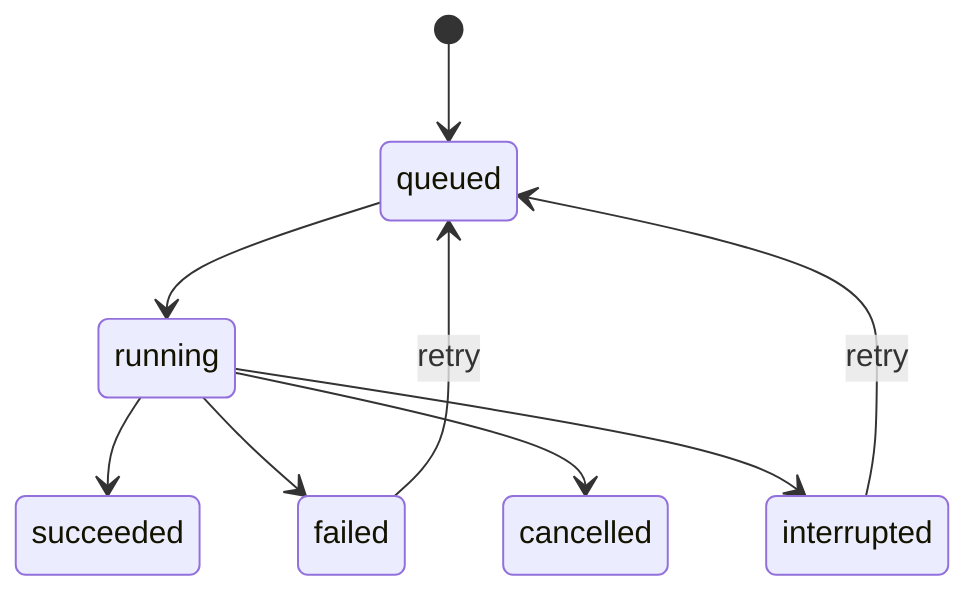
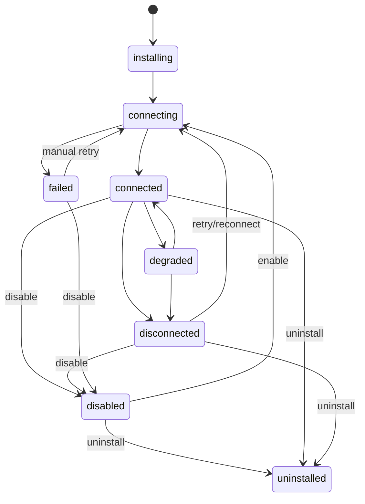
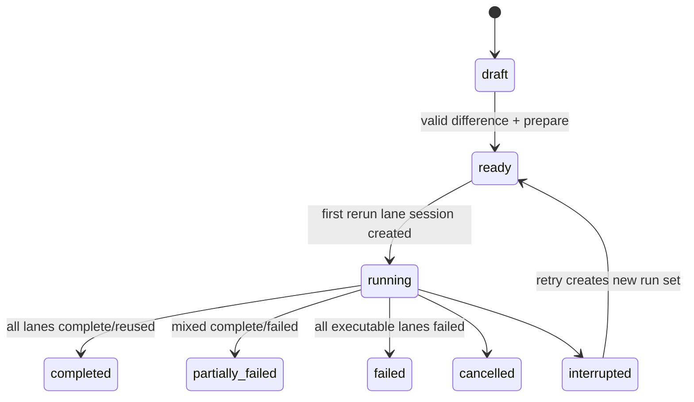

# Demo 产品化领域模型、数据与接口合同

> 主文档：[Model Kindergarten Demo 到真实产品实施 TRD](./DEMO_TO_PRODUCTION_TRD.md)  
> 需求与差距：[Demo 完整需求、交互效果与真实实现差距](./DEMO_TO_PRODUCTION_REQUIREMENTS_AND_GAPS.md)  
> 本文是设计合同，不代表代码已经实现。

## 1. 合同设计原则

1. **引用和事实分离**：ACP `_meta` 与 URL 只传资源引用；完整领域对象保存在 Remote。
2. **配置和执行分离**：Agent 保存期望能力；TurnExecutionRecord 保存当次实际解析结果。
3. **安装、绑定、可见、执行分离**：Skill/MCP 安装成功不等于 Agent 绑定，绑定不等于当前连接可见，可见仍不替代调用前授权。
4. **历史不可变**：Agent 是单一可变实体，但完成 Turn 的模型、Agent 配置快照哈希、上下文和能力快照不可被后续更新覆盖。
5. **一个执行器**：普通聊天和 Context Experiment lane 都使用正式 ACP Session/Prompt、AgentRunner、ContextAssembler、ToolRuntime。
6. **Secret 不过边界**：Secret 只以 credentialRef 存在于 Remote；不进浏览器状态、ACP、日志、实验和文件引用。
7. **严格解析**：前后端共享 discriminated union 和 schemaVersion；未知字段不自动获得运行权限。

## 2. 运行上下文

### 2.1 LocalPrincipal

```ts
export interface LocalPrincipal {
  schemaVersion: 1;
  principalId: "local-admin";
  kind: "local_admin";
}
```

本轮所有请求由 Remote 根据监听地址与 Origin 解析为 `local-admin`。浏览器不能通过 header 自行指定 principalId。

### 2.2 SessionBinding

```ts
export interface SessionBinding {
  schemaVersion: 1;
  modelStudentId: string;
  agentId: string;
}
```

SessionBinding 在创建 Session 时写入，之后不可改变。Session 页面只读显示模型和 Agent，不提供切换控件；用户要换身份时回到首页创建另一个 Session。

### 2.3 TurnScope

```ts
export interface TurnScope {
  schemaVersion: 1;
  ownerId: string;
  sessionId: string;
  turnId: string;
  purpose: "chat" | "experiment";
  modelStudentId: string;
  agentId: string;
  experimentRunRef?: {
    experimentId: string;
    variantId: string;
  };
}
```

TurnScope 由 Remote 从已持久化 Session 和 Experiment 生成，不直接信任 Prompt 内容。ToolRuntime、FileSandbox、CapabilityResolver 和 observation 都接收这个 scope。

## 3. Agent 合同

### 3.1 权限与能力绑定

```ts
export type ToolPermission = "allow" | "ask" | "deny";

export interface BuiltinToolBinding {
  toolId: string;
  enabled: boolean;
  permission: ToolPermission;
}

export interface SkillBinding {
  skillInstallationId: string;
  enabled: boolean;
}

export interface McpToolBinding {
  remoteName: string;
  enabled: boolean;
  permission: ToolPermission;
}

export interface McpResourceBinding {
  uri: string;
  enabled: boolean;
  preload: boolean;
}

export interface McpBinding {
  mcpInstallationId: string;
  enabled: boolean;
  tools: McpToolBinding[];
  resources: McpResourceBinding[];
}

export type HistoryPolicy =
  | { mode: "none" }
  | { mode: "recent_turns"; maxTurns: number };

export interface MemoryPolicy {
  mode: "off";
}
```

约束：

- `toolId` 必须来自 Remote 内置工具目录。
- `skillInstallationId` 必须 owner 相同且 state=`ready`。
- `remoteName`/`uri` 必须存在于指定 Installation 当前 capability snapshot；快照变化后可成为 unresolved，但不能自动换绑同名之外的新能力。
- `permission="allow"` 仍受工具自身强制 permission policy 约束；危险工具不能被 Agent 配置降级为无授权执行。
- `maxTurns` 首版范围 0～50；真正 token 截断由 ContextAssembler 执行。

### 3.2 AgentRecord

```ts
export interface AgentRecord {
  schemaVersion: 1;
  agentId: string;
  ownerId: string;
  name: string;
  description?: string;
  systemPrompt: string;
  builtinTools: BuiltinToolBinding[];
  skills: SkillBinding[];
  mcps: McpBinding[];
  historyPolicy: HistoryPolicy;
  memoryPolicy: MemoryPolicy;
  createdAt: string;
  updatedAt: string;
}
```

Agent 不存在 version、revision、ETag、archive、publish 或 fork 语义。首版运行在本地单用户、单 Remote 进程中，完整表单保存由服务端串行写入，后一次成功保存覆盖前一次。每个 Turn 仍单独保存当时 Agent 配置的 canonical hash，供历史解释。

### 3.3 Agent 写入 DTO

```ts
export interface AgentInput {
  name: string;
  description?: string;
  systemPrompt: string;
  builtinTools: BuiltinToolBinding[];
  skillInstallationIds: string[];
  mcps: McpBinding[];
  historyPolicy: HistoryPolicy;
  memoryPolicy: { mode: "off" };
}
```

服务端负责规范化空白、去重、排序和能力引用校验。客户端不得提交 ownerId、时间戳或 resolved tool schema。

## 4. ModelStudent 管理合同

消费目录保留统一 `ModelStudentSummary`；自定义 Responses 入园另通过 `POST /model-student-tests` 和 `POST /model-students` 两阶段完成。公开合同不返回 API Key 或 `credentialRef`：

```ts
export interface ModelStudentSummary {
  schemaVersion: 1;
  modelStudentId: string;
  displayName: string;
  providerKind: string;
  model: string;
  status: "ready" | "unavailable" | "unknown";
  supports: {
    streaming: boolean;
    toolCalls: boolean;
    thought: boolean;
    usage: boolean;
  };
  lastCheckedAt?: string;
  statusMessage?: string;
}
```

没有 POST/PUT/DELETE ModelStudent API。Catalog 可以先由当前已验证的进程配置投影为一个记录，之后由模型入园方案替换内部来源而不改变消费者合同。

## 5. Session 与 Turn 合同

### 5.1 SessionRecord V4

```ts
export type SessionPurpose = "chat" | "experiment";

export interface SessionRecordV4 {
  schemaVersion: 4;
  sessionId: string;
  ownerId: string;
  purpose: SessionPurpose;
  cwd: string;
  additionalDirectories: string[];
  title?: string;
  modelStudentId: string;
  agentId: string;
  sessionEntries: SessionEntry[];
  turns: TurnExecutionRecord[];
  experimentRef?: {
    experimentId: string;
    variantId: string;
  };
  createdAt: string;
  updatedAt: string;
}
```

`purpose="experiment"` 时必须有 experimentRef；默认 Session list 排除这类记录。

### 5.2 CapabilitySnapshot

```ts
export interface CapabilitySnapshot {
  schemaVersion: 1;
  generation: number;
  hash: string;
  builtinTools: Array<{
    toolId: string;
    name: string;
    permission: ToolPermission;
    inputSchemaHash: string;
  }>;
  skills: Array<{
    name: string;
    contentHash: string;
  }>;
  mcps: Array<{
    mcpInstallationId: string;
    capabilityGeneration: number;
    tools: Array<{
      remoteName: string;
      exposedName: string;
      permission: ToolPermission;
      inputSchemaHash: string;
    }>;
    resources: Array<{
      uri: string;
      contentHash?: string;
      preloaded: boolean;
    }>;
  }>;
}
```

Snapshot 不含 Secret、完整文件正文或可变 connection object。`exposedName` 由 Remote 按稳定 namespace 生成。

### 5.3 ContextSnapshot

```ts
export interface ProviderNeutralMessage {
  role: "system" | "user" | "assistant" | "tool";
  content: unknown;
  sourceIds: string[];
}

export interface ContextSourceRecord {
  sourceId: string;
  kind:
    | "system_instruction"
    | "available_tools"
    | "skill_catalog"
    | "mcp_resource_catalog"
    | "mcp_resource"
    | "session_history"
    | "truncated_history";
  title: string;
  trust?: "trusted" | "approved" | "untrusted";
  itemCount?: number;
  estimatedTokens: number;
  contentHash: string;
  truncated: boolean;
}

export interface ContextExecutionSnapshot {
  schemaVersion: 1;
  messages: ProviderNeutralMessage[];
  sources: ContextSourceRecord[];
  provider: string;
  model: string;
  providerInput: {
    format: "json" | "text";
    redactedValue: string;
    contentHash: string;
  };
  totalEstimatedTokens: number;
}
```

`redactedValue` 是产品可查看的真实序列化快照，但必须去除 authorization、credentialRef 指向的值和 Remote 内部路径。若超过持久化上限，保存 head/tail、总字节和完整 hash，并标记 truncated。

### 5.4 ModelRoundExecutionRecord

工具循环中的每一次模型请求都有自己的实际输入。Context Lab 默认比较首轮（用户 Prompt 进入、尚未发生工具结果前）的输入；运行审计保留全部 model rounds。

```ts
export interface ModelRoundExecutionRecord {
  roundIndex: number;
  capabilityGeneration: number;
  contextSnapshot: ContextExecutionSnapshot;
  startedAt: string;
  completedAt?: string;
}
```

### 5.5 TurnExecutionRecord

```ts
export interface TurnExecutionRecord {
  schemaVersion: 1;
  turnId: string;
  state:
    | {
        schemaVersion: 1;
        turnId: string;
        status: "active";
        phase: "accepted" | "preparing_context" | "model_streaming" | "tool_execution" | "finalizing";
        waitingFor: { permission: number; input: number };
      }
    | { schemaVersion: 1; turnId: string; status: "completed" | "failed" | "cancelled" | "interrupted" };
  promptEntryId: string;
  entryIds: string[];
  modelStudentId: string;
  providerKind: string;
  model: string;
  agentId: string;
  agentSnapshotHash: string;
  capabilitySnapshots: CapabilitySnapshot[];
  modelRounds: ModelRoundExecutionRecord[];
  usage?: TurnTokenUsage;
  stopReason?: string;
  error?: PublicErrorRef;
  fileReferenceIds: string[];
  startedAt: string;
  completedAt?: string;
}
```

`capabilitySnapshots` 至少一项；同 Turn 安装 Skill 后若刷新能力，追加 generation，不能覆盖首轮事实。完成 Turn 至少有一个 modelRound；历史 Context Lab 的原始上下文取 `modelRounds[0]`，完整运行详情仍可查看后续 rounds。

## 6. Skill 合同

### 6.1 Installation

```ts
export type SkillInstallationState =
  | "queued"
  | "validating"
  | "installing"
  | "ready"
  | "quarantined"
  | "failed"
  | "uninstalled";

export type SkillSource =
  | {
      kind: "github_tree";
      repository: string;
      requestedRef: string;
      resolvedCommit: string;
      subdirectory: string;
    }
  | {
      kind: "approved_local";
      sourceId: string;
    };

export interface SkillInstallation {
  schemaVersion: 1;
  skillInstallationId: string;
  ownerId: string;
  skillName: string;
  displayName?: string;
  state: SkillInstallationState;
  source: SkillSource;
  contentHash?: string;
  installedPathRef?: string;
  securitySummary?: {
    fileCount: number;
    totalBytes: number;
    warnings: string[];
  };
  error?: PublicErrorRef;
  createdAt: string;
  updatedAt: string;
}
```

`installedPathRef` 是 Remote 内部引用，绝不返回浏览器绝对路径。

### 6.2 Job 与对话 Batch

```ts
export type OperationState =
  | "queued"
  | "running"
  | "succeeded"
  | "failed"
  | "cancelled"
  | "interrupted";

export interface SkillInstallJobItem {
  itemId: string;
  source: SkillSource;
  state: SkillInstallationState;
  skillInstallationId?: string;
  error?: PublicErrorRef;
}

export interface SkillInstallJob {
  schemaVersion: 1;
  jobId: string;
  ownerId: string;
  origin:
    | { kind: "manual" }
    | { kind: "turn"; sessionId: string; turnId: string; agentId: string };
  state: OperationState;
  items: SkillInstallJobItem[];
  bindToAgentOnComplete: boolean;
  createdAt: string;
  updatedAt: string;
  completedAt?: string;
}
```

对话来源还必须带可验证的当前用户消息引用：

```ts
export interface EnsureAgentSkillsInput {
  sourceUrls: string[];
  mode: "ensure" | "update";
}
```

- `origin.kind="turn"` 时，Remote 从可信 TurnScope/PromptRecord 找到当前用户消息，不接受模型指定消息 ID；每个规范化 source URL 都必须逐字来自这条消息。模型自行搜索、补全或猜出的地址返回 `SKILL_SOURCE_NOT_USER_PROVIDED`。
- 模糊任务意图不授权安装。没有明确来源 URL 时，模型只能使用 Agent 已绑定的 ready Skills。
- `ensure`：相同 canonical source（repository + subdirectory + requested ref）且相同 resolved commit/content hash 时直接返回现有 Installation；同一来源已有旧版本时也默认复用，不联网更新。
- `update`：只有用户明确要求更新或在管理页主动点击更新时允许；解析并校验新 commit 成功后再切换绑定，失败继续保留旧版本。
- 名称只用于展示和冲突提示，不能作为唯一去重键；同名不同来源不得互相覆盖。

对话 Batch 原子语义：所有 items=`ready` 后，在同一个服务端写事务中把新 installation IDs 做集合并集；任一失败则不新增绑定。已存在的 Skill 返回 `reused`，不重复安装。安装/复用和“在当前模型轮次加载完整 Skill 内容”是两步：后者继续使用现有 `activate_skill` 工具。

## 7. MCP 合同

### 7.1 配置与测试

```ts
export type McpTransport = "streamable_http";
export type McpAuthConfig = { kind: "none" };

export interface McpCandidateInput {
  name: string;
  transport: "streamable_http";
  url: string;
  auth: { kind: "none" };
}

export interface McpCapabilitySnapshot {
  schemaVersion: 1;
  generation: number;
  tools: Array<{
    name: string;
    description?: string;
    inputSchema: unknown;
    inputSchemaHash: string;
  }>;
  resources: Array<{
    uri: string;
    name?: string;
    description?: string;
    mimeType?: string;
  }>;
  prompts: Array<{
    name: string;
    description?: string;
  }>;
  discoveredAt: string;
}

export interface McpTestRecord {
  schemaVersion: 1;
  testId: string;
  ownerId: string;
  candidateHash: string;
  state: "queued" | "testing" | "succeeded" | "failed" | "expired";
  snapshot?: McpCapabilitySnapshot;
  error?: PublicErrorRef;
  createdAt: string;
  expiresAt: string;
}
```

服务端对 URL canonicalize 后计算 candidateHash。安装只能引用未过期且 hash 与请求一致的成功 testId。

### 7.2 Installation 与连接

```ts
export type McpConnectionState =
  | "installing"
  | "connecting"
  | "connected"
  | "degraded"
  | "disconnected"
  | "disabled"
  | "failed"
  | "uninstalled";

export interface McpInstallation {
  schemaVersion: 1;
  mcpInstallationId: string;
  ownerId: string;
  name: string;
  transport: "streamable_http";
  url: string;
  auth:
    | { kind: "none" }
    | {
        kind: "externally_managed_bearer";
        credentialRef: string;
      };
  enabled: boolean;
  state: McpConnectionState;
  snapshot?: McpCapabilitySnapshot;
  lastConnectedAt?: string;
  lastAttemptAt?: string;
  nextRetryAt?: string;
  lastError?: PublicErrorRef;
  createdAt: string;
  updatedAt: string;
}

export type McpInstallationView = Omit<McpInstallation, "auth"> & {
  authKind: "none" | "externally_managed_bearer";
};
```

`McpInstallation` 是 Remote 内部记录。公开 view 只返回 `authKind: "none" | "externally_managed_bearer"`，永不返回 credentialRef。后一个分支只用于兼容导入现有环境变量/Keychain 配置；本轮 create/update input parser 对任何非 none auth 返回 `MCP_AUTH_NOT_SUPPORTED`，没有 token 字段，也没有小说 MCP recipe。

## 8. Experiment 合同

### 8.1 策略快照

实验策略是 AgentContextPolicy 的受控副本，不是任意 provider request：

```ts
export interface ExperimentContextPolicy {
  systemPrompt: string;
  builtinTools: BuiltinToolBinding[];
  skillInstallationIds: string[];
  mcps: McpBinding[];
  historyPolicy: HistoryPolicy;
  memoryPolicy: { mode: "off" };
}

export type ExperimentVariantMode = "rerun" | "reuse_snapshot";

export interface ExperimentVariant {
  variantId: string;
  label: "A" | "B" | "C";
  mode: ExperimentVariantMode;
  policy: ExperimentContextPolicy;
}
```

history 模式 A 必须为 reuse_snapshot 且 policy 只读；fresh 模式所有 lane 都是 rerun。

### 8.2 ExperimentRecord

```ts
export interface ExperimentRecord {
  schemaVersion: 1;
  experimentId: string;
  ownerId: string;
  name: string;
  mode: "fresh_prompt" | "history_turn";
  status:
    | "draft"
    | "ready"
    | "running"
    | "completed"
    | "partially_failed"
    | "failed"
    | "cancelled";
  modelStudentId: string;
  sourceAgentId: string;
  promptText: string;
  sourceTurnId?: string;
  variants: ExperimentVariant[];
  runs: ExperimentRun[];
  annotationWorksheet?: ExperimentAnnotationWorksheet;
  savedAt?: string;
  createdAt: string;
  updatedAt: string;
}
```

### 8.3 ExperimentRun

```ts
export interface ExperimentRun {
  runId: string;
  variantId: string;
  mode: "rerun" | "reuse_snapshot";
  status:
    | "pending"
    | "session_created"
    | "running"
    | "completed"
    | "failed"
    | "cancelled"
    | "interrupted";
  acpSessionId?: string;
  turnId?: string;
  reusedTurnId?: string;
  answerEntryIds: string[];
  modelRounds: ModelRoundExecutionRecord[];
  capabilitySnapshots: CapabilitySnapshot[];
  usage?: TurnTokenUsage;
  stopReason?: string;
  error?: PublicErrorRef;
  startedAt?: string;
  completedAt?: string;
}
```

ExperimentRecord 保存不可修改的运行事实和当前标注工作表，不直接混入人工 verdict 或评分。每次实验的全部 lane 完成后，Remote 调用当前 ModelStudent 生成工作表；显式 `force=true` 重新生成时替换工作表并删除旧 scorecard：

```ts
export interface ExperimentAnnotationWorksheet {
  schemaVersion: 1;
  worksheetId: string;
  experimentId: string;
  requirements: Array<{
    requirementId: string;
    label: string;
    weight: number;
  }>;
  workflows: Array<{
    variantId: string;
    steps: Array<{ stepId: string; label: string }>;
  }>;
  outputSections: Array<{
    variantId: string;
    sections: Array<{
      answerSectionId: string;
      label: string;
      start: number;
      end: number;
      quotedTextHash: string;
      preview: string;
    }>;
  }>;
  generator: {
    modelStudentId: string;
    providerKind: string;
    model: string;
    promptVersion: "annotation_worksheet_v1";
    inputHash: string;
    outputHash: string;
    generatedAt: string;
  };
}
```

生成器设置 `ModelInput.reasoning="disabled"`，不允许 Tool Call，不输出 verdict/score/ranking/winner。回答先由 Remote 切成编号原文单元，模型返回分段标签和单元边界建议；Remote 不信任模型自行计算字符偏移，并会按模型给出的段落顺序规范化跳号、重叠或越界边界，再换算字符 `start/end` 和原文 hash。模型返回的 lane 集合必须完整；最终持久化输出段由 Remote 强制从 0 开始、首尾相接、无重叠无遗漏。

四维评分使用独立 scorecard 引用 experimentId；它保存三类人工 annotation facts、Runtime 执行分证据和派生结果：

```ts
export type ScoreDimensionId =
  | "understanding"
  | "planning"
  | "output"
  | "execution";

export interface UnderstandingAnnotationFacts {
  requirements: Array<{ requirementId: string; label: string; weight: number }>;
  marks: Array<{
    variantId: string;
    requirementId: string;
    verdict: "met" | "missed";
  }>;
  completedAt?: string;
}

export interface PlanningAnnotationFacts {
  marks: Array<{
    variantId: string;
    stepId: string;
    verdict: "effective" | "partial" | "none";
  }>;
  completedAt?: string;
}

export interface OutputAnnotationFacts {
  marks: Array<{
    variantId: string;
    answerSectionId: string;
    start: number;
    end: number;
    verdict: "effective" | "partial" | "none";
    quotedTextHash: string;
  }>;
  completedAt?: string;
}

export interface ExecutionMetricsSnapshot {
  evaluationRecordId: string;
  normallyCompleted: boolean;
  firstTokenLatencyMs?: number;
  totalDurationMs: number;
  toolUseWasExpected: boolean;
  toolSuccessCount: number;
  toolFailureCount: number;
  errorCount: number;
  permissionViolationCount: number;
  hasRepeatedToolCall: boolean;
  modelRoundCount: number;
  toolCallCount: number;
  totalContextTokens: number;
  totalOutputTokens: number;
}

export interface ExecutionScorePolicySnapshot {
  policyId: "runtime_execution_v1";
  policyVersion: 1;
  componentMax: {
    completion: 30;
    toolReliability: 25;
    errorHygiene: 15;
    permissionSafety: 15;
    noRepeatedCalls: 5;
    responsiveness: 10;
  };
}

export interface VariantFourDimensionScore {
  variantId: string;
  dimensionScores: {
    understanding?: number;
    planning?: number;
    output?: number;
    execution: number;
  };
  executionEvidence: {
    metrics: ExecutionMetricsSnapshot;
    componentScores: {
      completion: number;
      toolReliability: number;
      errorHygiene: number;
      permissionSafety: number;
      noRepeatedCalls: number;
      responsiveness: number;
    };
  };
  totalScore?: number;
}

export interface ExperimentScorecard {
  schemaVersion: 1;
  scorecardId: string;
  experimentId: string;
  rubric: {
    rubricId: "context_experiment_four_dimensions";
    rubricVersion: 1;
    dimensions: [
      { id: "understanding"; source: "manual_annotation"; weight: 0.25 },
      { id: "planning"; source: "manual_annotation"; weight: 0.25 },
      { id: "output"; source: "manual_annotation"; weight: 0.25 },
      { id: "execution"; source: "runtime_metrics"; weight: 0.25 },
    ];
    executionPolicy: ExecutionScorePolicySnapshot;
  };
  annotations: {
    understanding: UnderstandingAnnotationFacts;
    planning: PlanningAnnotationFacts;
    output: OutputAnnotationFacts;
  };
  variants: VariantFourDimensionScore[];
  ranking?: Array<{
    rank: number;
    variantIds: string[];
    totalScore: number;
  }>;
  winnerVariantIds?: string[];
  status: "draft" | "complete";
  createdAt: string;
  updatedAt: string;
}
```

四维规则：

1. 理解、规划、输出分由服务端根据三类 annotation facts 和 rubricVersion 计算；不能直接信任浏览器提交的维度分。v1 由模型生成题目、人做判断：理解维逐 lane 标记公共需求“命中/未命中”；规划维对工作表中的每个步骤标记“有效/部分有效/不计分”；输出维对工作表中的每个完整结果段标记“有效/部分有效/不计分”，以去空白字符覆盖率计分。Remote 校验题目 ID、字符范围和 hash 必须来自当前工作表，不能只靠浏览器提交。
2. 执行分由同一 Experiment 各 lane 的 `ExecutionMetricsSnapshot` 和 `runtime_execution_v1` 计算：正常完成 30 分；Tool 成功率最多 25 分（无 Tool 且本次实验策略没有要求使用 Tool 时按满分）；无错误 15 分；无权限违规 15 分；无重复 Tool 5 分；相同模型、相同环境下的首 Token 延迟和总耗时相对表现合计最多 10 分。`toolUseWasExpected` 由 Experiment policy/fixture 在运行前确定，不能根据回答文本事后猜测。未正常完成时最终执行分取 `min(rawScore, 59)`。
3. `modelRoundCount`、`toolCallCount`、Context/Output Tokens 作为解释证据保存，但 v1 没有可靠单调方向，不直接加减分。
4. 三个人工维度任一未完成时 status=`draft`，不生成 totalScore、ranking 或 winner，也不得默认 100 分。
5. 完整时每个 lane 的 `totalScore = round((understanding + planning + output + execution) / 4)`。ranking 和 winner 由服务端派生；并列第一时 `winnerVariantIds` 可有多个，UI 显示“并列”。
6. 雷达图只读取四个 dimensionScores，不保存图表专用假数据。合同中没有 Judge、LLM 评分请求或 `source="automatic"`；`POST /experiments/{id}/annotation-worksheet` 是模型出题请求，不返回分数。

`runtime_execution_v1` 的确定性公式：

```ts
toolReliability = toolCallCount === 0 && !toolUseWasExpected
  ? 25
  : toolCallCount === 0
    ? 0
    : 25 * toolSuccessCount / (toolSuccessCount + toolFailureCount);

errorHygiene = Math.max(0, 15 - 5 * errorCount);
permissionSafety = permissionViolationCount === 0 ? 15 : 0;
noRepeatedCalls = hasRepeatedToolCall ? 0 : 5;
completion = normallyCompleted ? 30 : 0;

// lowerIsBetter 在同一实验、同一模型与同一运行环境的 lanes 内比较。
// 所有值相同时均得满分；缺失 TTFT 时该 5 分为 0。
ttft = 5 * lowerIsBetter(firstTokenLatencyMs);
duration = 5 * lowerIsBetter(totalDurationMs);
responsiveness = ttft + duration;

rawExecutionScore = round(
  completion + toolReliability + errorHygiene
  + permissionSafety + noRepeatedCalls + responsiveness,
);
executionScore = normallyCompleted
  ? rawExecutionScore
  : Math.min(rawExecutionScore, 59);
```

`lowerIsBetter(value)` 使用同一可比集合的 min-max：只有一个值或全部相等返回 1；否则返回 `1 - (value - min) / (max - min)`。Scorecard 必须保存 policyVersion、输入 metrics 和 componentScores，便于解释和重新计算。

### 8.4 Experiment 不变量

- variants 数量 2～3，label 唯一。
- fresh 模式至少两个策略 hash 不同才能进入 ready。
- history 模式 sourceTurnId 必须属于 owner，且其 Turn completed；A 引用原 Turn，不创建 ACP Session。
- B/C 的 session/new `_meta` 只传 `{experimentId, variantId}`；Remote 加载已保存 policy。
- experiment Session purpose=`experiment`，不出现在默认聊天历史。
- 同一 experimentId + Idempotency-Key 的 start 只创建一组 runs；prepare-run 在单次原子写入中复制当时的 variants/policy 到 run records，之后编辑草稿不改写已开始 runs。

## 9. FileReference 合同

```ts
export type FilePreviewKind = "markdown" | "static_html" | "text" | "unsupported";

export interface FileReference {
  schemaVersion: 1;
  fileReferenceId: string;
  ownerId: string;
  sessionId: string;
  turnId: string;
  displayName: string;
  relativePath: string;
  mimeType: string;
  byteLength: number;
  sha256: string;
  previewKind: FilePreviewKind;
  createdAt: string;
}

export interface FilePreviewResponse {
  file: FileReference;
  content:
    | { kind: "markdown"; markdown: string }
    | { kind: "static_html"; html: string; csp: string }
    | { kind: "text"; text: string }
    | { kind: "unsupported" };
}
```

`relativePath` 仅用于显示，服务端读取必须用记录中受控 workspace locator，不能将客户端传入 relativePath 再拼接。

ACP 工具内容：

```ts
const resourceLink = {
  type: "resource_link",
  name: file.displayName,
  uri: `mk-file://${file.fileReferenceId}`,
  mimeType: file.mimeType,
  size: file.byteLength,
};
```

## 10. ACP namespaced `_meta`

现有 `packages/contracts` 已使用顶层 key `modelKindergarten`。扩展同一个 `KindergartenMeta`，不创建多个散乱 key：

```ts
export interface SessionBindingMeta {
  schemaVersion: 1;
  binding: SessionBinding;
}

export interface ExperimentRunRefMeta {
  schemaVersion: 1;
  experimentId: string;
  variantId: string;
}

export interface OperationProjectionMeta {
  schemaVersion: 1;
  kind: "skill_install";
  operationId: string;
  state: OperationState;
  itemStates?: Array<{
    itemId: string;
    label: string;
    state: string;
  }>;
}

export interface FileReferencesMeta {
  schemaVersion: 1;
  fileReferenceIds: string[];
}

export interface KindergartenMeta {
  message?: MessageMeta;
  prompt?: PromptMeta;
  sessionBinding?: SessionBindingMeta;
  experimentRunRef?: ExperimentRunRefMeta;
  operation?: OperationProjectionMeta;
  fileReferences?: FileReferencesMeta;
}
```

ACP SDK 1.3 的 `NewSessionRequest` 和 `ToolCallUpdate` 均允许 `_meta?: Record<string, unknown>`，因此不需要自定义 ACP method。规则：

- chat session/new 必须有 sessionBinding；
- experiment session/new 必须有 experimentRunRef，且 Remote 从 Experiment 派生 binding；两者不能同时由浏览器自由组合；
- 本产品由 Remote 统一管理 MCP Installation 和 Agent binding，因此 `mcpServers=[]`；若浏览器传入一个或多个临时 server 配置，直接返回 `SESSION_BINDING_INVALID`；
- `cwd` 必须等于 bootstrap capability 中允许的虚拟 workspace，`additionalDirectories` 首版必须为空；文件工具始终写入 Remote 分配的 Session workspace；
- load/resume 从 Session record 恢复绑定，不再要求浏览器传；
- invalid meta 返回稳定的 ACP error，不能回退到错误默认 Agent；
- operation 只表示当前 Turn 内 `ensure_agent_skills` 工具的即时进度；MCP 管理任务走 Control API Job，实验 lane 的 ACP 流只服务该 lane，实验整体状态走 ExperimentRecord。file meta 只是文件卡片的即时投影，刷新后查询持久记录。

## 11. Runtime 内部合同

### 11.1 ResolvedRuntimeCapabilities

```ts
export interface ResolvedRuntimeCapabilities {
  scope: TurnScope;
  agent: AgentRecord;
  agentSnapshotHash: string;
  modelProvider: ModelProvider;
  catalog: RuntimeCapabilityCatalog;
  contextSources: ContextSource[];
  capabilitySnapshot: CapabilitySnapshot;
  fileSandbox: SessionFileSandbox;
}
```

### 11.2 Tool effect

```ts
export interface ToolExecutionEffects {
  capabilitiesChanged?: boolean;
  fileReferenceIds?: string[];
}

export interface ToolExecutionOutcome {
  content: ToolResultContent[];
  rawOutput?: unknown;
  locations?: ToolLocation[];
  effects?: ToolExecutionEffects;
}
```

`AgentRunner` 只根据 `effects.capabilitiesChanged` 重新调用 resolver。不能根据 tool name、rawOutput 文本或 prompt 猜测。

### 11.3 能力刷新算法

1. Turn start：resolve generation 1，写入 TurnRecord。
2. ContextAssembler 使用该 generation 的 Agent/Tool/Skill/MCP sources。
3. Model round → tool calls；ToolCallLedger 仍以原有键去重。
4. 某工具返回 `capabilitiesChanged=true`。
5. 下一 model round 前重新 resolve；若 hash 未变化，不追加 generation。
6. 若变化，追加 snapshot，并用新 catalog/tool definitions/skill sources 构建下一轮输入。
7. 已执行工具结果和历史消息不删除；observation 记录 generation change。

## 12. Control API 约定

### 12.1 基础

- Base path：`/api/control/v1`
- Content-Type：`application/json`
- 时间：RFC 3339 UTC 字符串
- ID：服务端生成 opaque UUID/ULID；客户端不得赋予业务语义
- 分页：cursor；默认 20，上限 100
- 写幂等：长操作要求 `Idempotency-Key`
- 配置写入：单进程串行，最后一次成功提交生效
- 追踪：每个响应 `X-Request-Id`

成功：

```ts
export interface ApiSuccess<T> {
  data: T;
  requestId: string;
}

export interface CursorPage<T> {
  items: T[];
  nextCursor?: string;
}
```

错误采用 `application/problem+json`：

```ts
export interface ApiProblem {
  type: string;
  title: string;
  status: number;
  detail: string;
  code: PublicErrorCode;
  requestId: string;
  retryable: boolean;
  fieldErrors?: Array<{ path: string; message: string }>;
}
```

### 12.2 Agents

| Method | Path | 说明 |
| --- | --- | --- |
| GET | `/agents?query=&cursor=&limit=` | 分页列表 |
| POST | `/agents` | 创建；body AgentInput；返回 record |
| GET | `/agents/:agentId` | 详情 |
| PUT | `/agents/:agentId` | 全量更新；后一次成功提交生效 |
| GET | `/capability-options` | 内置工具、ready Skills、MCP snapshots 的可选项 |

PUT 不接收 partial magic merge；页面保留编辑草稿，提交完整 AgentInput。首版不提供 Agent archive/delete/migrate API。对话安装的 Agent Skill 并集由 AgentService 内部事务方法执行，不暴露公共 PATCH。

### 12.3 ModelStudent（只读）

| Method | Path | 说明 |
| --- | --- | --- |
| GET | `/model-students` | 当前可选择目录 |
| GET | `/model-students/:id` | 只读详情/健康摘要 |

任何写方法返回 405；不提供 Secret 字段。

### 12.4 Session/Turn 查询

Session 创建和 Prompt 仍走 ACP。

| Method | Path | 说明 |
| --- | --- | --- |
| GET | `/sessions?purpose=chat&query=&cursor=` | 生产列表摘要 |
| GET | `/sessions/:sessionId` | 管理摘要，不替代 ACP load |
| GET | `/turns/:turnId` | Turn 执行事实 |
| GET | `/turns/:turnId/context` | Context snapshot/summary |

Control API 不返回可被 Web 用来伪造聊天历史的 Runtime projection；完整 ACP entry replay 仍由 ACP load 完成。

### 12.5 Skills

| Method | Path | Body/说明 |
| --- | --- | --- |
| GET | `/skills?state=&query=&cursor=` | Installation 列表 |
| POST | `/skill-install-jobs` | `{sources: SkillSource[]}`；Idempotency-Key |
| GET | `/skill-install-jobs/:jobId` | Job + items |
| POST | `/skill-install-jobs/:jobId/retry` | 失败项重试；Idempotency-Key |
| GET | `/skills/:skillInstallationId` | 详情/安全摘要 |

不提供浏览器任意绝对路径安装。approved_local sourceId 来自 Remote 配置的 allowlist。Turn 内调用改用 `EnsureAgentSkillsInput`，并校验用户消息来源；管理页的手动安装由用户直接提交，不伪装成模型授权。

### 12.6 MCP

| Method | Path | Body/说明 |
| --- | --- | --- |
| POST | `/mcp-tests` | McpCandidateInput；Idempotency-Key |
| GET | `/mcp-tests/:testId` | 测试状态/preview |
| GET | `/mcps?state=&query=&cursor=` | Installation 列表 |
| POST | `/mcps` | `{testId, name}`；只接受成功未过期测试 |
| GET | `/mcps/:mcpId` | 详情 |
| POST | `/mcps/:mcpId/reconnect` | 异步 operation；Idempotency-Key |
| POST | `/mcps/:mcpId/refresh-capabilities` | 异步 operation |
| POST | `/mcps/:mcpId/disable` | 串行更新状态 |
| POST | `/mcps/:mcpId/enable` | 串行更新状态 |
| DELETE | `/mcps/:mcpId` | 原子移除 Agent bindings 并卸载 |
| GET | `/operations/:operationId` | 重连/刷新/卸载状态 |

本轮没有 `/credentials`、`/tokens` 或 Bearer body。删除确认页先读取受影响 Agent 摘要；真正 DELETE 在单个 UnitOfWork 内重新计算并移除当前绑定，不依赖浏览器提交快照。

### 12.7 Context Preview 与 Experiment

| Method | Path | 说明 |
| --- | --- | --- |
| POST | `/context-previews` | modelStudentId、受控 policy、prompt/sourceTurnId；返回实际 preview |
| POST | `/experiments` | 创建 fresh/history draft |
| GET | `/experiments?status=&query=&cursor=` | 列表 |
| GET | `/experiments/:id` | 详情/运行状态 |
| PUT | `/experiments/:id` | 更新 draft；最后一次成功提交生效 |
| POST | `/experiments/:id/prepare-run` | 固化当时 variants/policy、创建 run records；Idempotency-Key |
| POST | `/experiments/:id/cancel` | 标记并由 Web/ACP cancel 活动 lane |
| POST | `/experiments/:id/save` | 持久保存标记；幂等 |
| GET | `/experiments/:id/scorecard` | 读取人工评分、总分和排名 |
| PUT | `/experiments/:id/scorecard` | 保存人工维度分；服务端重算总分/排名/winner |

`prepare-run` 不直接调用模型，只把 Experiment 置为 ready/running 并返回：

```ts
export interface PreparedExperimentRun {
  experimentId: string;
  lanes: Array<{
    variantId: string;
    mode: "reuse_snapshot" | "rerun";
    reusedTurnId?: string;
  }>;
}
```

Web 对 rerun lane 依次或并行调用 ACP session/new + session/prompt。Remote 在这些 Session 完成时更新 ExperimentRun；读取结果仍走 Control API。

### 12.8 Files

| Method | Path | 说明 |
| --- | --- | --- |
| GET | `/files/:fileReferenceId` | 元数据 |
| GET | `/files/:fileReferenceId/preview` | 受控预览内容 |
| GET | `/files/:fileReferenceId/content` | 允许类型的下载；Content-Disposition attachment |

响应必须设置 `X-Content-Type-Options: nosniff`。HTML preview 不通过普通 content 端点 inline 返回。

## 13. 状态机

### 13.1 Skill Job



Item 使用 validating/installing/ready/quarantined/failed；Job succeeded 的充要条件是全部 item ready 或已存在等价 ready Installation。

### 13.2 MCP Installation



`enabled=false` 与 state=disabled 一致。uninstalled 为审计终态，普通列表不返回。

### 13.3 Experiment



若只有 A reuse 完成、B/C 全失败，Experiment 为 partially_failed，不把 A 单独视作整体 completed。

## 14. 错误码

```ts
export type PublicErrorCode =
  | "VALIDATION_FAILED"
  | "NOT_FOUND"
  | "CONFLICT"
  | "IDEMPOTENCY_CONFLICT"
  | "ORIGIN_NOT_ALLOWED"
  | "SESSION_BINDING_INVALID"
  | "SESSION_BUSY"
  | "CAPABILITY_REFERENCE_INVALID"
  | "CAPABILITY_STALE"
  | "SKILL_SOURCE_NOT_ALLOWED"
  | "SKILL_SOURCE_NOT_USER_PROVIDED"
  | "SKILL_SOURCE_NAME_CONFLICT"
  | "SKILL_VALIDATION_FAILED"
  | "SKILL_JOB_INTERRUPTED"
  | "MCP_URL_NOT_ALLOWED"
  | "MCP_AUTH_NOT_SUPPORTED"
  | "MCP_TEST_EXPIRED"
  | "MCP_CONNECTION_FAILED"
  | "MCP_NOT_AVAILABLE"
  | "EXPERIMENT_NOT_RUNNABLE"
  | "SCORECARD_INCOMPLETE"
  | "TURN_SNAPSHOT_UNAVAILABLE"
  | "FILE_REFERENCE_FORBIDDEN"
  | "FILE_PREVIEW_NOT_SUPPORTED"
  | "INTERNAL_ERROR";

export interface PublicErrorRef {
  code: PublicErrorCode;
  message: string;
  requestId?: string;
  retryable: boolean;
}
```

错误投影规则：

- domain error → 稳定 code；
- provider/MCP 原始错误先净化 URL query、headers、token 和堆栈；
- UI 根据 code 决定重试/刷新/编辑，不解析 message 文本；
- ACP tool failure 的 rawOutput 可包含 PublicErrorRef，但不能包含内部异常对象。

## 15. 存储布局与迁移

建议本地数据根：Remote 配置的 `dataRoot`，默认仓库外可写目录。逻辑布局：

```text
dataRoot/
  agents.json
  sessions.json
  skills/
    installations.json
    jobs.json
    content/<contentHash>/...
    quarantine/<jobId>/...
  mcps/
    installations.json
    tests.json
    operations.json
  experiments.json
  files.json
  workspaces/<sessionId>/...
  migrations/<migrationId>.json
```

### 15.1 Store 要求

- 每个文件顶层有 schemaVersion 和 records。
- 写入序列：validate → temp write → fsync temp → rename → fsync directory；保留 `.bak` 的上一个成功快照。
- 同一聚合 Store 进程内串行写；跨 Store 事务使用 `LocalUnitOfWork` 和可恢复 journal。
- 启动时先验证，再迁移；迁移失败停止接受写请求，不静默创建空库。

### 15.2 Session V3 → V4

迁移输入是现有 Session V3：

1. 创建系统默认 Agent，内容来自当前 system prompt、built-in tools、Skill allowlist 和 MCP allowlist。
2. 创建只读默认 ModelStudent summary，引用当前成功配置。
3. 每个 Session 写 ownerId=`local-admin`、purpose=`chat`、默认 modelStudentId/agentId。
4. 历史 entries 保持 ID 和顺序；无法生成完整 Turn snapshot 的历史 Turn 标为 snapshot unavailable，不伪造 raw input。
5. 保留原 sessions 文件备份与 migration report。

### 15.3 MCP/Skill 导入

- 当前 MCP config 的每个 server 导入为 Installation；能力以首次受管连接发现为准。
- 当前全局 `agentCapabilities` 转换成默认 Agent 的 McpBinding；不复制到所有 Agent。
- 当前 SkillRegistry 中验证通过的 user/project skill 创建 ready Installation，并以 lock/content hash 去重。
- 无法确定来源的信息标记为 imported legacy，不伪造 GitHub commit。

## 16. 写入顺序、幂等与跨 Store 一致性

### 16.1 本地单用户写入

- Agent、MCP、Experiment 配置写入进入 Remote 单进程串行队列。
- 同一资源的后一次成功写入覆盖前一次；页面不显示字段级冲突合并。
- 正在运行的 Turn/ExperimentRun 使用启动时已复制的 snapshot，不被后续配置保存改写。

### 16.2 Idempotency

- 作用域：principal + route + Idempotency-Key。
- 保存 request hash、结果 resource ID 和过期时间；同 key 不同 body 返回 409。
- Skill Install、MCP test/reconnect/refresh、Experiment prepare-run 必须使用。

### 16.3 UnitOfWork 场景

以下操作必须原子或可恢复：

- Skill batch 全成功后更新 Agent bindings；
- MCP uninstall 移除所有 Agent bindings并标记 installation；
- Experiment prepare-run 固化当时 variants/policy 并创建全部 run records；
- write_file 成功后创建 FileReference并写 Turn fileReferenceIds。

首版使用单 Remote 进程写队列和 journal 足够；若未来改多进程/数据库，保持 Service 合同不变。

## 17. 前端数据边界

### 17.1 Query State

前端按 feature 组织 query hooks：

- `useAgents`/`useAgent`
- `useModelStudents`
- `useSkillInstallations`/`useSkillInstallJob`
- `useMcpInstallations`/`useMcpOperation`
- `useExperiment`/`useExperiments`
- `useFilePreview`

可以使用轻量自研 query cache 或引入成熟 query library，但必须有统一 request cancellation、stale policy 和 error parsing。不得把这些 records 永久写入 Zustand/sessionStorage。

### 17.2 Local UI State

只在组件或 UI store 保存：

- 当前 tab、折叠状态、分栏宽度；
- 未提交 Agent/Experiment 表单草稿；
- 当前打开 fileReferenceId；
- 当前 ACP connection/prompt projection。

### 17.3 ACP Update routing

```ts
export interface SessionUpdateSink {
  onSessionUpdate(sessionId: string, update: AcpSessionUpdate): void;
}

export class AcpSessionUpdateRouter {
  register(sessionId: string, sink: SessionUpdateSink): () => void;
  route(sessionId: string, update: AcpSessionUpdate): void;
}
```

- Chat Session sink 使用现有 chat reducer。
- Experiment Session sink 收集 lane progress，并以 Remote Experiment record 为最终状态。
- 未注册 Session 的 update 可记录摘要，不得投给当前 chat。

## 18. 安全与净化合同

### 18.1 Origin 与监听

- 默认 bind `127.0.0.1`/`::1`；配置非 loopback 时若没有明确 auth provider，启动失败。
- CORS allowlist 精确匹配 scheme/host/port；开发允许配置 5173/5174/5175，不硬编码到业务代码。
- 不使用 cookies；拒绝 `Origin: null` 的写请求。

### 18.2 Secret

必须被 redact 的 key（大小写不敏感）：authorization、proxy-authorization、token、access_token、refresh_token、api_key、cookie、set-cookie。

必须被净化的区域：

- MCP/Provider URL query；
- structured logs；
- PublicErrorRef；
- provider input snapshot；
- Tool rawInput/rawOutput；
- operation details；
- test fixtures snapshot。

### 18.3 文件

- workspace root 由 sessionId 映射，客户端 cwd 不决定实际可写根；
- FileSandbox 与 ProcessSandbox 使用同一 Session workspace；任何工具若要把本地路径显示为产物，必须把明确的受控 relative path 交给 FileReferenceService，不能扫描或暴露整个目录；
- 每次读写 realpath 校验仍在 root；不存在目标的父目录逐段检查 symlink；
- 默认单文件 256KiB 延续现状，HTML/Markdown preview 可按实际需要在 ADR 中调高，但必须有限额；
- HTML 保留脚本与交互控件；CSP 允许内联脚本和 HTTPS 静态资源，同时禁止嵌套页面、插件与表单提交；
- iframe 只加 `allow-scripts`，不加 `allow-same-origin`、`allow-forms`、`allow-popups` 或顶层导航权限。

## 19. 可观测事件

在不改变用户响应的前提下新增内部事件：

```ts
type DomainObservation =
  | { type: "agent_resolved"; sessionId: string; turnId: string; agentId: string; agentSnapshotHash: string }
  | { type: "capability_generation_changed"; turnId: string; from: number; to: number; reason: string }
  | { type: "skill_job_state_changed"; jobId: string; state: OperationState }
  | { type: "mcp_connection_state_changed"; installationId: string; state: McpConnectionState }
  | { type: "experiment_run_state_changed"; experimentId: string; variantId: string; state: string }
  | { type: "file_reference_created"; sessionId: string; turnId: string; fileReferenceId: string };
```

事件中不包含 Prompt、回答、文件正文、Secret 或完整 MCP URL。现有 Turn observation/export 故障隔离规则不变。

## 20. Responses Provider 启用前合同

本节是模型入园后续工作的质量门禁，不授权本轮接线或修改 ModelStudent 写接口。

### 20.1 SSE 终态

- 成功完成：`response.completed` → usage（若提供）→ `finish(stop)`。
- 不完整完成：`response.incomplete` → usage（若提供）→ `finish(length)`。
- 取消：`response.cancelled` → `finish(cancelled)`。
- 失败：`response.failed` 或 SSE `error` → 结构化 ModelProviderError，不发 finish。
- `[DONE]` 是部分兼容端点可能发送的 transport sentinel；只能忽略或用于诊断。流结束仍未收到正式终态时必须报 `invalid_model_response`。

### 20.2 Function call 聚合

Provider 以 `output_index` 作为顺序键、`item_id` 作为后续 delta 关联键、`call_id` 作为下一轮 tool output 关联键：

1. added/delta/done 事件更新每个 index 的独立 state；状态至少区分 `argumentsFinalized` 与 `itemCompleted`，不能把“参数传完”误当成“调用 item 已完成”；
2. arguments done 时立即验证最终 JSON，避免把坏数据拖到工具执行，但此时仍不向 Runtime 发出调用；
3. 在正式 response 终态核对 response.output，补齐兼容端点遗漏的 item 事件，并以 item status 判定是否真正完成；
4. 只发出 `itemCompleted=true` 且未 emitted 的调用；缺少 call_id/name 或 arguments 非 object 时整个模型轮次失败；
5. 发出前按 output_index 排序，不按 done 事件到达顺序排序；一次 `tool_calls` event 可包含整个有序 batch。

### 20.3 Secret redaction

同一 redactor 必须覆盖：非 2xx HTTP body、`response.failed.response.error.message`、SSE `error.message`、异常 cause 的公开投影。测试必须把实际 token 放入模拟上游错误，断言公开 message、Context Summary、Student JSON 和请求 body 都不包含明文。

### 20.4 必要测试场景

- 两个**不同工具**的 arguments delta 交错，较大 output_index 先 done，最终 Runtime 仍以较小 index 在前；具体使用 `read_file`/`list_files` 只为增加断言辨识度，不是产品需求。
- 两轮真实 HTTP SSE：首轮两个工具、次轮最终文本；断言 call_id 与 function_call_output 一一对应，usage 分轮并正确聚合。
- `[DONE]` 先于正式终态时不能提前 finish；只有 `[DONE]` 后断流必须失败。
- `response.incomplete` 中只有 arguments done、但 item 仍为 in_progress 的调用不得执行；缺失完成态应作为不完整响应事实处理。
- response.failed 的 message 含 token 时，错误保持 retryable/code 语义且明文被替换。

该门禁通过前，`ResponsesApiProvider` 不得进入可选择的 `ModelStudentCatalog`。

## 21. 合同验收

- [ ] `packages/contracts` 对所有公开 DTO、ACP meta 和错误有严格 reader/validator 测试。
- [ ] UI 不能提交 ownerId、resolved schemas、capability snapshot、绝对路径或 Secret。
- [ ] Session 创建时无有效 binding 会失败，不回退到错误默认值。
- [ ] Turn 至少记录一个 capability generation；同 Turn refresh 追加而不覆盖。
- [ ] Agent 无版本、ETag、归档或迁移系统；历史 Turn 保存配置快照 hash。
- [ ] fresh/history Experiment 状态机覆盖 partial failure、cancel、restart。
- [ ] Experiment 运行事实与人工 Scorecard 分离；总分、排名和 winner 由服务端确定性计算，自动评分合同缺席。
- [ ] MCP input 合同只接受 auth none，Bearer 字段会被拒绝。
- [ ] FileReference 只能按 owner/session 关联读取，不接受路径查文件。
- [ ] V3/legacy MCP/Skill 迁移可重复运行且有报告、备份和失败停止机制。
- [ ] Responses Provider 若被启用，正式终态、并行 tool order、调用完整性和 Secret redaction 合同测试全部通过。
