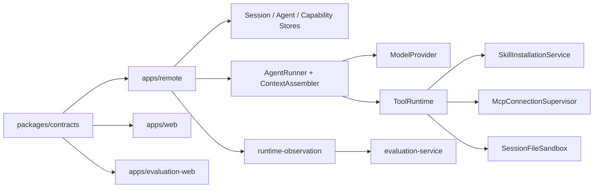
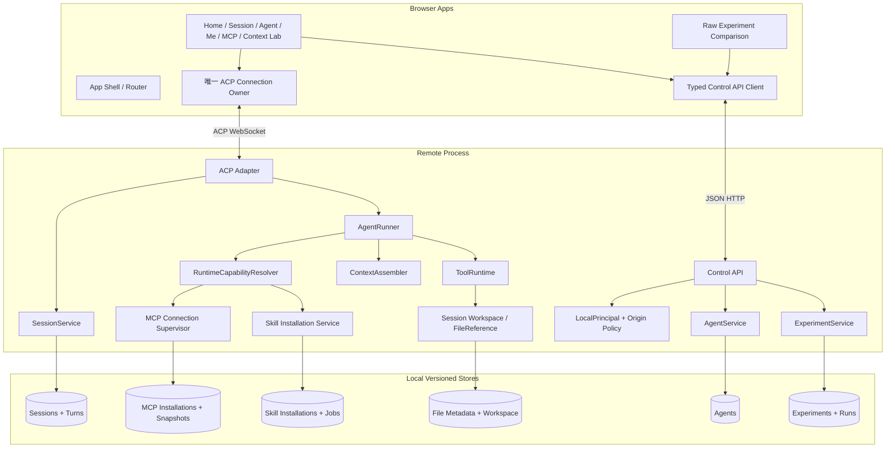
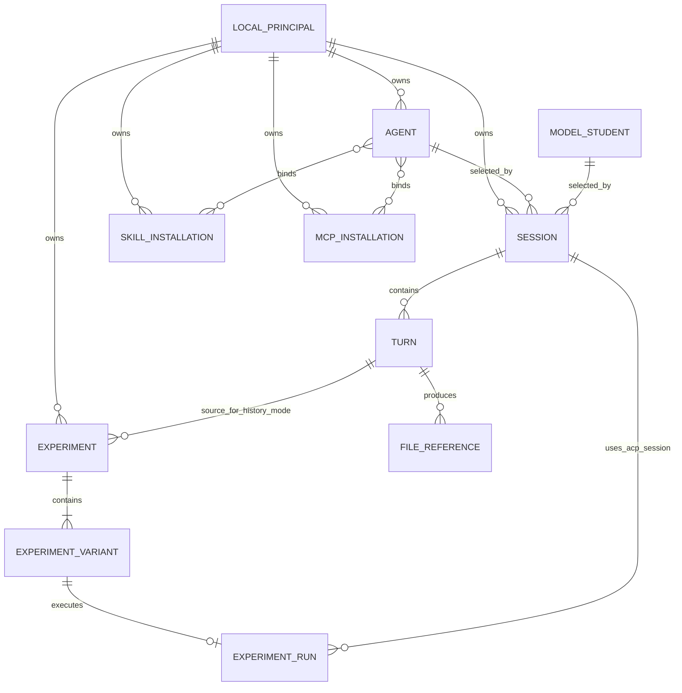

# Model Kindergarten Demo 到真实产品实施 TRD

> 方案代号：D2P-1.3（Demo to Product）
> 状态：已实现并完成首轮端到端验证
> 日期：2026-08-13
> 适用仓库：`/Users/bones/develop/Models-Kindergarten`

## 文档关系与裁决顺序

本文件是从现有 Demo 反推真实产品后的主技术方案。详细内容拆分为：

1. [完整需求与差距矩阵](./DEMO_TO_PRODUCTION_REQUIREMENTS_AND_GAPS.md)：逐页交互、状态、验收标准、Demo 与真实实现差距。
2. [全仓库校验与兜底逻辑审计](./VALIDATION_AND_FALLBACK_AUDIT.md)：区分明确需求、必要安全边界与实现自行添加的限制或静默修正。
3. [领域模型、数据与接口合同](./DEMO_TO_PRODUCTION_CONTRACTS.md)：前后端数据结构、ACP 扩展、Control API、状态机与错误码。
4. [分阶段实施计划](./superpowers/plans/2026-08-11-demo-to-production-implementation.md)：按文件、测试和依赖顺序拆分的开发任务。
5. [实现状态与验证记录](./DEMO_TO_PRODUCTION_IMPLEMENTATION_STATUS.md)：实际落地范围、关键程序路径、自动化结果和真实浏览器验证证据。

本方案吸收并统一以下既有设计：

- `docs/2026-08-10-models-kindergarten-demo-app-spec.md`
- `docs/MCP_REMOTE_DEMO_DESIGN.md`
- `docs/MCP_SKILLS.md`
- `docs/ARCHITECTURE.md`
- `docs/TECHNICAL_PLAN.md`
- `docs/ACP_COMPAT.md`
- `docs/TURN_EVALUATION.md`
- `docs/ERROR_HANDLING.md`
- `docs/superpowers/plans/2026-08-11-skill-installation-and-website-development.md`
- `docs/superpowers/plans/2026-08-11-remote-mcp-demo-flow.md`
- `docs/superpowers/plans/2026-08-10-agent-strategy-ui-delta.md`
- `docs/superpowers/plans/2026-08-10-provider-context-source-disclosure.md`
- `docs/superpowers/plans/2026-08-10-token-usage-projection.md`
- 外部参考 TRD：`model-kindergarten-ai-design-trd.md` 及其 appendix。

若上述文档与本方案冲突，以本方案为本轮 Demo 产品化的统一裁决；协议底线仍以 `AGENTS.md` 为最高约束。实施前必须先更新 `AGENTS.md` 的版本边界，使 Agent 管理、上下文实验和产品级 Control API 成为明确的新版本范围，不能让代码与仓库约束长期相互矛盾。

---

## 1. 概述

### 1.1 背景

当前仓库同时存在三种不同成熟度的资产：

- `/demo` 下已经表达较完整的产品导航、页面结构、操作反馈与跨页任务体验；
- Remote、Web、Evaluation 已有可运行的 ACP 会话、工具循环、上下文披露、MCP/Skill 底层、运行观察与基础评测能力；
- 多份模块方案已经设计了 Agent、Skill、MCP、模型入园和评测的部分落地路径。

问题不在于缺少页面，而在于 Demo 把用户需求和临时演示手段混在一起：共享状态依赖 `sessionStorage`，过程依赖定时器，功能分支依赖提示词字符串，资源和端口写死，页面状态没有服务端真相，真实 Runtime 又只有一个由环境变量决定的全局模型、全局能力和全局文件沙箱。因此，不能把 Demo 代码直接“接 API”；需要从效果反推领域边界，再让现有底层能力按会话、Agent 和 Turn 正确装配。

### 1.2 目标

本方案要在不破坏 ACP 主链和现有 Runtime 可靠性的前提下，实现以下结果：

1. 将 Demo 中除明确调研项外的所有用户可见功能变成真实、可持久化、可恢复、可测试的功能。
2. 建立统一的 Agent、Session、Turn、Skill、MCP、Experiment、FileReference 数据模型。
3. 保持“浏览器与 Remote 的 Agent 数据面只使用官方 ACP”；管理与查询使用同一 Remote 提供的 Control API。
4. 保持每个浏览器页面至多一个 ACP connection owner、每个 Session 至多一个活动 Prompt Turn。
5. 让每个 Turn 从 Session 绑定的 ModelStudent 和 Agent 解析真实能力，而不是读取进程级全局配置。
6. 让上下文实验复用真实 ContextAssembler、ModelProvider 和 ACP Session/Prompt 主链，不建立第二套伪执行器。
7. 将模型输出文件投影为标准 ACP `resource_link` 和受控文件预览，而不是暴露本地绝对路径。
8. 使用可观测的任务状态、错误合同和必要的幂等键，替代前端定时器和乐观假完成；本地单用户首版不做 ETag 编辑冲突系统。

### 1.3 成功标准

- Demo 对应的生产路由在刷新、重启 Remote、重新打开浏览器后仍能恢复服务端状态。
- Session 真实保存 `modelStudentId` 与 `agentId`；Turn 保存实际采用的 Agent 配置快照哈希、模型、能力快照和上下文快照。
- Agent 编辑保存后只影响后续 Turn；历史 Turn 可按其快照重放解释，不被当前 Agent 配置污染。
- Skill 安装、MCP 连接、Agent 绑定和运行时可见性具有一致的持久状态与端到端测试。
- 上下文实验的 B/C 变体产生真实模型输出；历史 A 可复用原始结果且不会重新请求模型。
- 文件创建后，聊天中的文件引用可在产品内安全预览；路径越权、符号链接逃逸和跨 Session 访问被拒绝。
- 关闭所有 Demo fallback 后，关键 E2E 不读取 `sessionStorage`、不使用模拟定时器、不按提示词文本判断业务分支。

---

## 2. 技术目标

### 2.1 功能目标

本轮实现以下模块：

- 产品级路由与共享 App Shell；
- 首页的真实会话启动、已有模型只读选择、Agent 选择、最近会话；
- 真实 Session 页面、会话历史、Agent/模型身份、上下文摘要与产物面板；
- Agent 新建/编辑、上下文策略、内置工具、Skill 和 MCP 能力绑定；
- Skill 资源库、手动安装、对话内批量安装并在同 Turn 刷新能力；
- 无认证 Remote MCP 的测试、安装、连接、重连、禁用、卸载、能力快照与 Agent 绑定；
- Context Lab 的新提示词模式和历史 Turn 模式；
- 2～3 变体的真实上下文实验、原始结果保存与实验列表；
- `resource_link` 文件引用、Markdown/静态 HTML 安全预览、可调分栏；
- “我的”页面中的实验、Agent、只读模型、MCP、Skill 管理；
- Control API 的本地单用户安全边界、统一错误和可观测性。

### 2.2 质量目标

- 新增领域 Store 使用原子写入、schemaVersion、迁移器与进程内串行写队列。
- 普通配置保存采用“后一次成功提交覆盖前一次”的本地单用户语义；安装、运行等可能重复触发的命令使用幂等键，避免重复创建资源。
- Control API 列表 P95 小于 200ms（本地、1000 条记录以内）；普通 Agent 保存 P95 小于 300ms。
- MCP 测试、Skill 安装、实验运行等长任务使用异步状态查询，不占用 HTTP 请求直到完成。
- ACP Prompt streaming 首个可见事件目标不劣于现有实现；新增持久化不能阻塞 token 流。
- 新增协议行为都有 contract/unit/integration 测试；关键跨应用路径有 E2E。

### 2.3 技术约束

- Node.js 22、TypeScript 7、React 19、Vite 8、Vitest 4、ACP SDK 1.3。
- Browser ↔ Remote 的对话、工具和模型执行只走官方 ACP；Control API 只承载 CRUD、预览、草稿和状态查询。
- 不引入第二个会话状态机，不让 UI 解释原始 ACP payload，不把管理领域塞入 `_meta`。
- `_meta` 只传 namespaced 引用或当前 ACP 工具调用的临时投影，例如 Session 绑定引用、Experiment Variant 引用、Skill 安装进度；服务端持久记录才是事实源。MCP 管理和实验总进度不借 ACP 冒充管理通道。
- 不让浏览器提交可信的 MCP capability snapshot、文件绝对路径或运行时工具定义。

---

## 3. 非目标与明确留白

以下四项仍有调研内容，但留白边界不同：

| 调研项 | 本轮处理 |
| --- | --- |
| 模型入园 | 不注册 `/model-admission` 或 `/demo/model-admission` 路由，不显示入园入口；生产只消费现有配置模型的只读目录。 |
| 模型打分 | 实现完整人工注释量表；四维固定为理解、规划、输出、执行，其中执行分由 Runtime metrics 按版本化规则计算。四维共同进入总分、雷达图、排名和 winner；不调用裁判模型，不实现自动评分调用。 |
| 创作小说 | 首页保留禁用卡片并标明“功能调研中”，卡片不可点击、不可填入提示词、不可进入假会话。 |
| 小说 MCP（Bearer Token） | 不实现浏览器录入/更新 Bearer Secret，不承诺小说 MCP 的特定工具语义；现有手工配置的 Secret 读取能力保持不变。 |

同时不包含：

- 通用 Workflow/DAG、Plan 执行器或多 Agent 协作；
- 长期记忆、RAG、课程/学生等新业务域；
- 全功能文件树、IDE、任意脚本预览执行；
- MCP 市场、OAuth 管理台或任意传输协议；
- 多租户、云端账号、计费、组织权限；
- Agent 版本、Revision、归档和 Session 迁移系统。Agent 是单一可变配置；保存时以最后一次成功提交为准，Turn 只记录当时的配置快照哈希。

Demo 中的 Memory 模块本轮仅允许保存 `mode: "off"`。UI 应禁用并说明尚未启用，不能用空壳开关制造已支持的假象。

---

## 4. 技术背景

### 4.1 现有技术栈

| 层 | 现有实现 | 可复用资产 | 主要缺口 |
| --- | --- | --- | --- |
| Web | React/Vite/Zustand、ACP Web Client | 稳定聊天 reducer、权限与 elicitation、上下文摘要 UI | 无产品路由、无管理客户端、无真实 Demo 页面状态 |
| Remote ACP | `KindergartenAgent`、SessionRepository、AgentRunner | new/list/load/resume/close/prompt/cancel、一会话一 Turn | Session 无 Agent/模型绑定；能力是全局静态 |
| Model Runtime | Ollama Provider、Responses API Provider | 流式文本、思考、工具调用、usage、重试与熔断 | 自定义 Responses 已完成真实端点体检、受管 Catalog、Secret 与按 Session resolver；硅基流动和 Ollama 管理入园仍留白 |
| Tool Runtime | ToolRegistry、ToolRuntime、Permission、Elicitation | 内置工具、重复调用防护、错误投影 | 缺 Turn scope、动态能力刷新、文件引用 |
| MCP | ConfigStore、ClientManager、ToolProvider | Streamable HTTP、发现、工具/资源、网络策略 | 单次初始化、全局 allowlist、无管理状态机 |
| Skill | Installer、Registry、Validator、ToolProvider | 校验、隔离安装、资源读取 | 无服务端安装 Job、无动态刷新、无 Agent 持久绑定 |
| Evaluation | observation/contracts/export/service/web | Turn trace、13 个基础指标、故障隔离 | 无实验草稿/变体/运行存储；Demo 评分是假状态 |

### 4.2 关键现状结论

1. `apps/web/src/demo/DemoApp.tsx` 才是 `/demo` 实际路由真相；模型入园路由按本轮裁决移除后，共有 `model-home`、`session`、`context-lab`、`agent-editor`、`me`、`mcp` 六个入口。
2. Context Lab 结果链接跨到 evaluation-web 的 `/evaluation/demo/agent-comparison`；真实详情路由另有 `/evaluation/sessions/:sessionId/turns/:turnId`。
3. `apps/remote/src/index.ts` 组装的是一个全局 ModelStudent、一个全局 Skill/MCP 能力集合和一个全局 FileSandbox；这与 Demo 的 Agent 选择、MCP 绑定和文件隔离语义不一致。
4. `AgentRunner` 在 Turn 开始时复制一次工具定义与能力快照；对话内安装 Skill 后，同 Turn 无法自然看见新能力。
5. Session V3 只保存会话元数据和 entries，没有 owner、Agent、模型、Turn 快照或文件引用。
6. MCP 和 Skill 底层安全能力可复用，但不能直接把 Demo 的 install/reconnect 状态接到现有一次性初始化对象上。

完整证据见[差距矩阵](./DEMO_TO_PRODUCTION_REQUIREMENTS_AND_GAPS.md)。

---

## 5. 依赖关系

### 5.1 内部依赖

### 5.2 外部依赖

- ACP SDK 1.3：Session/Prompt/Update/Permission/Elicitation 主协议。
- MCP Client SDK 2.0：Remote Streamable HTTP MCP 发现和调用。
- Model Provider：本轮只消费已存在、已验证的 ModelStudent；入园流程留白。
- 本地文件系统：开发阶段领域 Store 和 Session workspace 的持久层。

### 5.3 版本边界依赖

当前 `AGENTS.md` 将 Agent 管理、上下文实验等能力排除在 V1.6 之外。实施任务 0 必须先把本方案声明为新版本边界，并明确以下内容：

- Agent 是配置聚合根，不是第二个 Agent Runtime；
- Context Experiment 是固定 2～3 lane 的受控比较，不是通用 Workflow；
- Memory 仍关闭；
- Model admission 和 scoring 仍不进入范围。

---

## 6. 需求概览

### 6.1 生产路由

| 生产路由 | 来源 Demo | 主要职责 |
| --- | --- | --- |
| `/` | `/demo/model-home` | 选择已存在模型与 Agent、编辑任务、创建真实 Session、最近会话 |
| `/sessions/:sessionId` | `/demo/session` | ACP 聊天、上下文摘要、工具状态、文件产物、Session 身份 |
| `/context-lab` | `/demo/context-lab` | 新提示词实验草稿、A/B/C 策略编辑 |
| `/context-lab?turnId=...` | 同上 history 模式 | 加载不可变原 Turn；A 复用，B/C 重跑 |
| `/agents/new`、`/agents/:agentId` | `/demo/agent-editor` | Agent 新建/编辑和能力绑定 |
| `/me` | `/demo/me` | 实验、Agent、只读模型、MCP、Skill 资源管理 |
| `/mcps/new`、`/mcps/:mcpId` | `/demo/mcp` | 无认证 Remote MCP 测试、安装、详情与生命周期 |
| evaluation-web `/evaluation/experiments/:experimentId` | `/evaluation/demo/agent-comparison` | 原始回答、上下文事实、运行事实、人工评分与结果图表 |

`/demo/*` 在迁移期保留为视觉回归基线，不与生产数据混用。达到模块验收后逐路由关闭 fallback。

### 6.2 用户主链

1. 用户在首页选择一个已配置模型和一个 Agent，编辑任务后创建 Session。
2. Web 使用 ACP `session/new`，在 namespaced `_meta` 里只传 SessionBinding 请求。ACP 协议里的 `mcpServers` 是“由客户端临时提供 MCP 连接配置”的入口；本产品的 MCP 已在 Remote 安装并绑定 Agent，因此浏览器固定传空数组，避免重复连接或绕过授权。`cwd`/`additionalDirectories` 服从 Remote 公布的 workspace policy。
3. Session 页面通过同一个 ACP owner 加载会话并发起 Prompt。
4. Remote 在 Turn 开始时解析当前 Agent、模型和能力，构建上下文和 capability snapshot。
5. 只有当前用户消息明确给出受支持的 Skill 来源地址时，模型才可调用 `ensure_agent_skills`。Remote 还会校验地址确实来自该条用户消息；模糊的“帮我设计网页”只能使用 Agent 已绑定的 Skills，不能触发搜索或安装。整批成功后绑定 Agent，并在同 Turn 下一模型轮次重新解析能力。
6. 若模型写出文件，工具结果包含标准 `resource_link`；Web 打开受控预览面板。
7. 用户可从 Context Summary 进入 Context Lab，对本次真实 Turn 的上下文策略做 A/B/C 比较。
8. 实验 B/C 各创建一个 purpose=`experiment` 的 ACP Session，并走正式 `session/prompt`；结果写入 ExperimentRepository，evaluation-web 只读展示。

详细交互见[完整需求](./DEMO_TO_PRODUCTION_REQUIREMENTS_AND_GAPS.md)。

---

## 7. 目标功能架构

### 7.1 总体分层

### 7.2 数据面与控制面

**ACP 数据面**负责：

- Session 新建/加载/恢复/关闭；
- Prompt、流式消息、思考、工具调用、权限与 elicitation；
- experiment purpose Session 的真实模型执行；
- 文件 `resource_link` 和 Skill 安装临时进度投影。

**Control API**负责：

- Agent、Skill、MCP、Experiment 草稿与 FileReference 的 CRUD/查询；
- MCP 测试与重连、Skill 安装 Job 状态；
- Context Preview 和不可变 Turn Snapshot 查询；
- 实验结果列表/读取/保存标记；
- 管理页面数据，不发起普通聊天 Prompt。

### 7.3 单一事实源

| 信息 | 事实源 | 前端投影 |
| --- | --- | --- |
| Session/Turn | SessionRepository V4 | Zustand 仅缓存当前页面 |
| Agent | AgentRepository | 编辑草稿 + 最后写入生效 |
| Skill 安装 | SkillInstallationRepository/JobStore | Job polling + ACP Banner |
| MCP 连接 | McpInstallationRepository + Supervisor snapshot | 列表/详情 polling |
| 实验 | ExperimentRepository | Context Lab 草稿/结果页 |
| 文件 | Session workspace + FileReferenceRepository | Artifact panel |
| 聊天流 | ACP updates + persisted Session entries | chat reducer |

任何页面刷新都重新读取服务端事实；`sessionStorage` 是“只在当前浏览器标签页生命周期内存在的临时小仓库”，只允许保存侧栏折叠、分栏宽度等无业务意义的 UI 偏好，不能保存 Agent、MCP、Skill、实验结果或会话绑定。

---

## 8. 模块设计

### 8.1 产品路由与 App Shell

- 引入正式 Router，生产页面与 `/demo/*` 分开注册。
- `AcpConnectionProvider` 在单个 Web 页面中只构造一个 `AcpWebClient`；页面组件通过 hooks 使用，不自行 new connection。
- 建立 `AcpSessionUpdateRouter`，按 `sessionId` 将 update 路由到 chat collector 或 experiment collector，避免全局 reducer 把实验输出混入当前聊天。
- URL、Remote Control API、evaluation-web 地址全部从环境配置和 route helper 生成，禁止硬编码 5175 或 Vite 自动选中的 5174。

### 8.2 Agent 管理

Agent 是单一可变配置聚合根，至少包含：

- 名称、描述、system prompt；
- 内置工具及逐工具权限；
- Skill Installation 绑定；
- MCP Installation 绑定、逐工具权限和资源绑定；
- history policy；
- `memoryPolicy.mode = "off"`。

Session 只绑定 `agentId`，每个新 Turn 读取 Agent 当前值。Agent 编辑页直接保存完整表单，后一次成功提交覆盖前一次；首版本地单用户不显示冲突合并、归档、删除或迁移操作。Turn 持久化解析后的配置快照哈希，保证历史仍可解释。已创建 Session 只显示其绑定 Agent，不提供切换控件；要使用其他 Agent，必须从首页创建新的 Session。

### 8.3 Session 与 Turn

Session V4 新增 `ownerId`、`purpose`、`modelStudentId`、`agentId` 和 `turns`。普通会话 purpose=`chat`；实验 lane purpose=`experiment`，默认不出现在普通历史列表。

每个 Turn 保存：

- 模型与 Agent 实际身份；
- capability snapshot/hash；
- provider-neutral model messages 和 provider serialization 摘要/hash；
- context source、截断信息、usage、stop reason；
- 关联 entry IDs 和输出文件 references。

Session `load` 发送完整历史；`resume` 保持零重放。现有 invariant 不改变。

### 8.4 Runtime 能力解析

新增 `RuntimeCapabilityResolver.resolve(TurnScope)`，每次返回本轮专属的：

- ModelProvider 引用；
- Agent snapshot；
- ToolRegistry/RuntimeCapabilityCatalog；
- Skill/MCP context sources；
- session-scoped FileSandbox；
- capability snapshot 和 generation。

AgentRunner 首轮解析一次。工具结果可返回结构化 `effects.capabilitiesChanged=true`；发生后，Runner 在下一次模型请求前重新解析能力并记录新 generation，但保留同一 Turn、同一 ToolCallLedger 和已产生的消息。不得通过扫描 `rawOutput` 或提示词判断是否刷新。

### 8.5 Skill

- 手动安装与 `ensure_agent_skills` 复用一个 `SkillInstallationService`。
- 安装来源首版只接用户在当前消息中明确给出的 GitHub 仓库根目录或仓库内目录 URL，或用户在管理页主动选择的批准本地来源。服务端从 URL 指向目录开始按层查找，只安装第一次出现 `SKILL.md` 的深度；一旦该层有结果便不进入更深目录。解析到不可变 commit 后再安装。模型不得自行搜索、补全或猜测来源地址。
- 复用键以规范化来源（repository + subdirectory + requested ref）和内容 commit/hash 为准，不以 Skill 名称单独判重。相同来源、相同 commit 直接返回 `reused`；相同来源已有旧版本时默认继续复用，不静默联网更新。只有用户明确点击/说“更新”时才解析新 commit，校验成功后切换 Agent 绑定；同名不同来源按不同 Skill 处理并提示来源冲突。
- Job 和 Batch 持久化，重启时将未完成任务投影为 interrupted/failed，可重试。
- 只有 `ready` Installation 可绑定；批量对话安装必须全批成功后原子并入 Agent。
- 安装进度通过 Tool Call `_meta.modelKindergarten.operation` 投影到 Banner，刷新后以 Job API 为准。

### 8.6 MCP

- MCP Installation、连接状态、capability snapshot 和 Agent binding 分离。
- 本轮新建 UI 只允许 HTTPS Streamable HTTP、`authKind="none"`；loopback HTTP 仅开发模式。既有环境变量/Keychain Bearer 配置可作为只读 `externally_managed_bearer` 兼容导入，但页面不能创建、修改或显示其 credentialRef。
- `McpConnectionSupervisor` 按 installationId 维护连接、重连、快照 generation 和最后错误；不再启动时一次性冻结。
- Agent 绑定的是 Installation 下允许的工具/资源，不是一个全局 `agentCapabilities` 数组。
- 每次发现后由 Remote 生成并持久化 capability snapshot；浏览器不得提交或修改 snapshot。
- 调用时再检查 Installation enabled、connected、Agent binding 和 capability generation，防止仅靠展示层过滤。
- Bearer credential 创建/更新端点、小说 MCP recipe 与专用工具语义全部留白。

### 8.7 Context Lab 与实验

Context Lab 只编辑服务端 ExperimentDraft：

- fresh 模式：A/B 初始相同；发生策略差异后才可运行；可增加 C。
- history 模式：按 `turnId` 加载不可变原 Prompt、模型、Agent/能力/上下文事实和原始结果；A 固定 `reuse_snapshot`，B/C 为 rerun。
- 策略模块为 system/tools/MCP/skills/history；memory 显示禁用。
- 预览通过 Remote 调用真实 ContextAssembler 和 ModelProvider serializer，返回估算 token 与实际 raw provider input；不保留前端硬编码 token map。

运行时，Web 为 B/C lane 创建带 namespaced experiment reference 的 ACP Session，再调用标准 `session/prompt`。这些是真实的 ACP Session/Turn，但 `purpose="experiment"`，只关联在实验记录中，普通聊天列表不展示。Remote 从 ExperimentRepository 读取并校验变体，不相信浏览器传入完整能力定义。A 的 `reuse_snapshot` 不请求模型。全部完成后跳到 evaluation-web 对比页。

结果页显示回答、上下文差异、工具/usage/停止原因、状态与保存标记，并实现 Demo 表达的四维评分。全部 lane 完成后，Remote 每次实验调用当前 ModelStudent 生成并持久化一份标注工作表：从原任务和各 lane 信息合并公共需求项，从回答和 Tool 过程提取各 lane Workflow，并给出各回答的结果段语义与文本单元边界建议。该结构化整理调用关闭 Provider 推理模式；模型输出不含 verdict 或分数。Remote 按模型给出的段落顺序规范化可能的边界跳号/重叠/越界，自行生成首尾相接、无重叠无遗漏的字符区间与 hash。用户显式重新生成时旧 Scorecard 失效。

理解、规划、输出三维由人对该工作表的选择产生，执行维由同一 Run 的 Runtime Trace 按版本化确定性规则生成。四维均为 0～100、默认等权 25%，`totalScore = round((理解 + 规划 + 输出 + 执行) / 4)`；四维共同进入雷达图、排名和 winner。任一人工维度未完成时 Scorecard 仍是 draft，不生成总分、排名或 winner，不能像 Demo 假数据那样把未标注项默认为 100。

Runtime 的完成状态、Tool 成功率、错误/权限违规/重复调用、首 Token 延迟和总耗时用于合成“执行分”；Rounds、Tool Calls、Context/Output Tokens 等方向不天然代表好坏的指标继续作为解释事实展示，不随意按“越少越好”扣分。整个过程只做本地确定性计算，不发起任何裁判模型或自动评分 API 调用。

### 8.8 文件与 Artifact

- 所有可产出本地文件的内置工具都只能在 `SessionWorkspaceResolver.forSession(sessionId)` 返回的沙箱运行；FileSandbox 与 ProcessSandbox 共享同一 Session scope。
- 写入成功后创建不可变 `FileReference`，工具内容返回 `resource_link`，URI 使用不含真实路径的 `mk-file://{fileReferenceId}`。白话说：模型生成 `landing.html` 或 `README.md` 后，聊天里只得到一个随机文件 ID；用户点击文件卡片，右侧面板再凭这个 ID 请求并显示该文件，而不是把电脑真实路径交给浏览器。
- Web 识别该 URI 后通过 Control API 按 ID 获取元数据或安全预览；外部 `https:` resource link 仍遵循外链策略。
- Markdown 由安全 renderer 渲染；HTML 服务端注入严格 CSP，并在仅有 `allow-scripts` 的 sandbox iframe 中显示。不得加入 `allow-same-origin`、`allow-forms`、`allow-popups` 或顶层导航权限。
- 预览不执行 shell，不允许 `file://`，不允许跨 owner/session 读取。

### 8.9 “我的”资源管理

- Experiments：真实列表、搜索、分页、状态和原始结果入口。
- Agents：真实列表、新建、编辑；首版不提供归档、删除和 Session 迁移。
- Models：只读展示已经配置的 ModelStudent 和健康状态；不提供入园入口。
- MCPs：真实 Installation 列表和连接状态。
- Skills：真实 Installation 列表、安装 Job 和可绑定状态。

---

## 9. 数据设计摘要

核心实体关系：

所有记录包含 `schemaVersion`、ID、ownerId、createdAt、updatedAt；首版本地单用户写入串行执行并采用最后写入生效，不向 UI 暴露 revision/ETag。Secret 记录只保存 `credentialRef`，不进入日志、列表响应、ACP `_meta` 或 Context Summary。

字段、状态机、存储布局和迁移规则见[合同文档](./DEMO_TO_PRODUCTION_CONTRACTS.md)。

---

## 10. 接口设计摘要

### 10.1 ACP 扩展

只增加三类 namespaced `_meta`：

- `session/new`：`modelKindergarten.sessionBinding` 或 `modelKindergarten.experimentRunRef`；
- `session/prompt`：已有 turnId 元数据继续使用；
- `tool_call_update`：仅投影当前 ACP Turn 内 Skill 工具调用的 `modelKindergarten.operation`，以及文件工具的 `modelKindergarten.fileReferences`。

扩展解析统一放在 `packages/contracts`，版本不匹配或字段非法时忽略展示扩展或返回明确 Session 创建错误，不能让 UI/Runtime 到处手写类型断言。

这里所谓“Remote 受管”只是指：MCP 连接由产品后端统一安装、保存和授权，不由浏览器为每个会话临时创建。于是 Web 的 ACP `session/new.mcpServers` 必须是空数组；若浏览器传入任何服务器配置，Remote 明确拒绝。MCP 的工具定义由 Runtime 放入模型请求的 `tools` 字段，获准预载的 MCP 资源内容才由 ContextAssembler 放入上下文；两者都不是把服务器 URL/Secret 拼进聊天系统提示词。

`evaluation-web` 不是第三方网站，而是仓库内已有的另一个前端应用，专门展示评测/实验详情。“外部”只表示从主 Web 跨应用跳转。route helper 只在 URL 带 `experimentId`；新页面再用该 ID 向 Remote 读取回答、上下文、运行指标和评分，跳转 URL 不携带这些正文或 Secret。

### 10.2 Control API 资源

- `/api/control/v1/agents`
- `/api/control/v1/skills`、`/skill-install-jobs`
- `/api/control/v1/mcps`、`/mcp-tests`
- `/api/control/v1/sessions`、`/turns/:turnId/context`
- `/api/control/v1/context-previews`
- `/api/control/v1/experiments`
- `/api/control/v1/files/:fileReferenceId`
- `/api/control/v1/model-students`（只读）

统一使用 `{data, requestId}` 成功 envelope 和 RFC 9457 风格 problem detail 错误。完整路径、请求响应、状态码与幂等规则见[合同文档](./DEMO_TO_PRODUCTION_CONTRACTS.md)。

---

## 11. 安全设计

### 11.1 本地单用户边界

本轮不伪造账号系统。Remote 默认只绑定 loopback，principal 固定为 `local-admin`，所有记录仍保存 ownerId 以便未来迁移。Control API 只接受配置白名单中的 Web/Evaluation Origin，不使用 cookie，不允许 `*` CORS；非 loopback 暴露必须显式失败启动。

### 11.2 文件安全

- session-scoped root；
- realpath 与 symlink 双重校验；
- 大小、扩展名、MIME 和读取上限；
- opaque fileReferenceId；
- HTML CSP 与 sandbox；
- 审计拒绝原因，不记录文件正文。

### 11.3 MCP/Skill 安全

- MCP 延续 HTTPS、无重定向、私网解析阻断、响应大小和超时策略；开发 loopback 例外显式标记。
- MCP capability 由 Remote 发现，调用前二次授权。
- Skill 安装限制 source、commit、文件数、单文件/总大小、symlink 和路径；Job 日志净化 token/URL query。
- 浏览器 Secret 管理留白；任何已有 Bearer 只通过环境变量或 Keychain `credentialRef` 读取。

### 11.4 并发与越权

- Agent/MCP 普通配置写入在单 Remote 进程中串行执行，最后一次成功写入生效；首版不实现字段级冲突合并。
- 安装、重连、实验运行使用 `Idempotency-Key`。
- Session、Turn、Experiment、FileReference 每次读取都校验 ownerId 和关联关系。
- 一 Session 一 Prompt Turn 的现有锁保持；实验每 lane 一个独立 Session。

---

## 12. 性能与可靠性

### 12.1 性能策略

- 列表分页，默认 20、上限 100；服务端搜索，不把全部实验拉到浏览器过滤。
- Agent/Skill/MCP 快照按配置 hash/generation 缓存；更新后定点失效。
- Context Preview 使用 300ms 防抖和内容 hash 缓存。
- MCP discovery、Skill install、Experiment run 均异步；前端 1s 起步、指数退避至 5s polling。
- ACP token streaming 与领域持久化解耦；批量 append 仍保持已有顺序语义。

### 12.2 恢复策略

- 所有 JSON Store 使用 temp + fsync + rename，并保留上一个可读备份；启动执行 schema 校验。
- 进程重启后：running Skill Job → interrupted；connecting MCP → disconnected；running Experiment lane 根据 Session/Turn 事实恢复为 completed 或 interrupted。
- MCP reconnect 使用有上限的指数退避和手动重试；禁用立即停止自动重连。
- Evaluation exporter 失败不影响聊天完成；原始 Turn 事实仍保存在 Remote。

---

## 13. 测试策略

### 13.1 测试层级

| 层级 | 重点 |
| --- | --- |
| Contracts | schemaVersion、严格解析、状态机、ACP `_meta`、错误 envelope |
| Repository | 原子写、迁移、必要命令幂等、损坏恢复、关联校验 |
| Runtime unit | Agent 能力解析、同 Turn refresh、history policy、sandbox scope |
| Remote integration | ACP Session 绑定、Control API、Skill/MCP 状态、Experiment lane |
| Web unit | Router、update router、loading/empty/error、Artifact URI 分流 |
| Cross-app E2E | 首页→Session；Skill 安装→同 Turn；MCP→Agent→调用；Context Lab→原始对比；文件预览 |
| Security | Origin、路径逃逸、symlink、SSRF、重复请求、Secret 泄露 |

### 13.2 不可回归约束

- load 全量重放，resume 零重放；
- 一 Session 一活动 Prompt；
- Tool Call 原始顺序稳定；
- Permission 和 AskUser 仍走 ACP；
- Remote 不保存 Web UI projection；
- Web 不保存 Runtime state；
- observation/evaluation 失败不使 Turn 失败。

具体测试文件和命令见[实施计划](./superpowers/plans/2026-08-11-demo-to-production-implementation.md)。

---

## 14. 部署、迁移与回滚

### 14.1 迁移顺序

1. 加入新 contracts 和只读 Store，不切流量。
2. Session V3 → V4 启动迁移：现有 Session 使用默认只读 ModelStudent 和系统默认 Agent；保留备份。
3. 导入当前全局 MCP config 为 MCP Installation，并把 allowlist 迁到默认 Agent binding。
4. 扫描现有 SkillRegistry，创建 ready SkillInstallation 记录，不移动已验证内容。
5. 开启 Agent/Skill/MCP 管理页 feature flag。
6. 按路由逐步启用首页、Session、Artifact、Context Lab 与实验。
7. parity E2E 全绿后停止生产入口读取 Demo 状态。

### 14.2 Feature Flags

- `D2P_CONTROL_API`
- `D2P_AGENT_BINDING`
- `D2P_DYNAMIC_CAPABILITIES`
- `D2P_FILE_REFERENCES`
- `D2P_CONTEXT_EXPERIMENTS`
- `D2P_PRODUCTION_ROUTES`

Flag 必须是服务端和前端共同可见的 capability，不允许只在前端隐藏但后端仍接受危险请求。

### 14.3 回滚

- 每个 Store 迁移保留上一个 schema 文件和可重复迁移日志。
- ACP 扩展均为 optional；关闭 flag 后退回当前默认 ModelStudent/Agent，但不删除新数据。
- Production route 可逐项退回现有真实 Chat App；Demo 继续只作为视觉参考。
- Responses API Provider 的实际接线仍属于模型入园调研；本轮只记录其启用前质量门禁，不提前修改或接入生产。

---

## 15. 风险与缓解

| 风险 | 影响 | 缓解 |
| --- | --- | --- |
| 把 Demo 状态直接搬进生产 | 多事实源、刷新丢失 | 所有领域状态以 Remote Store 为准；前端只保留草稿/缓存 |
| 动态能力刷新破坏 Turn 一致性 | 模型看到不一致工具 | generation、每轮 snapshot、结构化 tool effect、测试同 Turn 路径 |
| MCP 卸载与 Agent 绑定同时发生 | 悬空引用或越权调用 | 单进程写队列、UnitOfWork、调用前二次校验 |
| 实验变成第二套 Runtime | 结果不可比较、维护分叉 | 每 lane 使用正式 ACP Session/Prompt 和同一 AgentRunner |
| Context Snapshot 过大或泄密 | 磁盘膨胀、Secret 暴露 | provider-neutral 结构、敏感字段净化、上限、hash、原文按需存储 |
| HTML 预览主动联网或执行脚本 | 隐私/安全 | CSP、URL 清洗、sandbox 无脚本权限、大小限制 |
| Local Control API 被其他网页调用 | 本机数据被操作 | loopback、Origin allowlist、无 wildcard、请求 ID 与审计 |
| 新范围与 V1.6 文档冲突 | 实施争议 | Task 0 先更新版本边界和 ADR，再写代码 |
| 调研项被“顺便实现” | 未定方案固化 | 路由 capability gate、验收明确排除、代码审查 checklist |
| Responses SSE 兼容层过早启用 | 并行工具顺序漂移、usage/终态丢失或上游错误泄露凭据 | 模型入园阶段先完成 Provider 合同测试门禁，再允许进入 ModelStudentCatalog |

---

## 16. 监控与运营

本地应用仍需要可诊断性：

- 结构化日志统一字段：requestId、sessionId、turnId、agentId、experimentId、installationId；
- 指标：ACP 连接数、Prompt active、首 token 延迟、Turn 完成率、能力解析耗时、MCP 连接状态、Skill Job 时长、实验 lane 状态、文件预览拒绝数；
- 日志禁止写入 Prompt 正文、文件正文、Bearer、MCP headers 或完整 provider request；
- Context Summary 的 raw provider input 是用户主动查看的受控产品数据，不等于服务日志；
- “我的”页面只显示面向用户的状态与最近错误，不暴露内部堆栈。

---

## 17. 实施里程碑

| 阶段 | 范围 | 退出条件 |
| --- | --- | --- |
| M0 边界与合同 | ADR、contracts、错误、feature flags | 编译与 contract tests 通过 |
| M1 持久领域 | Agent/Session V4/Skill/MCP Stores 与迁移 | 重启恢复、最后写入与必要幂等测试通过 |
| M2 Runtime 装配 | TurnScope、动态能力、Session workspace | ACP 回归 + 同 Turn Skill refresh 通过 |
| M3 管理体验 | Router、首页、Agent、Me、无认证 MCP、Skill | 不依赖 sessionStorage/timer，页面状态测试通过 |
| M4 Session/Artifact | 真实 Session Shell、文件引用和预览 | 首页→Session→文件 E2E 通过 |
| M5 Context Experiment | Snapshot、Lab、2～3 lane ACP 运行、三维人工注释、Runtime 执行分与四维图表 | fresh/history、量表保存、执行分、四维总分/雷达/排名/winner E2E 通过 |
| M6 迁移收口 | feature flag 切换、观测、文档和清理 | 全量 E2E、安全测试、回滚演练通过 |

详细任务依赖和文件级步骤见[实施计划](./superpowers/plans/2026-08-11-demo-to-production-implementation.md)。

---

## 18. 开放问题与调研占位

本轮不阻塞实施、但必须保持显式占位：

1. 模型入园采用何种 Provider Adapter、Secret 生命周期和能力体检标准。
2. 若未来重新考虑 LLM-as-Judge，裁判模型、校准集、置信度和人工复核如何定义；当前明确没有自动评分调用，人工三维与 Runtime 执行维不等待该调研。
3. 小说创作需要的领域模型、长文本分段、章节工件和恢复语义。
4. 小说 MCP 的 Bearer Secret 来源、轮换、最小权限和工具 schema。
5. Memory 模块何时进入版本边界及其隐私/删除语义。

在上述问题完成 ADR 前，生产 API 不预留“万能 JSON”绕过；只保留可扩展的 discriminated union 与 capability gate。

---

## 19. 变更记录

| 日期 | 版本 | 变更 |
| --- | --- | --- |
| 2026-08-13 | 1.3 | 完成 D2P-1 首轮实现；明确每个实验的标注工作表必须由该实验绑定的 ModelStudent 实时生成需求合并项、Workflow 与结果分段语义，生成结果持久化后由人作答；补充失败重试、边界规范化、强制重新生成使旧 Scorecard 失效和端到端验证记录。 |
| 2026-08-12 | 1.2 | 恢复不可点击的小说创作调研卡片；固定理解/规划/输出三维人工注释 + Runtime 执行分的四维评分，四维共同参与等权总分、雷达图、排名和 winner；明确无自动评分调用。 |
| 2026-08-12 | 1.1 | 按评审反馈简化为本地单用户最后写入；移除模型入园路由、Agent 归档/迁移和会话内身份切换；限定 Skill 显式来源与更新规则；纳入人工评分、总分、雷达图、排名和 winner；澄清 ACP、MCP、文件预览、evaluation-web 与三层状态。 |
| 2026-08-11 | 1.0 | 依据实际 Demo 路由、非 Demo 代码和现有设计文档，形成统一产品化方案；明确四项调研留白。 |
