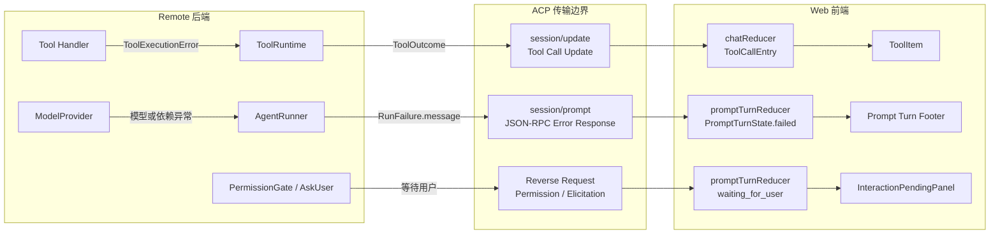
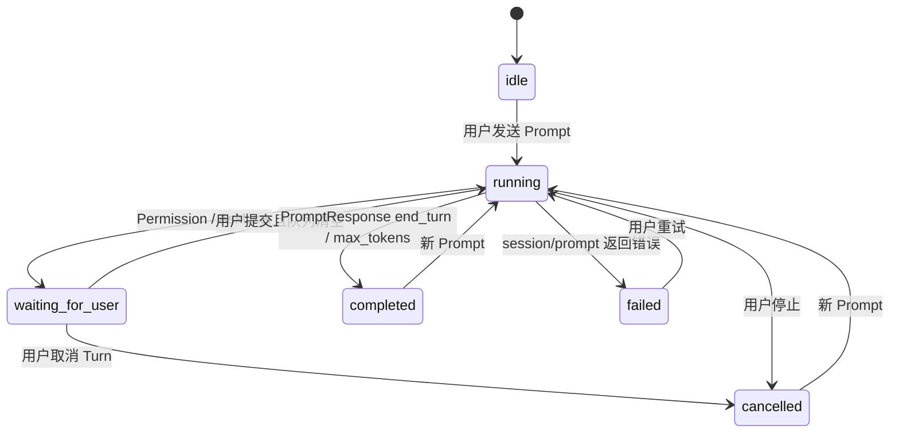

# Models Kindergarten 错误与 Prompt Turn 状态设计

## 1. 核心思路

错误在最了解事实的模块中判断，只有会终止当前 Prompt Turn 的错误才跨 ACP 返回给 Web。Remote 保留具体错误原因；Web 不理解后端错误分类，只把它归约成 `backend_error + message`。

```text
发生点识别事实
    ↓
Remote 决定局部继续或结束 Prompt Turn
    ↓ ACP
Web PromptTurnState 归约整体状态
    ↓
组件按稳定状态分散渲染
```

不实现全局 Error Manager、Runtime Event 或 Timeline。Tool 局部错误和 Prompt Turn 整体失败是两条不同链路。

## 2. 前后端边界



边界只有三层：

```text
Remote 后端
    判断错误属于 Tool 局部结果，还是必须结束整个 Prompt Turn

ACP
    Tool 结果走 session/update
    Prompt Turn 失败走 session/prompt JSON-RPC Error Response
    Permission / AskUser 走 Reverse Request

Web 前端
    chatReducer 归约 ToolCallEntry
    promptTurnReducer 归约 Prompt Turn 整体状态
    React 组件只消费归约后的稳定数据
```

### Tool 局部错误

Tool Handler 识别参数、权限、命令退出码、网络和超时等错误。`ToolRuntime` 将其规约为结构化 `ToolOutcome`，通过 ACP Tool Update 更新对应 `toolCallId`，同时把结果交回模型继续推理。

```ts
interface ToolOutcome {
  status: "success" | "error" | "denied" | "duplicate_blocked";
  modelContent: string;
  rawOutput: unknown;
  error?: {
    code: string;
    category: string;
    message: string;
  };
}
```

Tool 失败默认不结束 Prompt Turn，也不进入全局错误状态。Web 只根据 `ToolCallEntry.status` 在对应 `ToolItem` 内显示。

### Prompt Turn 后端错误

模型或 Runtime 异常无法作为 ToolOutcome 继续执行时，AgentRunner 将其转换为 `RunFailure`。这里保留具体、可读的错误原因，不统一改写成笼统文案。

```ts
class RunFailure extends Error {
  constructor(
    readonly message: string,
    options?: ErrorOptions,
  ) {
    super(message, options);
  }
}

function toRunFailure(cause: unknown): RunFailure {
  return new RunFailure(
    cause instanceof Error ? cause.message : "Agent Runtime 执行失败",
    { cause },
  );
}
```

ACP Adapter 只把详细错误文本放进 `session/prompt` 的 JSON-RPC 错误响应，不传递 `source/effect/retryable` 等 UI 不需要的结构：

```ts
throw new acp.RequestError(-32001, failure.message);
```

内部堆栈和原始对象只写 Remote 日志，不通过 ACP 暴露。Web 无论收到 Ollama、依赖还是未知 Runtime 错误，都归约为：

```ts
{
  kind: "backend_error",
  message: error.message,
}
```

## 3. Remote 模块职责

```text
apps/remote/src/
├── model/model-error.ts       # ModelProvider 内部错误
├── tools/tool-error.ts        # Tool Handler 内部错误
├── tools/tool-runtime.ts      # ToolOutcome、权限、局部重试和去重
├── runtime/run-failure.ts     # toRunFailure：终止 Turn 的错误规范化
└── acp/kindergarten-agent.ts  # RunFailure → ACP RequestError
```

边界规则：

- ModelProvider 只判断模型和模型依赖错误；
- ToolRuntime 只管理 Tool 局部结果，不决定 UI；
- AgentRunner 决定当前 Prompt Turn 是否还能继续；
- `toRunFailure` 是纯转换函数，不是全局错误管理器；
- Permission、AskUser 和用户取消不是后端错误。

自动重试只发生在 Remote 的同一次 Provider/Tool 调用内部。自动重试期间 Web 仍保持 `running`，不增加前端 `retrying` 状态。

## 4. Web 集中状态

Web 不维护错误集合，而维护当前 Prompt Turn 的单一综合状态。Chat 内容和 Prompt Turn 状态分别归约：

```text
apps/web/src/
├── acp/acp-client.ts                         # ACP 连接和 Reverse Request continuation
├── prompt-turn/prompt-turn-types.ts         # 稳定状态与交互数据契约
├── prompt-turn/prompt-turn-reducer.ts       # Prompt Turn 唯一状态转换入口
├── store/app-store.ts                       # 聚合 Connection、Session、Chat、PromptTurn
└── components/
    ├── errors/PromptTurnStatusRow.tsx       # Turn 终态投影
    ├── errors/ComposerAvailabilityNotice.tsx # 连接状态投影
    └── interactions/InteractionPendingPanel.tsx # 用户介入投影
```

```text
AppStore
├── connection             # ACP 连接状态
├── sessions               # Session 列表
├── chat                   # historyChatEntries / streamingChatEntries
└── promptTurn             # 当前 Prompt Turn 核心状态机
```

`PromptTurnState` 使用互斥联合类型，避免 `running/error/stopReason` 等零散字段组合出非法状态：

```ts
interface PromptRequestState {
  operationId: string;
  sessionId: string;
  turnId: string;
  text: string;
}

type PromptTurnState =
  | { phase: "idle" }
  | {
      phase: "running";
      request: PromptRequestState;
    }
  | {
      phase: "waiting_for_user";
      request: PromptRequestState;
      interactions: InteractionCollection;
    }
  | {
      phase: "completed";
      request: PromptRequestState;
      reason: "end_turn" | "max_tokens";
    }
  | {
      phase: "failed";
      request: PromptRequestState;
      failure: {
        kind: "backend_error" | "connection_error";
        message: string;
      };
      actions: TurnAction[];
    }
  | {
      phase: "cancelled";
      request: PromptRequestState;
    };

type TurnAction =
  | { type: "retry_prompt"; label: "重试回答" }
  | { type: "reconnect"; label: "重新连接" };
```

Permission 和 AskUser 统一进入 `waiting_for_user`，并继续使用 `order + byId` 支持多个并发 Tool 请求：

```ts
interface InteractionCollection {
  order: string[];
  byId: Record<string, PendingInteractionState>;
}
```

Prompt 请求文本保存在 `PromptRequestState`，重试直接读取 `request.text`，不再依赖 React ref 或反向读取 ChatEntry。

## 5. 状态转换



## 6. UI 数据映射

| 稳定数据 | UI 位置 |
| --- | --- |
| `ToolCallEntry.status=failed` | 对应 `ToolItem` 内部 |
| `promptTurn.phase=running` | 消息流末尾 Loader |
| `promptTurn.phase=waiting_for_user` | Composer 上方 `InteractionPendingPanel` |
| `promptTurn.phase=failed` | 当前 Turn 末尾错误文案和可用操作 |
| `promptTurn.phase=cancelled` | 当前 Turn 末尾中性停止状态 |
| `connection=disconnected` | Composer 上方连接提示 |
| React 渲染异常 | 局部或根 Error Boundary fallback |

组件只消费 `phase/status/kind/actions` 等稳定综合字段，负责布局、颜色、展开折叠和输入状态；组件不解析后端错误文本，也不组合多个零散布尔值推断业务状态。

## 7. 设计不变量

- 后端详细错误原因通过 `RequestError.message` 保留，但不扩展复杂跨端错误字段；
- Tool 错误属于 ToolCallEntry，只有无法继续的后端错误才令 Prompt Turn 失败；
- Web 以 `PromptTurnState` 管理整体 Turn，不建立通用错误管理器；
- Connection、ChatEntry、PromptTurn 分属不同领域状态，不塞进一个万能状态机；
- Store 保存数据和状态，不保存 React 组件 ref；
- UI 操作使用稳定的 `TurnAction`，不在组件中临时拼接协议响应；
- 用户取消和渲染错误都不触发业务重试。

## 8. 面试表述（软件工程视角）

这套设计解决的核心问题，是如何在 Agent 的异步执行链路中明确错误所有权，并保证后端执行状态、ACP 协议响应与前端交互状态保持一致。

Remote 按职责分层处理故障：Provider 和 Tool Handler 负责识别本领域事实，ToolRuntime 将可恢复的工具失败收敛为结构化 `ToolOutcome`，AgentRunner 只在编排层判断当前 Prompt Turn 是否仍可继续。这样可以把“某次工具调用失败”和“整个 Turn 无法继续”建模为两种不同语义，避免局部故障被错误升级为全局失败。

ACP Adapter 是系统的传输边界。它不向前端泄露后端异常类型，而是将内部结果映射为协议原生语义：Tool 局部结果使用 `session/update`，Turn 级失败使用 `session/prompt` 的 JSON-RPC Error Response，需要用户介入的流程使用 Reverse Request。跨端契约只保留 UI 真正需要的信息，内部错误栈和实现细节留在 Remote，从而降低前后端耦合。

Web 将当前 Turn 建模为互斥的 `PromptTurnState`，并由 Reducer 统一执行状态转换。它是 Turn 生命周期的单一事实来源，能够在类型层消除 `loading=true` 与 `failed=true` 等非法状态组合。Chat、Connection 和 PromptTurn 分别维护各自领域状态，React 组件只订阅稳定的投影结果并负责渲染，不解析错误文案，也不自行推断业务状态。

最终形成一条清晰的工程链路：**领域模块识别事实，Runner 决定执行策略，ACP 约束跨端契约，Reducer 维护客户端一致性，组件完成状态投影。** 该设计没有引入全局 Error Manager，同时为后续增加新的 Tool、Provider、权限交互或错误展示保留了稳定扩展点。
