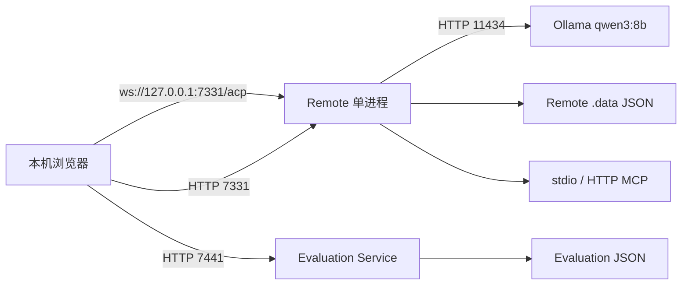
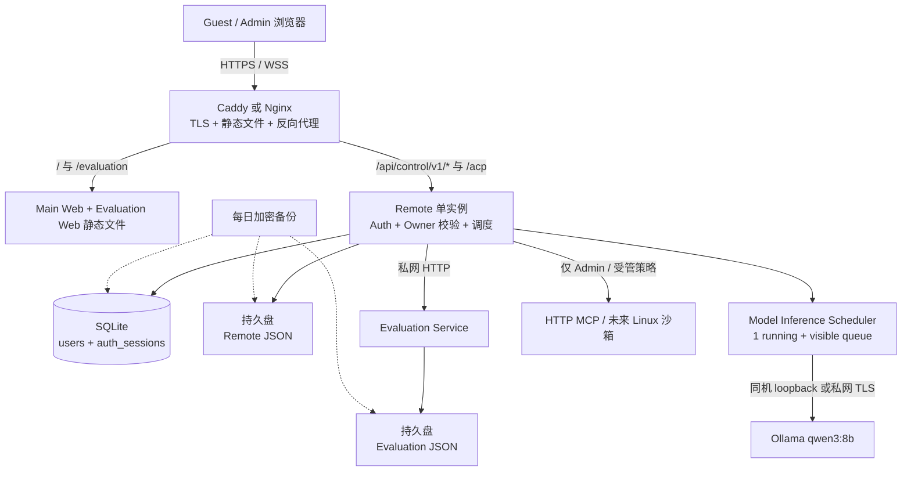
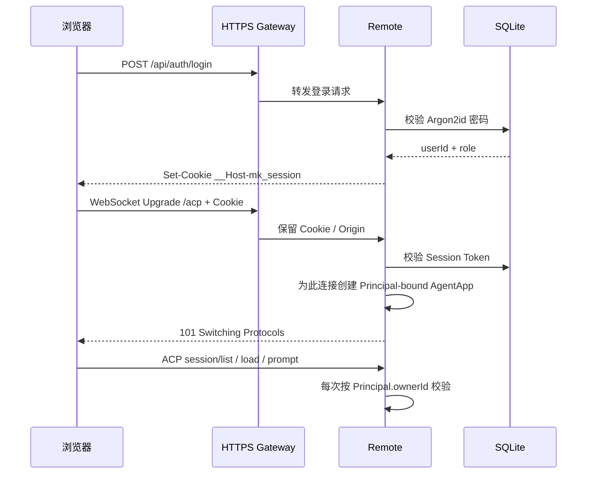
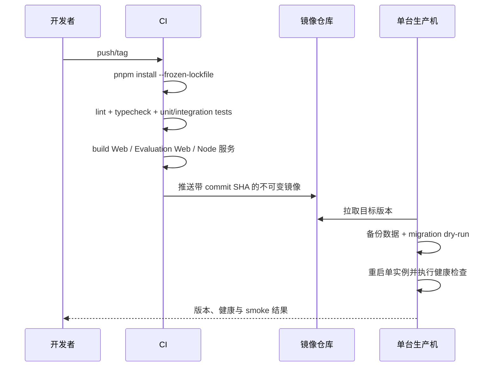

# Models Kindergarten 在线部署调研与双用户容量方案（TRD）

> 版本：v1.0  
> 日期：2026-08-14  
> 状态：调研结论 / 待实施  
> 适用阶段：面试演示、Guest + Admin 两个账号、低调用量  
> 关联文档：[ARCHITECTURE.md](./ARCHITECTURE.md)、[DEMO_TO_PRODUCTION_CONTRACTS.md](./DEMO_TO_PRODUCTION_CONTRACTS.md)、[TECHNICAL_PLAN.md](./TECHNICAL_PLAN.md)

---

## 0. 先给结论

MK 当前不需要 Kubernetes、Redis、消息队列、负载均衡集群或分布式数据库。针对“一个 Guest 给面试官、一个 Admin 自用，允许两人同时在线”的真实规模，正确的第一版是：

1. **只运行一个 Remote 实例**，让全部 ACP 会话、文件写入和任务调度仍然在同一进程内完成。
2. **一个域名、一个 HTTPS 入口**，主 Web、Evaluation Web、Control API 和 ACP WebSocket 全部走同源路径。
3. **SQLite 只承载账号、登录会话和权限**；现有业务 JSON 先继续放单机持久盘。两用户规模不需要购买云数据库。
4. **增加应用级并发调度**：Guest 与 Admin 可以同时拥有活动 Turn，但内置小模型初始只并行推理 1 个请求，另一个显示排队；实测显存足够后再把模型并行数调成 2。
5. **Guest 不开放高危管理和执行能力**：不能安装 Skill、管理 MCP、执行任意命令或修改系统内置资源；Admin 才能使用这些能力。
6. **Linux 云端先禁用 `run_command` 和 stdio MCP**。当前实现依赖 macOS `sandbox-exec`，不能在 Linux 上退化为宿主机裸执行。

推荐购买路径分两档：

- **最少改造、常久在线**：一台 4 核 16 GB Linux 云主机，前后端和 Ollama `qwen3:8b` 同机运行。腾讯云当前刊例价为中国内地约 ¥305–325/月、中国香港约 ¥405–430/月；CPU 推理速度必须用真实提示词验收。
- **面试时需要更快模型**：一台 2 核 4 GB 应用主机（中国内地约 ¥65–90/月、中国香港约 ¥90–95/月）加按需 24 GB GPU。RunPod RTX A5000 当前 $0.27/小时，20 小时/月为 $5.40、80 小时/月为 $21.60；需要额外完成模型服务 TLS 和服务间鉴权。

以上均按 2026-08-14 的官方刊例价估算，不使用首年促销价。服务器价格来源：[腾讯云轻量应用服务器价格总览](https://cloud.tencent.com/document/product/1207/73452/)，GPU 价格来源：[RunPod Cloud GPUs](https://www.runpod.io/product/cloud-gpus)。

---

## 一、变更概述

### 1.1 背景与目标

当前 MK 是本机 D2P 演示实现：浏览器连接本机 Remote，Remote 再调用本机 Ollama。现在需要将它变成可从互联网访问、带固定账号登录、能让 Guest 与 Admin 同时使用的在线演示。

本期目标：

- 支持用户名和密码登录，但不提供注册入口和账号管理页面；
- 账号由部署者通过服务端命令或数据库创建，至少包含 `guest` 与 `admin`；
- 保留当前真实 ACP、Agent、Context、Skill、MCP、实验和评测主链；
- 内置一个可用的小模型用于对比，后续其他模型通过在线 API 接入；
- 两个用户可以同时打开页面和运行任务，负载过高时给出明确排队状态；
- 数据重启不丢失、可以备份恢复、服务异常可以诊断和回滚。

本期不做：

- 用户自助注册、找回密码、账号管理后台；
- Kubernetes、多机 Remote、自动扩缩容、跨地域容灾；
- Redis、Kafka/RabbitMQ、独立任务集群；
- 模型入园功能本身的产品设计；本方案只规定其未来 API 凭证和网络边界。

### 1.2 影响范围

| 维度 | 范围 |
|---|---|
| 前端 | 主 Web、Evaluation Web、登录页、排队与无权限状态 |
| 后端 | Remote HTTP/ACP、身份认证、Owner 隔离、模型调度 |
| 评测 | Evaluation Service 从公网匿名接口改为私网服务 |
| 推理 | Ollama `qwen3:8b`，可同机 CPU 或独立 GPU |
| 存储 | 新增 SQLite 认证库；现有 JSON 数据落持久盘 |
| 运维 | HTTPS、进程守护、日志、备份、监控、部署回滚 |

---

## 二、当前代码实际需要部署的服务

### 2.1 服务清单

| 服务 | 当前实现 | 默认端口 | 上线角色 | 是否可直接公网 |
|---|---|---:|---|---|
| Main Web | React + Vite 静态构建 | 开发态 5173/5174 | 主产品界面 | 只通过 HTTPS 网关发布 |
| Remote | Node.js 22，HTTP + ACP WebSocket | 7331 | 会话、Agent Runtime、Control API、工具与管理主服务 | 否，只允许网关访问 |
| Evaluation Service | Node.js HTTP | 7441 | 保存 Turn Trace 与评测结果 | 否，只允许 Remote/内网访问 |
| Evaluation Web | React + Vite 静态构建 | 开发态 5175 | 实验与评测界面 | 通过同一 HTTPS 域名发布 |
| Ollama | `qwen3:8b` | 11434 | 内置小模型推理 | 绝不直接暴露公网 |
| MCP Server | stdio 或 Streamable HTTP | 由安装项决定 | Agent 外部能力 | 仅 Admin 可配置；按协议隔离 |
| GitHub/Gitee 等源码源站 | 出站 HTTPS | 443 | Skill 下载 | 只允许服务端出站访问 |
| 外部模型 API | 后续配置 | 443 | 其他 ModelStudent | 仅 Remote 出站访问，Secret 不下发浏览器 |

当前生产构建体积很小：Main Web 约 1.1 MB，Evaluation Web 约 432 KB；当前 Remote 和 Evaluation 数据合计约 10.2 MB。真正决定规格的是模型：Ollama 官方 `qwen3:8b` 的 Q4_K_M 包约 5.2 GB，而运行时还需要 KV Cache、系统和 Node 进程内存。[Ollama qwen3:8b 模型页](https://ollama.com/library/qwen3:8b)

### 2.2 当前不能直接上线的证据

| 阻塞项 | 当前代码事实 | 上线风险 |
|---|---|---|
| Remote 只允许本机 | `apps/remote/src/index.ts` 对非 loopback `HOST` 直接报错 | 云端无法正常监听网关/容器网络 |
| 固定单用户身份 | Control API 与 Session Binding 固定使用 `local-admin` | Guest 能看到或修改 Admin 数据 |
| ACP 未绑定用户 | Session list/load/resume 只按 Session ID/CWD 查找 | 知道 ID 就可能越权加载会话 |
| Evaluation 匿名 | 评测 API 使用 `Access-Control-Allow-Origin: *`，无身份校验 | Prompt、回答、工具轨迹可能泄露 |
| Linux 工具不可用 | 命令工具、stdio MCP 只支持 macOS `sandbox-exec` | 云端会失败；若去掉检查则可能执行宿主机任意命令 |
| 地址写死开发端口 | Web 默认连接 `ws://127.0.0.1:7331` 等地址 | HTTPS 页面会出现 mixed content 或连接错误 |
| 单机 JSON 存储 | 整份 `sessions.json`/评测 JSON 通过进程内队列重写 | 单进程可用，多副本会互相覆盖 |
| 缺少部署制品 | 仓库没有 Dockerfile、Compose/K8s 或生产部署流水线 | 环境不可复现，回滚困难 |

其中 JSON 写入使用“临时文件 + `fsync` + rename”和进程内写队列，单个 Remote 进程下是合理的；它不是跨进程锁，所以当前不能横向启动两个 Remote 副本。

### 2.3 当前架构



---

## 三、目标架构

### 3.1 推荐架构：单 Remote、同源入口、可分离模型



关键边界：

- 公网只开放 TCP 80/443；7331、7441、11434 均不直接公开。
- 浏览器只认识一个站点域名，不需要跨域 CORS。
- 登录 cookie 在 HTTP 和 WebSocket Upgrade 时都校验；ACP 连接建立后绑定不可变 Principal。
- Evaluation Service 保持私网 sidecar，由 Remote 代为做用户权限检查，不让浏览器匿名直连。
- 小模型可以先与应用同机；需要 GPU 时只替换推理节点，不改变浏览器和 ACP 协议。

### 3.2 为什么现在不做分布式

双用户最重要的是正确隔离、排队和恢复，不是多机器。当前 JSON Repository、内存中的活动 Turn 表、WebSocket 连接所有权都假设单进程。贸然增加第二个 Remote 会同时引入：

- WebSocket 粘性路由；
- 跨进程 Session/Turn 状态；
- 分布式锁和幂等协调；
- JSON 改数据库；
- 文件/Artifact 改对象存储；
- 模型队列跨实例协调。

这些工作对 Guest + Admin 没有收益，反而显著增加演示故障点。单实例故障通过进程自动重启和分钟级回滚处理即可。

---

## 四、账号、权限与数据设计

### 4.1 登录形态

只增加一个用户名/密码登录页，不增加注册、找回密码、用户列表或权限管理页面。账号由部署者在服务器上创建：

```text
pnpm auth:user upsert --username guest --role guest --password-stdin
pnpm auth:user upsert --username admin --role admin --password-stdin
pnpm auth:user disable --username guest
```

命令应从标准输入读取密码，避免密码进入 shell history；底层仍是直接写 SQLite，满足“不做管理页面、直接维护账号数据”的目标。

密码不得明文或用 SHA-256 保存，使用 Argon2id。OWASP 当前建议新系统优先使用 Argon2id，并给出最低内存/迭代参数。[OWASP Password Storage Cheat Sheet](https://cheatsheetseries.owasp.org/cheatsheets/Password_Storage_Cheat_Sheet.html)

### 4.2 最小数据表

```sql
users(
  id TEXT PRIMARY KEY,
  username TEXT UNIQUE NOT NULL,
  password_hash TEXT NOT NULL,
  role TEXT NOT NULL CHECK(role IN ('admin', 'guest')),
  enabled INTEGER NOT NULL DEFAULT 1,
  password_changed_at TEXT NOT NULL,
  created_at TEXT NOT NULL,
  updated_at TEXT NOT NULL
)

auth_sessions(
  id TEXT PRIMARY KEY,
  token_hash TEXT UNIQUE NOT NULL,
  user_id TEXT NOT NULL REFERENCES users(id),
  expires_at TEXT NOT NULL,
  last_seen_at TEXT NOT NULL,
  revoked_at TEXT,
  created_at TEXT NOT NULL
)
```

浏览器只保存随机不透明 Session Token，服务端只保存 Token Hash。Cookie 使用 `__Host-mk_session; Secure; HttpOnly; SameSite=Lax; Path=/`，认证 Token 不进入 `localStorage` 或 `sessionStorage`。这与 OWASP 的 Cookie 和浏览器存储建议一致。[OWASP Session Management Cheat Sheet](https://cheatsheetseries.owasp.org/cheatsheets/Session_Management_Cheat_Sheet.html)

建议策略：

- 登录会话有效期 12 小时，关闭浏览器可以结束；
- Admin 修改密码后撤销其全部旧会话；
- Guest 密码每轮面试前轮换；
- 同一用户名 + IP 在 10 分钟内最多 5 次失败，之后短时锁定；
- 登录成功、失败、退出、账号禁用写安全审计日志，但不记录密码和 Cookie。

### 4.3 HTTP 与 ACP 如何共用身份



ACP SDK 已支持在每次 WebSocket upgrade 时通过 `prepareWebSocketUpgrade({ createAgent })` 提供连接级 Agent factory。因此不需要把身份伪装成聊天消息或塞入 prompt；它属于 WebSocket 握手和服务端连接上下文。

### 4.4 Owner 隔离规则

现有 Agent、Session、Skill、MCP、Experiment、File 数据已经有多个 `ownerId` 字段，但当前固定为 `local-admin`。上线时统一改为认证 Principal：

| 数据 | Guest | Admin |
|---|---|---|
| 自己的 Session / Turn | 读写 | 读写 |
| 对方的 Session / Turn | 不可见 | 默认也不可见；排障需显式审计工具 |
| 系统内置 Agent / Model / Skill / MCP | 只读使用允许项 | 只读使用，不能删除内置项 |
| 自建 Agent / Context | 可选：限额创建 | 可管理 |
| Skill 安装、MCP 安装 | 禁止 | 允许 |
| 实验 | 可运行预置实验，限制并发和数量 | 可配置和运行 |
| `run_command` / stdio MCP | 禁止 | Linux 安全沙箱完成前也禁止 |
| 文件预览 | 仅本人 Session/Experiment 引用 | 仅本人和授权排障范围 |

所有 list/get/update/delete、ACP list/load/resume/prompt、文件预览和 Evaluation 查询必须同时检查 `ownerId`，不能只靠前端隐藏按钮。

### 4.5 为什么 SQLite 足够

SQLite 官方将低到中等流量网站列为合适场景，并给出低于约 10 万次访问/日通常可工作的保守说明。[SQLite Appropriate Uses](https://www.sqlite.org/whentouse.html) 本项目只有两个账号，认证写入量远低于该量级。

约束：

- SQLite 文件必须放本机块存储，不放 NFS/COS 挂载目录；
- 启用 WAL、`busy_timeout`、外键；
- 只由单个 Remote 实例写；
- 数据库、JSON 和备份目录都挂载到明确的持久卷；
- 需要第二个 Remote 副本时再迁移 PostgreSQL，而不是现在预购。

---

## 五、并发与容量设计

### 5.1 三种并发不要混为一谈

| 层次 | 含义 | 双用户方案 |
|---|---|---|
| 在线连接并发 | Guest/Admin 同时打开 WebSocket、浏览历史 | 允许，单进程可承载 |
| Turn 并发 | 两人同时点击发送或运行实验 | 每用户最多 1 个活动 Turn；全局最多 2 个 |
| 模型推理并发 | Ollama 同时实际生成 Token | 初始全局 1 个，其余可见排队；压测通过后可调 2 |
| 工具并发 | 文件、HTTP MCP、命令等同时运行 | Guest 只允许低风险工具；Admin 高风险工具单独限额 |
| 存储写并发 | 多个 Turn 同时保存状态 | 当前 Repository 进程内串行写入，单实例可接受 |

当前代码已经阻止“同一个 Session 同时发两轮”，但不同 Session 可以并行进入模型。上线前必须增加一个所有 Chat 和 Experiment 共用的 Provider Scheduler，否则 Guest 聊天、Admin 三路实验可能同时压到 Ollama。

### 5.2 推荐调度参数

```text
每用户活动 Turn 上限                 1
全局活动 Turn 上限                   2
全局模型 in-flight 上限              1
应用侧模型等待队列上限               3
单个实验同时占用模型槽               1
Guest 每日 Turn 软上限               50（可配置）
Guest 会话总数                       20（超出前提示清理）
Guest 单次上传                       10 MiB
Admin 单次上传                       50 MiB
```

排队时服务端返回真实 `queued` 状态和当前位置，Web 继续保持 WebSocket，不显示成“卡住”或“断开”。如果队列已满，立即返回可重试错误，不允许请求无限堆积。

Ollama 官方说明：`OLLAMA_NUM_PARALLEL` 默认 1，默认队列上限 512；同一模型并行数会按“并行数 × Context 长度”增加内存需求。[Ollama FAQ：并发请求](https://docs.ollama.com/faq#how-does-ollama-handle-concurrent-requests) 因此建议：

```text
OLLAMA_NUM_PARALLEL=1
OLLAMA_MAX_QUEUE=4
OLLAMA_MAX_LOADED_MODELS=1
OLLAMA_KEEP_ALIVE=-1       # 演示窗口预热后常驻；平时可改 30m
```

只有在 24 GB GPU、实际 Context 长度、Guest + Admin 同时运行的压测中没有 OOM，并且 P95 首 Token/生成速度达标时，才将 `OLLAMA_NUM_PARALLEL` 和应用模型槽同时升到 2。

### 5.3 双用户验收负载

至少覆盖：

1. Guest 长对话生成中，Admin 打开会话列表、管理资源，互不泄露数据；
2. Guest 与 Admin 同时发送，先到者运行，后到者显示排队，随后自动执行；
3. Admin 启动多路实验时，Guest 普通聊天不会被无限饿死；
4. 一个浏览器断网重连，不会清空另一个用户或自己的已持久化历史；
5. Remote 重启时，活动 Turn 记录为 `interrupted`，历史仍可恢复；
6. 模型节点不可达时，两人的页面都得到可操作错误，不误标为会话丢失。

---

## 六、Linux 云端的工具与 MCP 边界

### 6.1 当前阻塞

当前 `run_command` 与 stdio MCP 依赖 `/usr/bin/sandbox-exec`，这是 macOS 能力。Linux 云主机没有该程序。正确处理不是删除平台检查，而是：

- 第一版在线演示禁用 `run_command` 和 stdio MCP；
- Guest 永久不授予任意进程执行权限；
- 笔记等内置能力优先改为进程内工具或受控 HTTP MCP；
- Streamable HTTP MCP 继续要求 HTTPS、拒绝私网地址绕过，并由 Remote 管理 Secret。

### 6.2 后续若必须运行命令

单独实施 Linux Sandbox，不在本次上云中临时拼接。可选路径：rootless 容器、bubblewrap/nsjail 或专用短生命周期执行容器。最小要求：

- 每次执行独立工作目录和非 root UID；
- 只读根文件系统、显式可写目录；
- CPU、内存、进程数、磁盘和超时限制；
- 默认断网，按工具声明开放域名；
- 不挂载 Docker Socket、宿主 Secret、SSH Key；
- 退出即销毁，日志去 Secret；
- 安全方案未验证前 fail closed。

---

## 七、网络、域名与发布路径

### 7.1 同源路由

```text
https://mk.example.com/                         Main Web
https://mk.example.com/evaluation/*             Evaluation Web
https://mk.example.com/api/auth/*               登录/退出/当前用户
https://mk.example.com/api/control/v1/*         Remote Control API
wss://mk.example.com/acp                        ACP WebSocket
```

Evaluation Service 的 `/api/v1/turn-evaluations` 不直接暴露；由 Remote 提供带 Owner 校验的读取接口，或只接受 Remote 的私网服务凭证。

前端生产构建改用相对地址：

```text
VITE_CONTROL_API_URL=/api/control/v1
VITE_ACP_URL=<由 location.protocol/host 生成 /acp>
VITE_EVALUATION_WEB_URL=/evaluation
```

这样换域名不需要重新写死地址，也避免 HTTPS 页面连接 `ws://`。

### 7.2 公网与安全组

| 端口 | 公网 | 来源 |
|---:|---|---|
| 80 | 开放，只做 301 跳转 HTTPS | 全网 |
| 443 | 开放 | 全网；登录端点另做限速 |
| 22 | 默认关闭全网，仅固定管理 IP 或云厂商控制台 | 管理员 |
| 7331 | 不开放 | 本机/容器网络 |
| 7441 | 不开放 | Remote 所在私网 |
| 11434 | 不开放 | Remote 所在本机或私网 |

TLS 可使用 Caddy 自动签发或 Certbot；Let's Encrypt 是免费、自动化的证书颁发机构。[Let's Encrypt](https://letsencrypt.org/)

### 7.3 选择中国内地还是香港

- **中国内地**：访问面试官通常更稳定、主机更便宜，但网站对外提供服务前需要 ICP 备案。
- **中国香港**：无需 ICP 备案，上线快；腾讯云明确提示部分香港入门型套餐无法保障内地到香港的跨境公网质量，可能有延迟和丢包。

备案依据：[腾讯云备案云资源说明](https://cloud.tencent.com/document/product/243/18908)、[是否需要备案](https://cloud.tencent.com/document/api/243/19630)。

决策建议：

- 面试时间近且尚无备案：先选香港 4C16G 或香港应用机，提前在面试网络实测；
- 可以等待备案且主要用户在内地：选中国内地；
- 不要为了免备案而忽略 WebSocket 长连接质量，至少用目标城市网络做 30 分钟连续对话测试。

---

## 八、可以买的服务与预算

### 8.1 必买、可选与现在不要买

| 项目 | 是否购买 | 建议 |
|---|---|---|
| 域名 | 必买（如尚无） | 普通域名即可；预算按 ¥50–100/年估算，以注册商实时报价为准 |
| Linux 云主机 | 必买 | 单实例；CPU 同机模型选 4C16G，模型分离选 2C4G |
| 系统盘/持久盘 | 必买 | 套餐自带容量通常足够；确保 `.data`、SQLite 和模型目录不在临时盘 |
| TLS 证书 | 不需付费 | Let's Encrypt/Caddy 自动签发 |
| 备份点或对象存储 | 建议 | 当前数据很小，预算 ¥0–11/月；重点是自动备份和恢复演练 |
| GPU | 可选 | CPU 速度不达标时按需购买 24 GB GPU |
| 云数据库 | 现在不买 | SQLite 足够；多 Remote 前再买 PostgreSQL |
| Redis / 消息队列 | 现在不买 | 单进程内存队列足够 |
| CDN / WAF | 现在不买 | 静态资源很小且有登录门；先做 TLS、限速和安全组 |
| Kubernetes / 负载均衡 | 现在不买 | 两用户没有收益 |

### 8.2 方案 A：单机 CPU，最少运维

| 地域 | 建议规格 | 主机刊例价 | 其他月预算 | 合计 |
|---|---|---:|---:|---:|
| 中国内地 | 4C16G，180–220GB 盘 | ¥305–325/月 | 备份约 ¥0–11 | 约 ¥305–336/月 |
| 中国香港 | 4C16G，180–220GB 盘 | ¥405–430/月 | 备份约 ¥0–12 | 约 ¥405–442/月 |

优点：一个节点、无需跨云模型鉴权、站点与模型常久在线、最贴合当前 Ollama 代码。缺点：CPU 推理可能慢；“模型 5.2 GB 能放入内存”不等于“交互速度合格”。购买前应在同级 CPU 上用真实长上下文测试首 Token、tokens/s 和双用户排队体验。

### 8.3 方案 B：小应用机 + 按需 GPU，推荐给固定时间的面试演示

| 项目 | 中国内地 | 中国香港 |
|---|---:|---:|
| 2C4G 应用主机 | ¥65–90/月 | ¥90–95/月 |
| RunPod RTX A5000 24GB | $0.27/小时 | 同左，地域和库存以控制台为准 |
| 20 小时 GPU/月 | $5.40 | $5.40 |
| 80 小时 GPU/月 | $21.60 | $21.60 |
| 730 小时 GPU/月 | $197.10 | $197.10 |

优点：演示窗口模型更快，闲时可以停 GPU。缺点：多一个供应商、跨境网络、模型节点启动和 Secret 管理；RunPod 库存与实际价格会变动，面试前必须提前启动并预热。

实施前置：

- GPU 节点使用持久卷保存 Ollama 模型，避免每次下载 5.2 GB；
- 11434 不可裸露公网；需要私网隧道，或在 GPU 前增加 HTTPS + 服务 Token/mTLS 的推理网关；
- Remote 配置模型服务凭证，浏览器完全不可见；
- 设置健康检查和熔断，模型不可用时明确提示，不切换成假回答；
- 面试前 30 分钟启动、拉起模型并发送空请求预热。

### 8.4 方案 C：常驻 GPU

- RunPod A5000 按当前 $0.27/小时连续运行 730 小时约 $197.10/月，另计持久存储和网络。
- 国内 GPU 云价格明显更高。百度智能云当前 T4 16 GB 刊例价为 ¥8.30/小时或 ¥3985.01/月，A10 24 GB 为 ¥9.10/小时或 ¥4369.85/月。[百度智能云 GPU 价格](https://cloud.baidu.com/product-price/gpu.html)

这个阶段不推荐常驻 GPU：固定成本远高于两用户需要。只有当站点必须 24×7 保证较快本地模型、并且 CPU 实测不合格时才购买。

### 8.5 Serverless GPU 为什么暂不推荐

RunPod Serverless 的 L4/A5000/3090 Flex 当前为 $0.00019/秒，但它要求把推理封装成 Serverless Worker；不是把现有 Ollama URL 改一下就能可靠上线。[RunPod Serverless Pricing](https://docs.runpod.io/serverless/pricing)

它适合未来新增 Model Provider Adapter 后评估，当前会增加冷启动、镜像、Worker 协议和状态管理，不是最低总成本方案。

---

## 九、部署与运维方案

### 9.1 需要新增的部署制品

仓库当前没有生产部署定义。建议新增：

```text
deploy/
  Dockerfile.remote
  Dockerfile.evaluation-service
  Caddyfile
  compose.prod.yaml
  env.production.example
  systemd/（如果不用 Compose）
  scripts/backup.sh
  scripts/restore-verify.sh
```

模型与应用同机时，Ollama 可以由宿主 systemd 管理；Node 服务使用非 root 容器/用户。不要把 Docker Socket 挂进 Remote。

### 9.2 生产启动顺序

1. 挂载持久盘；验证 SQLite、Remote JSON、Evaluation JSON、模型目录可写；
2. 启动 Ollama，检查模型存在并预热；
3. 启动 Evaluation Service，仅绑定私网/容器网络；
4. 启动 Remote，完成 Repository 恢复与 SQLite migration；
5. 启动 Caddy/Nginx，发布静态文件并反代 Remote；
6. 运行 `/health`、登录、ACP 建连、创建/恢复 Session、模型生成冒烟测试；
7. 开放公网 DNS，观察 30 分钟。

健康检查需要分层：

| 检查 | 含义 | 是否影响接流量 |
|---|---|---|
| `/health/live` | Node 进程活着 | 否，失败才重启 |
| `/health/ready` | 数据目录、SQLite、Evaluation 可用 | 是 |
| `/health/model` | Ollama 可达、目标模型已加载/可调用 | 聊天功能是；管理页不是 |
| 浏览器 smoke | HTTPS、Cookie、WSS、ACP 初始化可用 | 发布验收 |

### 9.3 CI/CD



本阶段单实例允许 1–3 分钟维护窗口，不需要为“零停机”引入第二套 Remote。发布时先提示维护、阻止新 Turn，等待短 Turn 完成或将长 Turn 标为 interrupted，再切换版本。

### 9.4 备份与恢复

备份对象：

- 认证 SQLite；
- `apps/remote/.data` 对应生产数据目录；
- Evaluation 数据目录；
- 配置版本和 Secret 名称清单（不把 Secret 明文打包）；
- 如 GPU 模型下载耗时高，另保留模型持久卷或镜像缓存。

策略：

- 每日自动备份，保留 7 个日备份、4 个周备份；
- 备份前用 SQLite backup API/一致性快照，不直接复制正在写的 WAL 文件组合；
- 备份加密，使用与生产机不同的存储位置；
- 每月在临时目录执行一次恢复验证；
- 记录 RPO 24 小时、RTO 60 分钟；面试前手工增加一次快照。

腾讯云轻量实例备份点当前中国内地约 ¥0.10/GB/月、中国港澳台及海外约 ¥0.11/GB/月；当前 MK 数据量只有约 10.2 MB，实际费用不是瓶颈。[腾讯云轻量应用服务器价格总览](https://cloud.tencent.com/document/product/1207/73452/)

### 9.5 日志、指标和告警

不用先买完整 APM。结构化 JSON 日志 + 日志轮转 + 云主机基础监控即可。

| 维度 | 指标/事件 | 初始告警 |
|---|---|---|
| 可用性 | HTTPS、Remote ready、Evaluation ready | 连续 3 次失败 |
| WebSocket | 当前连接数、异常关闭率、重连次数 | 5 分钟异常关闭 > 5 |
| Turn | active/queued/interrupted/failed | 失败率 10 分钟 > 10% |
| 模型 | 首 Token P50/P95、tokens/s、队列长度、503/OOM | 队列 > 2 持续 5 分钟；任一 OOM |
| 存储 | JSON 保存耗时、SQLite busy、磁盘占用 | 磁盘 > 75%；保存 P95 > 200ms |
| 安全 | 登录失败、越权拒绝、Guest 高危操作 | 同 IP 10 分钟失败 > 10 |
| 出站依赖 | GitHub/Gitee、外部模型、HTTP MCP | 连续失败并带 requestId |

日志不得记录密码、Session Cookie、Bearer Token、完整外部模型 Secret；Prompt/回答默认只保存在产品业务数据中，不重复写入普通运维日志。

---

## 十、安全上线清单

### 10.1 P0：公网前必须完成

- [ ] HTTP 登录与 WebSocket Upgrade 统一认证；
- [ ] Principal 取代固定 `local-admin`；
- [ ] ACP list/load/resume/prompt 全部做 Owner 校验；
- [ ] Control API 所有资源按 Owner 和 Role 授权；
- [ ] Evaluation 不可匿名公网访问；
- [ ] HTTPS/WSS、Secure HttpOnly Cookie、Origin 校验；
- [ ] Guest 禁止 Skill/MCP 安装和任意进程执行；
- [ ] Linux 不支持的命令/stdio MCP 明确禁用；
- [ ] 7331/7441/11434 不暴露公网；
- [ ] 模型/API/MCP Secret 只在服务端；
- [ ] 登录限速、请求体/上传限制、Guest 配额；
- [ ] 持久卷、每日备份、恢复验证；
- [ ] 应用模型队列和真实 queued 状态；
- [ ] 生产域名相对路由，不再写死 localhost；
- [ ] 依赖锁定、生产构建、健康检查和回滚制品。

### 10.2 P1：上线后补齐

- 内容安全策略 CSP、HSTS、依赖漏洞扫描；
- 管理操作审计查询工具；
- 自动证书和备份到期告警；
- 更细的 Guest 每日配额和实验配额；
- Linux 隔离执行器；
- 模型节点自动启动/预热（若使用按需 GPU）。

---

## 十一、实施顺序与工作量边界

### 11.1 阶段划分

| 阶段 | 目标 | 主要产物 | 退出条件 |
|---|---|---|---|
| D1 身份与隔离 | 两账号不会串数据 | SQLite Auth、Cookie、Principal、Owner 测试 | Guest/Admin 越权测试全部拒绝 |
| D2 单机生产化 | 可在 Linux 单机可靠运行 | 同源路由、部署制品、持久卷、健康检查 | 重启/断网/恢复测试通过 |
| D3 安全收口 | 公网可控 | 端口、限速、Guest 权限、Evaluation 私网化 | P0 安全清单完成 |
| D4 模型并发 | 两人可同时操作 | 全局调度器、queued UI、Ollama 参数 | 双用户负载测试通过 |
| D5 云端预演 | 真实域名验收 | 云资源、DNS、TLS、备份、监控 | 连续 2 小时演示无阻断 |
| D6 可选 GPU | CPU 性能不达标时加速 | 私网/鉴权推理链、预热脚本 | 面试网络下 P95 达标 |

### 11.2 推荐验收阈值

先以可演示为目标，不承诺互联网大规模 SLA：

- 登录、历史读取、管理 API P95 < 500ms（不含模型）；
- WebSocket 30 分钟连接无服务端主动异常断开；
- 模型排队状态 1 秒内可见；
- CPU 或 GPU 的首 Token/P95 以真实样例压测后写入验收基线，不在购买前臆测；
- Remote 异常退出后 60 秒内恢复服务；
- 每日备份成功率 100%，恢复演练每月一次；
- Guest/Admin 数据隔离测试 100% 通过；
- 生产日志和浏览器网络面板中不存在密码、Cookie 或模型 Secret。

---

## 十二、回滚方案

### 12.1 发布回滚

1. 每个发布制品使用不可变 commit SHA；
2. 发布前保存数据库一致性备份和 JSON 快照；
3. 健康检查、登录、WSS 或模型 smoke 任一失败，停止接收新 Turn；
4. 切回上一个镜像/构建制品；
5. 只有数据库 migration 不向后兼容时才恢复数据快照；普通代码回滚不回退用户新数据；
6. 验证 Guest/Admin 登录、历史和一次模型对话后重新开放。

### 12.2 模型节点故障

- 熔断新推理请求并保留会话历史；
- 页面显示“内置模型暂不可用”，不伪造完成；
- 正在运行的 Turn 标记 failed/interrupted，可从原 Session 重试；
- 若配置了在线 API ModelStudent，只允许用户明确选择后新建 Session，不静默替换绑定模型。

---

## 十三、何时才需要分布式

出现以下任一真实指标，再启动下一阶段设计：

| 触发条件 | 下一步 |
|---|---|
| 持续同时活动用户 > 10，或单实例 CPU/事件循环成为瓶颈 | 将静态 Web 与 Remote 分开，评估第二 Remote |
| 必须无维护窗口、Remote 单机故障不可接受 | 双 Remote + WebSocket 粘性路由 + 共享状态 |
| 需要第二个 Remote 写同一数据 | JSON 迁移 PostgreSQL；文件/Artifact 迁移对象存储 |
| `sessions.json` > 100 MB 或保存 P95 > 200ms | 优先把 Session/Turn Repository 迁移 SQLite/PostgreSQL |
| 模型队列长期 > 2 或 P95 等待 > 60 秒 | 增加 GPU 推理槽、拆分推理服务 |
| 跨 Remote 仍需全局模型配额 | 引入 Redis/数据库租约或专用队列服务 |
| 实验任务需后台持续数小时且不能依赖 Remote 进程 | 独立 Worker + 持久任务队列 |

在这些触发条件发生之前，不购买 Redis、Kafka、Kubernetes 或托管 PostgreSQL。

---

## 十四、风险与待实测项

| 风险 | 概率 | 影响 | 处理 |
|---|---|---|---|
| 4C16G CPU 模型速度不够 | 中 | 高 | 购买前压测；不达标启用按需 GPU |
| 香港到内地 WebSocket 抖动 | 中 | 高 | 目标网络 30 分钟长连测试；有时间则内地备案 |
| RunPod 库存/跨境网络不稳定 | 中 | 高 | 面试前启动预热；保留 CPU 或国内 GPU 备选 |
| Guest 越权高危工具 | 中 | 高 | 服务端 Role/Capability 双重拒绝，不靠前端隐藏 |
| Remote 重启打断 Turn | 中 | 中 | 持久状态机标 interrupted，客户端恢复历史 |
| JSON 随历史增长写入变慢 | 低（当前） | 中 | 监控文件大小/保存 P95，达到阈值再迁移 |
| Skill 下载 GitHub 困难 | 中 | 中 | 内置 Skill 随镜像发布；Admin 可用 Gitee/镜像源，Guest 禁止安装 |
| 备份有文件但不可恢复 | 低 | 高 | 每月自动恢复演练，而非只检查上传成功 |

必须在购买 GPU 前实测而不能仅凭规格判断的项目：真实 Context 长度、首 Token 延迟、tokens/s、两用户轮流运行体验、实验三路调度、公网到模型节点延迟和显存峰值。

---

## 十五、最终采购建议

### 时间紧、没有备案

1. 腾讯云香港 4C16G Linux：约 ¥405–430/月；
2. 域名：按注册商实时报价，预算 ¥50–100/年；
3. TLS：¥0；
4. 备份：当前数据量预算 ¥0–12/月；
5. 先用 CPU 完成全链部署和双用户验收；只有真实速度不够，再临时增加 RunPod A5000。

### 有备案、主要从中国内地访问

1. 腾讯云内地 4C16G Linux：约 ¥305–325/月；
2. 其余同上；
3. 这是固定成本更低、长连接更可控的常驻方案。

### 固定时间面试、模型速度优先

1. 2C4G 应用主机：内地 ¥65–90/月或香港 ¥90–95/月；
2. RunPod A5000：$0.27/小时，按演示窗口启动；
3. 增加模型 TLS/服务凭证、持久卷和预热自动化；
4. 面试前至少完整预演两次，不把临时拉模型、临时安装 Skill 留到现场。

**评审结论：有条件通过。** 条件是“身份/Owner 隔离、Evaluation 私网化、Linux 高危工具禁用、同源 HTTPS、持久化备份和模型调度”六类 P0 工作完成。完成前，当前代码只能继续作为本机 Demo，不能直接对公网开放。

---

## 参考资料

### 当前代码

- [Remote 启动与 Model Provider](../apps/remote/src/index.ts)
- [Remote HTTP/ACP 网络壳](../apps/remote/src/server/http-server.ts)
- [Control API 当前 Principal 注入](../apps/remote/src/server/control-api.ts)
- [ACP Session 与同会话并发控制](../apps/remote/src/acp/kindergarten-agent.ts)
- [Session JSON Repository](../apps/remote/src/repository/session-repository.ts)
- [Atomic JSON Store](../apps/remote/src/storage/atomic-json-store.ts)
- [macOS Process Sandbox](../apps/remote/src/tools/process-sandbox.ts)
- [macOS stdio MCP Policy](../apps/remote/src/mcp/mcp-process-policy.ts)
- [Evaluation Service HTTP API](../apps/evaluation-service/src/server.ts)
- [环境变量示例](../.env.example)

### 官方外部资料

- [腾讯云轻量应用服务器价格总览](https://cloud.tencent.com/document/product/1207/73452/)
- [腾讯云 ICP 备案云资源](https://cloud.tencent.com/document/product/243/18908)
- [腾讯云：是否需要备案](https://cloud.tencent.com/document/api/243/19630)
- [Ollama qwen3:8b](https://ollama.com/library/qwen3:8b)
- [Ollama FAQ](https://docs.ollama.com/faq)
- [RunPod Cloud GPUs](https://www.runpod.io/product/cloud-gpus)
- [RunPod Serverless Pricing](https://docs.runpod.io/serverless/pricing)
- [百度智能云 GPU 价格](https://cloud.baidu.com/product-price/gpu.html)
- [SQLite Appropriate Uses](https://www.sqlite.org/whentouse.html)
- [OWASP Password Storage Cheat Sheet](https://cheatsheetseries.owasp.org/cheatsheets/Password_Storage_Cheat_Sheet.html)
- [OWASP Session Management Cheat Sheet](https://cheatsheetseries.owasp.org/cheatsheets/Session_Management_Cheat_Sheet.html)
- [Let's Encrypt](https://letsencrypt.org/)

## 变更记录

| 版本 | 日期 | 修改内容 |
|---|---|---|
| v1.0 | 2026-08-14 | 基于当前代码、官方云价格和双账号目标形成首版部署调研 |
