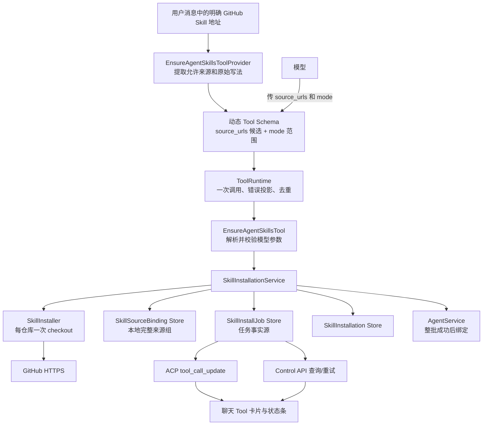
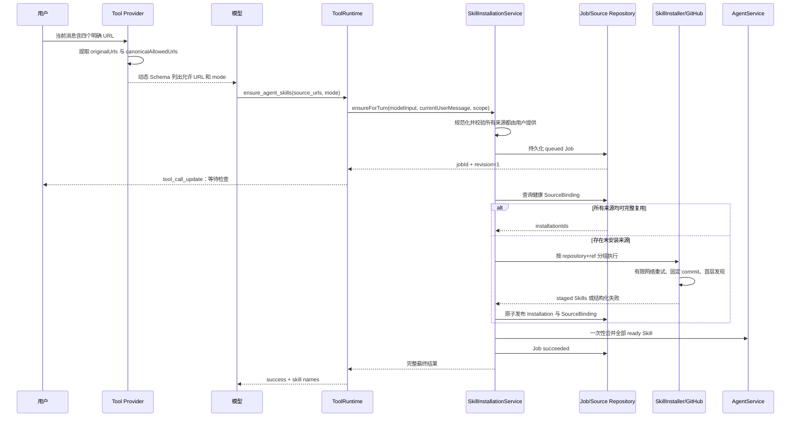
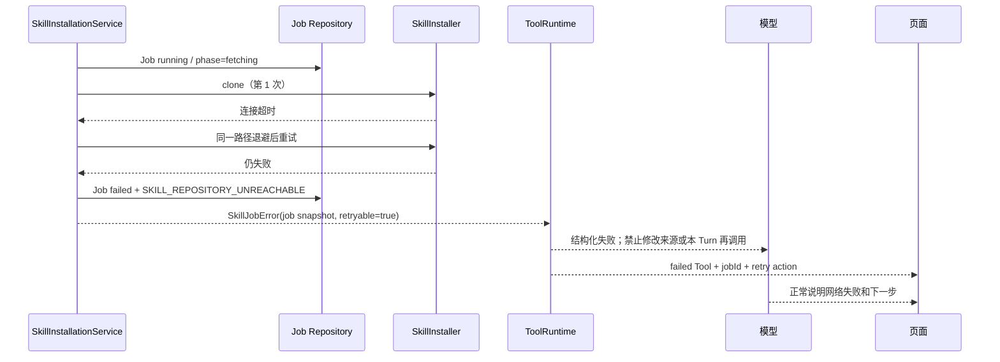
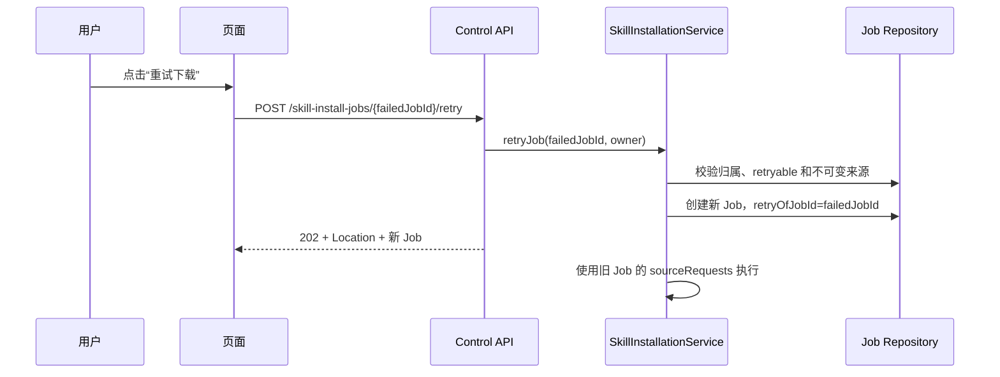
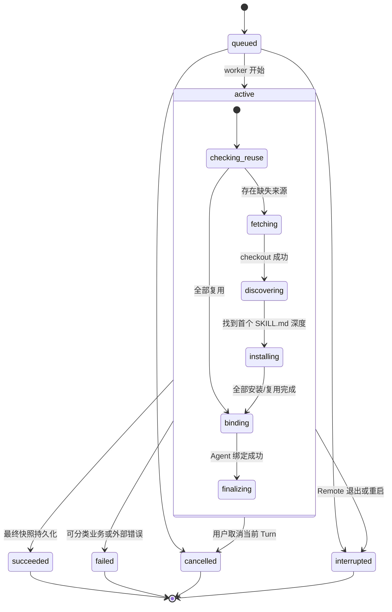
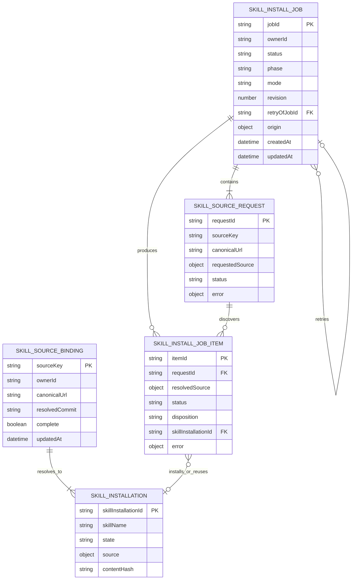

# Skill 安装失败恢复与错误状态机 — TRD（技术需求文档）

> 版本：1.1  
> 日期：2026-08-13  
> 作者：Codex  
> 关联文档：[Demo 到真实产品实施 TRD](./DEMO_TO_PRODUCTION_TRD.md)、[Skill 安装进度与输入框状态条通信](./SKILL_INSTALL_PROGRESS_COMMUNICATION_TRD.md)、[MCP 与 Agent Skills](./MCP_SKILLS.md)

---

## 概要

会话 `cc3d647f-eb69-4ba4-9094-42df501e756a` 暴露的不是单一格式校验故障，而是一条错误放大链：第一次 `ensure_agent_skills` 使用了用户原始提供的四个合法地址，随后 GitHub 下载失败；工具层把可重试网络错误压成不可重试的 `tool_execution_failed`，并要求模型“不要重复相同参数”；模型于是擅自把两个 `/tree/...` Skill 目录改成仓库根地址，最终被正确的来源授权校验拒绝为 `invalid_arguments`。

本方案不放宽 URL 授权，也不剥夺模型的 Tool Call 参数职责。`ensure_agent_skills` 继续由模型传入 `source_urls` 和 `mode`；Remote 从当前用户消息提取允许来源，动态写入 Tool 的 JSON Schema 和说明，模型必须把用户提供的地址原样复制到参数中。Service 对模型参数做规范化和授权校验，但不能替模型补参数、改参数或从服务端隐藏注入参数。

修复分为两层：提示层通过动态 Tool Schema、字段说明和结构化失败反馈，让模型正确理解 `.git`、`/tree/...`、网络失败和重试语义；确定性代码层继续负责安全校验、先创建并持久化 Job、本地复用、下载、发现、安装和 Agent 绑定。网络自动尝试耗尽后，本 Turn 中模型应说明失败，不得通过改写 URL 猜测修复；用户触发的后续重试使用已持久化 Job 的原始来源。

同时明确三套状态互不混用：Turn 表示一轮对话是否仍在运行，Tool Call 表示本轮中一次工具调用的执行结果，SkillInstallJob 表示一个可恢复的安装任务。Skill 下载失败后，如果模型正常向用户说明失败原因，该 Turn 仍应是 `completed`；只有模型请求、Runtime 或整个 Turn 无法继续时，Turn 才是 `failed`。

**技术目标**：

- 从用户提交 Prompt 到安装 Job 首次落盘，本地处理目标不超过 100ms；网络连接发生在 Job 创建之后。
- GitHub 网络失败必须保留 `jobId`、失败阶段、错误码和 `retryable=true`，不得降级为无上下文的 `tool_execution_failed`。
- 模型必须在 Tool Call 中传入 `source_urls` 和 `mode`；地址必须来自当前用户消息，不能改写或猜测。
- 动态 Tool Schema 的 URL 候选保留用户原始写法；`.git` 与无 `.git` 仅在服务端授权比较和来源复用时规范化等价。
- 同一任务内相同 `repository + ref` 只 checkout 一次；两个 `open-design` 目录不能重复下载同一仓库。
- `ensure` 优先复用完整、健康的本地来源组；只有未安装、来源组不完整或用户明确更新时才联网。
- 失败重试严格复用原 Job 的不可变来源，不能通过新的模型参数改变安装目标。
- 页面明确区分“下载失败”“参数未授权”“Skill 内容不合格”和“任务被中断”，不再把它们统一显示成“格式异常”。
- 新协议行为必须有合同、服务、Runtime、Turn 和页面回归测试。

**非目标**：

- 不通过放宽 `SKILL_SOURCE_NOT_USER_PROVIDED` 来允许模型安装用户没给出的地址。
- 不自动搜索或推荐 Skill 来源，不因为“帮我设计网页”而主动安装 Skill。
- 不自动升级已安装 Skill；普通“安装/使用”只允许模型传 `mode=ensure`，只有当前用户消息明确要求更新时才允许 `mode=update`。
- 不引入消息队列、EventBus、后台任务平台或第二条 WebSocket。
- 不伪造 Git 下载百分比，不把 Git 原始命令、本机路径或代理信息展示给模型和浏览器。
- 不把提示词当作安全边界；模型即使无视说明，服务端仍必须拒绝未授权来源和未授权更新。

---

## 技术背景

### 现有系统现状

当前完整调用链是：

```text
用户消息
  → EnsureAgentSkillsToolProvider 从消息提取允许 URL
  → 模型调用 ensure_agent_skills(source_urls, mode)
  → ToolRuntime 校验、去重并执行
  → SkillInstallationService.ensureForTurn
  → createJob 先调用 discoverGitHub
  → SkillInstaller clone / checkout / 扫描
  → 成功发现后才创建 SkillInstallJob
  → installItem 才检查本地是否可以复用
  → 全部成功后绑定 Agent
```

该顺序有六个实际问题：

1. [`skill-installation-service.ts`](../apps/remote/src/skills/skill-installation-service.ts) 在 `createJob` 内先联网发现，下载失败时没有 Job，因此页面没有 `jobId`、失败任务或正式重试入口。
2. 本地复用发生在 `installItem`，晚于远程发现。即使同一 Skill 已安装，`ensure` 仍可能先访问 GitHub。
3. [`ensure-agent-skills-tool.ts`](../apps/remote/src/skills/ensure-agent-skills-tool.ts) 允许模型再次提交原始 URL。授权校验虽然正确，却无法阻止模型在网络失败后“修理”URL。
4. Skill 服务抛出的是 `ApiProblemError(retryable=true)`，而 [`tool-runtime.ts`](../apps/remote/src/tools/tool-runtime.ts) 只识别 `ToolExecutionError`，导致错误码、类别和可重试标记丢失。
5. 工具配置为 `retry: none`，通用失败文案又要求模型不要重复同参。模型只能结束或改参；当前模型选择了错误的改参路径。
6. 同一仓库不同目录会分别执行发现；发现成功后每个 Skill 安装又会重新 checkout，导致网络耗时和失败概率被放大。

当前数据也说明第一次失败不能靠本地复用规避：安装目录里没有四个用户 Skill，安装记录只有内置 `sandbox-notes`。因此本次第一次 GitHub 下载是必要的；真正需要修复的是下载失败后的任务、错误和恢复链路。

### 技术栈

| 类别 | 选型 | 版本 | 说明 |
|------|------|------|------|
| 运行时 | Node.js | >=22 | Remote、Git 子进程和本地持久化 |
| 语言 | TypeScript | 7.0.2 | 全仓严格类型 |
| Agent 协议 | `@agentclientprotocol/sdk` | 1.3.0 | `tool_call` 与 `tool_call_update` |
| 前端 | React + Zustand | 19.2.8 / 5.0.14 | 聊天页和“我的 Skills”页面 |
| 持久化 | `AtomicJsonStore` | 仓库内实现 | Job、Installation 和来源组事实 |
| 外部程序 | Git CLI | 系统版本 | checkout、固定 commit，不执行仓库脚本 |
| 测试 | Vitest | 4.1.10 | 合同、服务、Runtime 和页面测试 |

### 依赖项

| 依赖 | 类型 | 用途 | 风险与处理 |
|------|------|------|------------|
| GitHub HTTPS | 外部服务 | 下载公开 Skill 仓库 | 网络、代理、限流；有限重试并保留失败 Job |
| Git CLI | 本机程序 | clone、checkout、rev-parse | 超时和取消必须传递；原始 stderr 不对外暴露 |
| macOS 系统代理 | 本机配置 | Remote 未显式配置代理时提供连接路径 | 不永久缓存；每个 Job 重新解析或使用短 TTL |
| AgentService | 内部服务 | 整批成功后绑定当前 Agent | 绑定失败时 Job 失败，不能伪装安装完成 |
| ToolRuntime | 内部运行时 | 权限、去重、工具结果和 ACP 投影 | 不承担 Skill 内部网络重试 |

---

## 架构设计

### 系统架构图



核心边界：

- 模型是 Tool Call 参数提出者；Provider 只负责把当前用户消息中的允许来源和操作范围写进动态 Schema，不能代替模型传参。
- Service 同时接收模型参数与当前用户消息，并再次执行规范化授权校验；动态 Schema 是引导和首层校验，不是唯一安全边界。
- Job Repository 是安装事实源。ACP 只是即时投影，页面刷新后通过 Job API 恢复。
- ToolRuntime 负责通用工具执行语义，但 Skill 的下载重试、来源组复用和安装阶段属于 Skill 领域。
- SourceBinding 记录“某个用户输入来源完整产生了哪些 Skill”，解决仓库根地址无法通过单个安装记录判断是否完整复用的问题。
- Agent 绑定是整批提交：所有来源完成或复用后一次性合并；中途失败不产生半套 Agent 能力。

### 模块划分

| 模块 | 职责 | 关键文件 | 对外接口 |
|------|------|----------|----------|
| Skill 合同 | 分离 Job 生命周期、活动阶段、来源请求和安装实体状态 | `packages/contracts/src/skill-management.ts` | `SkillInstallJobV2`、公开错误类型 |
| 来源提示与授权 | 从当前用户消息生成原始候选值、规范化授权集合和动态 Tool Schema | `apps/remote/src/skills/github-skill-source.ts`、`ensure-agent-skills-tool.ts` | `source_urls`/`mode` Schema + Service 校验 |
| 安装服务 | 先建 Job、检查复用、执行、持久化、绑定和失败收敛 | `apps/remote/src/skills/skill-installation-service.ts` | `ensureForTurn`、`retryJob` |
| 来源组仓储 | 记录一个请求来源完整映射出的安装集合 | `apps/remote/src/skills/skill-source-binding-repository.ts`（新增） | `findHealthyBinding`、`put/invalidate` |
| Git 执行器 | 仓库分组、checkout、扫描首个深度、原子发布 | `apps/remote/src/skills/skill-installer.ts` | `inspectAndStageGroup` |
| 错误适配 | 把领域错误完整转换为 Tool 错误 | `apps/remote/src/skills/ensure-agent-skills-tool.ts` | `ToolExecutionError` |
| 工具去重 | 相同规范化参数命中同一调用；网络失败由 Installer 内部处理 | `apps/remote/src/tools/tool-runtime.ts`、Provider | 规范化 `dedupeKey` |
| Control API | Job 查询与基于 Job 的重试 | `apps/remote/src/skills/skill-routes.ts` | POST/GET/retry |
| 页面投影 | 展示真实失败类型和恢复动作 | `apps/web/src/App.tsx`、`MePage.tsx`、Skill 状态条组件 | ACP + Control API |

### 核心流程

#### 流程 1：当前 Turn 首次安装



模型侧 Tool 保留 `source_urls` 和 `mode`：

```json
{
  "name": "ensure_agent_skills",
  "arguments": {
    "source_urls": [
      "https://github.com/anthropics/skills/tree/main/skills/frontend-design",
      "https://github.com/nexu-io/open-design/tree/main/skills/design-brief"
    ],
    "mode": "ensure"
  }
}
```

动态 Tool Schema 直接把本轮允许的原始 URL 写进 `source_urls.items.enum`；`mode` 在普通安装消息中只有 `ensure`，用户明确说“更新/升级/重新安装最新版”时才增加 `update`。模型仍然自主选择数组中的哪些来源传入并明确表达安装意图，但不能凭空生成新地址。

这比只在系统提示词里提醒更可靠，因为模型生成 Tool Call 时能看到字段级候选；同时仍保留 Service 授权校验，避免模型或其他调用方绕过 Schema。提示词负责指导，确定性校验负责安全，两者不能互相替代。

#### 流程 2：网络失败



此时三套状态分别是：

- `SkillInstallJob.status = failed`，失败原因是网络不可达，可重试。
- `ToolCall.status = failed`，结果中保留 `jobId` 和结构化错误。
- 如果模型成功生成说明，`Turn.status = completed`；不能因为业务工具失败就把整轮写成 `failed`。

#### 流程 3：用户重试



重试创建新 Job，不把已经终止的 Job 从 `failed` 改回 `running`。旧 Job 保留为证据，新 Job 通过 `retryOfJobId` 关联；请求来源完全继承，页面和模型都不能替换 URL。

### 安装 Job 状态机



状态设计规则：

- 顶层 `status` 只有 `queued | active | succeeded | failed | cancelled | interrupted`。
- `phase` 只在 `active` 时存在，取值为 `checking_reuse | fetching | discovering | installing | binding | finalizing`。
- `failed/cancelled/interrupted/succeeded` 是不可逆终态；重试创建新 Job。
- SkillInstallation 自身的 `ready/quarantined/uninstalled` 不得复用为 Job item 的运行阶段。
- 每次状态变化先持久化完整快照并递增 `revision`，再发 ACP Update。

### Turn 状态处理

Skill Job 与 Turn 的关系按下表执行：

| 事件 | Skill Job | Tool Call | Turn |
|------|-----------|-----------|------|
| 安装成功，模型继续工作 | `succeeded` | `completed` | 继续 `active`，最终通常 `completed` |
| 下载失败，模型正常解释 | `failed` | `failed` | `completed` |
| Skill 内容校验失败，模型正常解释 | `failed` | `failed` | `completed` |
| 用户在下载中停止 | `cancelled` | `failed/cancelled` 投影 | `cancelled` |
| Remote 在下载中重启 | `interrupted` | 历史投影保持 | `interrupted` |
| 模型服务本身失败且无法生成说明 | Job 保持自身终态 | Tool 保持自身结果 | `failed` |
| 小模型连续模型轮重复提交完全相同的无效参数 | 不创建第二个 Job | 返回原始参数错误和当前守卫终态 | `failed: TOOL_ARGUMENT_RETRY_LIMIT` |

`ensure_agent_skills` 继续按“规范化后的 `source_urls + mode`”计算 `dedupeKey`。同一 Turn 重复完全相同的有效参数时返回第一次调用结果，不创建第二个 Job；参数不同则必须重新走动态 Schema 和 Service 授权校验。模型把 `/tree/...` 改成仓库根地址时会稳定得到 `SKILL_SOURCE_NOT_USER_PROVIDED`，不能绕过去重，也不能触发下载。

对网络失败不依赖模型再次调用：Installer 已在单次 Job 内完成有限自动重试。重试耗尽后，工具结果明确要求模型停止修改参数并向用户说明；真正的新尝试由用户重新提交包含 URL 的消息，或点击基于 Job ID 的重试按钮触发。

---

## 数据模型

### ER 图



### `SkillInstallJobV2`

```ts
type SkillJobStatus =
  | "queued"
  | "active"
  | "succeeded"
  | "failed"
  | "cancelled"
  | "interrupted";

type SkillJobPhase =
  | "checking_reuse"
  | "fetching"
  | "discovering"
  | "installing"
  | "binding"
  | "finalizing";

interface SkillInstallJobV2 {
  schemaVersion: 2;
  jobId: string;
  ownerId: string;
  origin:
    | { kind: "manual" }
    | { kind: "turn"; sessionId: string; turnId: string; agentId: string };
  status: SkillJobStatus;
  phase?: SkillJobPhase;
  revision: number;
  mode: "ensure";
  sourceRequests: SkillSourceRequest[];
  items: SkillInstallJobItemV2[];
  bindToAgentOnComplete: boolean;
  retryOfJobId?: string;
  error?: PublicErrorRef;
  createdAt: string;
  updatedAt: string;
  completedAt?: string;
}
```

### `SkillSourceRequest`

```ts
interface SkillSourceRequest {
  requestId: string;
  sourceKey: string;          // canonicalUrl 的稳定摘要，不含 Secret
  canonicalUrl: string;       // 用户明确提供并规范化后的 URL
  requestedSource: Extract<SkillSource, { kind: "github_tree" }>;
  status: "queued" | "reused" | "resolved" | "failed";
  discoveredItemIds: string[];
  error?: PublicErrorRef;
}
```

### `SkillSourceBinding`

```ts
interface SkillSourceBinding {
  schemaVersion: 1;
  sourceKey: string;
  ownerId: string;
  canonicalUrl: string;
  requestedSource: Extract<SkillSource, { kind: "github_tree" }>;
  resolvedCommit: string;
  skillInstallationIds: string[];
  complete: true;
  createdAt: string;
  updatedAt: string;
}
```

复用判定必须同时满足：

1. `canonicalUrl/sourceKey` 完全一致；`.git` 和尾斜杠只在规范化阶段等价。
2. SourceBinding 标记为完整。
3. 其所有 `skillInstallationIds` 都存在、状态为 `ready`，Registry 中也能找到实际目录。
4. 当前模式是 `ensure`。

任一 Skill 被删除时必须使对应 SourceBinding 失效。后续再次 `ensure` 会重新联网发现，不会把不完整来源组误判为已安装。

### 数据迁移策略

- 不在运行时代码中同时解析 Job v1/v2；Tool 参数仍使用现有 `source_urls` 和 `mode`，不发生这一层合同迁移。
- 当前仓库属于本地 Demo，部署前把旧 `skill-install-jobs.json` 备份为只读历史文件，新 Job Store 使用 schema v2；旧聊天 Tool 卡片仍保留自身 `rawInput/rawOutput`，不依赖旧 Job 才能展示。
- 当前只有内置 `sandbox-notes` 安装记录，不需要为用户 Skill 反推 SourceBinding。
- 如果开发开始前出现新的用户安装记录，只对明确的单目录来源执行一次性迁移；无法确认其原始仓库根请求时不猜测，首次 `ensure` 重新发现。

---

## 接口设计

### 模型 Tool 合同

#### `ensure_agent_skills`

**暴露条件**：当前用户消息至少包含一个可解析的 GitHub Skill 来源，并且消息明确要求安装或使用这些来源。模糊任务不暴露此 Tool。

**动态 Tool Schema**：

假设当前用户消息明确给出了下列四个地址，Provider 生成：

```json
{
  "type": "object",
  "properties": {
    "source_urls": {
      "type": "array",
      "minItems": 1,
      "maxItems": 4,
      "uniqueItems": true,
      "items": {
        "type": "string",
        "enum": [
          "https://github.com/anthropics/skills/tree/main/skills/frontend-design",
          "https://github.com/nexu-io/open-design/tree/main/skills/design-brief",
          "https://github.com/nexu-io/open-design/tree/main/skills/impeccable-design-polish",
          "https://github.com/greensock/gsap-skills.git"
        ]
      },
      "description": "只复制当前用户消息里的完整地址。/tree/{ref}/{path} 表示明确目录；仓库根地址可带 .git。不要删除 .git，不要把 tree 地址缩短为仓库根地址，也不要修改 ref 或目录。"
    },
    "mode": {
      "type": "string",
      "enum": ["ensure"],
      "description": "安装或复用使用 ensure。只有用户明确要求更新时 Schema 才允许 update。"
    }
  },
  "required": ["source_urls", "mode"],
  "additionalProperties": false
}
```

**Tool 描述**：

```text
安装或复用当前用户明确提供的 GitHub Skills。
必须把用户给出的 URL 从 source_urls 的候选值中原样复制；不得推断、补全、缩短或改写。
.git 后缀合法；/tree/{ref}/{path} 也是合法的具体目录地址，两者语义不同。
如果返回网络或下载失败，说明地址已经通过格式和授权校验；不要换 URL、不要改仓库层级、不要在本 Turn 再调用，直接向用户说明并等待重试。
```

**请求示例**：

```json
{
  "source_urls": [
    "https://github.com/anthropics/skills/tree/main/skills/frontend-design",
    "https://github.com/nexu-io/open-design/tree/main/skills/design-brief",
    "https://github.com/nexu-io/open-design/tree/main/skills/impeccable-design-polish",
    "https://github.com/greensock/gsap-skills.git"
  ],
  "mode": "ensure"
}
```

**成功结果**：

```json
{
  "jobId": "uuid",
  "status": "succeeded",
  "skills": [
    { "name": "frontend-design", "disposition": "installed" },
    { "name": "design-brief", "disposition": "reused" }
  ]
}
```

**失败结果**：

```json
{
  "jobId": "uuid",
  "status": "failed",
  "phase": "fetching",
  "error": {
    "code": "SKILL_REPOSITORY_UNREACHABLE",
    "message": "无法连接 GitHub，Skill 下载失败",
    "retryable": true,
    "sourceValidation": "passed"
  },
  "recovery": {
    "action": "retry_job",
    "preserveSources": true,
    "modelInstruction": "不要修改 source_urls；向用户说明网络失败并等待用户重试"
  }
}
```

Tool 给模型的失败指令按错误类型生成：

- 网络可重试：明确 `sourceValidation=passed`，说明地址格式和授权已经通过；该 Job 已失败，本 Turn 不再调用；不得修改来源；向用户提供重试动作。
- 参数/授权：返回模型传入值与允许候选值，说明必须从候选中原样复制；停止调用；不得猜测替代地址。
- Skill 内容错误：说明仓库可访问但 Skill 不合格；不得以改目录或递归更深作为隐藏兜底。

### 提示分层

| 层级 | 内容 | 作用 | 是否安全边界 |
|------|------|------|----------------|
| Agent 系统提示 | 只安装用户明确提供的地址；不要自动搜索；不要改写 URL | 建立长期行为原则 | 否 |
| 动态 Tool 描述 | 解释 `.git`、`/tree/...` 和网络失败语义 | 当前工具决策指导 | 否 |
| 动态 JSON Schema | 用 `enum` 列出当前消息允许的原始 URL，并收窄 mode | 约束 Tool Call 生成 | 否，但比纯文本稳定 |
| Provider `prepare` | 检查参数类型、候选值和 mode | 在执行前确定性拒绝 | 是 |
| Service `ensureForTurn` | 重新规范化并与当前消息授权集合比较 | 防止绕过 Provider | 是 |

不建议把完整 URL 再拼进普通系统提示词：模型已经能在动态 Tool Schema 中看到候选，重复注入只会增加上下文和不一致风险。系统提示写行为原则，具体候选只出现在当前 Tool 定义中。

### Control API

| Method | Path | 描述 | 返回 |
|--------|------|------|------|
| POST | `/api/control/v1/skill-install-jobs` | 管理页从明确 URL 创建任务 | `202 + Location + Job` |
| GET | `/api/control/v1/skill-install-jobs/:jobId` | 获取完整 Job 快照 | `200 + Job` |
| POST | `/api/control/v1/skill-install-jobs/:jobId/retry` | 从失败 Job 的不可变来源创建新任务 | `202 + Location + New Job` |
| GET | `/api/control/v1/skill-install-jobs?sessionId=...&limit=1` | 刷新后恢复当前 Session 最新任务 | `200 + items` |

#### POST `/skill-install-jobs/:jobId/retry`

请求体为空：

```json
{}
```

服务端校验：

- Job 属于当前 owner。
- Job 为 `failed` 或 `interrupted`，且错误 `retryable=true`。
- Job 保存了完整 `sourceRequests`。
- 若来源 Job 来自 Turn，新的 Job 仍绑定原 `agentId`，不能由浏览器替换。

响应：

```json
{
  "jobId": "new-job-id",
  "retryOfJobId": "failed-job-id",
  "status": "queued",
  "revision": 1
}
```

### 错误码

| 错误码 | 类别 | 可重试 | 含义 | 页面动作 |
|--------|------|--------|------|----------|
| `SKILL_SOURCE_NOT_ALLOWED` | validation | 否 | URL 不是允许的 GitHub HTTPS 来源 | 修改用户输入 |
| `SKILL_SOURCE_NOT_USER_PROVIDED` | validation | 否 | 调用来源不属于当前用户授权集合 | 停止模型调用，不给自动修复 |
| `SKILL_REPOSITORY_UNREACHABLE` | network | 是 | DNS、连接、TLS、超时或连接重置 | “重试下载” |
| `SKILL_REPOSITORY_NOT_FOUND` | validation | 否 | 仓库/Ref 不存在或公开访问不可用 | 检查地址 |
| `SKILL_NOT_FOUND_AT_FIRST_DEPTH` | validation | 否 | 指定范围内没有 `SKILL.md` | 检查仓库结构 |
| `SKILL_VALIDATION_FAILED` | validation | 否 | `SKILL.md` 或安全校验不通过 | 展示公开校验原因 |
| `SKILL_SOURCE_NAME_CONFLICT` | conflict | 否 | 同名 Skill 来自不同来源 | 用户先处理已有安装 |
| `SKILL_JOB_INTERRUPTED` | execution | 是 | Remote 重启导致任务中断 | “重新执行” |
| `SKILL_INSTALL_CANCELLED` | cancelled | 否 | 用户停止当前 Turn | 不自动重试 |

`ApiProblemError` 不能直接穿过 ToolRuntime。Skill Tool Provider 必须将领域错误显式转换为 `ToolExecutionError`，并携带 `code/category/retryable/rawOutput(job snapshot)`。ToolRuntime 不再把它降级成 `tool_execution_failed`。

---

## 安全设计

### 认证与授权

- 当前 Turn 的允许来源集合由 Remote 从当前用户消息解析，写入 Tool Provider 的动态 Schema；模型必须通过 Tool Call 明确传入所选 URL 和 mode。
- Provider `prepare` 先校验模型参数是否来自候选集合；Service `ensureForTurn` 再用当前用户消息独立复核，避免绕过 Provider。
- 管理页手动安装仍接受 URL，但必须经过同一个 `parseGitHubSkillUrl`、owner 校验和 GitHub HTTPS 白名单。
- Job 查询和重试均校验 owner；Turn 来源 Job 的 Agent 绑定目标来自持久化 origin，不接受请求覆盖。
- `.git`、尾斜杠和规范化大小写只用于判断同一来源，不能把仓库根地址与 `/tree/ref/path` 当作同一授权目标。

### 数据安全

- Job 只保存规范化公开 GitHub URL、ref、commit 和相对目录，不保存代理凭据、临时 checkout 路径或 Git 命令。
- Git stderr 仅用于服务端分类；对外消息使用固定公开文案和 `requestId`。
- checkout 完成后固定 40 位 commit，再扫描和安装，避免同一 Job 中远端分支漂移。
- 临时目录仍位于隔离安装区，安装过程中不执行仓库脚本，不跟随符号链接越界。

### 安全风险与缓解

| 风险 | 等级 | 缓解措施 |
|------|------|----------|
| 模型改写为用户未授权的仓库根地址 | 高 | 动态 Schema enum + Provider 校验 + Service 二次校验 |
| 重试时替换来源或 Agent | 高 | 只接受 `jobId`，从旧 Job 继承不可变字段 |
| Git 错误泄露本机路径 | 中 | 领域错误分类后输出固定公开消息 |
| 远端 ref 在任务中变化 | 中 | checkout 后固定 `resolvedCommit` |
| 删除一个 Skill 后错误复用完整仓库 | 中 | 删除时使 SourceBinding 失效 |

---

## 性能设计

### 性能目标

| 指标 | 目标 | 测量方式 |
|------|------|----------|
| Job 首次持久化 | 本地 P99 < 100ms | 服务测试与日志时间戳 |
| 页面首次看到任务 | 本地 P99 < 500ms | ACP Tool Update 集成测试 |
| 同仓库 checkout 次数 | 每 Job、每 `repository+ref` 最多 1 次 | Installer mock 断言 |
| 健康本地复用 | 0 次 Git 调用 | 服务单元测试 |
| Job 状态写入 | 仅真实 phase/item 变化时写 | Repository 调用计数 |

### 网络与代理策略

- 网络重试只在 `SkillInstaller` 内执行，默认最多 2 次；ToolRuntime 不重跑整个安装任务。
- 仅对 DNS、连接超时、TLS/连接重置等明确瞬时错误重试；仓库不存在、Ref 不存在、内容错误立即失败。
- 每次重试使用同一条已经选定的连接路径，不进行“代理失败后偷偷直连”或“直连失败后自动猜代理”的多路兜底。
- 代理优先级固定为：Remote 显式环境变量 → 当前 macOS 系统代理 → 直连。
- macOS 代理解析不能进程级永久缓存；每个 Job 重新读取，或使用不超过 30 秒的 TTL。这样用户切换代理后无需重启 Remote。
- AbortSignal 传递到 Git 子进程；用户停止 Turn 后立刻终止 clone，不继续占用连接到超时。

### 扩展性设计

当前是本地单用户 Demo，不引入队列和 Redis。Job 仍由 `AtomicJsonStore` 保存，单进程执行即可。只有同时安装任务数量和持久记录规模经过测量后成为瓶颈，才评估后台队列；本方案不提前建设。

---

## 错误处理

### 错误分类原则

```text
Git/文件/校验原始错误
  → SkillInstaller 分类为内部领域错误
  → SkillInstallationService 将 Job 收敛为终态并持久化
  → EnsureAgentSkillsTool 转为 ToolExecutionError
  → ToolRuntime 原样保留 code/category/retryable/rawOutput
  → ACP/Web 投影用户可操作信息
  → 模型获得“来源已校验、不要改写参数”的恢复指令
```

不得再以错误消息正则作为跨层合同。Git stderr 正则只能存在于 Installer 最内层，用于映射稳定领域错误码；Service、ToolRuntime 和页面只判断结构化字段。

### 重试策略

| 层级 | 是否自动重试 | 规则 |
|------|--------------|------|
| 单次 Git clone | 是 | 明确瞬时网络错误最多 2 次，短退避 |
| SkillInstallJob | 否 | 自动尝试耗尽后进入不可逆失败终态 |
| ToolRuntime | 否 | 不重跑包含持久副作用的整项 Job |
| 模型同一 Turn | 否 | 相同规范化参数返回原结果；不同参数重新授权校验，网络失败时提示停止调用 |
| 用户操作 | 是 | 点击重试，以旧 Job 来源创建关联的新 Job |

### 部分成功处理

- 一个 Job 可以已经安装若干 Skill 后在后续来源失败，但顶层仍为 `failed`。
- 已经原子发布的 Skill 保留，并在 Job items 中标记 `installed`；不做破坏性回滚。
- Agent 绑定只在整批成功后发生，因此部分成功不会改变当前 Agent 能力。
- 用户重试时先复用已经成功的 items，再继续缺失来源；不重新下载完整健康来源组。

---

## 实现计划

### 阶段 1：先写失败测试和合同

涉及文件：

- `packages/contracts/src/skill-management.ts`
- `packages/contracts/src/common.ts`
- `apps/remote/test/skills/skill-installation.test.ts`
- `apps/remote/test/tool-runtime.test.ts`
- Turn/ACP 现有相关测试

任务：

1. 定义 `SkillInstallJobV2`、`status + phase`、`sourceRequests`、`revision` 和新错误码。
2. 写失败测试证明 Job 必须先于 Git 调用存在。
3. 写失败测试证明模型 Tool Schema 仍包含 `source_urls`/`mode`，且 URL `enum` 精确等于当前用户消息中的原始允许值。
4. 写失败测试证明网络错误经过 ToolRuntime 后仍为 `SKILL_REPOSITORY_UNREACHABLE` 且 `retryable=true`。
5. 写 Turn 测试证明“Tool 失败 + 模型正常说明”最终是 `completed`。

### 阶段 2：动态 Tool Schema、参数授权与去重

涉及文件：

- `apps/remote/src/skills/github-skill-source.ts`
- `apps/remote/src/skills/ensure-agent-skills-tool.ts`
- `apps/remote/src/tools/tool-registry.ts`
- `apps/remote/src/tools/tool-runtime.ts`

任务：

1. Provider 构造时同时保留当前消息的原始 URL 候选与规范化授权集合。
2. `ensure_agent_skills` 保留 `source_urls` 和 `mode`；URL 候选动态写入 `items.enum`。
3. 普通安装只允许 `mode=ensure`；用户明确要求更新时才允许 `update`。
4. `prepare` 与 Service 分别执行候选校验和规范化授权复核。
5. `dedupeKey` 使用规范化后的 `source_urls + mode`；相同参数返回已有结果。
6. 错误结果按 validation/network/conflict/cancelled 分类生成模型指令，网络错误明确 `sourceValidation=passed`。

### 阶段 3：Job 状态机和来源组复用

涉及文件：

- `apps/remote/src/skills/skill-installation-service.ts`
- `apps/remote/src/skills/skill-installation-repository.ts`
- `apps/remote/src/skills/skill-source-binding-repository.ts`（新增）
- `apps/remote/src/skills/skill-routes.ts`

任务：

1. 同步完成来源合法性检查后立即创建 `queued` Job。
2. 所有运行阶段通过单一状态机函数转换，终态不可逆。
3. 增加 SourceBinding，确保根仓库多 Skill 可以整体复用。
4. 重试基于旧 Job 创建新 Job，并写入 `retryOfJobId`。
5. Remote 启动时只把 `queued/active` Job 收敛为 `interrupted`。

### 阶段 4：一次 checkout 与取消传播

涉及文件：

- `apps/remote/src/skills/skill-installer.ts`
- `apps/remote/src/resilience/retry.ts`（仅复用通用退避函数，不让 ToolRuntime重跑 Job）

任务：

1. 按 `repository + requestedRef` 对来源分组。
2. 同一 checkout 内处理多个指定目录和仓库根的首次命中深度。
3. 固定 commit 后安装所有发现项，不再逐 Skill clone。
4. 将 AbortSignal 传入 Git 子进程。
5. 取消永久代理缓存，每 Job 或短 TTL 读取当前配置。
6. 用结构化内部错误替代跨层消息正则。

### 阶段 5：页面失败信息与恢复

涉及文件：

- `apps/web/src/api/control-api.ts`
- `apps/web/src/App.tsx`
- `apps/web/src/product/MePage.tsx`
- `apps/web/src/components/skills/SkillInstallStatusBanner.tsx`
- 对应 CSS 和测试

任务：

1. 下载失败显示“无法连接 GitHub”，不显示“格式异常”。
2. 展示 `jobId/requestId`、失败来源的公开标签和重试按钮。
3. 重试按钮只提交 Job ID，不重新提交 URL。
4. 按 `jobId + revision` 合并 ACP 和 HTTP 快照。
5. 页面刷新后查询当前 Session 最新 Job；终态停止轮询。
6. 具体进度交互遵循关联的进度通信 TRD，不新增第二条实时通道。

### 阶段 6：真实链路验证

1. 启动 Remote 和 Web；Evaluation 模块随 Remote 初始化。
2. 用四个真实来源创建新 Session，其中两个来自同一 `open-design` 仓库。
3. 记录 Git 分组调用次数，确认 `open-design` 每个 Job 只 checkout 一次。
4. 人为配置不可达代理或 mock Git 超时，确认页面显示网络错误、保留 Job 且 Turn 正常结束。
5. 恢复网络后从失败 Job 点击重试，确认来源没有变化并最终绑定四组 Skill。
6. 再发一次同来源 `ensure`，确认零 Git 调用、全部 `reused`。
7. 运行全仓 `git diff --check && pnpm -r typecheck && pnpm -r test && pnpm -r build`。

---

## 测试策略

### 测试分层

| 层级 | 覆盖范围 | 工具 | 要求 |
|------|----------|------|------|
| 合同测试 | Job v2、错误码、终态互斥 | Vitest | 所有状态转换 |
| 来源测试 | `.git`、tree、规范化、未授权地址 | Vitest | 关键输入 100% |
| 服务测试 | 先建 Job、复用、部分成功、重试 | Vitest + mock installer | 所有分支 |
| Runtime 测试 | 动态 Schema、错误保真、参数去重、模型结果 | Vitest | 关键路径 100% |
| Turn 集成 | Tool 失败/取消/重启与 Turn 终态 | Vitest | 状态矩阵全部覆盖 |
| Web 测试 | 错误文案、重试、刷新恢复 | Vitest/React | 关键交互 100% |
| 真实冒烟 | GitHub 实际下载和本地复用 | 本地服务 | 一次网络失败 + 一次成功 |

### 关键测试场景

| # | 场景 | 预期结果 | 优先级 |
|---|------|----------|--------|
| 1 | 四个合法 URL，第一次 clone 网络失败 | Job 已存在；错误为 network、可重试；无 `invalid_arguments` | P0 |
| 2 | 模型从动态 enum 原样传四个 `source_urls` | 通过 Provider 与 Service 双重授权并进入安装 | P0 |
| 3 | 模型把两个 tree URL 改成仓库根地址 | `invalid_arguments`；不进入 Service 下载；错误列出允许候选 | P0 |
| 4 | 网络失败后模型重复相同参数 | 返回第一次 Job 快照，不创建第二个 Job | P0 |
| 5 | 两个 URL 指向 `open-design` 不同目录 | 同一 Job 只 checkout 一次 | P0 |
| 6 | `.git` 根地址 | 模型原样传参；服务端与无 `.git` 规范化等价并正常安装 | P0 |
| 7 | `/tree/main/skills/design-brief` | 模型原样传参；只从该目录开始寻找首个 `SKILL.md` 深度 | P0 |
| 8 | 本地 SourceBinding 完整 | 全部复用，Git 调用为 0 | P0 |
| 9 | SourceBinding 中一个 Skill 被删除 | Binding 失效，重新发现，不误判复用 | P1 |
| 10 | 第一来源安装成功，第二来源网络失败 | Job failed；前项保留；Agent 未绑定半套能力 | P0 |
| 11 | 点击重试 | 新 Job 关联旧 Job，并使用完全相同来源 | P0 |
| 12 | Tool 失败后模型给出说明 | Turn completed，Tool/Job 各自 failed | P0 |
| 13 | 下载中用户停止 | Git 被终止，Job cancelled，Turn cancelled | P0 |
| 14 | 下载中 Remote 重启 | Job interrupted，Turn interrupted，可由用户重试 | P1 |
| 15 | Git stderr 含本机临时路径 | 页面、模型和 Session 均不出现路径 | P0 |
| 16 | 用户只说“帮我设计网页” | 不暴露安装 Tool，不自动寻找来源 | P0 |

---

## 部署与迁移

### 部署方案

这是本地单体联调环境，Remote 与 Web 必须同批切换合同：

1. 停止创建新的 Skill Job，等待当前活动 Job 结束或明确中断。
2. 备份 v1 Job 数据文件，创建 v2 Job/SourceBinding Store。
3. 先运行合同和 Remote 测试，再启动 Remote。
4. 启动 Web，确认新 Tool Schema 和页面投影一致。
5. 用本地 mock 失败场景验收后，再执行真实 GitHub 下载。

开发环境的 Vite 热更新只影响 Web；Remote TypeScript 变更会触发 Remote 重启并中断活动 Turn。因此实施时必须新建测试会话，不能在用户正在运行的对话上直接热改 Remote。

### 回滚策略

- 保留 v1 Job 数据备份和旧代码构建产物。
- 回滚代码时同时切回 v1 Job Store；不要让旧代码读取 v2 数据。
- 已经成功发布的 Skill Installation 可保留，因为安装目录和锁文件格式未要求破坏性变化。
- SourceBinding 是新增的复用索引；回滚时可以停止读取，不影响实际 Skill 文件。
- 如果新版本出现错误码或 Tool 投影异常，先关闭新的安装入口，不删除已有 Skill 和历史 Session。

---

## 技术风险

| 风险 | 概率 | 影响 | 缓解措施 |
|------|------|------|----------|
| 模型没有从 enum 原样复制 URL | 低 | 中 | 字段说明 + Provider 错误回显允许候选 + 模型集成测试 |
| SourceBinding 与 Installation 不一致 | 中 | 中 | 原子更新、删除时失效、复用前健康检查 |
| Git 取消后残留子进程或临时目录 | 中 | 高 | AbortSignal、finally 清理、进程测试 |
| 同仓库分组后不同 ref 混用 | 低 | 高 | 分组键必须包含 repository + requestedRef |
| 网络错误分类遗漏新 stderr | 中 | 中 | Installer 内集中映射，未知错误保守归 execution 且不泄露原文 |
| Tool 失败导致模型改参或继续循环 | 中 | 中 | 网络错误标记来源已校验 + 相同参数去重 + 授权拒绝 + 轮次上限回归 |
| Job v2 切换损失旧任务查询 | 已知 | 低 | 备份为只读历史；聊天 Tool 卡片仍保留证据 |

---

## 监控与告警

当前 Demo 不建设外部监控平台，但必须写结构化服务日志：

| 字段 | 说明 |
|------|------|
| `jobId` | 安装任务 ID |
| `sessionId/turnId` | 仅 Turn 来源 Job 记录 |
| `phase/status/revision` | 当前持久状态 |
| `repositoryHost` | 固定为 github.com，不记录完整敏感查询 |
| `sourceCount/itemCount` | 来源与发现 Skill 数量 |
| `attempt` | 当前 Git 尝试次数 |
| `errorCode/retryable` | 稳定公开分类 |
| `durationMs` | 阶段耗时 |

不得记录：Git 凭据、代理凭据、完整进程环境、本机临时路径、Skill 文件正文或用户完整 Prompt。

本地验收至少统计：Job 创建数、成功/失败/中断数、Git checkout 次数、本地复用数、网络失败数、重复 Tool 调用数。出现“网络错误后紧接 `SKILL_SOURCE_NOT_USER_PROVIDED`”应视为回归失败。

---

## 待定问题

本方案没有阻塞开发的待定项，当前决策如下：

- 模型继续在 Tool Call 中传 `source_urls` 和 `mode`；普通安装只允许 `ensure`，用户明确更新时才允许 `update`。
- 自动网络尝试固定在 Installer 内，默认最多 2 次；失败后必须由用户触发新的 Job。
- 重试保留旧 Job 并创建新 Job，不反转终态。
- 动态 Tool Schema、Provider 校验和 Service 校验共同约束模型参数；提示词不是安全边界。
- 进度通信继续使用 ACP `tool_call_update`，持久 Job 是唯一完成事实。

---

## 变更记录

| 版本 | 日期 | 变更内容 | 作者 |
|------|------|----------|------|
| 1.0 | 2026-08-13 | 基于会话 `cc3d647f-eb69-4ba4-9094-42df501e756a` 根因形成状态机级修复方案 | Codex |
| 1.1 | 2026-08-13 | 保留模型 `source_urls/mode` Tool Call 参数，改为动态 Schema 候选、分层提示和双重授权校验 | Codex |
