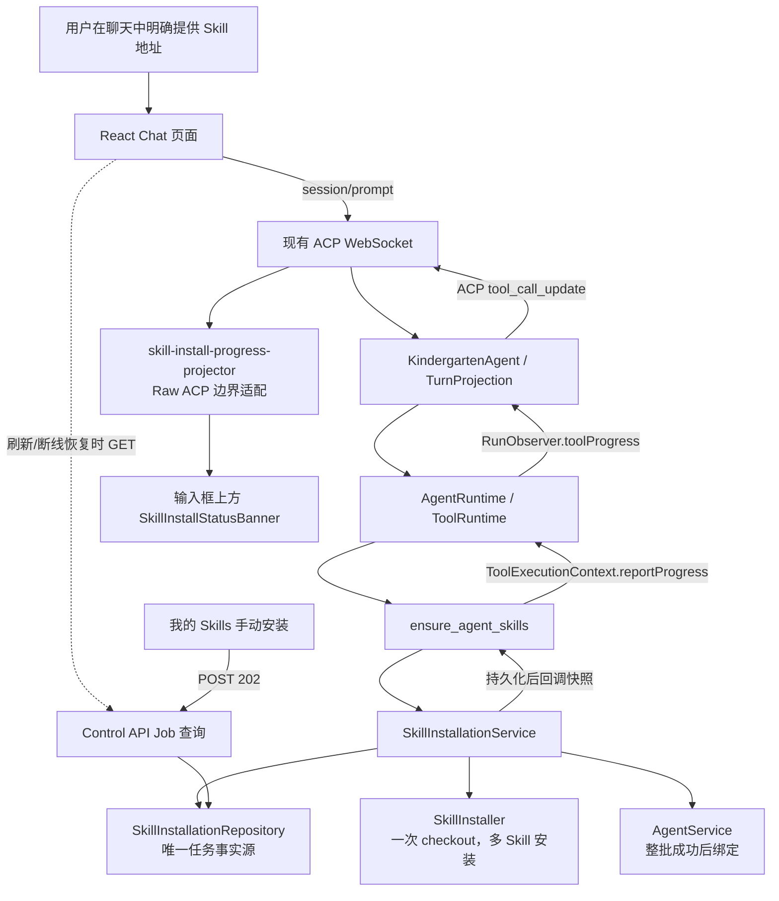
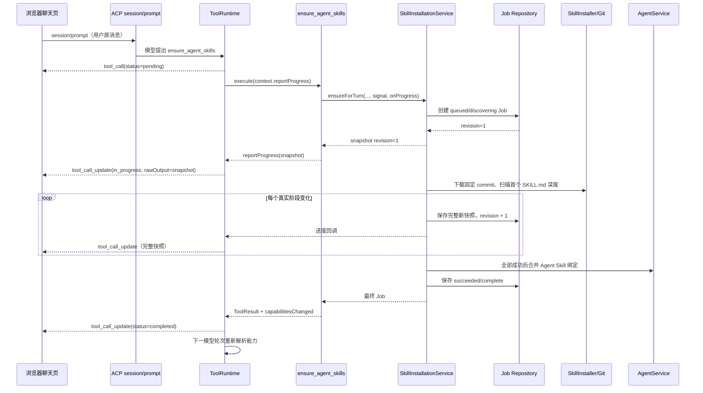
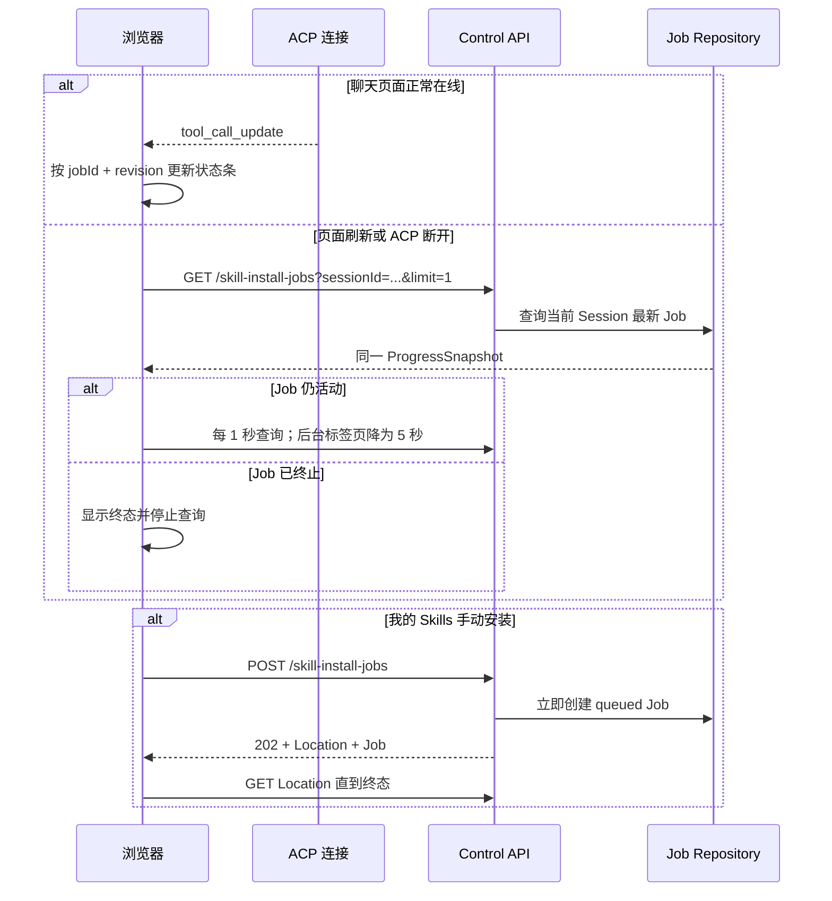
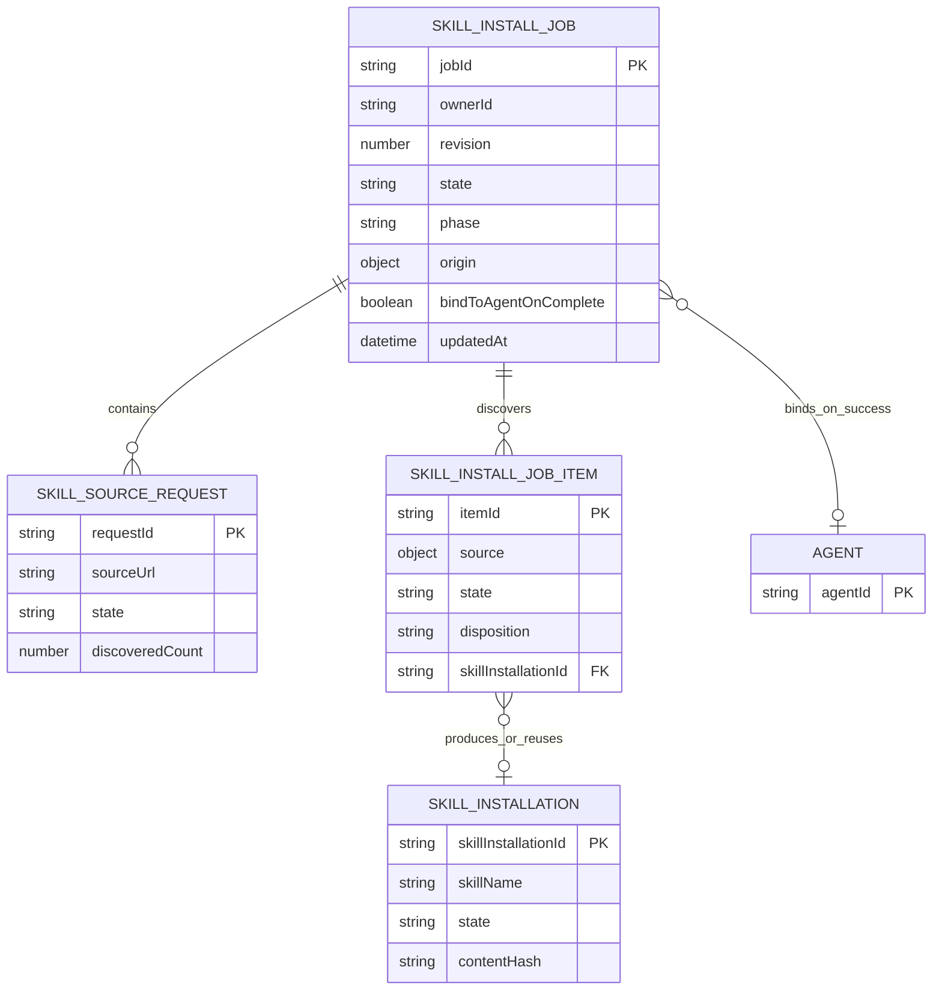

# Skill 安装进度与输入框状态条通信 — TRD（技术需求文档）

> 版本：1.0  
> 日期：2026-08-13  
> 作者：Codex  
> 关联需求：[Demo 到真实产品实施 TRD](./DEMO_TO_PRODUCTION_TRD.md)、[MCP 与 Agent Skills](./MCP_SKILLS.md)

---

## 概要

当前真实聊天页已经能执行 `ensure_agent_skills`，也已经能接收 ACP `tool_call` 和最终的 `tool_call_update`，但安装过程中没有连续进度：服务端先下载、扫描和安装，全部结束后才返回最终结果；前端输入框上方也没有把安装工具投影为 Demo 中的状态条。因此用户只能看到聊天里的工具卡片长时间转圈，不知道是在连接 GitHub、扫描 Skill、安装、复用，还是绑定 Agent。

本方案采用“两层通信、一个事实源”设计：

1. 当前聊天中的即时进度使用 ACP v1 正式的 `session/update → tool_call_update`，不伪造助手消息，不新增私有 ACP method，不把业务状态塞入 `_meta`。
2. `SkillInstallJob` 是唯一持久事实源。服务端每次先保存完整任务快照，再发送 ACP 更新；刷新、断线恢复和“我的 Skills”手动安装页通过 Control API 读取同一任务。
3. Runtime 只增加通用的“工具报告进度”能力；Skill 的阶段和明细仍属于 Skill 领域，不引入 EventBus、RunEvt、Tasks 或第二套运行协议。

ACP 官方说明，Agent 应通过 `session/update` 报告工具调用，并在执行过程中用 `tool_call_update` 更新进度和结果；更新除 `toolCallId` 外的字段均可按需发送。参见 [ACP Tool Calls](https://agentclientprotocol.com/protocol/v1/tool-calls)。ACP 本身也以 JSON-RPC notification 向界面实时推送更新，参见 [ACP Architecture](https://agentclientprotocol.com/get-started/architecture)。

**技术目标**：

- 从 `ensure_agent_skills` 开始执行到输入框上方首次出现状态条，本地环境目标不超过 500ms；网络下载耗时不影响首次反馈。
- 用户能区分“解析来源、连接仓库、扫描、安装/复用、绑定 Agent、成功/失败”阶段。
- 进度不进入助手/用户消息，不增加模型上下文；模型只接收工具最终结果。
- 页面正常在线时只使用已有 ACP WebSocket；刷新或 ACP 中断后才使用任务查询恢复状态。
- 同一任务的 ACP 更新与 HTTP 查询返回相同的快照结构，并通过递增 `revision` 解决乱序。
- 一个仓库在一个任务内只下载一次，再从同一固定 commit 安装该深度发现的多个 Skills。

**非目标**：

- 不实现通用后台任务中心、任务队列、EventBus、SSE 或第二条 WebSocket。
- 不解析 `git clone` 字节百分比，不伪造无法确认的下载进度。
- 不改变“只有用户明确提供有效来源地址才允许模型安装”的授权规则。
- 不自动搜索 Skill 地址，不自动更新已安装 Skill，不自动执行 Skill 脚本。
- 不使用 ETag；安装任务由服务端单写，浏览器只读，不存在多人同时编辑任务的问题。

---

## 技术背景

### 现有系统现状

#### Models Kindergarten 真实代码

- [`ensure-agent-skills-tool.ts`](../apps/remote/src/skills/ensure-agent-skills-tool.ts) 在 `execute` 中一直等待 `ensureForTurn` 完成，只返回最终 `jobId/state/items`，没有中间进度回调。
- [`skill-installation-service.ts`](../apps/remote/src/skills/skill-installation-service.ts) 当前先完成所有 GitHub 发现工作，之后才创建 Job；最慢的下载/扫描阶段发生时，浏览器甚至还拿不到 `jobId`。
- 同一服务只在 Job 开始和整批结束时持久化。单个来源、单个 Skill、绑定 Agent 等阶段没有可恢复的快照。
- [`skill-installer.ts`](../apps/remote/src/skills/skill-installer.ts) 的发现会下载一次仓库，随后每个发现出的 Skill 在安装时又各下载一次。同一根仓库包含多个 Skills 时，下载次数和等待时间会被放大。
- [`tool-runtime.ts`](../apps/remote/src/tools/tool-runtime.ts) 只有 `toolStart` 和 `toolFinish`；[`acp-output.ts`](../apps/remote/src/acp/acp-output.ts) 已经具备标准 `toolUpdate` 输出能力，缺少的是 Runtime 中间一段回调链。
- [`chat-reducer.ts`](../apps/web/src/chat/chat-reducer.ts) 已能按 `toolCallId` 就地归并 `tool_call_update`，也已处理更新先到、创建后到和并行工具乱序。
- [`App.tsx`](../apps/web/src/App.tsx) 的输入区目前只显示断线提示、权限/询问面板和 Composer，没有安装状态条。
- [`MePage.tsx`](../apps/web/src/product/MePage.tsx) 的手动安装采用 500ms 轮询，但只能显示 Job 总状态；由于 Job 创建太晚，提交请求本身仍可能长时间等待。
- 主 TRD 目前提出 `_meta.modelKindergarten.operation`，合同中也保留 `OperationProjectionMeta`，但真实 Runtime 尚未使用。这是可以在实现前直接纠正的设计债务。

#### Demo 交互目标

[`SkillInstallBanner.tsx`](../apps/web/src/demo/session/SkillInstallBanner.tsx) 已表达目标效果：状态条位于输入框上方，显示总进度，可展开查看逐项状态，完成后收起/消失。Demo 的定时器和写死数据不是实现依据，仅保留交互效果。

#### JoyCode Team Studio 参考

JoyCode 实际实现位于：

- [`SessionDetail.tsx`](</Users/bones/develop/JoyCode-team-studio/src/pages/RemoteAiDesign/SessionDetail.tsx>)：页面维护多个 Skill 的 `loading/installing/success/error` 状态；按文件批次更新 `progress`。
- [`ChatPanel.tsx`](</Users/bones/develop/JoyCode-team-studio/src/pages/RemoteAiDesign/components/ChatPanel.tsx>)：状态条悬浮在输入框上方；成功或失败后 5 秒自动隐藏；终态允许手动关闭。

可借鉴：

- 输入框上方的固定位置，不挤进助手回答。
- 运行、成功、失败三类视觉反馈。
- 展开查看明细，终态允许关闭，成功后自动收起。

不复制：

- JoyCode 由浏览器逐文件拉取并写入工作区，页面本地 React state 就是进度来源；Models Kindergarten 的 Skill 只能由 Remote Runtime 安装。
- 不使用 `setTimeout` 模拟进度，也不靠“刷新文件列表成功”推断安装成功。
- JoyCode 的早期设计曾把进度伪装成助手消息；本方案明确不进入消息历史。
- 不为每个发现出的 Skill 堆一条横幅。一个 Job 使用一条汇总横幅，展开后显示明细，避免根仓库发现十几个 Skill 时遮住聊天区。

#### 通信方案调研与选择

| 方案 | 判断 | 原因 |
|------|------|------|
| 伪造助手消息 | 不采用 | 污染聊天历史和模型上下文，语义错误 |
| 自定义 ACP 消息类型 | 不采用 | ACP 已有正式工具进度，不应另造协议 |
| `_meta.modelKindergarten.operation` | 不采用 | `_meta` 适合关联/追踪等扩展；业务进度依赖私有语义会造成可移植性问题。ACP 的 `_meta` 约定也主要解决关联和可观测性传播，参见 [Meta Field Propagation](https://agentclientprotocol.com/rfds/meta-propagation) |
| ACP `tool_call_update` | 采用，聊天实时主通道 | 与“工具正在执行”的语义完全一致；现有连接、SDK、Reducer 和 Tool 卡片均可复用 |
| 仅 HTTP 轮询 | 只用于手动安装与恢复 | 稳定、可刷新，但正常聊天时已有 ACP，再持续轮询属于重复通信 |
| SSE | 不采用 | 仓库明确排除；还会增加第二条推送连接。SSE 是单向连接，浏览器会自动重连，参见 [MDN SSE](https://developer.mozilla.org/en-US/docs/Web/API/Server-sent_events/Using_server-sent_events) |
| 第二条自定义 WebSocket | 不采用 | 违反一个页面一个 ACP connection owner，形成第二套连接与重连状态机 |
| `202 Accepted + Job 查询` | 采用，手动安装入口 | HTTP 202 表示已接受但尚未完成，并应提供状态监视资源，参见 [RFC 9110 15.3.3](https://www.rfc-editor.org/rfc/rfc9110#section-15.3.3) |

### 技术栈

| 类别 | 选型 | 版本 | 说明 |
|------|------|------|------|
| 运行时 | Node.js | >=22 | Remote 与构建运行时 |
| 语言 | TypeScript | 7.0.2 | 全仓 strict 类型约束 |
| 前端 | React + Zustand | 19.2.8 / 5.0.14 | 聊天投影与状态条视图 |
| 构建 | Vite | 8.2.0 | Web 开发与构建 |
| Agent 协议 | `@agentclientprotocol/sdk` | 1.3.0 | `tool_call` / `tool_call_update` |
| 持久化 | `AtomicJsonStore` | 仓库内实现 | 单用户 Demo 阶段原子 JSON 事实源 |
| 测试 | Vitest | 4.1.10 | 合同、单元和集成测试 |

### 依赖项

| 依赖 | 类型 | 用途 | 风险 |
|------|------|------|------|
| ACP SDK | npm | 标准工具调用与进度通知 | `name` 等草案字段不作为核心识别条件 |
| Git CLI | 系统程序 | 下载并固定 Skill commit | 网络、代理、超时和取消传播 |
| `AtomicJsonStore` | 内部模块 | Job/Installation 原子保存 | 高频逐文件写会放大 IO，必须按阶段写 |
| Control API | 内部 HTTP | 手动安装、刷新和断线恢复 | 不能替代聊天实时 ACP 通道 |
| AgentService | 内部服务 | 整批成功后绑定当前 Agent | 绑定失败时 Job 必须明确失败 |

---

## 架构设计

### 系统架构图



设计边界：

- ACP 负责当前 Prompt Turn 内工具的实时通知。
- Job Repository 负责可靠状态，通知丢失不会改变安装事实。
- Control API 负责管理页和恢复查询，不承载模型执行流。
- Skill Service 不依赖 ACP；它只保存状态并调用传入的进度回调。
- UI 组件不读取原始 ACP。唯一适配器把标准 ToolCall 数据和产品 `rawOutput` 转成 `SkillInstallBannerView`。
- 不增加全局事件总线；回调只存在于当前工具执行调用栈内。

### 模块划分

| 模块 | 职责 | 关键文件/目录 | 对外接口 |
|------|------|--------------|---------|
| Skill Job 合同 | 定义持久 Job、公开快照、阶段和明细 | `packages/contracts/src/skill-management.ts` | TypeScript 类型与解析函数 |
| SkillInstallationService | 先建 Job、执行发现/安装/绑定、每个阶段持久化 | `apps/remote/src/skills/skill-installation-service.ts` | `ensureForTurn`、`createManualJob`、`get/listJob` |
| SkillInstaller | checkout、扫描、校验、发布、取消 | `apps/remote/src/skills/skill-installer.ts` | `withGitHubCheckout` 或等价执行作用域 |
| Tool 进度端口 | 让长工具报告中间状态，不带 Skill 业务知识 | `apps/remote/src/tools/tool-registry.ts`、`tool-runtime.ts` | `reportProgress`、`toolProgress` |
| ACP 投影 | 将通用工具进度转为标准 `tool_call_update` | `apps/remote/src/acp/kindergarten-agent.ts`、`acp-output.ts` | ACP `session/update` |
| 前端进度适配 | 识别公开快照、校验版本、按 revision 合并 | `apps/web/src/skills/skill-install-progress-projector.ts`（新增） | `projectSkillInstallProgress` |
| 状态条 | 展示汇总、阶段、明细、失败与关闭 | `apps/web/src/components/skills/SkillInstallStatusBanner.tsx`（新增） | 纯 `SkillInstallBannerView` props |
| 恢复查询 | session load 后恢复最新任务，断线时有限轮询 | `apps/web/src/api/control-api.ts`、`App.tsx` | Job list/get API |

### 核心流程

#### 流程 1：聊天内安装与实时状态条



关键顺序必须固定为：

1. 服务端完成一个业务状态变化。
2. Job Repository 原子保存完整快照并递增 `revision`。
3. 再调用 `onProgress(snapshot)`。
4. ToolRuntime 转为 ACP `tool_call_update`。

这样即使第 4 步因断线失败，恢复查询仍能读到第 2 步的真实状态。

#### 流程 2：刷新、断线与手动安装



恢复规则：

- 正常 ACP 流期间不轮询。
- `session/load` 完成后只查询一次该 Session 最新 Job；只有 Job 仍活动才进入有限轮询。
- 刷新后找不到 Job 就不显示状态条，不根据聊天文案猜测。
- ACP 与 HTTP 快照同时到达时，只接受相同 `jobId` 下更大的 `revision`；相同 revision 幂等忽略。
- 用户关闭状态条只改变本地可见性，不删除 Job，不取消安装。
- Prompt 被用户停止时，AbortSignal 必须传到 Git 子进程；Turn 来源 Job 写为 `cancelled`。手动安装 Job 不受聊天 Prompt 取消影响。

#### 流程 3：一次 checkout 安装多个 Skills

当前“发现下载一次 + 每个 Skill 再下载一次”会让根仓库安装明显变慢。执行期改为：

1. 按规范化 `repository + requestedRef` 分组输入来源。
2. 每组创建一个隔离 checkout，固定 `resolvedCommit`。
3. 从用户指定目录开始逐层扫描；第一次发现一个或多个 `SKILL.md` 后停止深入。
4. 从同一 checkout 对每个 Skill 分别校验并原子发布。
5. Job 不保存 checkout 绝对路径；进程退出后活动 Job 按现有规则标为 `interrupted`。
6. 作用域结束统一删除临时 checkout。

这既缩短实际等待，也让“正在连接仓库 / 已发现 N 个 Skill / 正在安装第 M 个”对应真实程序阶段。

---

## 数据模型

### ER 图



### 数据表设计

当前仍使用原子 JSON Store，不新增数据库表。以下是合同层的记录结构。

#### 记录：SkillInstallJob（向后兼容扩展）

```ts
export type SkillInstallJobPhase =
  | "discovering_sources"
  | "installing_items"
  | "binding_agent"
  | "complete";

export type SkillSourceRequestState =
  | "queued"
  | "discovering"
  | "discovered"
  | "failed";

export interface SkillInstallSourceRequest {
  requestId: string;
  sourceUrl: string;
  state: SkillSourceRequestState;
  repository?: string;
  requestedRef?: string;
  resolvedCommit?: string;
  discoveredItemIds: string[];
  error?: PublicErrorRef;
}

export interface SkillInstallJob {
  schemaVersion: 1;
  jobId: string;
  ownerId: string;
  origin:
    | { kind: "manual" }
    | {
        kind: "turn";
        sessionId: string;
        turnId: string;
        agentId: string;
        toolCallId: string;
      };
  state: OperationState;
  phase?: SkillInstallJobPhase;
  revision?: number;
  sourceRequests?: SkillInstallSourceRequest[];
  items: SkillInstallJobItem[];
  bindToAgentOnComplete: boolean;
  createdAt: string;
  updatedAt: string;
  completedAt?: string;
}
```

为降低当前 Demo 阶段迁移复杂度，记录继续使用 `schemaVersion: 1`，新增字段在磁盘读取时允许缺省：

- 新创建 Job 必须写入 `revision=1`、`phase` 和 `sourceRequests`。
- 旧 Job 缺少 `revision` 时按 `0` 读取；缺少 `phase` 时根据 `state/items` 推导仅用于展示。
- 旧终态 Job 不回写；重试会创建一条新格式 Job。
- 不保存临时目录、代理地址、Git stderr、Secret 或本机绝对路径。

#### 公开快照：SkillInstallProgressSnapshot

ACP `rawOutput` 与 Control API 恢复查询共享以下公开结构：

```ts
export interface SkillInstallProgressSnapshot {
  schemaVersion: 1;
  kind: "skill_install_progress";
  jobId: string;
  revision: number;
  state: OperationState;
  phase: SkillInstallJobPhase;
  summary: {
    requestedSources: number;
    sourcesScanned: number;
    discovered: number;
    ready: number;
    reused: number;
    updated: number;
    failed: number;
    totalKnown: boolean;
  };
  sourceRequests: Array<{
    requestId: string;
    label: string;
    state: SkillSourceRequestState;
    discoveredCount: number;
    error?: PublicErrorRef;
  }>;
  items: Array<{
    itemId: string;
    label: string;
    state: SkillInstallationState;
    disposition?: "installed" | "reused" | "updated";
    skillInstallationId?: string;
    error?: PublicErrorRef;
  }>;
  startedAt: string;
  updatedAt: string;
  completedAt?: string;
}
```

`totalKnown=false` 时，界面显示不确定进度：“正在扫描第 2/4 个来源，已发现 7 个 Skills”，不显示虚假百分比。扫描完成后才显示“9/11 已就绪”。

#### 前端视图：SkillInstallBannerView

```ts
export interface SkillInstallBannerView {
  jobId: string;
  revision: number;
  phase: "active" | "succeeded" | "failed";
  title: string;
  detail: string;
  items: Array<{
    id: string;
    label: string;
    stateLabel: string;
    tone: "neutral" | "success" | "danger";
  }>;
  dismissible: boolean;
  autoDismissMs?: number;
}
```

这个视图由适配器生成；React 组件不读取 `rawOutput`、不判断工具名称、不拼业务状态。

**索引设计**：

原子 JSON 首版无需数据库索引。Repository 提供两个明确查询：

- `getJob(jobId, ownerId)`：按 ID 查询。
- `listJobs({ ownerId, sessionId?, state?, limit? })`：在内存记录上过滤并按 `updatedAt` 倒序。

本地 1000 条以内满足需求；达到 10000 条或查询 P95 超过 200ms 后再评估 SQLite，不预建数据库抽象。

**数据迁移策略**：

- 使用兼容读取，不批量重写现有 `skill-install-jobs.json`。
- 删除旧的 `OperationProjectionMeta` 是 TypeScript 合同清理，不涉及持久数据。
- 新版本回滚时，旧代码只校验 Job 的基础字段，会忽略新增字段，因此磁盘数据仍可读。

---

## 接口设计

### API 列表

| 方法 | 路径/协议 | 描述 | 认证 | 优先级 |
|------|-----------|------|------|--------|
| ACP notification | `session/update: tool_call_update` | 当前 Turn 实时工具进度 | 当前 ACP 连接 | P0 |
| POST | `/api/control/v1/skill-install-jobs` | 手动创建安装任务，立即返回 | LocalPrincipal | P0 |
| GET | `/api/control/v1/skill-install-jobs/:jobId` | 读取任务完整快照 | owner 校验 | P0 |
| GET | `/api/control/v1/skill-install-jobs?sessionId=...&state=...&limit=...` | 刷新/断线恢复与管理查询 | owner 校验 | P0 |
| POST | `/api/control/v1/skill-install-jobs/:jobId/retry` | 创建新的重试任务 | owner 校验 | P1 |

### 接口详情

#### ACP `tool_call_update`

首次 Job 持久化后：

```json
{
  "jsonrpc": "2.0",
  "method": "session/update",
  "params": {
    "sessionId": "session-1",
    "update": {
      "sessionUpdate": "tool_call_update",
      "toolCallId": "call-1",
      "status": "in_progress",
      "title": "正在扫描 Skill 来源",
      "content": [
        {
          "type": "content",
          "content": {
            "type": "text",
            "text": "正在扫描第 1/4 个来源"
          }
        }
      ],
      "rawOutput": {
        "schemaVersion": 1,
        "kind": "skill_install_progress",
        "jobId": "job-1",
        "revision": 1,
        "state": "running",
        "phase": "discovering_sources",
        "summary": {
          "requestedSources": 4,
          "sourcesScanned": 0,
          "discovered": 0,
          "ready": 0,
          "reused": 0,
          "updated": 0,
          "failed": 0,
          "totalKnown": false
        },
        "sourceRequests": [],
        "items": [],
        "startedAt": "2026-08-13T10:00:00.000Z",
        "updatedAt": "2026-08-13T10:00:00.000Z"
      }
    }
  }
}
```

约束：

- 使用 ACP 原生 `title/status/content/rawOutput`，不携带 `_meta.operation`。
- `content` 提供所有 ACP 客户端都能展示的一句人类可读摘要。
- `rawOutput` 是该 Tool 的产品结构化输出；通用客户端可以忽略，Models Kindergarten 由边界适配器解析。
- 每次发送完整快照，不发送 JSON Patch；客户端按 `revision` 去重，避免漏 patch 后无法恢复。
- ACP 的 `status` 只使用 `pending/in_progress/completed/failed`。Job 的 `cancelled/interrupted` 映射为 ACP `failed`，具体原因保留在公开快照。
- 最终 `ToolResult.rawOutput` 仍为同一结构的最终快照，模型的 `modelContent` 只接收这一次最终结果，中间快照不进入模型消息。

#### POST `/api/control/v1/skill-install-jobs`

**请求**：

```json
{
  "sourceUrls": ["https://github.com/greensock/gsap-skills.git"],
  "bindToAgentOnComplete": false
}
```

**响应：`202 Accepted`**

```http
Location: /api/control/v1/skill-install-jobs/job-1
Cache-Control: no-store
```

```json
{
  "data": {
    "schemaVersion": 1,
    "kind": "skill_install_progress",
    "jobId": "job-1",
    "revision": 1,
    "state": "queued",
    "phase": "discovering_sources"
  },
  "requestId": "request-1"
}
```

路由只做同步 URL 校验并创建 Job，不能等待 `git clone` 或目录扫描。后台执行在响应发出后启动。

#### GET `/api/control/v1/skill-install-jobs`

查询参数：

| 参数 | 必填 | 说明 |
|------|------|------|
| `sessionId` | 否 | 只返回该 Session 的 Turn 来源 Job |
| `state` | 否 | `active` 表示 queued/running；也可使用具体 OperationState |
| `limit` | 否 | 默认 20，最大 100 |

**响应 `200 OK`**：

```json
{
  "data": {
    "items": [
      {
        "schemaVersion": 1,
        "kind": "skill_install_progress",
        "jobId": "job-1",
        "revision": 8,
        "state": "running",
        "phase": "installing_items"
      }
    ]
  },
  "requestId": "request-2"
}
```

#### 错误响应

| HTTP/ACP 结果 | 错误码 | 场景 |
|--------------|--------|------|
| 400 / Tool failed | `SKILL_SOURCE_NOT_USER_PROVIDED` | 模型提交的来源不在当前用户消息中 |
| 400 | `SKILL_SOURCE_NOT_ALLOWED` | URL 不是允许的 GitHub HTTPS 形式 |
| 400 / Tool failed | `SKILL_VALIDATION_FAILED` | 未发现 SKILL.md 或内容校验失败 |
| 404 | `NOT_FOUND` | Job 不存在或不属于当前 owner |
| 409 | `SKILL_SOURCE_NAME_CONFLICT` | 同名 Skill 来自不同来源，拒绝覆盖 |
| 409 | `CONFLICT` | 非失败/中断任务被请求重试 |
| 502 / Tool failed | `SKILL_JOB_INTERRUPTED` | GitHub 连接在有限重试后仍失败 |

公开错误只含可操作文案、`retryable` 和 `requestId`；不返回命令、checkout 路径、代理端口、环境变量或堆栈。

---

## 安全设计

### 认证与授权

| 主体 | 权限 | 限制 |
|------|------|------|
| 当前 ACP Session | 查看当前工具调用的进度 | 只能接收该连接当前 Session 的通知 |
| `local-admin` | 创建/读取自己的 Job | 所有查询必须带服务端 owner 过滤 |
| 模型 | 调用当前 Turn 暴露的 `ensure_agent_skills` | 来源必须逐个匹配当前用户消息中的有效 URL，不能指定 owner/agent/session |

### 数据安全

- `sourceUrls` 只接受现有规则允许的无凭据 GitHub HTTPS URL；URL 中的用户名、密码、query 和 fragment 被拒绝。
- ACP/HTTP 公开快照不含 Remote 文件绝对路径、隔离目录、代理配置、Git 命令全文或 Secret。
- `origin.sessionId/turnId/agentId/toolCallId` 由可信 `TurnScope` 和 ToolRuntime 注入，不接受模型参数。
- Job 完成后绑定的 Agent 固定为当前 Session 已绑定 Agent；模型不能借工具修改其他 Agent。
- `rawOutput` 在进入 UI 前经过 schema 解析；版本、枚举或字段不合法时，状态条忽略该产品投影，但通用 Tool 卡片仍照常显示 ACP title/status/content。

### 安全风险与缓解

| 风险 | 等级 | 缓解措施 |
|------|------|---------|
| 跨用户读取 Job | 高 | Repository 查询强制 ownerId；404 隐藏存在性 |
| 路径/Secret 泄露到状态条 | 高 | 专用公开快照生成器；测试注入敏感值并断言响应不包含 |
| 模型自行补全安装地址 | 高 | 保留当前消息显式 URL 二次校验 |
| 恶意仓库消耗磁盘/时间 | 中 | 延续大小、文件数、超时、隔离目录和原子发布限制；取消时终止子进程 |
| 伪造过期进度覆盖新状态 | 中 | `jobId + revision` 单调合并，拒绝更小 revision |

---

## 性能设计

### 性能目标

| 指标 | 目标值 | 测量方法 |
|------|--------|---------|
| 工具开始到 Job revision 1 写入 | P95 < 300ms（不含网络） | 集成测试时间戳 |
| Job 写入到 ACP 更新发出 | P95 < 200ms | 服务端结构化日志 |
| 输入框状态条首次可见 | P95 < 500ms（本地） | 浏览器 E2E |
| Job GET | P95 < 200ms（1000 条内） | API 集成测试/本地基准 |
| 同仓库同 ref 下载次数 | 每 Job 1 次 | Fake installer 调用断言 |

### 缓存策略

| 缓存层 | 技术 | TTL | 淘汰策略 | 适用场景 |
|--------|------|-----|---------|---------|
| Job Repository 内存副本 | 现有 `AtomicJsonStore` cache | 进程生命周期 | 写入后替换 | Job 查询 |
| 前端投影 | Zustand/React UI state | 当前页面 | 更高 revision 覆盖 | 横幅即时展示 |
| Git checkout | 任务执行期临时目录 | 单 Job | finally 删除 | 同仓库多个 Skill 安装 |

不增加跨任务 Git 缓存：Demo 当前调用量低，持久缓存会引入失效、安全扫描和磁盘清理复杂度。相同来源的已安装 Skill 继续通过 Installation 复用。

### 扩展性设计

- Job 每次按真实阶段保存，不按下载字节或每个文件保存，避免原子 JSON 高频写。
- 前端正常在线不轮询；恢复轮询前台 1 秒、后台 5 秒，终态立即停止。
- 多个来源可在“仓库分组”层有限并发，首版上限 2；同一仓库内发布保持串行，避免同名目标竞争。
- 达到 10000 条历史 Job、并发安装超过 5 个或 JSON 写入 P95 超过 100ms 时，再评估 SQLite/工作队列；本轮不提前实现。

---

## 错误处理

### 错误分类

| 类别 | 服务端处理 | 用户感知 |
|------|------------|---------|
| URL/授权错误 | Tool 立即失败，不创建网络任务 | 横幅/Tool 卡片显示明确错误 |
| GitHub 暂时连接失败 | 每次尝试前写入真实 attempt 状态；最多按现有策略重试一次 | “连接 GitHub，第 2/2 次”，不显示假百分比 |
| 仓库内容错误 | 对应 source/item 标为 failed，继续收集可报告结果 | 展开明细显示哪个来源失败 |
| Agent 绑定失败 | 已安装项保留，Job failed，不新增本批 Agent 绑定 | 提示“Skill 已安装，但启用到 Agent 失败”并允许重试绑定/整批任务 |
| ACP 通知失败 | 不回滚已持久化 Job；记录一次错误 | 页面重连后从 Job 查询恢复 |
| 用户停止 Prompt | AbortSignal 终止 Git/复制；Turn Job 标为 cancelled | 状态条显示已取消 |
| Remote 重启 | 启动时 queued/running → interrupted | 恢复后显示中断和重新安装入口 |

整批语义：所有来源都尽量完成扫描/安装，以便一次报告所有问题；只有全部需要项为 ready/reused/updated 后才合并 Agent 绑定。部分成功产生的 Installation 可以在“我的 Skills”看到，但不会偷偷绑定到当前 Agent。

### 重试策略

| 场景 | 最大重试次数 | 退避策略 | 触发条件 |
|------|--------------|---------|---------|
| 单次 Git clone | 2 次总尝试 | 500ms 固定等待（沿用当前实现） | DNS、连接超时、reset、early EOF 等明确网络错误 |
| 格式/权限/内容校验 | 0 | 无 | 重试不会改变结果 |
| ACP 进度通知 | 0 | 无 | Job 已持久化；连接层负责断线，不能另起补发通道 |
| 前端恢复查询 | 活动 Job 期间 | 1s；隐藏标签页 5s | 只在 refresh/reconnect 恢复模式 |
| Job retry API | 用户显式触发 | 新 Job，不复用旧 jobId | 旧 Job 为 failed/interrupted/cancelled |

失败横幅默认不自动消失；成功横幅 5 秒后折叠并移除当前展示，聊天中的最终 Tool 卡片仍作为历史证据存在。

---

## 实现计划

### 任务拆分

| 阶段 | 任务 | 估时 | 依赖 | 负责模块 |
|------|------|------|------|---------|
| Phase 1 | 扩展 Job/ProgressSnapshot 合同、解析器、revision 与来源阶段 | 0.5d | 无 | `packages/contracts` |
| Phase 2 | Job 在网络前立即创建；阶段持久化；list/filter API；POST 改 202 | 1d | Phase 1 | Remote Skill/Control API |
| Phase 3 | 增加 `reportProgress → toolProgress → AcpOutput.toolUpdate` 通用链路 | 1d | Phase 1 | ToolRuntime/ACP Adapter |
| Phase 4 | Installer 支持 AbortSignal；同仓库一次 checkout、多 Skill 发布 | 1–1.5d | Phase 2 | SkillInstaller/Service |
| Phase 5 | 新增前端边界适配器、状态条、revision 合并与恢复查询 | 1d | Phase 2–3 | Web Chat |
| Phase 6 | 手动安装页复用公开快照，改善进度和终态错误 | 0.5d | Phase 2 | MePage |
| Phase 7 | 合同、单元、集成、浏览器 E2E；修正文档中的 `_meta.operation` | 1d | 全部 | Tests/Docs |

具体改动点：

1. `packages/contracts/src/skill-management.ts`
   - 增加 Job phase、source request、公开 ProgressSnapshot 和解析函数。
   - 保持旧 Job 兼容读取。
2. `packages/contracts/src/control-api.ts`、`packages/contracts/src/index.ts`
   - 删除未落地的 `OperationProjectionMeta` 和 `KindergartenMeta.operation`。
   - 保留确实用于绑定/关联的其他 `_meta`。
3. `apps/remote/src/tools/tool-registry.ts`
   - `ToolExecutionContext` 增加 `reportProgress(update)`。
4. `apps/remote/src/tools/tool-runtime.ts` 与 `apps/remote/src/runtime/agent-runtime.ts`
   - `ToolObserver/RunObserver` 增加 `toolProgress`，透传通用 Tool 进度。
   - 不新增 Runtime 事件类型，不把每次进度写入 Evaluation Trace。
5. `apps/remote/src/acp/kindergarten-agent.ts`
   - 更新当前 `SessionToolCallEntry` 的流式投影并调用 `AcpOutput.toolUpdate`。
   - Prompt 完成时仍只持久化一条最终 Tool entry，不把每个进度快照写成历史条目。
6. `apps/remote/src/skills/skill-installation-service.ts`
   - URL 同步验证后立即创建 Job。
   - `transition(jobId, change)` 在 Repository 原子更新中递增 revision，并在保存后返回公开快照。
   - `ensureForTurn` 接收 `toolCallId/signal/onProgress`。
7. `apps/remote/src/skills/skill-installer.ts`
   - 所有 `execFile`、扫描和复制接收 AbortSignal。
   - 将发现与安装共享同一隔离 checkout。
8. `apps/remote/src/skills/skill-routes.ts`
   - 增加 Job 列表查询。
   - 创建/重试使用 202 + Location；GET 使用 `Cache-Control: no-store`。
9. `apps/web/src/skills/skill-install-progress-projector.ts`
   - 只接受 `kind=skill_install_progress` 且 schema 合法的 `rawOutput`。
   - ACP 与 HTTP 走同一个 `mergeSnapshot`。
10. `apps/web/src/components/skills/SkillInstallStatusBanner.tsx`
    - 一 Job 一横幅；汇总 + 可展开明细。
    - 发现期不确定进度，安装期显示完成数。
11. `apps/web/src/App.tsx`
    - 将横幅放在 `.composer-dock` 内、Composer 上方。
    - Session load 后恢复一次最新 Job；仅活动任务轮询。
12. `docs/DEMO_TO_PRODUCTION_TRD.md` 与 `docs/DEMO_TO_PRODUCTION_CONTRACTS.md`
    - 用本文方案替换 `_meta.modelKindergarten.operation` 描述，并引用本文。

### 关键里程碑

- [ ] M1：调用工具后 500ms 内出现真实“扫描来源”状态条，Job 已持久化。
- [ ] M2：一个包含多个 Skills 的根仓库只下载一次，逐项进度可见。
- [ ] M3：ACP 更新、HTTP 恢复和最终 ToolResult 使用同一快照结构。
- [ ] M4：刷新、断线、取消、Remote 重启、GitHub 超时均有可解释终态。
- [ ] M5：全仓类型检查、单测、集成测试和真实浏览器路径通过。

---

## 测试策略

### 测试分层

| 层级 | 覆盖范围 | 工具 | 最低要求 |
|------|----------|------|----------|
| 合同测试 | ProgressSnapshot 解析、旧 Job 兼容、revision 合并 | Vitest | 所有枚举与非法结构 |
| 单元测试 | Service 状态转换、公开投影、前端适配器 | Vitest | 核心分支 100% |
| Runtime 集成 | reportProgress 到 ACP `tool_call_update` | Vitest + ACP in-process client | 关键路径 100% |
| API 集成 | 202/Location、list/get、owner、错误结构 | Vitest | 所有新增接口 |
| Installer 测试 | 一次 checkout、首深度扫描、AbortSignal、清理 | Fake Git/临时目录 | 关键路径 100% |
| 浏览器 E2E | 状态条位置、展开、终态、刷新恢复 | 真实本地服务 | 主要验收路径 |

### 关键测试场景

| # | 场景 | 预期结果 | 优先级 |
|---|------|---------|--------|
| 1 | 用户消息给出 4 个合法来源，模型调用工具 | 先 `tool_call`，随后多次标准 `tool_call_update`；没有伪助手消息 | P0 |
| 2 | Job 创建时 GitHub 很慢 | POST/首次进度不等待 clone；状态条显示正在连接来源 | P0 |
| 3 | 根仓库发现 8 个 Skills | 只 clone 一次；发现后显示 0/8，再逐项推进 | P0 |
| 4 | ACP 更新乱序或重复 | 更小/相同 revision 不覆盖较新视图 | P0 |
| 5 | 页面刷新时 Job running | GET 最新 Session Job，1 秒内恢复横幅 | P0 |
| 6 | ACP 通知发送失败但 Job 已写 | Job 状态保留；恢复查询可读 | P0 |
| 7 | 用户停止对话 | Git 子进程收到取消，Job cancelled，未绑定 Agent | P0 |
| 8 | Remote 安装中重启 | Job interrupted；重启后可查询并重试 | P0 |
| 9 | 一个来源失败、其他成功 | 逐项结果全部展示；整批不绑定 Agent | P0 |
| 10 | 相同来源 ensure | 返回 reused，不重新下载；状态条显示复用 | P0 |
| 11 | 旧 Job 缺少新增字段 | 仍能读取，不使 Store 启动失败 | P0 |
| 12 | `rawOutput` 含错误版本/字段 | 状态条忽略；通用 Tool 卡片仍正常 | P1 |
| 13 | Secret/本地路径注入底层错误 | ACP、API、日志公开投影均不含明文 | P0 |
| 14 | 成功/失败横幅 | 成功 5 秒后消失；失败保留且可手动关闭 | P1 |

验收时还要验证：安装进度更新不会增加模型输入消息数量；最终工具结果仍只出现一次；Tool card 在历史回放中保持最终状态。

---

## 部署与迁移

### 部署方案

按以下顺序落地，避免新前端收到旧后端不认识的状态：

1. 先发布兼容合同和 Remote：旧前端仍能显示通用 Tool 卡片。
2. 再发布前端状态条和恢复查询。
3. 最后清理未使用的 `_meta.operation` 类型与旧文档。

本地 Demo 不需要数据库迁移、双写或停机。新增字段向后兼容，API 新增 list 查询；现有 GET by ID 保持不变。

### 数据迁移

| 步骤 | 操作 | 回滚方案 |
|------|------|---------|
| 1 | Job 读取器接受旧记录并补默认展示值 | 回滚代码后旧记录仍可读 |
| 2 | 新 Job 开始写 revision/phase/sourceRequests | 旧代码忽略附加字段 |
| 3 | 前端启用 ProgressSnapshot 适配器 | 关闭界面开关后退回通用 Tool 卡片 |
| 4 | 删除 `_meta.operation` 类型 | 若有未发现调用，先恢复类型但不恢复运行依赖 |

### 回滚策略

- **触发条件**：工具最终结果异常、Agent 能力未刷新、ACP Prompt 被进度通知意外中断、现有会话回放测试失败。
- **回滚步骤**：关闭状态条投影 → 禁用中间 `reportProgress` 调用 → 保留新 Job 字段与立即建 Job逻辑 → 回滚一次 checkout 优化（若问题在 Installer）。
- **数据一致性**：Job 永远先持久化再通知；前端功能回滚不影响安装事实。新增 JSON 字段对旧读者兼容，无需删除用户安装记录。
- 不回滚到伪助手消息、SSE 或 `_meta.operation`；这些不是应急降级路径。

---

## 技术风险

| 风险 | 概率 | 影响 | 缓解措施 | 责任模块 |
|------|------|------|---------|---------|
| 进度回调异常使工具执行失败 | 中 | 高 | 通知失败与业务执行隔离；Job 先写；连接关闭由 AbortSignal 负责终止 | ToolRuntime/ACP |
| ACP 与 HTTP 快照竞争覆盖 | 中 | 中 | 完整快照 + 单调 revision | Web projector |
| 一次 checkout 重构影响原子发布 | 中 | 高 | 保留每个 Skill 独立校验/独立 rename；临时目录集成测试 | SkillInstaller |
| Job 阶段写太频繁拖慢安装 | 低 | 中 | 只在业务阶段或 item 终态写，不按文件/字节写 | Skill Service |
| `rawOutput` 被 UI 各处自行解释 | 中 | 中 | 唯一 schema parser/projector；组件只接 ViewModel | Web |
| 失败后部分 Installation 已发布 | 中 | 中 | 明确“安装可部分成功，Agent 绑定整批原子”；管理页可见并可删除 | Skill Service |
| Git 长时间无字节进度仍像卡住 | 中 | 中 | 展示真实阶段、尝试次数和本地等待时长；不伪造百分比；保留 30s 超时 | Banner/Installer |

---

## 监控与告警

### 监控指标

本地单用户版本先使用结构化日志和测试观测，不引入外部 APM 或事件总线。

| 指标 | 采集方式 | 异常阈值 | 处理方式 |
|------|---------|---------|---------|
| `skill_job_duration_ms` | Job 终态日志 | >120s | 显示来源与阶段，检查 Git 网络 |
| `skill_job_first_progress_ms` | Job revision 1 / toolStart 时间差 | >500ms | 检查是否又把网络放到建 Job 之前 |
| `skill_job_clone_count` | Installer 执行摘要 | 同 repo/ref >1 | 视为性能回归 |
| `skill_progress_notify_failed` | ACP Adapter 日志 | 任意持续发生 | 检查连接生命周期；Job 状态仍可恢复 |
| `skill_job_interrupted_total` | 启动恢复日志 | 连续重启增加 | 检查 Remote 稳定性 |
| `skill_job_recovery_poll_count` | Web 开发诊断 | 单 Job >120 | 停止轮询并提示稍后刷新 |

### 日志规范

| 级别 | 使用场景 | 示例 |
|------|---------|------|
| ERROR | Job 终止且用户无法自行恢复 | `jobId/code/requestId`，不含命令和路径 |
| WARN | ACP 进度通知失败、Job 被重启中断 | `jobId/revision/sessionId` |
| INFO | Job 创建、阶段切换、终态 | `jobId/phase/state/counts/durationMs` |
| DEBUG | 单项安装与复用 | 仅开发环境，仍不输出 Secret/绝对路径 |

相邻且相同 Job 的进度通知失败只记录一次，避免断线时刷屏；最终 Job 终态必须有一条 INFO 或 ERROR。

---

## 待定问题

- [ ] 历史 Skill Job 的长期保留期限尚未定义；当前继续保留，与现有实现一致，不阻塞本方案。
- [ ] 多机 Remote 部署时 `AtomicJsonStore` 不再适用；当前明确是单进程 Demo，达到实际部署需求后单独设计，不在本轮预建。
- [ ] [ASSUMPTION] 成功横幅沿用 JoyCode 的 5 秒自动消失；Demo 当前约 1.1 秒，实施时以 5 秒为默认，失败不自动消失。

上述问题均不影响前后端通信合同和当前开发顺序。

---

## 变更记录

| 版本 | 日期 | 变更内容 | 作者 |
|------|------|---------|------|
| 1.0 | 2026-08-13 | 初始版本：确定 ACP Tool 进度 + 持久 Job 恢复方案，替代 `_meta.operation` | Codex |
