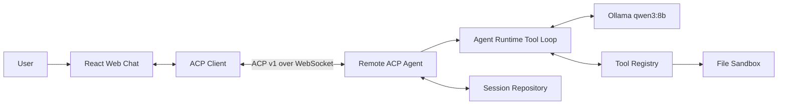

# Models Kindergarten 完整技术方案与演进路线

> 状态：当前有效方案  
> 当前实现基线：V1.1（ACP-first）  
> 作用：统一记录产品远景、技术模块、当前边界和后续进入条件，防止旧方案重新污染 V1。

## 1. 产品目标

Models Kindergarten（模型幼儿园）不是普通聊天壳，也不是第一版就做完整的 Agent 平台。

长期目标是建立一个可观察、可比较、可演进的 Context Engineering 与 Agent 实验环境：把模型视为“学生”，把不同能力配置视为“学生版本”，通过课程、上下文策略、工具、记忆和评测观察它如何成长。

产品主叙事：

```text
模型 API
  ↓ 创建
ModelStudent（模型学生）
  ↓ 创建不同能力版本
AgentVersion（学生版本，也是实际 Agent）
  ↓ 导入
Course / Skills / Tools
  ↓ 配置
ContextStrategy / MemorySpace
  ↓ 产生
Session / Prompt Turn
  ↓ 记录与评估
Trace / Evaluation / Benchmark / Observation
```

当前 V1 刻意只证明最基础、最关键的一件事：

> 一个浏览器 ACP Client 能够与一个 Remote ACP Agent 建立标准链路，由本地模型完成流式回答、工具循环、用户交互和稳定会话回放。

## 2. 决策优先级

发生冲突时按以下顺序判断：

```text
当前代码与测试证明的行为
  > AGENTS.md 当前边界
  > 本文当前有效方案
  > ARCHITECTURE.md / ACP_COMPAT.md
  > 早期对话和旧设计
  > JoyCode / Team 参考实现
```

JoyCode 和 JoyCode-team-studio 只用于参考 ACP 处理、流式交互、Tool UI 与成熟产品细节，不作为 Models Kindergarten 的状态管理和系统架构模板。

## 3. 最终领域模型

### 3.1 ModelStudent

代表一个人格化的模型 API 身份。

```ts
interface ModelStudent {
  id: string;
  name: string;
  provider: {
    kind: "ollama" | "siliconflow" | "openai-compatible";
    model: string;
    baseUrl: string;
    keyRef?: string;
  };
  capabilities?: ModelCapabilities;
}
```

它回答“这个学生是谁、连接哪个模型”，不承担课程、版本记忆或会话状态。

V1 只有一个后台默认学生：本地 Ollama `qwen3:8b`。V1 实现为降低复杂度，暂时把默认 Agent 配置内联在 `ModelStudent.agentConfig` 中。

### 3.2 AgentVersion

代表 ModelStudent 的一个能力版本，同时也是实际运行的 Agent。

```ts
interface AgentVersion {
  id: string;
  studentId: string;
  name: string;
  modelParameters: ModelParameters;
  agentDocument: VersionedDocument;
  courseBindings: CourseBinding[];
  skillBindings: SkillBinding[];
  toolPolicy: ToolPolicy;
  contextStrategyId: string;
  memorySpaceId: string;
}
```

同一学生可以拥有：

```text
通用版本
游戏开发版本
游戏开发大师版本
```

版本之间的长期记忆必须隔离；不同学生之间也必须隔离。

V1 不创建 `AgentVersion` 管理功能。只有真正进入配置编辑、版本复现和版本对比阶段，才把当前内联配置提取为正式实体。

### 3.3 Session

表示基于一个 AgentVersion 创建的可继续会话。

```ts
interface Session {
  id: string;
  agentVersionId: string;
  title: string;
  createdAt: string;
  updatedAt: string;
}
```

Session 拥有消息历史、短期摘要和 Prompt Turn，不拥有 Provider 连接配置。

是否冻结 AgentVersion 配置，必须在未来版本化功能实现时一次性决策。当前有效原则是：V1 不为 Session 保存一套重复的配置快照；未来需要可复现对比时，以不可变 Revision 或 Run 级使用记录解决，而不是复制整套领域对象。

## 4. 技术模块总览

| 技术模块 | V1.1 当前状态 | 后续目标 |
| --- | --- | --- |
| ACP 协议层 | 已实现 ACP v1 Client/Agent、Prompt、Update、Tool、Permission、Elicitation、Load/Resume | 增加 stdio/TCP 等 Transport，扩展兼容测试 |
| Web 聊天投影 | 已实现 `entries + streamingEntries`、`order + byId`、流式 Markdown、Tool 聚合 | AgentWork 层级、更多内容类型、可访问性与响应式完善 |
| Web 状态管理 | Zustand 聚合 Store，组件窄订阅，局部 disclosure | 拆分稳定 slice、持久 UI 偏好、开发调试工具 |
| Remote Agent Runtime | 已实现本地模型 Tool Loop、Cancel、最大 8 次模型调用 | 限额、超时、重试策略、Checkpoint、Human Approval |
| Model Provider | 已有与 ACP 解耦的接口和 Ollama Provider | SiliconFlow/OpenAI-compatible Adapter、能力探测、路由与成本 |
| Tool Runtime | 已有 Schema、参数校验、并行执行、状态回传 | Tool Catalog、课程绑定、可配置权限、更多受控工具 |
| Sandbox | 已有 UTF-8 文件读写、路径/大小/符号链接边界 | Artifact、隔离 Worker、CPU/内存/网络/进程策略 |
| Session Repository | 已有稳定 Message/Thought/Tool 持久化和完整 Load 回放 | 数据库、分页、归档、迁移、并发控制 |
| 领域模型 | V1 只有默认 ModelStudent；AgentVersion 内联 | Student/AgentVersion/Course 管理与 Revision |
| Context Engine | V1 只有固定 system prompt + 历史 + Tool Result | ContextStrategy、预算、裁剪、来源追踪、CtxSnap |
| Memory | 未实现 | Session 短期摘要、版本长期记忆、Revision、检索与编辑 |
| Runtime 可观测性 | 明确不进入 V1 | RuntimeEvent、Trace、Span、CurrentRunView、回放 |
| Evaluation | 未实现 | 确定性 Evaluator、LLM Judge、失败分类 |
| Benchmark | 未实现 | Trial 编排、横向/纵向对比、统计与观察报告 |
| 多课程 | 未实现 | 公共基础课、单专业课，再探索多专业上下文隔离 |
| 多 Agent | 未实现 | 同伴学习、群聊、协作、Handoff、Skill Evolution |
| 平台治理 | 仅本机单用户 | Gateway、认证、权限、多租户、调度、监控与部署 |

## 5. V1.1：ACP 前后端最小闭环（当前版本）

### 5.1 架构



V1 不增加 Java Gateway、RCS、EventBus、SSE 或第二套 Command/Event Envelope。

### 5.2 ACP 范围

支持：

```text
initialize
session/new
session/list
session/load
session/resume
session/prompt
session/cancel
session/update
session/request_permission
elicitation/create
```

核心不变量：

- Browser 页面只有一个 ACP Connection Owner；
- `load` 完整回放，`resume` 零回放；
- Remote Handler 只向当前 AgentContext 输出，不跨连接广播；
- Agent 生成 `messageId` 和 `toolCallId`，Web 把它们当作不透明 ID；
- Permission 表示安全授权，Elicitation 表示补充信息，两者不混用；
- 最终 `PromptResponse.stopReason` 是整个 Prompt Turn 的提交边界。

### 5.3 Web 聊天投影

```ts
interface ChatState {
  sessionId: string | null;
  entries: EntryCollection;
  streamingEntries: EntryCollection;
  streaming: StreamingContext | null;
}

interface EntryCollection {
  order: EntryId[];
  byId: Record<EntryId, ChatEntry>;
}
```

语义：

- `entries`：已由完整 ACP 操作提交的稳定历史；
- `streamingEntries`：当前 Prompt 或 Load 的临时投影；
- `order`：第一次出现的稳定顺序；
- `byId`：Message/Thought/Tool 按 ID 原位更新；
- Tool 先后完成只改变状态，不改变 UI 位置；
- PromptResponse 到达后整体提交并清空 `streamingEntries`。

UI 派生块不是第三份状态：

```text
EntryCollection
  ↓ selectEntryBlocks
MessageBlock / ActivityGroup
```

当前 UI：

```text
AppShell
├── SessionSidebar
└── ChatScreen
    ├── ChatHeader
    ├── ChatViewport
    │   ├── committed blocks
    │   ├── streaming blocks
    │   └── PromptTurnLoader
    └── ComposerDock
        ├── InteractionPendingPanel
        └── Composer
```

### 5.4 Tool Loop

V1 工具：

| Tool | 行为 | 安全/交互 |
| --- | --- | --- |
| `read_file` | 读取沙箱 UTF-8 文本 | 只读，无授权弹窗 |
| `write_file` | 创建或完整覆盖 UTF-8 文本 | 每次通过 ACP Permission 授权 |
| `ask_user` | 在当前 Turn 等待用户回答 | ACP Elicitation，不是 Permission |

同批 Tool 的处理：

```text
模型返回 tool_calls
  ↓ 按模型返回顺序创建 ToolEntry
全部 ToolEntry 已对 Web 可见
  ↓ Promise.all 并行执行
各 Tool 按 toolCallId 独立完成
  ↓ Tool Result 写回模型上下文
继续下一次模型调用
```

### 5.5 Sandbox 边界

- 所有文件操作只能经过 `FileSandbox`；
- 只允许相对 POSIX 路径；
- 拒绝绝对路径、`.`、`..`、反斜杠、空路径段；
- 拒绝符号链接和 `realpath` 逃逸；
- 单文件读写上限 256 KiB；
- 不提供 Shell、npm、Git、任意代码执行或网络访问。

### 5.6 V1 验收标准

- Web 与 Remote 完成 ACP initialize；
- 创建、列出、加载和继续 Session；
- 本地 `qwen3:8b` 产生 thinking 与流式 Markdown；
- 多个 Tool 可以同时处于 streaming；
- Tool 乱序完成但 UI 不乱序；
- `write_file` 必须获得授权；
- `ask_user` 在当前 Turn 暂停并等待回答；
- Prompt Cancel 能传播到模型、Tool 和等待交互；
- 刷新后 Message、Thought、Tool 按原序完整回放；
- typecheck、test、build 全部通过。

## 6. V1 明确不做

以下能力曾出现在旧 V1 方案中，但现在全部移出当前版本：

- RuntimeEvent、RunEvt、Trace Timeline、CurrentRunView；
- Context 可视化和 CtxSnap 页面；
- Student/AgentVersion/Course 管理页面；
- ContextStrategy 编辑器；
- 长短期记忆和 Memory Extractor；
- Artifact/ZIP、游戏构建和浏览器 Preview；
- Shell、网络、任意代码执行；
- Evaluation、Benchmark、教师观察记录；
- 多 Agent、多课程融合、同伴学习；
- Java/RCS、Channel Group、跨连接 EventBus；
- 自动重连、重试、熔断和多用户平台治理。

“不进入 V1”不等于永远删除；它们在后续阶段以独立模块进入，不能提前污染当前 ACP 主链。

## 7. V1.5：领域与上下文基础

目标：把当前单一默认 Agent 提取成可管理、可版本化的正式领域对象，但暂不做 Runtime 可视化和 Benchmark。

### 7.1 进入范围

- ModelStudent 创建、编辑、连接测试；
- AgentVersion 创建、复制、命名与 Revision；
- 模型参数从 Student 下沉到 AgentVersion；
- Agent.md 管理与版本记录；
- Course、Skill、Tool Binding；
- 版本级 ContextStrategy；
- Session 绑定 AgentVersion；
- 版本级 MemorySpace 数据结构；
- 默认游戏开发课作为第一门专业课程。

### 7.2 Course

```ts
interface Course {
  id: string;
  name: string;
  revision: string;
  agentFragment: string;
  skillIds: string[];
  toolIds: string[];
}
```

课程是可导入的领域能力包，不是一次 Session，也不是 Prompt 模板。

早期约束优先采用：一个版本最多一门专业课程，可以叠加公共基础课。转专业时创建新版本或重置专业记忆，避免不同领域记忆直接污染。多专业同时学习留到更晚阶段研究。

### 7.3 ContextStrategy

ContextStrategy 属于 AgentVersion：

```ts
interface ContextStrategy {
  id: string;
  revision: string;
  maxInputTokens: number;
  outputReserveTokens: number;
  safetyMarginTokens: number;
  recentMessageCount: number;
  summaryTriggerTokens: number;
  summaryTargetTokens: number;
  memoryLimit: number;
  memoryTokenBudget: number;
  skillTokenBudget: number;
  retainedToolCallCount: number;
  toolResultTokenLimit: number;
}
```

上下文固定保留项：System、Agent.md、当前用户消息、Tool Definitions。建议裁剪顺序：旧 Tool Result → 最旧历史 → 低权重长期记忆 → Skill 详情。必选内容仍超限时明确返回 `context_overflow`。

## 8. V2：Context 与 Runtime 可观测性

目标：解释 Agent 为什么这样回答，而不是只展示聊天结果。

这时才引入独立内部事件模型：

```ts
interface RuntimeEvent<T = unknown> {
  id: string;
  runId: string;
  sequence: number;
  timestamp: string;
  type: RuntimeEventType;
  stepId?: string;
  parentEventId?: string;
  spanId?: string;
  payload: T;
  visibility: "summary" | "detail" | "internal";
}
```

边界必须保持：

```text
ACP SessionUpdate       = 跨 Client/Agent 的标准协议
RuntimeEvent            = Remote 内部运行事实
ChatEntry               = 聊天消息投影
CurrentRunView          = 当前运行状态投影
ContextSnapshot/CtxSnap = 一次模型调用实际使用的上下文记录
```

RuntimeEvent 不能冒充 ACP，也不能直接当聊天消息渲染。

### 8.1 Context Engine

Context Engine 负责：

- 加载 Agent.md、课程、Skills、Memory、历史和当前输入；
- 应用 Token Budget 与裁剪策略；
- 记录每个组件的来源、优先级、是否保留和修改原因；
- 生成最终模型消息和 Tool Definitions；
- 保存 Run/Step 级 Context Snapshot。

### 8.2 UI

增加独立观察面板：

```text
当前 Run 状态
模型调用次数
Tool 生命周期
Retry / Error
上下文来源和 Token 占用
裁剪与摘要原因
实际使用的 Memory / Skills
```

聊天主栏继续只展示 User、Assistant、AgentWork、Tool、AskUser 和 Artifact，不展示原始 RuntimeEvent 列表。

## 9. V3：Testing、Evaluation 与 Benchmark

目标：从“能运行”升级到“能比较、能证明改进”。

### 9.1 实验编排

```text
ClassTest
├── CaseRun 01
│   ├── Trial 01
│   ├── Trial 02
│   └── Trial N
└── CaseRun N
```

负责 Case 展开、重复 Trial、并发、取消、失败恢复和进度收集。

### 9.2 Evaluation Engine

Evaluator 插件类型：

```text
exact_match
numeric
regex
contains
json_schema
unit_test
build_result
keyword_coverage
llm_rubric
llm_pairwise
manual
```

优先使用确定性评分；只有无法客观验证的开放任务才增加 LLM Judge，并记录 Judge 模型、Prompt 和版本。

### 9.3 Benchmark

核心维度：

- 平均分、通过率、中位数、标准差；
- 平均耗时、P50/P95；
- Token、成本、模型调用次数；
- Agent Loop、Retry、Tool 调用成功率；
- 失败类型聚类；
- 同模型不同版本纵向对比；
- 不同模型同课程横向对比。

产物是“教师观察记录”，而不是只有一个排行榜分数。

## 10. V4：课程体系扩展

在游戏开发课闭环稳定后，再增加：

- 数学课：calculator、确定性数值评测；
- 写作课：结构、关键词、Rubric；
- 聊天课：长期关系与记忆质量；
- 公共基础课：通用工具、安全、表达规范；
- 多课程组合实验。

多专业学习必须先解决：

- Context 冲突与优先级；
- Memory 命名空间和召回过滤；
- Skill/Tool 冲突；
- 课程版本组合的可复现性；
- Evaluation 归因。

## 11. V5：Memory OS

目标：把记忆从“拼到 Prompt 的文本列表”升级为可观察、可治理的独立系统。

### 11.1 层次

```text
Working Memory   当前模型调用临时状态
Session Memory   当前会话消息、摘要和未完成事项
Version Memory   AgentVersion 的长期经验
Course Memory    课程领域知识与学习成果
Shared Memory    经授权的跨 Agent/团队知识
```

### 11.2 能力

- Memory Extractor 与候选审核；
- 去重、合并、冲突和过期；
- 语义检索与规则过滤；
- 来源、置信度、作用域和有效期；
- 人工编辑与模型修改 Revision；
- 为什么被召回、为什么被丢弃；
- 记忆污染检测和重置；
- Memory 对结果影响的 Evaluation。

## 12. V6：多 Agent 与同伴学习

最后进入：

- 多 Agent Handoff；
- 群聊与协作任务；
- 教师 Agent / Reviewer Agent；
- 同伴学习与经验共享；
- 共享 Memory 的权限与污染隔离；
- Agent/Skill Evolution；
- 多 Agent Trace、成本和责任归因。

这些能力会改变 Runtime、Context、Memory、协议和 UI，不能作为当前单 Agent Loop 的“小扩展”顺手加入。

## 13. 平台化进入条件

当前 Browser → Remote 直连足够。只有出现以下真实需求才加入 Gateway 和平台治理：

- 多用户认证与授权；
- Remote 容器调度；
- Session 路由和横向扩容；
- 企业审计和管理策略；
- 多租户数据隔离；
- 配额、计费和统一监控；
- 远程 Agent 的生命周期管理。

届时架构才演进为：

```text
Browser
  ↓
Gateway / Control Plane
  ↓
ACP Transport Router
  ↓
Remote Agent Workers
```

Gateway 不能改变 ACP 的 Agent/Client 语义，只负责平台级认证、路由和治理。

## 14. 路线图汇总

| 阶段 | 核心问题 | 主要交付 |
| --- | --- | --- |
| V1.1 当前 | ACP Agent 能否完整工作 | Web Chat、Remote、Ollama、Tool Loop、Sandbox、AskUser、Session |
| V1.5 | Agent 配置如何成为产品对象 | ModelStudent、AgentVersion、Course、ContextStrategy、MemorySpace 基础 |
| V2 | Agent 为什么这样行动 | RuntimeEvent、Trace、Context Snapshot、可视化投影 |
| V3 | 改进是否真实有效 | Test、Evaluation、Benchmark、Observation Record |
| V4 | 如何覆盖不同学习场景 | 数学、写作、聊天、游戏及课程组合 |
| V5 | 如何长期成长且避免污染 | Memory OS、Revision、检索、治理与影响分析 |
| V6 | 如何协作和互相学习 | Multi-Agent、Handoff、Shared Memory、Skill Evolution |

## 15. 下一阶段选择原则

V1.1 完成后，不自动进入整套 V1.5。每次只选一个能形成独立闭环的模块，并满足：

1. 有明确用户场景；
2. 有最小领域对象和持久化边界；
3. 不破坏 ACP 主链；
4. 有可验证的验收标准；
5. 不为了“以后可能需要”提前建立空抽象。

推荐的第一个候选是正式提取 `AgentVersion`，因为它是课程、ContextStrategy、Memory 和版本对比的共同归属点；但只有开始提供版本配置或比较功能时才实施。

## 16. 已废弃方案索引

以下旧表述不再作为当前实现依据：

- “V1 是完整游戏开发 Agent、自动打包 ZIP”；
- “V1 内置课程、Skills、ContextStrategy 与长期记忆”；
- “Web 主界面有右侧 Runtime Timeline”；
- “Remote 先产生 RunEvt，再转成 ACP”；
- “Browser 与 Remote 使用 SSE Command/Event”；
- “Session 创建时复制整套 Agent 配置快照”；
- “Model、Student、Version、Agent 是四层独立对象”；
- “Java/RCS 是首版必要层”。

当前有效主线始终是：

```text
ACP 标准链路先稳定
  ↓
Agent 产品领域对象
  ↓
Context / Runtime 可观测
  ↓
Evaluation / Benchmark
  ↓
Memory OS
  ↓
多 Agent
```
