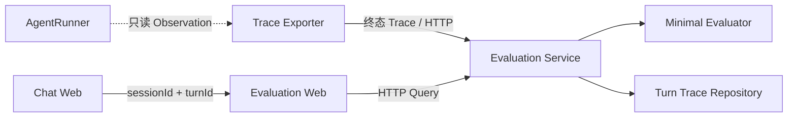

# Turn Evaluation 最小实现

## 1. 目标与边界

当前版本只评测一个真实 Agent 的一次终态 Prompt Turn（完成、Runtime 失败或用户取消）。聊天页不嵌入评测状态，而是根据已提交 `ChatEntry.turnId`，在每个 Turn 的最后一个消息块后提供“Runtime 与评测”入口。入口携带 `sessionId + turnId` 跳转到独立 Evaluation Web，重新加载历史会话后仍然存在。



不实现批量数据集、后台无头执行、LLM-as-Judge、综合总分、模型横向对比和通用 Runtime Event Store。

## 2. 模块边界

| 模块 | 职责 | 明确不负责 |
| --- | --- | --- |
| `runtime-observation` | 定义稳定的只读执行事件端口 | HTTP、存储、评分、React |
| `evaluation-exporter` | 按 `runId` 聚合终态 Trace 并异步上传 | 改变 Runtime 控制流 |
| `evaluation-contract` | Trace、评分结果和 API 数据契约 | 执行逻辑 |
| `evaluation-service` | 接收、校验、评分、原子持久化和查询 | ACP、Agent 执行、聊天投影 |
| `evaluation-web` | Runtime 执行树和最小评分集 | ACP 连接、ChatEntry、Agent 状态 |
| `web/TurnEvaluationLink` | 生成独立页面导航地址 | 查询或缓存评测结果 |

## 3. Trace 事实结构

```text
TurnTraceDocument
├── identity: traceId / runId / sessionId / turnId
├── variant: ModelStudent / model / systemPromptHash / tools
├── terminal: status / stopReason / startedAt / completedAt
├── modelRounds[]
│   ├── context.messages[] / truncatedSourceIds[] / inputTokens
│   ├── firstTokenAt / outputTokens
│   └── thinking / text / stopReason
├── toolCalls[]
│   ├── modelRoundId / toolCallId / name / arguments / signature
│   ├── permission / status / startedAt / completedAt
│   └── output / error
├── permissions[]
└── errors[]
```

Tool 节点按 `startedAt` 固定在所属 Model Round 中；并行 Tool 的完成先后只更新节点状态，不改变展示顺序。

## 4. 最小评分集

`MinimalTurnEvaluationResult` 只从 Trace 确定性计算：正常完成、Model Round 数、Tool Call 数、Tool 成功/失败数、是否重复调用、上下文 Token、被截断上下文数、首 Token 延迟、总耗时、输出 Token、错误数和权限违规数。

这里没有主观质量判断。Provider 提供 usage 时采用精确 Token；逐条 Context Message 的 `estimatedTokens` 仅用于解释上下文组成，不替代评分中的 Provider usage。

## 5. 一致性与故障隔离

- Agent 主链先完成自身状态；Trace 上传异步执行。
- Evaluation Service 不可用时只记录上传警告，Prompt Turn 不失败。
- Evaluation Service 使用终态文档写入，不接收 UI ChatEntry，也不反向构造 Runtime。
- Repository 以 `sessionId + turnId` 覆盖同一轮记录，并通过临时文件原子替换。
- Evaluation Web 对异步上传窗口做短暂查询重试，随后明确展示“尚未生成”。

## 6. 本地地址

- Evaluation API：`http://127.0.0.1:7441`
- Evaluation Web：`http://127.0.0.1:5175`
- 页面路径：`/evaluation/sessions/:sessionId/turns/:turnId`

根目录运行 `pnpm dev` 会同时启动 Chat Web、Remote、Evaluation Service 和 Evaluation Web。
