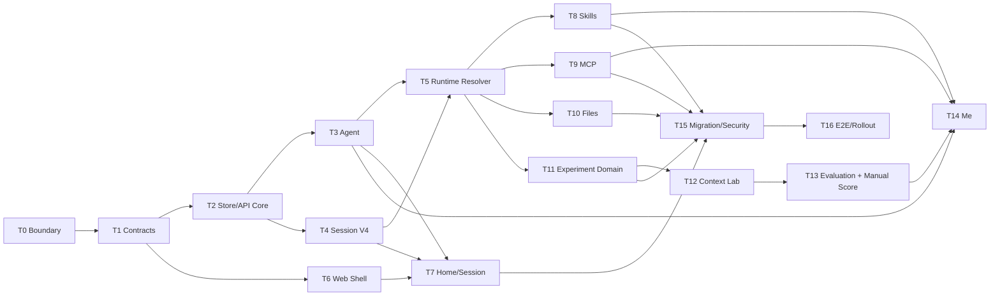

# Demo to Production Implementation Plan

> **For agentic workers:** REQUIRED SUB-SKILL: Use superpowers:executing-plans to implement this plan task-by-task. Steps use checkbox (`- [ ]`) syntax for tracking.

**Goal:** 将 `/demo` 中除模型入园、小说真实创作和 Bearer Token 小说 MCP 外的产品体验接入真实主链；首页保留不可点击的小说调研卡片。实验评分实现理解/规划/输出三维人工注释 + Runtime metrics 执行分，四维共同进入等权总分、雷达图、排名和 winner；不实现任何自动评分调用。

**Architecture:** Browser 只有一个 ACP connection owner；对话和实验 lane 执行均使用官方 ACP Session/Prompt，实验 Session 以 purpose 隐藏于普通会话列表。Remote 的 Control API 处理资源 CRUD、草稿、预览、后台 Job 和实验总体状态。Session 固定绑定 ModelStudent/Agent，页面不提供改绑；每个 Turn 保存实际能力与上下文快照。Agent 是单一可变实体，无版本、ETag、归档或迁移系统，最后一次成功保存生效。Skill/MCP 的安装、Agent 绑定、Runtime 可见与执行授权分层实现。

**Tech Stack:** Node.js 22、TypeScript 7、React 19、Vite 8、Vitest 4、ACP SDK 1.3、MCP Client SDK 2.0、Zustand、现有 JSON Repository/FileSandbox/AgentRunner/Evaluation packages。

**Authoritative design:**

- `docs/DEMO_TO_PRODUCTION_TRD.md`
- `docs/DEMO_TO_PRODUCTION_REQUIREMENTS_AND_GAPS.md`
- `docs/DEMO_TO_PRODUCTION_CONTRACTS.md`

**Existing module plans:**

- Skill 细节参考 `docs/superpowers/plans/2026-08-11-skill-installation-and-website-development.md`。
- MCP 细节参考 `docs/superpowers/plans/2026-08-11-remote-mcp-demo-flow.md`。
- Agent UI、上下文披露和 token 参考同目录的 `agent-strategy-ui-delta`、`provider-context-source-disclosure`、`token-usage-projection` 计划。
- 若旧计划与三份 authoritative design 冲突，以 authoritative design 为准。尤其不得复用全局 Agent capability config、不得把业务状态塞入 ACP `_meta`、不得为实验建立第二 Runtime。

---

## 执行前纪律

- [ ] 每个 Task 开始先运行 `git status --short`，记录并保护用户已有修改。
- [ ] Responses API Provider、mock server 和新增 Provider test 的先前未提交代码已经按用户要求撤回；不要从 reflog、编辑器历史或旧 diff 直接恢复。
- [ ] Responses Provider 的合理部分已转写为文末“Deferred Gate R1”；它属于模型入园启用前门禁，不在 Task 0～17 中执行。
- [ ] 每个 Task 先写失败测试，再写最小实现，再跑本包 typecheck/test。
- [ ] 不用 Demo 的 `sessionStorage`、定时器、prompt 字符串匹配或 hardcoded port 作为生产实现。
- [ ] 不注册模型入园路由，不实现小说真实创作、Bearer Token 小说 MCP 或自动评分调用；小说卡片保留 disabled，三维人工注释、Runtime 执行分与四维图表属于本轮。

## 依赖顺序



T3 与 T4 在 T2 后可并行；T8、T9、T10、T11 在 T5 后可并行，但共享 `AgentRunner`/`index.ts` 的改动必须由一个集成任务顺序合并。

---

## Task 0：建立新版本边界和 ADR

**Files:**

- Modify: `AGENTS.md`
- Create: `docs/adr/001-demo-to-production-boundary.md`
- Modify: `docs/ARCHITECTURE.md`
- Modify: `docs/TECHNICAL_PLAN.md`

**Steps:**

- [ ] 写 ADR，明确 D2P-1 是 V1.6 之后的新边界；Agent 是配置聚合根，Context Experiment 是固定 2～3 lane，不是 Workflow。
- [ ] 在 ADR 列出继续排除项：Memory/RAG、多 Agent、模型入园、自动评分、小说、Bearer MCP；明确人工 scorecard 属于本轮。
- [ ] 修改 `AGENTS.md`，只调整版本范围段，不放宽 ACP 单 owner、Session 单 Turn、FileSandbox、Permission/Elicitation、MCP/Skill Runtime 边界。
- [ ] 更新 ARCHITECTURE/TECHNICAL_PLAN 的目标图和阶段链接，引用主 TRD。
- [ ] 运行文档路径检查：`rg -n "DEMO_TO_PRODUCTION|D2P-1" AGENTS.md docs/ARCHITECTURE.md docs/TECHNICAL_PLAN.md docs/adr/001-demo-to-production-boundary.md`。
- [ ] Commit: `docs: define demo-to-production architecture boundary`

**Done when:** 仓库约束不再把本计划要实现的 Agent/Experiment/人工评分声明为禁止范围；自动评分等留白仍显式禁止。

---

## Task 1：拆出共享领域合同和严格解析器

**Files:**

- Create: `packages/contracts/src/common.ts`
- Create: `packages/contracts/src/agent-management.ts`
- Create: `packages/contracts/src/session-binding.ts`
- Create: `packages/contracts/src/skill-management.ts`
- Create: `packages/contracts/src/mcp-management.ts`
- Create: `packages/contracts/src/experiments.ts`
- Create: `packages/contracts/src/file-references.ts`
- Create: `packages/contracts/src/control-api.ts`
- Modify: `packages/contracts/src/index.ts`
- Create: `packages/contracts/src/management-contracts.test.ts`
- Modify: `packages/contracts/src/index.test.ts`

**Steps:**

- [ ] 先写测试：合法/非法 schemaVersion、Agent capability 引用、MCP auth none、Experiment 2～3 lanes、FileReference URI、ApiProblem。
- [ ] 写 ACP meta 测试：`sessionBinding`、`experimentRunRef`、`operation`、`fileReferences` 在现有 `modelKindergarten` key 下解析；未知字段不抛错，非法已知结构返回 undefined/明确错误。
- [ ] Run: `pnpm --filter @kindergarten/contracts test`，确认测试先失败。
- [ ] 按 `DEMO_TO_PRODUCTION_CONTRACTS.md` 实现 DTO、type guards/readers 和 canonical hash 输入；避免一个超大 `index.ts`。
- [ ] 为 `mk-file://` 只实现 opaque ID parser，不允许 path、host、query 变体。
- [ ] Run: `pnpm --filter @kindergarten/contracts typecheck && pnpm --filter @kindergarten/contracts test`。
- [ ] Commit: `feat(contracts): add demo productization domain contracts`

**Done when:** Web、Remote、Evaluation Web 不需要自行声明重复 DTO；非法 Bearer 输入在合同层被拒绝。

---

## Task 2：建设 Versioned Store、Control API Core 与本地安全边界

**Files:**

- Create: `apps/remote/src/storage/atomic-json-store.ts`
- Create: `apps/remote/src/storage/local-unit-of-work.ts`
- Create: `apps/remote/src/storage/migration-runner.ts`
- Create: `apps/remote/src/server/control-api.ts`
- Create: `apps/remote/src/server/control-router.ts`
- Create: `apps/remote/src/server/api-problem.ts`
- Create: `apps/remote/src/server/local-principal.ts`
- Create: `apps/remote/src/server/origin-policy.ts`
- Modify: `apps/remote/src/server/http-server.ts`
- Create: `apps/remote/test/storage/atomic-json-store.test.ts`
- Create: `apps/remote/test/storage/local-unit-of-work.test.ts`
- Create: `apps/remote/test/control-api-core.test.ts`

**Steps:**

- [ ] 测试 temp write/rename、写队列、损坏 JSON 停止写、`.bak` 恢复、journal 恢复、schema mismatch。
- [ ] 测试 Control API success/problem envelope、requestId、JSON size limit、method 405、unknown route 404。
- [ ] 测试只允许 loopback 和精确 Origin allowlist；写请求拒绝 `Origin: null`/未配置 Origin；CORS 不返回 `*`。
- [ ] Run: `pnpm --filter @kindergarten/remote test -- atomic-json-store local-unit-of-work control-api-core`，确认失败。
- [ ] 实现通用 Store 和 Router；Control API 与 `/acp` 共用 Remote HTTP server，但 handler 完全分离。
- [ ] 不使用 cookie；principal 由服务器固定解析为 local-admin。
- [ ] Run: `pnpm --filter @kindergarten/remote typecheck && pnpm --filter @kindergarten/remote test`。
- [ ] Commit: `feat(remote): add versioned stores and control api core`

**Done when:** 后续领域服务能在统一安全/错误/持久化底座上注册路由，且不改 ACP WebSocket 行为。

---

## Task 3：实现 Agent Repository、Service 与能力选项

**Files:**

- Create: `apps/remote/src/agent/agent-types.ts`
- Create: `apps/remote/src/agent/agent-repository.ts`
- Create: `apps/remote/src/agent/agent-service.ts`
- Create: `apps/remote/src/agent/agent-routes.ts`
- Create: `apps/remote/src/agent/capability-options-service.ts`
- Create: `apps/remote/test/agent/agent-repository.test.ts`
- Create: `apps/remote/test/agent/agent-service.test.ts`
- Create: `apps/remote/test/agent/agent-routes.test.ts`
- Modify: `apps/remote/src/server/control-api.ts`

**Steps:**

- [ ] 测试 create/get/list/update、字段限制、名称搜索、cursor pagination、owner 过滤；确认无 archive/delete/migrate 路由。
- [ ] 测试同一资源写入由单进程队列串行执行，后一次成功更新生效；不生成或要求 ETag/If-Match。
- [ ] 测试引用校验：只允许 built-in catalog、ready Skill、存在的 MCP snapshot 能力；memory 只能 off。
- [ ] 测试内部 `mergeReadySkills(agentId, installationIds)` 在一个写事务中做集合并集；公共 API 不暴露该捷径。
- [ ] Run: `pnpm --filter @kindergarten/remote test -- agent-repository agent-service agent-routes`，确认失败。
- [ ] 实现 Repository/Service/Routes，并把 capability option 组装留在服务端。
- [ ] Run: `pnpm --filter @kindergarten/remote typecheck && pnpm --filter @kindergarten/remote test`。
- [ ] Commit: `feat(remote): persist mutable agents with capability bindings`

**Done when:** Agent 是唯一可变配置实体，本地单用户保存语义清楚，且不保存 resolved Runtime objects。

---

## Task 4：Session V4、只读 ModelStudent Catalog 与 ACP SessionBinding

**Files:**

- Modify: `apps/remote/src/repository/session-types.ts`
- Modify: `apps/remote/src/repository/session-repository.ts`
- Create: `apps/remote/src/model/model-student-catalog.ts`
- Create: `apps/remote/src/session/session-binding-service.ts`
- Modify: `apps/remote/src/acp/kindergarten-agent.ts`
- Modify: `apps/web/src/acp/acp-client.ts`
- Create: `apps/remote/test/session/session-v4.test.ts`
- Create: `apps/remote/test/session/session-binding.test.ts`
- Modify: `apps/remote/test/acp-session.test.ts`
- Create: `apps/web/src/acp/session-binding.test.ts`

**Steps:**

- [ ] 测试 V4 record 必须含 owner/purpose/modelStudentId/agentId/turns；experiment purpose 必须有 experimentRef。
- [ ] 测试 ACP session/new 读取 namespaced sessionBinding；不存在的 Agent、unavailable ModelStudent、非空 `mcpServers`、未批准 cwd/additionalDirectories 失败；load/resume 从 record 恢复而不要求 meta。
- [ ] 测试普通 list 默认隐藏 experiment Session；load 全量、resume 零重放继续通过。
- [ ] Run Remote/Web 指定测试，确认先失败。
- [ ] 实现 ModelStudentCatalog 只读包装当前已配置且已验证的 provider；不要接线或修改仍在模型入园调研中的 Responses API Provider。
- [ ] 修改 AcpWebClient 的 createSession 接受 SessionBinding 并使用 shared `makeSessionBindingMeta`。
- [ ] Session 创建时由 Remote 校验并原子保存；不回退到错误默认值。
- [ ] Run: `pnpm --filter @kindergarten/remote test && pnpm --filter @kindergarten/web test`。
- [ ] Commit: `feat(session): bind sessions to model students and agents`

**Done when:** 新 Session 的模型/Agent 身份是持久事实；现有 ACP 会话不变量全部保持。

---

## Task 5：TurnScope、动态 RuntimeCapabilityResolver 与 Turn 快照

**Files:**

- Create: `apps/remote/src/runtime/turn-scope.ts`
- Create: `apps/remote/src/capability/runtime-capability-resolver.ts`
- Create: `apps/remote/src/capability/capability-snapshot.ts`
- Modify: `apps/remote/src/runtime/agent-runtime.ts`
- Modify: `apps/remote/src/conversation/context-assembler.ts`
- Modify: `apps/remote/src/tools/tool-runtime.ts`
- Modify: `apps/remote/src/tools/tool-registry.ts`
- Modify: `apps/remote/src/repository/session-repository.ts`
- Modify: `packages/runtime-observation/src/index.ts`
- Create: `apps/remote/test/runtime/runtime-capability-resolver.test.ts`
- Create: `apps/remote/test/runtime/capability-refresh.test.ts`
- Create: `apps/remote/test/runtime/turn-execution-record.test.ts`

**Steps:**

- [ ] 测试 resolver 对相同 Agent/config 产生稳定 hash，对不同 Session 返回不同 FileSandbox scope。
- [ ] 测试 Agent 不存在/Skill not ready/MCP disconnected 的解析结果和错误。
- [ ] 测试 tool outcome `effects.capabilitiesChanged=true` 时下一 model round 重新解析；hash 未变不追加 generation；ToolCallLedger 不重置。
- [ ] 测试 TurnRecord 保存 Agent 配置快照 hash、模型、所有 capability generations、每个 model round 的 Context snapshot、usage、stop reason 和 file IDs；Context Lab 原始输入明确取 round 0。
- [ ] Run: `pnpm --filter @kindergarten/remote test -- runtime-capability-resolver capability-refresh turn-execution-record`，确认失败。
- [ ] 把 `AgentRunner` 构造时冻结全局 catalog 的方式改为每 Turn resolve；每 model round 使用当前 resolved catalog。
- [ ] ContextAssembler 接收 Agent history policy 和 resolved sources，不直接访问全局 Skill/MCP registry。
- [ ] observation 增加 generation change 事实，但保持 exporter 失败隔离。
- [ ] Run Remote、runtime-observation 的 typecheck/test 和现有 tool-loop/runtime 回归。
- [ ] Commit: `refactor(runtime): resolve agent capabilities per turn`

**Done when:** 不同 Session/Agent 获得正确隔离的能力；同 Turn 安装后可安全刷新；历史有可解释快照。

---

## Task 6：生产 Router、App Shell、Control Client 与唯一 ACP owner

**Files:**

- Modify: `apps/web/package.json`
- Create: `apps/web/src/app/AppRouter.tsx`
- Create: `apps/web/src/app/AppShell.tsx`
- Create: `apps/web/src/app/routes.ts`
- Create: `apps/web/src/app/AcpConnectionProvider.tsx`
- Create: `apps/web/src/acp/session-update-router.ts`
- Create: `apps/web/src/api/control-client.ts`
- Create: `apps/web/src/api/api-problem.ts`
- Create: `apps/web/src/api/query-state.ts`
- Modify: `apps/web/src/main.tsx`
- Modify: `apps/web/src/App.tsx`
- Create: `apps/web/src/app/AppRouter.test.tsx`
- Create: `apps/web/src/acp/session-update-router.test.ts`
- Create: `apps/web/src/api/control-client.test.ts`

**Steps:**

- [ ] 选择并添加 `react-router-dom`；锁文件由 pnpm 更新，不手改。
- [ ] 测试生产路由、`/demo/*` 保留、未知路由、evaluation URL helper 无硬编码端口。
- [ ] 测试一次 render 只创建一个 AcpWebClient，子页面 mount/unmount 不创建第二 owner。
- [ ] 测试 update router：chat/experiment session 分流，未注册 update 不污染当前 chat。
- [ ] 测试 typed client 解析 success/problem、abort、requestId；普通配置保存不发送 ETag/If-Match。
- [ ] Run: `pnpm --filter @kindergarten/web test`，确认新测试失败。
- [ ] 实现 App Shell/Provider/clients；现有 Chat App 暂挂到 Session route compatibility adapter。
- [ ] Run: `pnpm --filter @kindergarten/web typecheck && pnpm --filter @kindergarten/web test`。
- [ ] Commit: `feat(web): add production shell and shared acp owner`

**Done when:** 所有生产页面共享一个连接 owner 和统一 Control Client；Demo 仍可独立视觉回归。

---

## Task 7：首页与真实 Session Shell

**Files:**

- Create: `apps/web/src/features/home/ModelHomePage.tsx`
- Create: `apps/web/src/features/home/home-api.ts`
- Create: `apps/web/src/features/session/SessionPage.tsx`
- Create: `apps/web/src/features/session/SessionSidebar.tsx`
- Create: `apps/web/src/features/session/SessionIdentity.tsx`
- Modify: `apps/web/src/components/layout/SessionSidebar.tsx`
- Modify: `apps/web/src/components/layout/ChatHeader.tsx`
- Modify: `apps/web/src/store/app-store.ts`
- Create: `apps/web/src/features/home/ModelHomePage.test.tsx`
- Create: `apps/web/src/features/session/SessionPage.test.tsx`
- Modify: `apps/web/src/app/AppRouter.tsx`

**Steps:**

- [ ] 测试 Home loading/empty/error、模型/Agent disabled reason、模板只填入、不发送、最近 Session 分页。
- [ ] 测试发送顺序：ACP session/new 成功后才导航和 prompt；创建失败不出现假 Session。
- [ ] 测试小说卡片存在、显示“功能调研中”、原生 disabled，点击/键盘都不填 prompt、不导航、不调用 API；模型入园无入口。没有完整 scorecard 时只显示“尚未评测”，完整时读取真实四维总分。
- [ ] 测试 Session direct load、模型/Agent 只读身份（无选择器/改绑）、active Prompt 限制、sidebar collapse 和新建会话返回创建流程。
- [ ] Run Web tests，确认失败。
- [ ] 提取 Demo 视觉样式时只复用无状态 CSS/纯组件；不 import demo-data、agent-storage 或 prompt 文本分支。
- [ ] 把现有稳定 chat reducer、PromptTurn、Permission/Elicitation 和 Context Summary 组件接入 SessionPage。
- [ ] Run: `pnpm --filter @kindergarten/web typecheck && pnpm --filter @kindergarten/web test`。
- [ ] Commit: `feat(web): connect home and session pages to real services`

**Done when:** 首页可创建/恢复真实会话，Session 页没有 Demo 消息、timer 或 sessionStorage 业务依赖。

---

## Task 8：统一 Skill 安装服务、对话 Tool 与同 Turn 绑定

**Files:**

- Create: `apps/remote/src/skills/skill-installation-repository.ts`
- Create: `apps/remote/src/skills/skill-install-job-store.ts`
- Create: `apps/remote/src/skills/github-skill-source.ts`
- Create: `apps/remote/src/skills/skill-installation-service.ts`
- Create: `apps/remote/src/skills/ensure-agent-skills-tool.ts`
- Create: `apps/remote/src/skills/skill-routes.ts`
- Modify: `apps/remote/src/skills/skill-installer.ts`
- Modify: `apps/remote/src/skills/skill-registry.ts`
- Modify: `apps/remote/src/skills/skill-tool-provider.ts`
- Modify: `apps/remote/src/runtime/agent-runtime.ts`
- Modify: `apps/remote/src/acp/acp-output.ts`
- Create: `apps/remote/test/skills/skill-installation-service.test.ts`
- Create: `apps/remote/test/skills/ensure-agent-skills-tool.test.ts`
- Create: `apps/remote/test/skills/skill-routes.test.ts`
- Create: `apps/web/src/features/skills/SkillInstallControl.tsx`
- Create: `apps/web/src/features/skills/SkillInstallBanner.tsx`
- Create: `apps/web/src/features/skills/skill-install-projection.test.ts`

**Steps:**

- [ ] 先执行并核对旧 Skill 计划；记录本计划的覆盖点：TurnScope 来自 resolver、刷新由 structured effect 驱动、Agent 绑定 installationId。
- [ ] 测试 GitHub tree URL canonicalization、resolved commit、source allowlist、超时/文件数/总大小和重复内容去重。
- [ ] 测试 Turn 来源安全：每个 source URL 必须来自当前 user message；模糊网站任务、模型猜测/搜索出的 URL 均返回 `SKILL_SOURCE_NOT_USER_PROVIDED`。
- [ ] 测试复用/更新：相同 canonical source + commit/hash 返回 reused；同来源已有旧版本时 `ensure` 仍复用；只有用户明确 `update` 才解析并校验新 commit；同名不同来源不覆盖并报告来源冲突。
- [ ] 测试 Job 持久状态、重启 running→interrupted、retry、manual 与 turn origin 共用服务。
- [ ] 测试 Batch 全成功后 Agent 集合并集；部分失败不绑定；同 Turn 返回 capabilitiesChanged。
- [ ] 测试 `_meta.operation` 只投影当前 ACP Turn 内 Skill 安装；MCP 管理和实验总体状态不使用该投影，刷新时各自读取 Job/Experiment API。
- [ ] 测试安装完成后按需调用现有 `activate_skill` 加载完整内容；已安装已绑定的 Skill 不重复 ensure。
- [ ] 实现 registry refresh 或按 content-addressed installation 构造新的 per-Turn provider；不要在全局对象上无锁 mutate。
- [ ] Run Remote/Web tests + typecheck。
- [ ] Commit: `feat(skills): install and bind skills through real runtime`

**Done when:** 手动安装和对话安装共用事实源；当前 Agent 与当前 Turn 真正获得新 Skill 能力。

---

## Task 9：无认证 Remote MCP 管理与动态 Agent 绑定

**Files:**

- Create: `apps/remote/src/mcp/mcp-installation-repository.ts`
- Create: `apps/remote/src/mcp/mcp-test-service.ts`
- Create: `apps/remote/src/mcp/mcp-operation-store.ts`
- Create: `apps/remote/src/mcp/mcp-connection-supervisor.ts`
- Create: `apps/remote/src/mcp/mcp-management-service.ts`
- Create: `apps/remote/src/mcp/mcp-routes.ts`
- Modify: `apps/remote/src/mcp/mcp-client-manager.ts`
- Modify: `apps/remote/src/mcp/mcp-tool-provider.ts`
- Modify: `apps/remote/src/mcp/mcp-config-store.ts`
- Create: `apps/remote/test/mcp/mcp-test-service.test.ts`
- Create: `apps/remote/test/mcp/mcp-connection-supervisor.test.ts`
- Create: `apps/remote/test/mcp/mcp-management-service.test.ts`
- Create: `apps/remote/test/mcp/mcp-runtime-authorization.test.ts`
- Create: `apps/web/src/features/mcp/McpEditorPage.tsx`
- Create: `apps/web/src/features/mcp/mcp-api.ts`
- Create: `apps/web/src/features/mcp/McpEditorPage.test.tsx`

**Steps:**

- [ ] 先核对 `MCP_REMOTE_DEMO_DESIGN.md` 和旧 remote MCP plan；保留 install/connect/bind 分离，覆盖全局 allowlist 设计。
- [ ] 测试 create/update input 只接受 HTTPS Streamable HTTP + auth none；开发 loopback HTTP 受 flag；Bearer 返回 `MCP_AUTH_NOT_SUPPORTED`。另测 legacy externally-managed Bearer 只读导入不会暴露 credentialRef。
- [ ] 测试 testId 过期/candidate hash、服务端 discovery snapshot、浏览器不能提交 snapshot。
- [ ] 测试 Supervisor connect/reconnect/backoff/disable/enable/restart 和 snapshot generation。
- [ ] 测试 Agent 未绑定、Installation disabled/disconnected、tool 不在 snapshot 时模型不可见且执行拒绝。
- [ ] 测试卸载 UnitOfWork：确认页显示受影响 Agent；执行时重新计算并原子移除绑定、断开、终结，不依赖浏览器提交旧快照。
- [ ] 实现 Control routes 和生产 MCP 页面，不创建 credential/token endpoint。
- [ ] Run Remote/Web tests + typecheck。
- [ ] Commit: `feat(mcp): manage no-auth remote mcp installations`

**Done when:** 无认证 MCP 可真实测试、安装、重连、禁用、卸载并绑定 Agent；Bearer 小说 MCP 仍完全留白。

---

## Task 10：Session Workspace、FileReference 与安全 Artifact 预览

**Files:**

- Create: `apps/remote/src/files/session-workspace-resolver.ts`
- Create: `apps/remote/src/files/file-reference-repository.ts`
- Create: `apps/remote/src/files/file-reference-service.ts`
- Create: `apps/remote/src/files/html-preview-sanitizer.ts`
- Create: `apps/remote/src/files/file-routes.ts`
- Modify: `apps/remote/src/tools/sandbox.ts`
- Modify: `apps/remote/src/tools/process-sandbox.ts`
- Modify: `apps/remote/src/tools/tool-registry.ts`
- Modify: `apps/remote/src/acp/acp-output.ts`
- Create: `apps/remote/test/files/session-workspace.test.ts`
- Create: `apps/remote/test/files/file-reference-service.test.ts`
- Create: `apps/remote/test/files/html-preview-sanitizer.test.ts`
- Modify: `apps/web/src/components/chat/ContentRenderer.tsx`
- Create: `apps/web/src/features/artifacts/ArtifactPanel.tsx`
- Create: `apps/web/src/features/artifacts/file-link.ts`
- Reuse/Move: `apps/web/src/demo/session/split-pane.ts`
- Create: `apps/web/src/features/artifacts/ArtifactPanel.test.tsx`

**Steps:**

- [ ] 测试 FileSandbox 与 ProcessSandbox 使用同一 Session workspace；两个 Session 互相不可读，cwd/path traversal/symlink/不存在目标父 symlink 均拒绝。
- [ ] 测试 write_file 成功创建 FileReference、ACP resource_link、Turn file IDs；事务失败不产生悬空引用。
- [ ] 测试 `mk-file://` 只按 opaque ID 分流，外部 https link 继续按外链策略。
- [ ] 测试 HTML 移除/阻止 script、object、base、refresh、危险 URL，返回严格 CSP；跨 Session file ID 返回 403/404。
- [ ] 测试 Markdown/HTML/text/unsupported、大小上限、nosniff 和 attachment。
- [ ] 提取 split pane 纯逻辑并保留原测试；ArtifactPanel 接真实 preview API。
- [ ] 分栏只实现鼠标/触控笔拖动，最小两侧各 300px；拖过 iframe、到达阈值和松手均稳定。首版不加键盘调整和双击复位。
- [ ] Run Remote/Web tests + typecheck。
- [ ] Commit: `feat(files): expose session artifacts through safe file references`

**Done when:** 模型写出的文件通过标准 ACP link 在产品内安全预览，任何路径都不暴露给浏览器。

---

## Task 11：Context Snapshot、Preview 与 Experiment 领域

**Files:**

- Create: `apps/remote/src/experiments/experiment-repository.ts`
- Create: `apps/remote/src/experiments/experiment-service.ts`
- Create: `apps/remote/src/experiments/experiment-routes.ts`
- Create: `apps/remote/src/experiments/context-preview-service.ts`
- Create: `apps/remote/src/experiments/experiment-session-binding.ts`
- Modify: `apps/remote/src/conversation/context-assembler.ts`
- Modify: `apps/remote/src/acp/kindergarten-agent.ts`
- Modify: `apps/remote/src/repository/session-repository.ts`
- Create: `apps/remote/test/experiments/context-preview-service.test.ts`
- Create: `apps/remote/test/experiments/experiment-service.test.ts`
- Create: `apps/remote/test/experiments/experiment-session-binding.test.ts`
- Create: `apps/remote/test/experiments/experiment-recovery.test.ts`

**Steps:**

- [ ] 测试 Turn completion 保存 provider-neutral messages、sources、provider input redaction/hash、capability generations。
- [ ] 测试 preview 与实际 ContextAssembler/ModelProvider serializer 对相同输入产生相同 hash；缓存按内容 hash；不使用固定 token map。
- [ ] 测试 fresh 至少两 lane 策略不同；history source Turn ownership/completed/snapshot；A 强制 reuse。
- [ ] 测试 prepare-run 幂等、启动时策略 snapshot、2～3 lane、partial failure/cancel/interrupted 恢复；启动后编辑草稿不改写 runs。
- [ ] 测试 experiment session/new 只凭 experimentId/variantId 从服务端读取 policy，不能接受浏览器注入工具 schema。
- [ ] 实现 ExperimentRepository/Service；prepare-run 不直接调用模型。
- [ ] `KindergartenAgent` 创建 purpose=experiment Session，并在 Turn 完成/失败时更新对应 run。
- [ ] Run Remote 全量测试和 typecheck。
- [ ] Commit: `feat(experiments): persist context drafts and acp run facts`

**Done when:** Context Lab 有真实服务端草稿/预览/状态，实验 lane 仍走唯一 Runtime 主链。

---

## Task 12：生产 Context Lab 与 ACP Experiment Coordinator

**Files:**

- Create: `apps/web/src/features/context-lab/ContextLabPage.tsx`
- Create: `apps/web/src/features/context-lab/ContextPolicyEditor.tsx`
- Create: `apps/web/src/features/context-lab/ContextPreview.tsx`
- Create: `apps/web/src/features/context-lab/experiment-api.ts`
- Create: `apps/web/src/features/context-lab/experiment-run-coordinator.ts`
- Create: `apps/web/src/features/context-lab/context-lab-state.ts`
- Create: `apps/web/src/features/context-lab/context-lab-state.test.ts`
- Create: `apps/web/src/features/context-lab/experiment-run-coordinator.test.ts`
- Create: `apps/web/src/features/context-lab/ContextLabPage.test.tsx`
- Modify: `apps/web/src/app/AppRouter.tsx`

**Steps:**

- [ ] 测试 fresh A/B 初始一致、无差异禁用、C 上限/复制/删除、memory disabled。
- [ ] 测试 history 只传 turnId 加载；A policy/result 只读且不创建 Session；B/C rerun。
- [ ] 测试 preview debounce/abort/stale response 丢弃、服务端 field error 显示。
- [ ] 测试 coordinator：prepare-run → 每个 rerun lane ACP session/new → prompt；update 按 sessionId 分流；lane 独立失败；全部终态导航。
- [ ] 测试双击运行只产生一组 runs；刷新后从 Experiment record 恢复。
- [ ] 实现时只复用 Demo 的纯视觉/策略编辑交互，不 import demo storage、mock token 或 hardcoded evaluation URL。
- [ ] Run: `pnpm --filter @kindergarten/web typecheck && pnpm --filter @kindergarten/web test`。
- [ ] Commit: `feat(web): run real context experiments over acp`

**Done when:** fresh/history 两种模式产生真实且可恢复的实验；A reuse 不请求模型。

---

## Task 13：Evaluation Web 对比、人工评分与结果图表

**Files:**

- Create: `apps/evaluation-web/src/experiments/ExperimentComparisonPage.tsx`
- Create: `apps/evaluation-web/src/experiments/RawAnswerGrid.tsx`
- Create: `apps/evaluation-web/src/experiments/ContextDifferenceView.tsx`
- Create: `apps/evaluation-web/src/experiments/ManualScorecard.tsx`
- Create: `apps/evaluation-web/src/experiments/UnderstandingAnnotationPanel.tsx`
- Create: `apps/evaluation-web/src/experiments/PlanningAnnotationPanel.tsx`
- Create: `apps/evaluation-web/src/experiments/OutputAnnotationPanel.tsx`
- Create: `apps/evaluation-web/src/experiments/ExecutionScorePanel.tsx`
- Create: `apps/evaluation-web/src/experiments/ScoreRadarChart.tsx`
- Create: `apps/evaluation-web/src/experiments/RankingSummary.tsx`
- Create: `apps/evaluation-web/src/experiments/experiment-api.ts`
- Create: `apps/evaluation-web/src/experiments/experiment-state.ts`
- Create: `apps/evaluation-web/src/experiments/experiment-state.test.ts`
- Create: `apps/evaluation-web/src/experiments/ExperimentComparisonPage.test.tsx`
- Modify: `apps/evaluation-web/src/App.tsx`
- Modify: `apps/evaluation-web/src/api.ts`

**Steps:**

- [ ] 测试 `/evaluation/experiments/:id` loading/ready/partial failure/error/save，以及 scorecard loading/empty/editing/saving/error。
- [ ] 测试 A reuse 标记、B/C usage/stop reason、context/capability diff 和 raw answer 切换。
- [ ] 测试理解、规划、输出三套人工 annotation facts 的字段校验、保存和刷新恢复；未完成任一人工维度时 status=draft，不得默认 100，不生成 total/rank/winner。
- [ ] 测试 `runtime_execution_v1`：正常完成、Tool 成功率、错误、权限违规、重复调用、TTFT/总耗时同实验归一化；无 Tool 合法任务、缺失 TTFT、全部耗时相等和失败封顶 59 的边界。
- [ ] 测试四维固定等权：`round((理解 + 规划 + 输出 + 执行) / 4)`；服务端计算并列排名和 `winnerVariantIds`，前端不能提交 dimension score/total/rank/winner 作为可信结果。
- [ ] 测试雷达图读取理解/规划/输出/执行四个 dimensionScores；partial failure 只让有完整人工量表和执行事实的 lanes 参与排名。
- [ ] 测试页面刷新后从 Control API 恢复，不依赖 `useState` 保存记录；不得 import Demo 的 score/winner mock data。
- [ ] ExecutionScorePanel 同时展示执行分、公式版本、各 component 和原始 runtime facts；Rounds/Calls/Tokens 作为解释事实但 v1 不直接扣分。自动评分按钮/API/裁判模型合同必须缺席。
- [ ] 复用 Demo 的纯布局和图表视觉，建立独立 production types 与可访问表格替代信息。
- [ ] 配置 Remote Control API URL/Origin，不写死 5174/5175。
- [ ] Run: `pnpm --filter @kindergarten/evaluation-web typecheck && pnpm --filter @kindergarten/evaluation-web test`。
- [ ] Commit: `feat(evaluation-web): persist experiment comparisons and manual scores`

**Done when:** 三维人工注释和 Runtime 执行分可跨应用持久查看；四维等权总分、雷达图、排名和 winner 都由真实 scorecard 重建，自动评分无入口/API。

---

## Task 14：Agent Editor 与“我的”真实资源中心

**Files:**

- Create: `apps/web/src/features/agents/AgentEditorPage.tsx`
- Create: `apps/web/src/features/agents/AgentCapabilityEditor.tsx`
- Create: `apps/web/src/features/agents/agent-api.ts`
- Create: `apps/web/src/features/me/MePage.tsx`
- Create: `apps/web/src/features/me/ExperimentsTab.tsx`
- Create: `apps/web/src/features/me/AgentsTab.tsx`
- Create: `apps/web/src/features/me/ModelsTab.tsx`
- Create: `apps/web/src/features/me/McpsTab.tsx`
- Create: `apps/web/src/features/me/SkillsTab.tsx`
- Create: `apps/web/src/features/agents/AgentEditorPage.test.tsx`
- Create: `apps/web/src/features/me/MePage.test.tsx`
- Modify: `apps/web/src/app/AppRouter.tsx`

**Steps:**

- [ ] 测试 Agent create/edit/validation/loading/error/最后保存生效；确认无 archive/delete/migrate UI；capability options 只显示服务端允许项。
- [ ] 测试 MCP snapshot 变化导致 unresolved binding 的可见错误，不能静默加入新工具。
- [ ] 测试 Me tab URL、服务端 search/cursor pagination、empty/error/retry。
- [ ] 测试 Models tab 只读且无入园入口；Skills/MCPs/Experiments 读真实状态；实验项可显示人工 scorecard 摘要。
- [ ] 复用 Demo 样式时删除 sessionStorage adapter；表单草稿只保留到提交/离开确认。
- [ ] Run Web tests/typecheck。
- [ ] Commit: `feat(web): connect agents and resource center to control api`

**Done when:** Demo 的 Agent/Me/MCP/Skill 资源体验全部由真实服务端记录驱动，调研功能保持禁用。

---

## Task 15：Legacy 迁移、恢复、安全与可观测性

**Files:**

- Create: `apps/remote/src/migrations/001-session-v3-to-v4.ts`
- Create: `apps/remote/src/migrations/002-import-default-agent.ts`
- Create: `apps/remote/src/migrations/003-import-skills.ts`
- Create: `apps/remote/src/migrations/004-import-mcps.ts`
- Create: `apps/remote/src/observability/domain-observation.ts`
- Create: `apps/remote/src/observability/redaction.ts`
- Modify: `apps/remote/src/index.ts`
- Modify: `.env.example`
- Create: `apps/remote/test/migrations/demo-productization-migrations.test.ts`
- Create: `apps/remote/test/security/control-api-security.test.ts`
- Create: `apps/remote/test/security/secret-redaction.test.ts`
- Create: `apps/remote/test/recovery/operation-recovery.test.ts`

**Steps:**

- [ ] 用临时 dataRoot 测试 V3 Session → V4：ID/entry order 保持，默认 Agent/Model 绑定，未知历史快照明确 unavailable，备份和报告存在。
- [ ] 测试 legacy Skill lock/registry 导入按 content hash 去重；未知来源标 imported legacy。
- [ ] 测试 MCP config 导入为 Installation，全局 allowlist 只迁到默认 Agent；浏览器能力快照不参与迁移。
- [ ] 测试迁移可重复运行、失败停止写、不会清空源文件。
- [ ] 测试 running Skill/MCP/Experiment 重启恢复规则。
- [ ] 测试日志/错误/provider input/tool raw data 对 authorization/token/api_key/cookie/URL query 的净化。
- [ ] 在 `index.ts` 组装 Store/Services/Resolver/Supervisor/Control API；不接线 Responses API Provider。
- [ ] 更新 `.env.example`：dataRoot、Control Origin allowlist、evaluation URL、feature flags；不加 Bearer 管理配置。
- [ ] Run Remote 全量 test/typecheck/build。
- [ ] Commit: `feat(remote): migrate and secure demo productization state`

**Done when:** 现有用户会话/Skill/MCP 可安全进入新结构；失败可回滚，Secret 不进入可见投影。

---

## Task 16：跨应用 E2E、性能门槛与逐路由切换

**Files:**

- Create: `apps/web/test/e2e/home-session.e2e.test.ts`
- Create: `apps/web/test/e2e/skill-install.e2e.test.ts`
- Create: `apps/web/test/e2e/mcp-agent-call.e2e.test.ts`
- Create: `apps/web/test/e2e/file-preview.e2e.test.ts`
- Create: `apps/web/test/e2e/context-experiment.e2e.test.ts`
- Create: `apps/remote/test/performance/control-api.performance.test.ts`
- Create: `docs/DEMO_TO_PRODUCTION_ROLLOUT.md`
- Modify: `README.md`
- Modify: `target.md`

**Steps:**

- [ ] 建立可控 FixtureProvider/MCP fixture/Skill fixture，不访问真实外部服务。
- [ ] E2E 1：首页选择→ACP Session→聊天→刷新恢复；断言 Session binding。
- [ ] E2E 2a：含用户明确 Skill URL 的网站任务→真实 ensure_agent_skills→Batch→Agent binding→同 Turn activate/新 capability generation。
- [ ] E2E 2b：只有“帮我设计网页”而无 URL→不安装、不搜索，只使用 Agent 已绑定 Skills；重复 URL ensure 复用，明确 update 才升级。
- [ ] E2E 3：无认证 MCP test/install→Agent bind→下一 Turn tool visible/call；disable 后不可见。
- [ ] E2E 4：write_file→resource_link→Markdown/HTML preview；尝试跨 Session ID 和路径逃逸失败。
- [ ] E2E 5：fresh A/B 与 history A reuse/B rerun→evaluation→理解/规划/输出人工注释→Runtime 执行分→四维总分/雷达/排名/winner；刷新后保持；断言无自动评分 API。
- [ ] 性能测试本地 1000 records 的列表 P95、Agent save、Context preview cache；阈值按主 TRD。
- [ ] 写 rollout 文档：flags、迁移备份、验证、逐路由开关、rollback、日志检查。
- [ ] Run 全量：

```bash
pnpm typecheck
pnpm test
pnpm build
```

- [ ] 运行静态 guard：

```bash
rg -n "sessionStorage|setTimeout|127\.0\.0\.1:5175|novel.*bearer|automatic_score|judge_model" \
  apps/web/src/features apps/evaluation-web/src/experiments apps/remote/src
```

允许 UI timeout/debounce 的 `setTimeout` 必须逐个说明；业务状态推进、hardcoded port、自动评分调用必须为零。`winner`/`dimensionScores` 只允许存在于真实 Scorecard 合同和消费组件。

- [ ] Commit: `test: verify complete demo-to-production workflows`

**Done when:** 五条主 E2E、安全/性能门槛和全仓 test/typecheck/build 通过，rollout/rollback 可执行。

---

## Task 17：收口 Demo 引用与文档一致性

**Files:**

- Modify: `apps/web/src/demo/DemoApp.tsx`
- Modify: `apps/web/src/main.tsx`
- Modify: `apps/evaluation-web/src/App.tsx`
- Modify: `docs/2026-08-10-models-kindergarten-demo-app-spec.md`
- Modify: `docs/MCP_REMOTE_DEMO_DESIGN.md`
- Modify: `docs/MCP_SKILLS.md`
- Modify: `docs/TECHNICAL_PLAN.md`
- Modify: `README.md`

**Steps:**

- [ ] 在生产 flags 默认开启前完成一次 migration dry-run 和 rollback 演练。
- [ ] 将旧文档标为“Demo 视觉/历史参考”，顶部链接 authoritative TRD；不删除仍有价值的设计证据。
- [ ] `/demo/*` 保留为开发视觉基线时，确保它使用独立 namespace 且不写生产 Store；`/demo/model-admission` 不注册。若删除其他 Demo，先保存截图/测试基线并单独提交。
- [ ] 默认生产入口使用 AppRouter；evaluation demo route 与 production experiment route 明确分开。
- [ ] 运行 `rg` 检查文档中关于 Agent version、全局 MCP allowlist、Bearer UI、模型评分已实现等过期承诺。
- [ ] 最终运行 `pnpm typecheck && pnpm test && pnpm build`。
- [ ] Commit: `docs: finalize demo-to-production rollout`

**Done when:** 新开发者从 README/AGENTS/主 TRD 得到一致边界，不会再把 Demo 假状态当成真实实现。

---

## 实施检查点

### Checkpoint A：Task 0～5

- Session/Agent/Model/Turn/Capability 数据合同稳定；
- ACP 回归全绿；
- 暂不启用生产 Demo 页面。

### Checkpoint B：Task 6～10

- 首页、Session、Agent、Skill、MCP、Artifact 主链可用；
- 可做首轮内部 dogfood；Context Lab 仍可用旧 Demo 作为视觉参考。

### Checkpoint C：Task 11～14

- Context Lab、实验对比、三维人工注释、Runtime 执行分和四维结果可用；
- “我的”资源中心完整；
- 明确没有自动评分/Bearer/小说/入园实现。

### Checkpoint D：Task 15～17

- 迁移、恢复、安全、性能、E2E 和文档收口完成；
- 逐路由打开 production flags。

## 最终 Definition of Done

- [ ] 主 TRD 的成功标准全部有自动化证据或可重复手工验证记录。
- [ ] 差距矩阵非留白项全部关闭；模型入园、自动评分、小说与 Bearer 项仍标留白。
- [ ] Browser 页面只有一个 ACP connection owner；实验没有第二执行器。
- [ ] Remote 不保存 Web projection，Web 不保存 Runtime state。
- [ ] Agent 无版本、ETag、归档或迁移系统；Turn 有不可变事实快照。
- [ ] load 全量、resume 零重放、一 Session 一 Turn、Permission/Elicitation、tool order 无回归。
- [ ] 生产代码不使用 Demo sessionStorage/timer/prompt string/hardcoded port 驱动业务。
- [ ] 用户已有 dirty worktree 修改未被覆盖或混入无关提交。

---

## Deferred Gate R1：Responses Provider 启用门禁（模型入园调研批准后执行）

**Status:** Deferred；不是当前 Demo 产品化 Task，不计入 Task 0～17 的阻塞依赖。

**Files:**

- Modify: `apps/remote/src/model/responses-api-provider.ts`
- Modify: `apps/remote/test/support/responses-mock-server.ts`
- Create: `apps/remote/test/responses-api-provider.test.ts`

**Steps:**

- [ ] 写失败测试：模拟两个不同 function call 的 delta 交错，`output_index=2` 先 done、`output_index=1` 后 done；断言 Provider 最终一次发出的 calls 顺序为 `[1, 2]`，且 call_id 与第二轮 outputs 一一对应。
- [ ] 写失败测试：流发送 `[DONE]` 后结束但没有 `response.completed/incomplete/cancelled/failed`；断言 `invalid_model_response`，不能得到 `finish(stop)`。
- [ ] 写失败测试：`response.failed.response.error.message` 和 SSE `error.message` 含实际 Bearer token；断言 ModelProviderError 保留 code/retryable 且 message 不含明文。
- [ ] 写失败测试：完成态 function call 缺 call_id/name、arguments 不是 JSON object；断言调用不会被静默丢弃，而是 `invalid_model_response`。
- [ ] 写失败测试：`response.incomplete` 中 arguments 已 done、但 response.output item 仍为 `in_progress`；断言该调用不会进入 ToolRuntime。
- [ ] Run: `pnpm --filter @kindergarten/remote test -- responses-api-provider.test.ts`；Expected: 新增断言在当前实现失败。
- [ ] 在 FunctionCallState 分开记录 `argumentsFinalized` 与 `itemCompleted`；arguments done 只聚合/校验，正式 response 终态补齐 response.output 后，只对真正 completed 的 items 按 output_index 排序并一次发出 batch。
- [ ] 把 `[DONE]` 降为兼容 transport sentinel；只有正式 Responses 终态设置 terminal 和产生 finish/usage。
- [ ] 让 `responseFailure`/`eventFailure` 使用与非 2xx body 相同的 redactor，再构造公开错误。
- [ ] mock 中让两个不同工具逆序完成。工具名称本身无产品含义，只用于证明排序断言不是同名误判。
- [ ] Run: `pnpm --filter @kindergarten/remote typecheck && pnpm --filter @kindergarten/remote test -- responses-api-provider.test.ts`；Expected: PASS。
- [ ] Run: `pnpm --filter @kindergarten/remote test`；Expected: 全部 Remote 回归通过。
- [ ] Commit: `fix(model): enforce responses streaming terminal and tool order contracts`

**Gate exit:** 模型入园 ADR 明确选择 Responses Provider，以上合同测试通过，且 Provider 才允许加入可选择的 ModelStudentCatalog。
