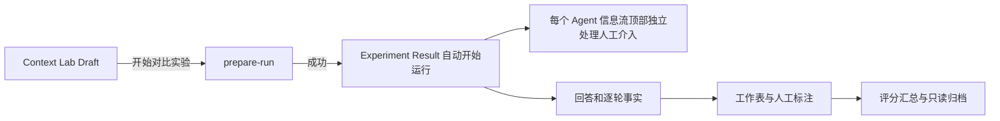
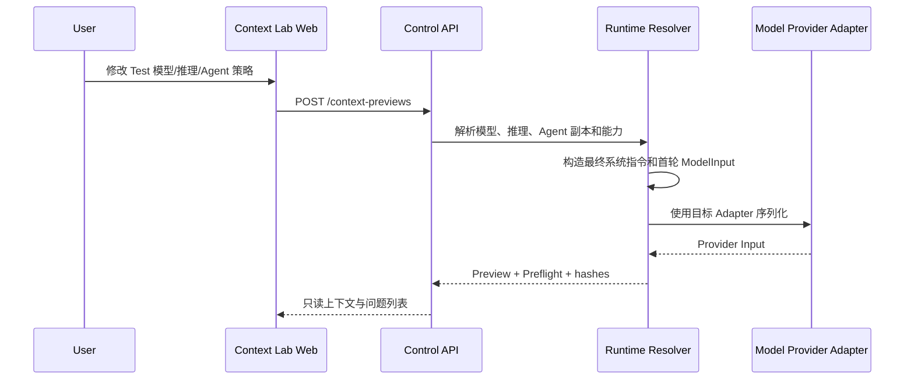
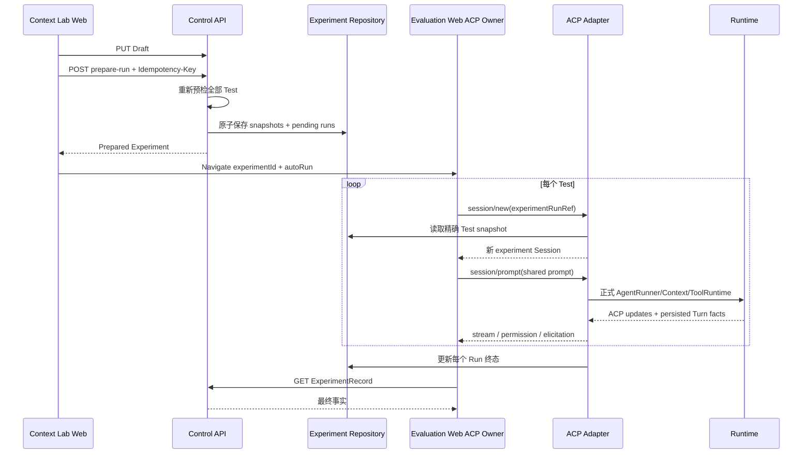
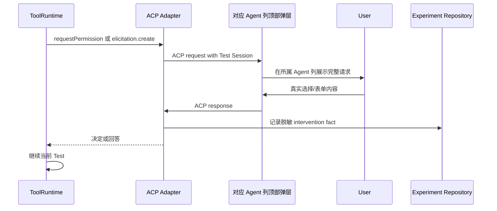

# Models Kindergarten 上下文实验完整重构 App Spec

> 上游文档：[上下文实验完整重构 PRD](./上下文实验完整重构-PRD.md)  
> 文档状态：工程评审稿  
> 平台：Desktop-first Web；窄屏可查看和操作  
> 产品角色：本地单用户 Admin

## 1. Requirements Extraction

### 1.1 Feature Inventory

| # | 功能 | 用户动作 | 主要实体 | 优先级 |
| --- | --- | --- | --- | --- |
| 1 | 公共实验输入 | 填写名称、公共提示词、Tool 预期 | Experiment Draft | P0 |
| 2 | Test 管理 | 切换 A/B/C、添加 C、删除 C、克隆配置 | Experiment Test | P0 |
| 3 | Agent 配置副本 | 导入 Agent、编辑系统提示/Tools/Skills/MCP | Agent Policy Copy | P0 |
| 4 | Test 模型 | 选择 ModelStudent | ModelStudent | P0 |
| 5 | Test 推理级别 | 选择模型支持的推理档位 | Reasoning Profile | P0 |
| 6 | 历史事实 | 查看 Agent 历史策略与本次实际 0 条历史 | History Fact | P0 |
| 7 | 首轮上下文预览 | 查看完整系统指令、能力上下文、Provider Input | Preview | P0 |
| 8 | 运行预检 | 查看模型/能力/依赖错误并准备运行 | Preflight | P0 |
| 9 | 多 Test 真实运行 | 启动、观察、取消、恢复全部新 Session | Run | P0 |
| 10 | 人工介入 | 处理 permission 与 AskUser 请求 | Intervention | P0 |
| 11 | 结果审阅 | 对比回答、逐轮上下文和 Runtime 事实 | Run Facts | P0 |
| 12 | 工作表与人工标注 | 生成题目、标注三维、查看执行分 | Worksheet / Scorecard | P0 |
| 13 | Legacy 查看 | 只读旧版 Fresh / History 结果 | Legacy Experiment | P1 |

### 1.2 Role-Permission Matrix

| 动作 | Local Admin | Model / Runtime |
| --- | --- | --- |
| 创建和编辑实验 Draft | 是 | 否 |
| 修改已保存 Agent | 仅在 Agent 页面 | 否 |
| 在 Test 中修改 Agent 副本 | 是 | 否 |
| 选择模型/推理级别 | 是 | 只报告能力并执行 |
| 回答 permission request | 是 | 发起请求，不代替用户决定 |
| 回答 AskUser | 是 | 发起表单，不代填 |
| 生成工作表 | 发起 | 只整理题目，不判断结果 |
| 人工标注 | 是 | 否 |
| 计算分数/排名 | 否 | 服务端确定性计算 |

### 1.3 Platform Constraints

- 正式路由使用现有 Web 与 evaluation-web，不引入第三个前端。
- 每个浏览器页面最多一个 ACP connection owner。
- Experiment Control API 只管理草稿、快照和状态；模型执行只走官方 ACP。
- 2～3 个 Test；页面默认 A/B，可选 C。
- 当前只有一个用户 Prompt Turn，不出现“下一轮”输入框。
- 窄屏下 Test rail 变为横向滚动标签；回答比较允许横向滚动，不压缩到不可读宽度。
- 所有表单控件有 label，键盘可操作；错误同时使用文字和状态图标，不只依赖颜色。

## 2. Page Inventory 与导航

```text
Models Kindergarten
├── Context Lab (/context-lab)
│   ├── 空白单轮实验
│   └── 从 Turn 导入 (/context-lab?turnId=:turnId)
├── Experiment Result (/evaluation/experiments/:experimentId)
│   ├── V2 执行/结果/标注
│   └── V1 Legacy 只读结果
└── My Experiments (/me?tab=experiments)
    └── 打开结果 / 删除 / 查看来源关系
```

主要跨页流程：



## 3. Page: Context Lab

- Route：`/context-lab`
- Purpose：建立一份单轮公共任务，并配置 2～3 个独立 Test。
- Access：Local Admin。
- Entry points：顶部导航、My Experiments 的“新实验”、聊天 Turn 的“创建上下文实验”。

### 3.1 Layout

```text
┌──────────────────────────────────────────────────────────────────┐
│ Product Nav                                                       │
├──────────────────────────────────────────────────────────────────┤
│ Heading: 模型上下文实验 · 单轮 · 所有 Test 重新运行              │
├──────────────────────────────────────────────────────────────────┤
│ 实验名称              公共用户提示词                              │
│ Tool 使用预期         评测辅助模型                                │
├──────────────┬───────────────────────────────────────────────────┤
│ Test Rail    │ Active Test Header                                │
│ A            │ Agent 来源 / ModelStudent / 推理级别              │
│ B            ├───────────────────────────────────────────────────┤
│ C optional   │ Agent 策略副本                                    │
│ + 添加 C     │ System / Tools / Skills / MCP                     │
│              ├───────────────────────────────────────────────────┤
│              │ 历史策略（只读）+ 本次实际历史 0                  │
│              ├───────────────────────────────────────────────────┤
│              │ 实际模型上下文（只读）                            │
│              │ System / Tools / Skills / MCP / Prompt / Provider │
├──────────────┴───────────────────────────────────────────────────┤
│ Sticky Runbar: validation summary           开始对比实验          │
└──────────────────────────────────────────────────────────────────┘
```

### 3.2 Page Header

固定文案：

- Kicker：`MODEL CONTEXT · SINGLE-TURN EXPERIMENT`
- Title：`模型上下文实验`
- Description：`同一份用户提示词，比较 2–3 个独立 Test；每个 Test 都会创建新 Session 并重新运行。`

若从 Turn 导入，在标题下显示来源条：

- `已从 Turn {shortId} 导入提示词与运行配置`
- 小字：`仅用于初始化；不会带入历史，也不会复用原回答。`
- 提供“查看来源会话”链接；不提供“恢复 History 模式”。

### 3.3 Global Input Zone

#### 实验名称

- 必填，最多 120 字。
- 空白时 Runbar 显示行内错误。

#### 公共用户提示词

- 必填，多行文本，最多使用现有 Prompt 上限。
- A/B/C 只读取这一份内容，不在 Test 内复制输入框。
- 从 Turn 导入时可编辑，旁边显示“来源已导入 · 可编辑”。

#### Tool 使用预期

- Checkbox：`这个任务预期必须使用 Tool`。
- 只影响执行维度对 Tool reliability 的解释，不改变 Tool 可见性。
- 小字：`这是评分事实，不会自动为 Test 开启 Tool。`

#### 评测辅助模型

- Label：`标注题目整理模型`
- Ready ModelStudent 下拉选择，默认系统推荐模型。
- 小字：`它只整理人工标注题目，不参与被测回答，也不判断好坏；推理和 Tool 固定关闭。`

### 3.4 Test Rail

每项显示：

- 大写标签 A / B / C。
- 来源 Agent 名称。
- ModelStudent 短名称。
- 推理摘要，例如“自动→深入”或“固定·均衡”。
- 预检状态：`待预览 / 可运行 / 需处理`。

规则：

- A/B 始终存在，不可删除。
- 添加 C 时复制当前 Active Test 的完整草稿，包括 Agent 策略、模型和推理选择；生成新的 testId。
- C 可删除；删除后切换到 B。
- Rail 不显示“具体哪些模块不同”的差异摘要。

### 3.5 Active Test Header

从左到右：

1. Test 标签与来源说明。
2. `导入已保存 Agent` 下拉。
3. `ModelStudent` 下拉。
4. `推理级别` 选择或固定值。

#### Agent 导入

- 列出用户 Agent；不列出隐藏/legacy experiment policy Agent。
- 选择后只复制该 Agent 当前策略到 Active Test。
- 不修改 ModelStudent 和推理级别。
- 成功反馈：`已复制“{AgentName}”到 Test {Label}；原 Agent 不会被修改。`
- 若来源 Agent 之后被编辑，Draft 不自动刷新；用户需再次导入。

#### ModelStudent 选择

- 每项显示 displayName、上游 model、Provider、上下文窗口、Ready 状态。
- 只允许选择 Ready；不可用模型可在列表底部只读显示原因，也可完全从主选项中隐藏。
- 切换模型后立即刷新推理选项与预检。

#### 推理级别

- Adjustable 模型：显示支持的 `自动 / 快速 / 均衡 / 深入 / 极致`。
- `自动` 的选项文案包含当前模型默认，例如 `跟随模型默认 · 深入`。
- Fixed 模型：显示只读事实，例 `固定 · 均衡`。
- 模型切换导致原值无效时：选择重置到“自动”，显示 `已按新模型能力重置为自动；运行前会再次冻结实际档位。`

### 3.6 Agent Policy Copy

复用 `/agents/new` 的正式字段和数据源，不复制 Demo 假数据。

| Module | 状态 | 行为 |
| --- | --- | --- |
| Agent 基础指令 | 可编辑 | 修改当前 Test 的 systemPrompt |
| Built-in Tools | 可编辑 | 启用/禁用并设置 allow/ask/deny |
| Skills | 可编辑 | 选择 Ready Installation |
| MCP | 可编辑 | 选择 Connected Installation 与现有绑定能力 |
| 历史与记忆 | 不复用原可编辑模块 | 改为单独的只读 History Fact；Memory 不显示 |

任何 Test 编辑都不调用 Agent 保存 API。离开页面时，如果 Draft 已写入服务端，显示未准备实验；如果只存在本地未保存变更，使用标准“放弃更改”确认。

### 3.7 History Fact

这是独立只读卡片，不是 disabled 的复杂表单。

#### recent_turns

- Title：`聊天历史（只读）`
- Value：`Agent 配置：最近 {N} 个完整 Turn`
- Actual：`本次实际进入：0 个 Turn`
- Help：`本次每个 Test 使用全新实验 Session，只运行首轮。这个设置仅帮助你了解导入的 Agent，不会影响当前测试结果。`

#### none

- Value：`Agent 配置：不带历史`
- Actual 与 Help 同上。

卡片不可点击、不可编辑、不可作为“满足差异”的依据。

### 3.8 Actual Model Context Preview

Header：

- Title：`首轮实际模型上下文（只读）`
- Subtitle：`由当前 Test 的 ModelStudent、推理设置与正式 Runtime 生成`
- Actions：`刷新`
- Facts：估算 input tokens、context window、余量、provider bytes、preview hash。

Disclosure 顺序：

1. `最终系统指令`
   - 默认展开。
   - 展示 Agent system prompt 与全部 Runtime 固定指令的最终合并文本。
   - 每个固定片段显示来源名称、版本和 hash。
2. `可用 Tool Schema`
   - 展示完整序列化 schema 和 Tool 数量。
3. `Skill 目录上下文`
   - 展示 name / description / trust。
   - 小字：`首轮只注入索引；运行中按需加载的 SKILL.md 会在对应模型轮次展示。`
4. `MCP Resource 目录`
5. `MCP 预加载资源`
6. `公共用户提示词`
7. `推理设置`
   - requested、resolved、source、脱敏 native 参数。
8. `Provider 完整输入`
   - monospace，默认折叠。

不创建 History 正文或 Memory disclosure。若 Provider 私有 continuation 不可披露，显示 opaque hash / bytes，不显示 payload。

### 3.9 Preflight Status

Active Test 顶部和 Runbar 都显示当前预检。

状态：

| State | Visual | Behavior |
| --- | --- | --- |
| waiting | 灰色 `等待输入` | 缺 Prompt / Agent / Model |
| checking | Spinner `正在检查` | Preview 防抖请求中 |
| ready | 绿色 `可运行` | 显示 effective hash 短值 |
| stale | 黄色 `配置已变更` | 旧 Preview 保留灰化，等待刷新 |
| blocked | 红色 `需处理` | 展开精确缺失能力/依赖 |
| error | 红色 `预览失败` | 可重试，不显示伪 Preview |

Blocked 示例：

- `当前模型未通过 Tool Call 能力体检，但 Test 启用了 4 个 Tools。`
- `Skill “frontend-design” 已不可用；请重新选择或恢复 Installation。`
- `MCP “DeepWiki” 的 capability generation 已变化；请刷新并重新确认。`
- `所选推理级别“极致”不受当前模型支持。`

### 3.10 Runbar

左侧只给通用状态，不开发具体差异列表：

- 缺输入：`填写实验名称和公共提示词。`
- 有 Test blocked：`先处理所有 Test 的模型或能力问题。`
- 无有效差异：`至少两个 Test 的实际运行配置需要不同。`
- Ready：`{N} 个 Test 都会创建新 Session 并重新运行。`

Button：`开始对比实验`

Click flow：

1. 禁用所有编辑与按钮，显示 `正在冻结运行配置…`。
2. 保存最新 Draft。
3. 调用 prepare-run；服务端对全部 Test 重新预检。
4. 失败：恢复编辑，错误定位到 Test；已有预览标为 stale。
5. 成功：跳转 Result 页，并携带一次性 `autoRun=1` UI 意图；事实仍从服务端读取。

## 4. Context Lab Interaction Flows

### 4.1 新建空白实验

- Trigger：打开 `/context-lab`。
- Preconditions：至少一个 Ready ModelStudent 和一个 Agent。
- Steps：
  1. 页面并行读取 Agents、Models、Tools、Skills、MCP 与系统推荐工作表模型。
  2. 选择第一个可用 Agent / Model，生成 A/B 两份深拷贝。
  3. A/B 使用同一 reasoning=`auto`。
  4. 生成两份独立 Preview；运行按钮保持禁用，因为有效配置相同。
- Empty outcome：没有 Agent 时显示“先创建 Agent”；没有 Ready Model 时显示“先完成模型入园”。

### 4.2 从 Turn 导入

- Trigger：打开 `/context-lab?turnId=:id`。
- Preconditions：Turn 属于当前 owner 且已完成。
- Steps：
  1. 服务端返回来源 Prompt、Agent snapshot、ModelStudent 和 ResolvedReasoningSnapshot。
  2. A/B 复制这些事实；sourceRef 记录 turnId。
  3. Prompt 可编辑。
  4. 不请求或展示来源历史，不复制来源回答。
  5. 运行时全部 Test fresh run。
- Error：Turn 不存在、不可读或 ModelStudent 已移除时仍可展示可恢复来源信息；用户需选择当前 Ready 模型后才能运行。

### 4.3 导入 Agent

- Trigger：选择 Agent。
- Preconditions：Active Test 未 prepared。
- Steps：复制 system/tools/skills/mcps/history/memory-off；保留 model/reasoning；刷新 Preview。
- Outcome：显示复制成功说明。
- Error：Agent 在读取期间删除，保持原 Test 草稿并提示重试。

### 4.4 添加 C

- Trigger：点击“添加 C”。
- Preconditions：当前只有 A/B。
- Steps：深拷贝 Active Test 的全部草稿；生成新 testId；切换到 C；发起独立 Preview。
- Outcome：C 与来源 Test 初始 effective hash 相同。

### 4.5 模型切换

- Trigger：选择另一个 ModelStudent。
- Steps：
  1. 当前 Preview 立即标记 stale。
  2. 读取新模型推理能力。
  3. 原 reasoning 支持则保留；不支持则显式重置 auto 并提示。
  4. 重新运行能力门禁与 Preview。
- Outcome：其他 Test 不变。

### 4.6 Preview 防抖

- Trigger：Test 配置或公共 Prompt 变化。
- Steps：250–300ms 后请求；取消前一请求；响应必须匹配当前 fingerprint 才应用。
- Slow：超过 3 秒显示“仍在生成真实上下文”；不切换为估算假数据。
- Error：保留错误和重试按钮；Run disabled。

## 5. Context Lab State Definitions

| Page State | Trigger | What Changes |
| --- | --- | --- |
| Loading | 首次载入 | 显示结构骨架，不显示默认假配置 |
| Empty Agents | 0 个 Agent | 说明并链接 `/agents/new` |
| Empty Models | 0 个 Ready Model | 说明并链接 `/models/new` |
| Editing | Draft 可变 | 表单可编辑，Preview 防抖 |
| Preparing | prepare-run in flight | 全表单锁定，Runbar spinner |
| Prepared | 服务端冻结成功 | 页面跳转，不继续编辑 |
| Load Error | 任一关键列表失败 | 页面级错误 + 重试 |
| Source Partial | Turn 可读但依赖失效 | 显示来源，要求重新选择依赖 |

Edge cases：

- Agent 系统提示超长：使用 Agent 相同长度校验。
- A/B 只有 historyPolicy 不同：仍视为无有效差异。
- A/B auto 与显式档位解析相同：仍视为无有效差异。
- Model context window 不足：显示估算和所需余量，阻止 prepare。
- Skill / MCP 名称过长：两行截断，hover/focus 显示完整值。
- 三个 Test 均 blocked：Rail 每项显示状态，不自动删除 Test。

## 6. Page: Experiment Result

- Route：`/evaluation/experiments/:experimentId`
- Purpose：运行 prepared Test、在各 Agent 信息流内处理介入、审阅真实结果、人工标注与评分。
- Access：Local Admin。

### 6.1 Layout

```text
┌──────────────────────────────────────────────────────────────────┐
│ Back  Experiment Name · status                        保存结果    │
├──────────────────────────────────────────────────────────────────┤
│ Public User Task · source relation · V2/Legacy badge             │
├──────────────────────────────────────────────────────────────────┤
│ Tabs: 回答 / 输入事实 / 理解 / 规划 / 输出 / 执行 / 汇总          │
├──────────────────────────────────────────────────────────────────┤
│ ┌──────── Agent A ───────┐ ┌──────── Agent B ───────┐ ...        │
│ │ 权限/回答弹层（按需）  │ │ 权限/回答弹层（按需）  │            │
│ │ 模型 + 推理级别        │ │ 模型 + 推理级别        │            │
│ │ 现有评分条             │ │ 现有评分条             │            │
│ │ Agent 信息流 / 标注    │ │ Agent 信息流 / 标注    │            │
│ └────────────────────────┘ └────────────────────────┘            │
└──────────────────────────────────────────────────────────────────┘
```

### 6.2 Header Actions

- `保存本次结果`：保持现有语义，幂等。
- 不显示“重跑”“再测一次”“克隆”“转换为新实验”或“重置并重跑”。
- V1/V2 终态实验都只读；新实验必须从 Context Lab 手动新建。

### 6.3 Agent 信息流顶部结构

三个 Agent 列使用相同内部顺序，不能把交互请求移到页面级 Drawer：

1. `LaneInterventionDialog`：仅当前 Test 有 pending permission / AskUser 时出现。
2. `LaneModelPanel`：ModelStudent 与推理级别。
3. 现有评分条：沿用当前宽度与评分表达。
4. Agent 信息流正文、上下文事实或当前标注内容。

#### LaneInterventionDialog

- 挂载在对应 Agent 信息流外部盒子的最上方，宽度为该盒子的 `100%`，左右边界与列完全对齐。
- 它是列内弹层，不是浏览器 `confirm/prompt`、居中全局 Modal 或跨列 Drawer。
- 弹层出现时只暂停当前 Test；其他 Agent 列继续流式运行并保持可见。
- 三个 Test 同时请求时，三列可同时各显示一个弹层。
- 同一 Test 同时有多个请求时，在该列内部 FIFO；标题显示 `还有 N 个待处理`。

#### LaneModelPanel

- 位于现有评分条正上方。
- Context Lab 使用同一组件的编辑态选择 ModelStudent 和推理级别，并触发当前 Test 的 Preview / Preflight。
- Result 页使用同一组件的冻结态；位于各 Agent 信息流评分条正上方，只读显示本次实际选择，不允许切换。
- 显示 ModelStudent / upstream model / Provider、requested → resolved reasoning、context window。

#### Agent Column Facts

每列同时显示：

- Label、来源 Agent。
- Status 与 duration（不含 queue）/ queue duration。
- `含人工介入` badge（如有）。
- Snapshot hash / first provider input hash 短值。

### 6.4 Tabs

#### 回答对比

- 显示流式文本、Tool 卡片、状态和错误。
- Pending：`等待新 Session`。
- Running：`生成中`。
- Completed：最终持久回答。
- Failed：公开错误 + requestId / retryability；不把空回答渲染成 0 分。

#### 输入事实

- 每 Test 按模型轮次显示 Context Summary。
- 首轮标记是否与冻结 Preview hash 匹配。
- 后续轮显示新增 Skill 正文、MCP Resource、Tool Result 等来源。
- History 显示 `0 个 prior Turns`，不显示 history body。
- Provider serialization 只读；Secret/continuation 按披露策略隐藏。

#### 需求理解 / Workflow 规划 / 有效输出

- 沿用当前三类人工标注，但每个页面显示工作表 generator 的真实 ModelStudent / Provider / model。
- 未生成工作表时显示明确 Gate。
- 重新生成前确认：`旧工作表和基于它的标注/评分会失效；回答与运行事实不变。`

#### 执行能力

- 显示 rubric version 和每个组件。
- 指标缺失显示“不可用：{reason}”，不显示 `0`。
- 跨 Provider 耗时显示“本次观测值”说明。

#### 四维汇总

- 只有三项人工标注完成且执行指标可计算时显示总分、雷达、排名和 winner。
- 否则显示缺少的维度，不画 0 分雷达误导用户。

### 6.5 Lane-local Permission / AskUser

#### Pending Permission

- 对应列顶部弹出：`Test B 请求 Tool 权限`。
- Body：Tool title/name、参数摘要、permission options。
- Actions：使用 ACP 提供的真实选项，例如“允许本次 / 拒绝”。
- 不提供全局“所有 Test 都允许”；用户只处理当前列当前请求。

#### Pending AskUser

- 对应列顶部弹出：`Test C 需要补充信息`。
- 展示 message 与完整 requestedSchema。
- 支持 required、string、number、boolean、enum 等当前 ACP form 能力。
- 校验通过后提交；Cancel 使用真实 `action=cancel`。

#### Multi-lane Behavior

- 不建立跨 Test 的全局队列；每列独立持有 pending requests。
- 三列同时有请求时，三个同宽弹层同时显示，用户可任意选择先处理哪一列。
- 同一列一次展开一个请求，其余显示数量；处理完成后自动打开本列下一项。
- 页面刷新后从 Remote pending facts / ACP resume 恢复到原 Agent 列，不能静默丢失或串到其他列。
- 已处理历史在所属列中可折叠查看，不显示 Secret 字段值。

### 6.6 Run Flow

- Trigger：由 Context Lab 跳转且 `autoRun`，或 prepared 页面点击“运行全部 Test”。
- Preconditions：Record status=`prepared`，所有 Run pending。
- Steps：
  1. 打开唯一 ACP connection。
  2. 为每个 pending Test 调 `session/new`，只传 `experimentRunRef`。
  3. Remote 从快照返回绑定；Session 固定模型和 reasoning override。
  4. 对每个 Session 发送同一 promptText。
  5. Stream 只投影到对应 Test；Remote ExperimentRecord 是最终状态。
  6. 全部终态后读取 Record；全部 completed 才允许生成工作表。
- Partial failure：保留已成功回答；允许查看，不允许生成“完整比较”工作表，除非产品后续增加缺 lane 标注模式。
- Retry：本次不在同 Experiment 内重建失败 Run，也不提供复制或重跑入口；用户只能回到 Context Lab 手动新建实验。

### 6.7 Result Page States

| State | Behavior |
| --- | --- |
| Loading | 读取 Experiment / Scorecard；不自动重复 prompt |
| Prepared | 显示全部 pending；autoRun 只消费一次 |
| Running | 流式更新；允许取消 |
| Waiting Intervention | Run 仍 active；对应 Agent 列顶部显示同宽弹层 |
| Completed | 允许工作表、标注与保存；不显示重跑/clone |
| Partially Failed | 展示成功与失败；无完整评分 |
| Failed | 展示每 Test 错误；终态只读 |
| Interrupted | 展示恢复事实；终态只读 |
| Cancelled | 保留已产生事实；终态只读 |
| Legacy V1 | 只读旧结果和旧评分；旧运行按钮隐藏 |

## 7. Page: My Experiments

现有列表新增：

- `V2 单轮` 或 `旧版` badge。
- Test 数量。
- 模型摘要：相同则一个名称；不同时显示“多个模型”。
- 来源关系：`来自 Turn` 或无来源。
- Terminal V1/V2 不显示重跑、再测、转换或 clone action。

删除规则不变：删除 Experiment 时只删除其 purpose=experiment Session 与评分事实，不删除来源 Turn、来源 Agent、Skill 或 MCP。删除前显示影响数量。

## 8. Component Catalog

### 8.1 TestRail

- Purpose：切换 A/B/C 并显示简要可运行状态。
- Inputs：tests、activeTestId、preflightByTest。
- Actions：select、addC、removeC。
- States：default、active、blocked、checking。

### 8.2 TestExecutionFields

- Purpose：配置 Test 的 ModelStudent 与 Reasoning。
- Inputs：models、selectedModel、reasoning capability、requested profile。
- Behavior：模型变化后重新校验 reasoning；无静默降档。

### 8.3 AgentPolicyFields

- Purpose：Agent 页与 Context Lab 共用 system/tools/skills/mcps。
- Context Lab variant：不渲染可编辑 history/memory；不包含 Agent name/description。
- Agent Editor variant：保留当前完整 Agent 行为。

### 8.4 HistoryPolicyFact

- Purpose：只读展示来源 Agent 的 historyPolicy 与当前实际 0。
- Inputs：HistoryPolicy、actualHistoryTurns 固定由 Preview response 提供。
- No actions。

### 8.5 ContextPreviewPanel

- Purpose：展示首轮真实 ModelInput。
- Inputs：Preview response、loading、error、stale。
- Variants：ready、blocked、error。
- Behavior：原文用 native details；长内容内部滚动并支持复制。

### 8.6 PreflightIssueList

- Purpose：按 Test 展示精确错误，不做差异摘要。
- Inputs：issues `{code, path, message, dependencyRef?}`。
- Behavior：点击 issue 聚焦对应字段或打开能力 disclosure。

### 8.7 LaneModelPanel

- Purpose：在每个 Agent 列评分条上方配置或展示 Model / Reasoning。
- Inputs：model catalog、reasoning capability、draft 或 frozen snapshot。
- Behavior：Context Lab 为可编辑态；Result Agent 列为冻结只读态，固定放在评分条上方。

### 8.8 LaneInterventionDialog

- Purpose：在发起请求的 Agent 列顶部呈现 ACP permission 与 elicitation。
- Inputs：pending requests、completed facts。
- Behavior：宽度跟随所属列；跨列独立、同列 FIFO、schema validation、refresh recovery。

### 8.9 RuntimeRoundFacts

- Purpose：展示逐模型轮真实上下文、capability、provider input 和 usage。
- Inputs：Run runtime facts。
- Behavior：首轮与 Preview hash 对比；不解释 raw ACP。

## 9. Feedback Specification

| Event | Type | Copy / Behavior |
| --- | --- | --- |
| Agent 导入成功 | Inline | `已复制到 Test B；原 Agent 不会被修改。` |
| 推理被重置 | Inline warning | `新模型不支持原档位，已重置为自动。` |
| Preview stale | Inline | `配置已变化，正在重新生成实际上下文。` |
| Prepare 成功 | Navigation | 跳转 Result，不额外 toast |
| Prepare 失败 | Inline + Runbar | 精确 Test 问题；保留草稿 |
| Permission pending | Lane-local dialog + badge | 在 Test A 信息流顶部显示 `正在等待你的 Tool 权限决定。` |
| AskUser pending | Lane-local dialog + badge | 在 Test C 信息流顶部显示 `需要补充信息后才能继续。` |
| Run partially failed | Banner | `部分 Test 失败；成功结果已保留，本次不生成完整评分。` |
| Worksheet generated | Toast | `人工标注题目已生成。` |
| Metrics unavailable | Inline | `执行指标不可用；不会按 0 分处理。` |

## 10. Navigation Guards

- Context Lab 有未保存本地更改时离开：标准确认“放弃当前实验草稿？”
- prepare-run 中离开：阻止或确认；服务端幂等状态仍可重新打开。
- Result running 时离开：不自动 cancel；提示“离开后实验会继续，稍后可从我的实验查看”。
- pending intervention 时离开：提示相关 Test 会继续等待，不自动回答或取消。
- 工作表有未保存标注时切换页面：确认放弃，或先保存草稿。

## 11. Business Process Sequences

### 11.1 Preview



### 11.2 Prepare and Run



### 11.3 Permission / AskUser



## 12. Legacy Experience

V1 页面顶部显示：

> `旧版实验`  
> `此记录可能包含历史结果复用或实验级统一模型。结果按原样保留，但不能继续按旧语义运行。`

Legacy 页面：

- 可查看原 Prompt、variant 策略、回答、指标、工作表和评分。
- A 的历史耗时若存在，只标为原始记录，不与其他旧 lane 做速度结论。
- 隐藏“运行全部 lane”“复用快照”“转换”“重跑”和“再测一次”。
- 旧实验只读，不提供复制配置到 V2 的快捷能力。

## 13. Traceability Matrix

| PRD Requirement | Page / Component | Interaction / State |
| --- | --- | --- |
| Test 独立模型 | Context Lab / TestExecutionFields | 模型切换 flow |
| Test 独立推理 | Context Lab / TestExecutionFields | capability filter / fixed state |
| 公共 Prompt | Global Input Zone | 单一 textarea |
| 全部 fresh run | Result / Run Flow | 每 Test session/new + prompt |
| Agent 不回写 | AgentPolicyFields | import copy feedback |
| 历史只读且实际 0 | HistoryPolicyFact | recent_turns / none states |
| 完整固定系统提示 | ContextPreviewPanel | 最终系统指令 disclosure |
| Tools/Skills/MCP 上下文 | ContextPreviewPanel / RuntimeRoundFacts | 首轮与后续轮披露 |
| Snapshot 唯一事实源 | prepare-run / run sequence | hash and snapshot refs |
| 能力门禁 | PreflightIssueList | blocked state |
| 人工介入 | LaneInterventionDialog | 各 Agent 列顶部 permission / AskUser flows |
| 真实工作表模型 | Global Input + annotation tabs | generator facts |
| 缺指标不补 0 | Execution tab | unavailable state |
| 无重跑能力 | Result terminal states | 不存在 clone/rerun/转换 action |
| Legacy 可读 | Result Legacy state | 只读，无转换 CTA |
| 不开发差异摘要 | TestRail / Runbar | 仅通用有效差异提示 |

## 14. Completeness Checklist

- [x] 每个 PRD P0 功能映射到页面和组件。
- [x] 每个页面定义 Default / Loading / Empty / Error / Edge states。
- [x] 每个核心用户动作定义 Trigger、Preconditions、Steps 和 Outcomes。
- [x] 每个 Test 都有 Model、Reasoning、Agent 副本和 Preview。
- [x] 历史策略只读且说明实际 0；Memory 不展示。
- [x] 所有 Test 全部重新运行，不存在 reuse UI。
- [x] Preview、Run、Result 共享同一快照事实。
- [x] Permission / AskUser 不自动回答并可追溯。
- [x] Worksheet、人工标注、执行分和总分状态完整。
- [x] 终态实验没有重跑/clone/转换能力；Legacy 只读。
- [x] 没有 Workflow / DAG、多轮、长期记忆或自动评分扩 scope。
