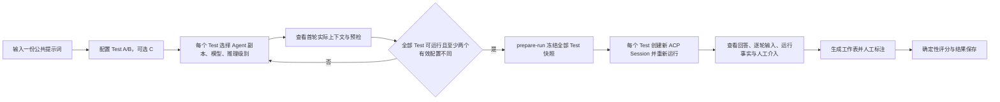

# Models Kindergarten 上下文实验完整重构 PRD

> 文档状态：方案评审稿  
> 生成日期：2026-08-18  
> 变更类型：存量能力系统性重构  
> 当前范围：单轮、2～3 个 Test、全部重新运行

## 1. 结论摘要

本次不再保留“Fresh / History 两种实验模式”，统一为一种单轮上下文实验：用户输入一份公共提示词，配置 2～3 个彼此隔离的 Test；每个 Test 独立选择 Agent 配置副本、ModelStudent 和推理级别，并全部创建新的实验 Session、重新请求模型。

实验页面继续复用正式 Agent 表单的系统提示、Built-in Tools、Skills、MCP 配置，但修改只作用于当前 Test 草稿，不修改已保存 Agent。Agent 的历史策略只读展示；由于当前实验是新 Session 的首轮，实际进入历史始终为 0，因此历史策略不参与差异判断，也不影响本次结果。长期记忆继续关闭且不展示。

实验快照成为唯一执行事实源。预览、正式运行和结果披露都从同一份 Test 快照解析模型、推理、Agent 策略与能力依赖；不再由页面、隐藏 Agent、默认模型和工作表生成器分别拼装事实。任何依赖缺失或能力不兼容都明确阻止运行，不静默换模型、降推理档位或删除 Tool / Skill / MCP。

## 2. 需求边界

### 2.1 本次必须完成

1. 每个 Test 独立配置 ModelStudent 和推理级别。
2. 每个已配置 Test 都重新运行；不复用历史回答、历史耗时或历史 Provider Input。
3. 公共用户提示词只有一份。
4. Test 继续复用正式 Agent 策略表单，导入已保存 Agent 后只复制，不回写 Agent。
5. 完整、只读展示首轮实际模型上下文及运行后逐模型轮上下文；历史正文和长期记忆除外。
6. 只读展示 Agent 的最近历史策略与本次实际历史条数，并解释为什么不影响当前实验。
7. 用不可变 Test 快照统一创建、预览、执行、标注与评分。
8. 解决工作表生成模型与记录模型不一致、权限/AskUser 人工介入不可追溯、指标缺失被按零处理等问题。
9. 旧版 Fresh / History 实验仍可读取，但不再按旧语义创建或继续运行。

### 2.2 明确不做

1. 不引入多轮用户对话实验。
2. 不把历史策略做成实验变量，不展示历史正文或历史裁剪策略可视化。
3. 不展示或接入长期记忆；Memory 继续为 `off`。
4. 不开发“具体哪个模块发生差异”的差异摘要或差异高亮。
5. 不引入 AgentVersion / AgentRevision。
6. 不引入 Workflow、DAG、Planner / Executor、自动评分模型、RAG 或多 Agent。
7. 不在上下文实验里配置模型上下文窗口；只读显示 ModelStudent 已生效的窗口能力与用量。
8. 不冻结 MCP 外部系统的实时业务数据；只冻结本次可见的能力声明与 generation。
9. 不在本需求中解决千问 8B 的结构化完成状态、Tool 错误循环或默认上下文窗口产品策略。
10. 不开发重跑、克隆实验、把旧实验转换成新实验或在终态实验内重置 Run；若存在相关入口或雏形，应删除。

## 3. 当前问题

### 3.1 产品语义冲突

- 当前合同把模型放在实验级，所有 lane 只能共用一个 ModelStudent，也没有 Test 级推理选择。
- 当前仍有 `history_turn` 和 `reuse_snapshot`；A 可以使用旧回答，B/C 使用当前运行，结果和速度缺乏可比性。
- Fresh Session 中历史为空，但历史配置仍能被编辑并被当成有效差异，用户会误以为它改变了结果。
- 从 Turn 进入实验时，页面把来源 Prompt、模型、Agent 策略和 A 结果混合成另一套特殊模式。

### 3.2 事实源冲突

- `ExperimentRecord` 保存策略，同时又创建隐藏 `experiment_policy` Agent 执行。
- Skill 卸载、MCP 删除或隐藏 Agent 变化可能让展示策略与实际运行能力漂移。
- Preview、Runtime 和 Provider serializer 尚未形成一个可验证的冻结输入合同。
- 工作表生成器可持有 Remote 启动时的默认 Provider，却按实验字段记录另一个 ModelStudent。

### 3.3 可信度与交互问题

- 浏览器端权限和 AskUser 交互没有形成结构化、逐 Test 的审计事实。
- 当前浏览器原生弹窗无法同时表达三个并行 Agent 信息流分别在等待什么。
- 部分 Runtime 指标缺失时可能以 0 补齐，0 与“无数据”混为一谈。
- 旧评分权重虽然确定性实现，但页面没有把规则版本和适用条件讲清楚。

## 4. 方案选择

| 方案 | 核心做法 | 优点 | 主要问题 | 结论 |
| --- | --- | --- | --- | --- |
| A. 在旧 Fresh / History 上补字段 | 保留旧模式，给 variant 增加模型和推理 | 改动局部 | 继续保留复用旧结果、双事实源和历史伪变量 | 不采用 |
| B. Snapshot-first V2 | 单一单轮模式；Test 快照统一预览、执行和结果 | 语义清晰，可分阶段迁移，仍复用正式 Runtime | 合同、存储和两端页面需要一起升级 | 采用 |
| C. 通用实验编排器 | 抽象任意轮次、任意步骤和自动裁判 | 扩展性高 | 超出 D2P-1，实质成为 Workflow / DAG | 不采用 |

选择 B。它解决当前所有直接矛盾，同时保留未来把“一个 Test 的单轮 Session”扩展为“一个 Test 的多轮 Session”的数据空间，但本次不实现多轮交互。

## 5. 核心产品规则

### 5.1 Experiment 与 Test

- 一个 Experiment 有一份 `promptText` 和 2～3 个 Test。
- 页面初始创建 A、B；可从当前 Test 克隆 C。
- A/B 初始配置完全相同，用户至少产生两个“实际有效配置”后才能运行。
- 每个 Test 包含：来源 Agent 引用、Agent 策略副本、ModelStudent、请求的推理级别。
- 导入 Agent 只替换当前 Test 的 Agent 策略副本，不改变该 Test 已选择的模型和推理级别。
- Test 标签、来源 Agent 名称、历史策略和长期记忆不构成有效差异。

### 5.2 有效差异判断

服务端根据预检后的 `effectiveConfigurationHash` 判断是否可运行。哈希包含：

- 精确 ModelStudent 与上游模型身份；
- 已解析的实际推理档位及原生参数；
- 最终系统指令；
- 本轮可见的 Tool Schema；
- Skill 目录与已冻结内容版本；
- MCP Tool / Resource 声明与 generation；
- 其他会改变首轮 ModelInput 的模型执行默认值。

哈希不包含：Test 标签、来源 Agent 展示信息、`historyPolicy`、`memoryPolicy=off`、预计 Token 展示值。

同一模型下“自动”与显式档位若最终解析为完全相同的原生参数，不算有效差异。页面不展示模块级差异，只在不能运行时给出通用说明：“至少两个 Test 的实际运行配置需要不同”。

### 5.3 历史与长期记忆

历史模块在每个 Test 中只读展示：

> Agent 历史策略：最近 N 个完整 Turn（只读）  
> 本次每个 Test 使用全新实验 Session，只运行首轮，实际进入历史为 0；此项仅帮助理解 Agent 配置，不影响本次实验结果。

若 Agent 配置为不带历史，则显示“Agent 历史策略：不带历史（只读）”，小字仍说明本次实际进入 0。

运行时仍保留这份历史策略作为 Agent 来源事实，但由于 Session 为空，ContextAssembler 的实际结果必须为 0 个历史 Turn。历史策略不进入有效差异哈希。长期记忆固定关闭，不出现在编辑表单、预览列表或结果正文中。

### 5.4 从已有 Turn 进入

`/context-lab?turnId=...` 不再创建 History 实验。它只是一个导入快捷入口：

1. 服务端读取来源 Turn 的用户提示、Agent 快照、ModelStudent 和实际推理档位。
2. 页面用这些事实初始化 A/B，标注“已从 Turn 导入”。
3. 公共提示词可编辑；编辑后保存最终文本，不改变来源 Turn。
4. 不读取来源 Turn 之前的历史，不复用来源回答。
5. A/B/C 全部创建新实验 Session 并重新运行。
6. `sourceTurnId` 只作为来源追溯字段，不参与 ModelInput 构造。

### 5.5 模型和推理级别

- 模型选择只列出状态为 Ready 的 ModelStudent。
- 推理选项来自该模型逐项体检后的 `ModelReasoningCapability`。
- 可调模型显示 `自动 / 快速 / 均衡 / 深入 / 极致` 中实际支持的选项。
- 固定模型显示只读“固定 · {档位}”，不伪造可选档位。
- 切换模型后，如果原推理选择不受支持，页面显式重置为“自动”并显示一次行内提示；服务端仍会再次验证。
- `auto` 在 prepare-run 时解析并冻结 `requestedProfile`、`resolvedProfile`、来源和原生参数。
- 不兼容时阻止运行，不静默降档。

### 5.6 Agent 与 ModelStudent 能力门禁

每个 Test 在预览和 prepare-run 两个阶段检查：

- 选择了任何 Tool / Skill Tool / MCP Tool 时，ModelStudent 必须支持实测 Tool Call。
- Reasoning 选择必须在该模型实测能力中。
- Skill Installation 必须 Ready，内容 digest 必须可读。
- MCP Installation 必须 Connected，所选 Tool / Resource 必须仍存在于同一 capability generation。
- ModelStudent 必须 Ready，Provider 配置仍可解析。
- Provider 的 Context Window 必须容纳首轮输入与保留输出预算。

页面可以展示不可运行的预览诊断，但“开始对比实验”必须禁用。错误列出缺失依赖或缺失能力，不自动关闭能力或替换模型。

## 6. 目标用户流程



## 7. 目标数据合同

以下是产品合同草图，字段名可在 TRD 中微调，但语义不可改变。

```ts
interface ExperimentDraftV2 {
  schemaVersion: 2;
  name: string;
  promptText: string;
  sourceRef?: { kind: "turn"; id: string };
  toolUseWasExpected: boolean;
  worksheetModelStudentId: string;
  tests: ExperimentTestDraftV2[];
}

interface ExperimentTestDraftV2 {
  testId: string;
  label: "A" | "B" | "C";
  sourceAgent: {
    agentId: string;
    name: string;
    updatedAt: string;
  };
  modelStudentId: string;
  reasoningProfile: "auto" | "fast" | "balanced" | "deep" | "max";
  policy: ExperimentContextPolicy;
}

interface ExperimentTestSnapshotV2 {
  snapshotId: string;
  testId: string;
  label: "A" | "B" | "C";
  sourceAgent: ExperimentTestDraftV2["sourceAgent"];
  policy: ExperimentContextPolicy;
  agentSnapshotHash: string;
  model: {
    modelStudentId: string;
    providerKind: string;
    model: string;
    capabilityHash: string;
    contextWindowTokens?: number;
  };
  reasoning: ResolvedReasoningSnapshot;
  dependencies: Array<{
    kind: "skill" | "mcp";
    id: string;
    generation?: number;
    contentHash: string;
  }>;
  runtimePrompt: { version: string; hash: string };
  firstRequestPreview: {
    contextHash: string;
    providerInputHash: string;
    estimatedTokens: number;
    actualHistoryTurns: 0;
  };
  effectiveConfigurationHash: string;
  frozenAt: string;
}

interface ExperimentRecordV2 {
  schemaVersion: 2;
  experimentId: string;
  ownerId: string;
  name: string;
  status: "draft" | "prepared" | "running" | "completed" |
    "partially_failed" | "failed" | "cancelled" | "interrupted";
  promptText: string;
  sourceRef?: { kind: "turn"; id: string };
  toolUseWasExpected: boolean;
  worksheetModelStudentId: string;
  tests: ExperimentTestDraftV2[];
  snapshots?: ExperimentTestSnapshotV2[];
  runs: ExperimentRunV2[];
  annotationWorksheet?: ExperimentAnnotationWorksheet;
  savedAt?: string;
  createdAt: string;
  updatedAt: string;
}
```

### 7.1 快照事实边界

- Draft 可编辑；`prepare-run` 成功后 Test 输入不可变。
- ExperimentRecord V2 是唯一执行事实源。
- 不再创建或读取普通 AgentRepository 中的隐藏 `experiment_policy` Agent。
- `purpose=experiment` Session 仍保存来源 `agentId` 用于追溯，但 Runtime 必须根据 `experimentRunRef` 读取冻结策略，不能读取当前 Agent。
- Agent 被编辑或删除不影响已 prepared 的 Experiment。
- Skill / MCP / Model 的 Secret、credentialRef 和 Provider 私有 continuation 不进入 ExperimentRecord。
- Skill 内容和 MCP 能力声明按 hash / generation 冻结；外部 MCP 系统返回的业务数据仍是运行时事实。

### 7.2 Run 事实

每个 Run 至少保存：

- Test 快照引用；
- 新建的 experiment Session ID 与 Turn ID；
- 实际模型、Provider、请求/解析后的推理档位；
- 每个模型轮次的 Context Summary、Provider Input hash / bytes、Tool Schema 与 capability generation；
- 当前轮 Skill 激活和 MCP Resource 读取形成的新增上下文；
- 回答、Tool 调用、权限决定、AskUser 问答、usage、stopReason、错误；
- 指标可用性，不用 0 代替缺失。

## 8. 上下文预览与披露规则

### 8.1 创建页首轮预览

预览与正式 Runtime 共用一个 `resolveExperimentModelInput` 路径，展示：

1. Agent 可编辑系统提示。
2. Runtime 追加后的完整最终系统指令，并按来源标出固定协议版本。
3. 当前模型可见的 Built-in / Skill / MCP Tool Schema。
4. 首轮 Skill 目录；完整 SKILL.md 尚未激活时明确显示“首轮仅注入索引”。
5. MCP Resource 目录和预加载资源正文。
6. 公共用户提示词。
7. 请求推理档位、实际解析档位与脱敏后的原生参数。
8. 目标 Provider 的完整首轮序列化输入与 hash / bytes。
9. ModelStudent 上下文窗口、首轮估算 Token 和余量。
10. 历史策略只读摘要与 `actualHistoryTurns=0`。

不展示：历史消息正文、长期记忆、Secret、credentialRef、非用户可解释的 Provider 私有 continuation 原文。

### 8.2 结果页逐轮披露

Tool 结果可能激活 Skill 正文或加载 MCP Resource，因此结果页按模型轮次展示真实 Context Summary。每轮只展示 Runtime 已保存的事实，不根据最终 Agent 配置反推。若某段因安全边界不可披露，显示类型、大小、hash 和原因，不伪造正文。

### 8.3 Preview 与运行一致性

- prepare-run 重新计算一次 Preview，防止 250ms 页面预览与运行之间依赖变化。
- 未变化的 Test，首模型请求的 `providerInputHash` 必须等于冻结 Preview 的 hash。
- 若 Runtime 产生不可避免的动态字段，序列化器先规范化这些字段再比较，并记录规范化版本。
- 任何 hash 不一致都将 Run 标记为 `input_mismatch` 并阻止评分，不把它当成普通模型结果。

## 9. 执行与人工介入

### 9.1 执行

- `prepare-run` 原子冻结全部 Test 并创建 pending Run；使用 Idempotency-Key。
- evaluation-web 使用一个 ACP connection owner，为每个 Test 建立一个新的 experiment Session，再发送同一公共 Prompt。
- 所有存在的 Test 都运行；没有 `reuse_snapshot` 分支。
- Test 可并行启动；排队时间与模型实际执行时间分开记录。
- 一个 Test 失败不自动取消其他 Test，整体可进入 `partially_failed`。
- 取消只取消活动 Session，已完成事实保留。
- Remote 重启后根据 Session / Turn 事实恢复为 completed 或 interrupted。

### 9.2 Permission 与 AskUser

- Built-in Tool 和 MCP Tool 继续遵守各 Test 冻结的 `allow / ask / deny`。
- `ask` 必须通过 ACP permission request 显示 Test 标签、Tool 与参数摘要；用户真实选择后才能继续。
- `ask_user` 必须展示完整 ACP elicitation 表单；不再用单个字符串代填第一个字段。
- 每个 Agent 信息流顶部都有独立的人工交互区，顺序固定为：权限/回答弹层 → 模型与推理板块 → 现有评分条 → Agent 信息流正文。
- 权限或 AskUser 到来时，只在发起请求的 Test 列顶部弹出 lane-local dialog；宽度必须与当前 Agent 信息流外部盒子一致，不使用浏览器原生弹窗或跨三列的全局弹窗。
- 三个 Test 同时请求介入时，三列可以同时各自显示弹层，互不遮挡、互不阻塞用户查看其他列；同一 Test 内多个请求才按到达顺序排队。
- 运行前模型与推理板块可编辑；Run prepared 后在信息流顶部保留为只读冻结事实。不得自动选择 `allow_once` 或提交预置答案。
- 每次介入保存 Test、请求摘要、选择、操作者、时间和结果，不保存 Secret。
- 发生人工介入的 Test 在结果与评分页显示“含人工介入”。比较仍可完成，但不得声称它是完全无人干预的严格对照。

## 10. 工作表、人工标注与评分

### 10.1 工作表模型

每个 Experiment 单独保存 `worksheetModelStudentId`。它不是被测 Test：

- 创建页“评测辅助”区域显示并可选择一个 Ready ModelStudent，默认使用系统推荐模型。
- 工作表调用固定 `reasoning=disabled`、`tools=[]`。
- `generator.modelStudentId / providerKind / model` 必须来自同一个实际 Provider 对象。
- 生成器只整理公共需求、工作流和原文分段，不产生 verdict、分数、排名或 winner。
- 若工作表模型不可用，回答事实仍可查看；用户更换工作表模型后重新生成，并记录新的 generator。

### 10.2 Runtime 指标

- `0` 只表示真实测量值为 0；缺失使用 `unavailable` 或字段缺席并附原因。
- 必需执行指标不完整时，执行维度显示“不可计算”，不生成总分、排名或 winner。
- 首 Token 耗时、模型执行耗时和基础设施排队时间分开展示。
- 跨不同 Provider / 硬件的耗时标为“本次观测值”，不宣称为纯模型速度基准。

### 10.3 评分规则

- 继续使用理解、规划、输出三项人工标注 + Runtime 执行分。
- 当前四维各 25% 的规则保留，但升级为显式、可见的版本化 rubric；本次不重新设计权重。
- 分数只从完整人工选择与可用 Runtime 指标确定性计算。
- 任一人工维度未完成或关键执行指标不可用时，Scorecard 为 draft。
- 页面展示 rubric ID、版本、权重和每个执行分组件，避免把规则当成模型判断。

## 11. 终态实验与旧实验

- Experiment 一旦进入 completed、partially_failed、failed、cancelled 或 interrupted，就是只读终态。
- 不提供“重跑”“再测一次”“克隆为新实验”“转换为 V2”或重置 Run 的入口与 API。
- 用户若要做新的实验，只能从 Context Lab 新建并重新配置，不能从旧结果自动复制。
- V1 Fresh / History 记录只读保留；原始回答、运行事实、工作表和评分按旧语义展示。
- 删除当前 `/variants/:variantId/reuse-snapshot` 客户端调用、服务端路由和执行分支；它属于被移除的 History 实验语义，不保留为重跑雏形。
- 旧 `experiment-rerun` 待办按最新产品决定关闭，不进入开发队列。

## 12. API 与运行边界

| Method | Path | V2 语义 |
| --- | --- | --- |
| POST | `/context-previews` | 输入一个 Test 草稿，返回预检、首轮真实 ModelInput 与有效配置 hash |
| POST | `/experiments` | 创建 V2 draft，不创建隐藏 Agent 或 Session |
| PUT | `/experiments/:id` | 只允许更新 draft；prepared 后拒绝 |
| POST | `/experiments/:id/prepare-run` | 原子冻结全部 Test、创建 Run；使用 Idempotency-Key |
| GET | `/experiments/:id` | 返回 V1 legacy 或 V2 记录 |
| POST | `/experiments/:id/cancel` | 标记取消并返回活动 Session 引用，由 ACP owner 发送 cancel |
| POST | `/experiments/:id/annotation-worksheet` | 用记录中的工作表模型生成或显式重生成 |
| PUT | `/experiments/:id/annotations` | 保存人工事实并确定性重算评分 |

Browser 与 Remote 的模型执行仍只走官方 ACP。Control API 只保存草稿、预检、冻结、查询和评分事实，不直接发起模型 Prompt。Experiment Session 继续使用 namespaced `experimentRunRef`；Remote 从该引用解析精确 Test 快照、模型和推理覆盖。

## 13. 数据迁移与兼容

### 13.1 存储策略

- Experiment Store envelope 升级为 schemaVersion 2，record 支持 `LegacyExperimentRecordV1 | ExperimentRecordV2` 联合类型。
- 一次性迁移只升级 Store envelope，不改写 V1 record 内容；迁移前创建带时间戳的完整备份。
- V1 记录和 V1 Scorecard 只读展示，并标记“旧版实验语义”。
- 新 API 只创建 V2。
- 不在首轮迁移中删除旧 `experiment_policy` Agent；它们继续从普通 Agent 列表隐藏。确认无回滚需要后再单独清理。

### 13.2 旧行为处理

| 旧能力 | V2 行为 |
| --- | --- |
| `mode=fresh_prompt` | 转为普通 V2 单轮实验概念 |
| `mode=history_turn` | 只读 legacy；不提供转换或继续运行 |
| `reuse_snapshot` | V2 删除，不提供运行入口 |
| 实验级 `modelStudentId` | 仅按旧记录原样展示；V2 新实验由每个 Test 独立选择 |
| 隐藏实验 Agent | V2 不创建；V1 记录继续只读 |
| 当前默认 Provider 工作表 | V2 必须解析 `worksheetModelStudentId` |

### 13.3 回滚

1. 关闭 Context Experiment V2 feature flag，禁止创建/prepare V2。
2. 停止 Remote 写入，保存当前 V2 Store 供排障。
3. 恢复迁移前 Experiment / Scorecard 文件备份。
4. 部署旧二进制并运行 V1 读取回归。
5. 已创建的 V2 experiment Session 默认隐藏，不删除；确认后再处理。

## 14. 影响分析

### 14.1 直接影响

| 区域 | 变更类型 | 风险 | 说明 |
| --- | --- | --- | --- |
| `packages/contracts/src/experiments.ts` | 重构 | 高 | V2 Draft/Test/Snapshot/Run/Legacy union、严格 parser、rubric v2 |
| `apps/web/src/product/ContextLabPage.tsx` | 重构 | 高 | Test 级模型/推理、导入语义、只读历史、预检与 prepare |
| `apps/web/src/product/context-lab-state.ts` | 重构 | 中 | A/B/C 克隆、模型/推理状态、有效差异与来源 |
| `apps/web/src/product/AgentPolicyFields.tsx` | 扩展 | 中 | 支持实验模式下历史只读说明；正式 Agent 页仍可编辑 |
| `apps/web/src/product/ContextPreviewPanel.tsx` | 扩展 | 中 | 首轮完整上下文、推理与 Provider Input；隐藏历史正文/Memory |
| `apps/remote/src/experiments/experiment-service.ts` | 重构 | 高 | draft→prepare、快照事实源、legacy 读取；删除 reuse 分支 |
| `apps/remote/src/experiments/experiment-repository.ts` | 重构 | 高 | Store V2 迁移与 V1/V2 联合读取 |
| `apps/remote/src/experiments/experiment-routes.ts` | 修改 | 高 | 增加 prepare；删除 reuse-snapshot，不新增 clone/rerun |
| `apps/remote/src/experiments/context-preview-service.ts` | 重构 | 高 | 与正式 Runtime 共用 Test 解析和 ModelInput 构造 |
| `apps/remote/src/experiments/annotation-worksheet-generator.ts` | 修改 | 高 | 按 worksheetModelStudentId 解析实际 Provider |
| `apps/remote/src/session/session-binding-service.ts` | 修改 | 高 | experiment binding 返回精确 Test 模型/推理/快照引用，不依赖当前 Agent |
| `apps/remote/src/capability/runtime-capability-resolver.ts` | 扩展 | 高 | 支持从 ExperimentTestSnapshot 解析，同一 ToolRuntime 主链 |
| `apps/evaluation-web/src/experiment-acp-client.ts` | 重构 | 高 | Test 运行、lane-local permission / elicitation、介入事实 |
| `apps/evaluation-web/src/experiment/ExperimentEvaluationPage.tsx` | 重构 | 高 | 每列模型/推理板块、列内交互弹层、逐轮上下文、legacy、指标不可用 |

### 14.2 间接影响

| 区域 | 影响 |
| --- | --- |
| Session / Turn contracts | Experiment Session 需要冻结 reasoning override 与 snapshot ref；普通聊天合同不变 |
| ModelStudent Catalog | 提供精确 Provider 解析、能力 hash 和工作表模型解析 |
| AgentService | V2 不再创建隐藏 Agent；普通 Agent CRUD 不变 |
| Skill / MCP 管理 | 删除或刷新前需能报告引用中的实验快照，但不允许反向改写快照 |
| Evaluation exporter | 补指标可用性、排队时间、人工介入与逐轮输入 hash |
| “我的实验”列表 | 区分 legacy / V2；终态实验只读，无重跑状态 |
| 文档 | 更新 Architecture、Contracts、Reasoning Policy、Validation Audit 与旧 TRD 的 History 结论 |

## 15. 分阶段实施

### Phase 0：冻结语义与合同

- 范围：更新正式需求、合同、状态机、错误码和 legacy 策略；为 V2 DTO 写严格 parser 测试。
- 风险：新旧文档继续冲突。
- 回滚：仅文档和未接入合同，可直接撤回。
- 完成标准：不存在 `history_turn` / `reuse_snapshot` 的 V2 创建路径；每个 Test 有模型和推理字段。

### Phase 1：Snapshot-first Remote 与存储

- 范围：Store V2 迁移、draft / prepare、快照 resolver、能力门禁、去除 V2 隐藏 Agent、删除 reuse-snapshot。
- 风险：迁移后旧记录无法读取；实验 binding 错读当前 Agent。
- 回滚：feature flag + Store 备份。
- 完成标准：删除来源 Agent 后，prepared V2 仍能从快照解析；依赖缺失明确阻止。

### Phase 2：Context Lab 创建体验

- 范围：每 Test 模型/推理、共享 Agent 表单、只读历史、小字说明、完整首轮预览、Turn 导入新语义。
- 风险：预览与正式请求漂移；模型切换后保留无效推理值。
- 回滚：V2 创建入口 feature flag。
- 完成标准：A/B/C 均可独立配置；首轮 Preview hash 可在 Run 首请求验证。

### Phase 3：真实执行、介入和评测

- 范围：全 Test fresh run、每个 Agent 信息流顶部的 lane-local 介入弹层、模型/推理板块、工作表模型解析、指标可用性、rubric v2、结果披露。
- 风险：并发请求和浏览器刷新造成 pending ACP request；指标升级影响总分。
- 回滚：保留回答事实，禁用评分/重生成，不回写旧 Scorecard。
- 完成标准：无自动授权/代答；非默认工作表模型的真实 Provider 可追溯；缺指标不补 0。

### Phase 4：Legacy 与系统验收

- 范围：legacy 只读页面、删除所有重跑/转换入口、完整 E2E、重启/取消/partial failure、文档收口。
- 风险：旧 History 记录被当成 V2 公平结果；残留 reuse 路由仍可触发旧行为。
- 回滚：V2 feature flag 关闭，legacy 继续只读。
- 完成标准：终态记录没有任何重跑/clone/转换入口；系统验收矩阵全部通过。

## 16. 系统验收门禁

| 场景 | 必须观察到的结果 |
| --- | --- |
| A/B 初始状态 | Agent、模型、推理和策略一致；运行禁用 |
| Test 模型不同 | 两个 Test 分别绑定所选 ModelStudent，Session/Turn 事实一致 |
| Test 推理不同 | requested / resolved / native 三层可追溯；不支持时阻止 |
| 固定推理模型 | UI 只读展示固定档位，不显示虚假选择 |
| 三个 Test | A/B/C 都创建新 Session、都产生新 Turn；无 reuse 请求 |
| Turn 导入 | 只复制来源事实；不带历史、不复用回答，Prompt 可编辑 |
| 历史只读 | 显示 Agent 最近 N Turn 策略和实际 0；不能编辑，不计有效差异 |
| 完整系统上下文 | 最终系统指令包含全部 Runtime 固定协议；Tools/Skills/MCP 与首轮 Provider Input 可读 |
| 后续模型轮 | 激活 Skill / MCP Resource 后，新增上下文只从真实 Run facts 展示 |
| Preview 一致性 | 冻结 Preview 与首模型请求 hash 一致；不一致时不评分 |
| Agent 删除 | prepared 实验不读取当前 Agent，仍可运行 |
| Skill/MCP 缺失 | 阻止并报告精确依赖；不静默删除绑定 |
| Permission ask | 发起请求的 Agent 列顶部出现同宽弹层；其他列不被全局弹窗遮挡；选择写入介入事实 |
| AskUser 表单 | 发起请求的 Agent 列顶部展示完整 schema；不自动填第一个字段 |
| 三列同时介入 | 三个 lane-local dialog 可同时存在；同一列内部请求按顺序处理 |
| 模型板块位置 | 每列模型与推理板块位于现有评分条上方；运行后只读显示冻结事实 |
| 工作表模型 | generator 三个身份字段与实际调用 Provider 一致 |
| 指标缺失 | 显示不可用，不显示 0，不生成总分/winner |
| 部分失败 | 成功 Test 事实保留，整体 partially_failed，不伪造完整比较 |
| 取消与重启 | 活动 Run 可取消；Remote 重启后按 Session/Turn 恢复或 interrupted |
| 终态实验 | 没有重跑、clone、转换或重置 Run 的入口/API |
| Legacy | V1 可读且有旧版标识，不能走旧 reuse、转换或继续运行 |
| Secret | 浏览器、日志、Experiment、Trace 中均不存在凭据或 credentialRef |

## 17. 测试策略

### 17.1 Contracts

- V2 Draft/Test/Snapshot 的严格 parse、未知字段和边界数量测试。
- 每 Test reasoning 与 ModelStudent 组合测试。
- V1 / V2 union 读取和 Store envelope 迁移测试。
- effectiveConfigurationHash 排除历史/Memory、包含真实模型输入变量的测试。

### 17.2 Remote 单元与集成

- preview 与正式首请求共用构造函数并验证 hash。
- source Agent 编辑/删除后快照不变。
- Skill/MCP generation 漂移、模型 unavailable、Tool Call 不兼容门禁。
- prepare-run 幂等、双击、partial failure、cancel、restart 恢复。
- 非默认 worksheet model 真实调用和 generator facts。
- Runtime 指标 unavailable 与 rubric draft 行为。

### 17.3 Web

- A/B/C 克隆、导入 Agent 不改变模型/推理、删除 C。
- 模型切换与推理选项过滤/提示。
- 每个 Agent 列的模型/推理板块位于评分条上方，运行后变为只读。
- Permission / AskUser 在对应 Agent 列顶部显示同宽 dialog；三列同时介入互不遮挡。
- 历史只读文案和 actual 0。
- 完整 Context Preview 类别、历史正文/Memory/Secret 不出现。
- 无差异时通用禁用提示；不渲染模块差异摘要。

### 17.4 Cross-app E2E

- 创建 → Preview → prepare → 三 Test ACP run → 工作表 → 人工标注 → scorecard。
- Turn 导入 → 修改 Prompt → 所有 Test fresh run。
- Permission / elicitation 在各自 Agent 列独立呈现、同列排队并可刷新恢复。
- V1 legacy 只读；reuse、转换和重跑入口均不存在。

## 18. 待办页覆盖矩阵

| 待办 ID | 本方案处置 |
| --- | --- |
| `experiment-rerun` | 最新决定为不开发；删除任何重跑/clone/转换雏形，终态实验只读 |
| `history-experiment-source` | V2 删除 History 运行模式；Turn 仅作导入来源，全部 fresh run |
| `context-preview-truth` | Preview 与 Runtime 共用解析和 serializer，并以 hash 验证 |
| `fresh-history-variable` | 历史只读、实际 0、不进入有效差异 |
| `experiment-snapshot` | Experiment Test Snapshot 成为唯一事实源；V2 不创建隐藏 Agent |
| `worksheet-provider` | 独立、显式 worksheetModelStudentId；generator 记录真实调用对象 |
| `agent-model-gate` | 每 Test 预检 Model / Agent 能力组合，失败阻止且不降级 |
| `fallback-audit` 中实验项 | 指标缺失不用 0；无隐式模型/推理/能力替换；评分规则版本化可见 |
| `experiment-permission-form-policy` | 每个 Agent 信息流顶部使用同宽 lane-local dialog，并记录事实；不自动授权或代答 |
| `ollama-raw-observability` | 结果审计只保存脱敏解析事实/hash；完整私密原文不进入实验展示 |
| `experiment-systemic-acceptance` | 第 16 节形成创建→预览→执行→标注→评分→只读归档门禁 |
| `qwen-context-window` | 作为 ModelStudent 只读运行事实展示；不成为 Test 配置项 |
| `qwen-structured-state` | 不属于本重构；实验可用于验证该能力，但不在本次实现 Runtime 状态机 |

## 19. 成功标准

- 100% 的 V2 Run 都能追溯到精确 Test 快照、ModelStudent 和 ResolvedReasoningSnapshot。
- 所有 Test 都有独立的新 Session / Turn；V2 中 `reuse_snapshot` 出现次数为 0。
- 未变化的 Test 首请求与冻结 Preview hash 一致。
- 历史策略展示与实际历史条数分开；首轮实际值始终为 0。
- V2 不产生新的 `experiment_policy` Agent。
- 无自动 permission 选择、无自动 AskUser 代答、无缺指标补 0。
- 终态 V1/V2 实验均没有重跑、clone、转换或重置 Run 的入口与 API。
- V1 记录可读、可追溯、不会被 V2 写入路径改写。

## 20. 参考现状

- 待办来源：`mk_todo_v2.html` 中 experiment-rerun、History、Preview、Snapshot、Worksheet、能力门禁、Fallback、Permission 与系统验收条目。
- 当前合同：`packages/contracts/src/experiments.ts`。
- 当前页面：`apps/web/src/product/ContextLabPage.tsx`、`apps/evaluation-web/src/experiment/ExperimentEvaluationPage.tsx`。
- 当前执行：`apps/remote/src/experiments/experiment-service.ts`、`apps/remote/src/session/session-binding-service.ts`。
- 当前架构边界：`AGENTS.md`、`docs/ARCHITECTURE.md`、`docs/DEMO_TO_PRODUCTION_CONTRACTS.md`、`docs/REASONING_POLICY.md`。
