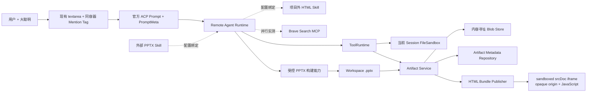
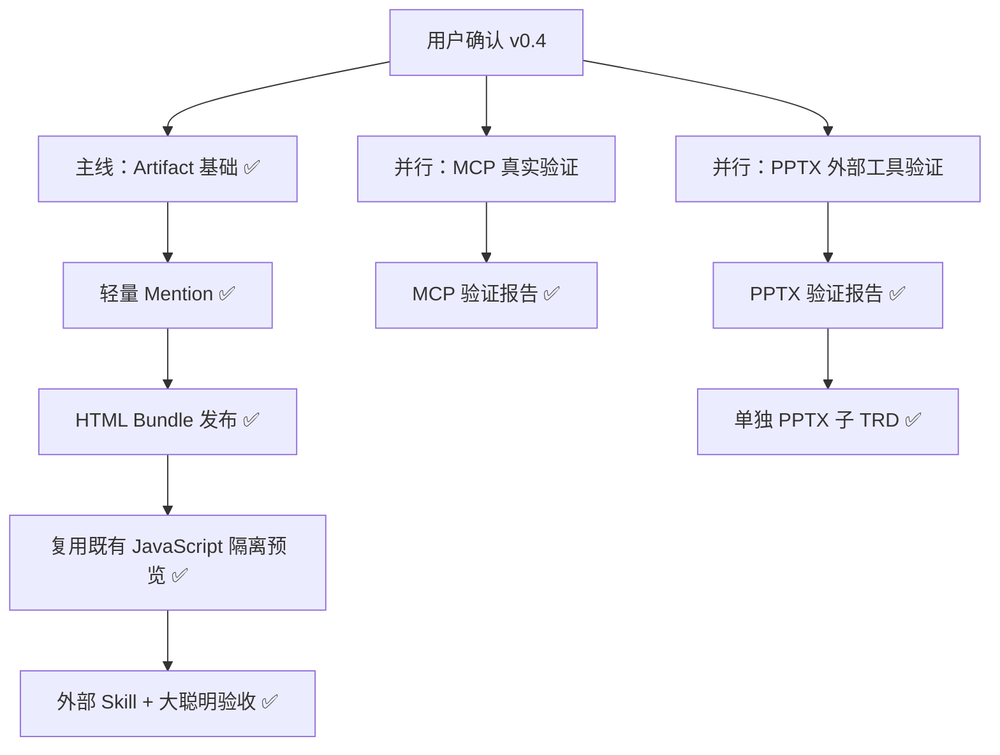

# MK 产物、Mention 与 HTML/PPTX 链路升级（含 MCP 能力预研）— TRD

> 版本：1.0（实施记录）
> 日期：2026-08-18
> 状态：Artifact、Mention、HTML 主链已完成验收；PPTX 技术链路已实现，等待外部 Skill + 大聪明配置化验收
> 关联讨论：`01a00dc2-58df-7122-b0ac-981216ae1ba1`、`01a00e17-dbbc-7f23-8647-5d56edb8b982`
> 实施边界：PPTX 增加通用构建、普通 Artifact 发布、浏览器静态预览和按需动画播放能力；不内置 Skill、不创建默认 PPT Agent。

---

## 1. 概要

首轮主线完成通用 Artifact、轻量 Artifact Mention 和允许 JavaScript 动效的 HTML 生成/预览。外部 PPTX 工具验证完成后，后续阶段增加受控 PptxGenJS 构建能力，并复用普通文件 Artifact 完成发布和下载；远程 MCP 继续保持配置化接入与独立验证。

项目只提供通用技术能力，不内置 HTML/PPT/Imagegen 等业务 Skill，不内置 MCP Server，不创建默认 HTML/PPT Agent。主线完成后，通过 MK 配置外部 Skill、远程 MCP 和 Agent，并且只使用“大聪明”做模型验收。

### 1.1 本轮技术目标

- 新增 owner-scoped Artifact Store，支持普通文件与 HTML Bundle 的发布、查询、下载、归档和恢复。
- Blob 采用内容寻址，同一内容只保存一次；Mention 既有 Artifact 时可以直接读取并复用既有 Blob。
- 保留当前 `textarea`，通过 `@` 搜索和 Composer 输入区域内的 Tag 标签实现 Mention，不开发 Composer Editor。
- Prompt、Session、`load`、`resume` 都能携带稳定的 Artifact ID，不用文件名或文本位置判断身份。
- 跑通 HTML/CSS/JavaScript/图片/字体等 Bundle 资源的生成、发布和隔离预览，JavaScript 动效可运行。
- 构建 HTML 时不增加单独的“构建并发布”确认框。
- 支持 Agent 配置受控 PPTX 构建能力，将当前 Workspace 中的 PptxGenJS 源码生成标准 `.pptx`，再由通用 Artifact 显式发布。
- 支持在 Session 文件面板直接静态预览 `.pptx`；已发布 Artifact 详情可按需使用本机 ONLYOFFICE 动画播放，并保留原文件下载。
- 所有新增协议行为都有测试，不破坏 ACP、Session、ToolRuntime 和 FileSandbox 既有不变量。

### 1.2 并行验证结果

- MCP 已验证连接、能力发现、ToolRuntime、Rich Content 和模型 Tool 选择；真实 Brave 搜索因凭据/网络缺失保持“未验证”。
- PPTX 已用真实外部 Skill/工具链和大聪明生成、渲染、检查可编辑文件；实测差异已经形成独立 PPTX 子 TRD。

### 1.3 非目标

- 不创建或内置 PPT Agent；不为预览在服务端主动转换 PDF、逐页图片或检查报告。
- 不强制一次 PPT 任务只能产生一个 Artifact，也不拦截用户或 Skill 生成其他文件。
- PPTX 构建能力只生成调用方指定的 `.pptx`，不主动生成附属文件；这不是“禁止任务出现其他文件”的运行时规则。
- Mention 既有图片时不强制禁止生成新图片；“优先复用”是提示词和验收期望，不是拦截器。
- 不开发 `contenteditable`、富文本 AST、行内 Mention node、光标映射或隐藏 markup 编辑器。
- 不内置 Skill、MCP Server、默认 Agent、固定 MCP URL 或演示数据。
- 不做 Skill 工具名动态映射；外部 Skill 使用能力描述，模型依据当前实际 Tool 描述选择工具。
- 不支持 MCP `AudioContent` 产物化。
- 不做旧 FileReference/旧对话迁移；旧测试对话已经删除。
- 不实现取消后暂存下一条 Prompt；该想法只保留在低优先级待办。
- 不自动重试；需要重试时由用户点击手动重试按钮。
- 不检查或阻断 HTML 外链、CDN 字体、外部图片和脚本是否自包含，避免首版误判。
- 不增加 Workflow/DAG、Planner/Executor、Runtime Event Store、长期记忆、RAG 或产品内多 Agent。

---

## 2. 本轮确认后的产品语义

### 2.1 PPTX 与其他产物

“PPT 最终只发布一个 `.pptx`”只作为典型目标场景，不作为程序级排他规则：

- PPTX 技术链路生成指定 `.pptx`，并复用普通文件 Artifact 成为可下载产物。
- 不新增 PPTX 持久化 Artifact 类型或 Artifact Group；普通文件 Artifact 通过预览响应声明 `pptx` 展示方式。
- 不因为当前 Turn 的目标是 PPT 就拒绝其他文件、删除其他 Artifact，或阻止模型生成新的图片。
- 如果用户、外部 Skill 或普通 Artifact 发布流程明确产生其他文件，通用 Artifact 能力仍可处理；是否发布由显式调用决定。

### 2.2 Mention 与 Blob 复用

Mention 表示“用户明确选择了一个自己已有的 Artifact 地址”，不是一句普通文本，也不是强制模型必须使用的指令：

- Remote 使用 `artifactId` 做 owner 校验并解析 `artifact://<artifactId>`。
- 读取的是 Artifact Blob Store，不读取来源 Session 的 Workspace。
- 内容寻址 Blob Store 以 SHA-256 去重；HTML Bundle 再次引用同一图片时，Manifest 指向同一 Blob，不复制内容，也不重新生成。
- 模型可根据任务判断 Mention 是否相关；用户要求新版本、新素材或 Mention 不适用时，可以生成新内容。
- 系统不通过“检测到 Mention 就禁用图片生成工具”来强制复用。

### 2.3 系统提示词语义

Runtime 增加稳定的平台语义，不增加工具别名映射：

```text
用户本轮可能明确引用已有 Artifact。每项引用都包含稳定的 artifactId 和只读 artifact:// 地址。
这些内容是用户已经拥有、可以直接读取或复用的产物；当它适合当前任务时优先复用，
不要仅因为存在生成工具就重复生成。若用户明确要求新版本、新素材，或引用不适用，可以生成新内容。
不要猜测文件名对应哪个产物，也不要尝试读取其他用户或其他 Session 的 Workspace。
```

这段语义只解释 Mention 是什么，不写死 `ask_user` 等外部 Skill 工具名，也不根据 Agent 动态补工具名。

---

## 3. 重新调研结论

### 3.1 textarea 可以保留，同时提供 Tag 标签效果

当前 `Composer.tsx` 是受控 `textarea`，`PromptMeta` 只有 `turnId`。本轮既要保留这个简单输入模型，也要让用户看到明确的 Mention Tag，而不是普通附件列表。

已核对 `/Users/bones/develop/JoyCode-team-studio` 的两套实现：

- `src/aiDesign/components/ChatInput/index.tsx` 把已选项作为 `.ai-chat-input-mention-chip` 渲染在输入组件同一个边框外壳内，标签状态与文本值分开保存。这种视觉和状态设计适合 MK。
- `src/aiDesign/components/ChatInputBase/index.tsx` 把标签真正混排在光标位置，但它依赖 `contenteditable`、Range、零宽字符和 DOM/State 同步，不属于本轮采用方案。
- `react-mentions` 也需要保存行内 markup 和文本索引；本轮没有必要引入。[react-mentions](https://github.com/signavio/react-mentions)
- Slack 的消息格式把稳定 ID 与展示名分开，说明 Tag 外观和 Mention 身份应该分层。[Slack mention formatting](https://docs.slack.dev/messaging/formatting-message-text/#mentioning-users)

本方案采用“textarea + 同容器 Tag”实现：

1. 用户在普通 textarea 中输入 `@`，弹出 Artifact 搜索浮层。
2. 选中后，在 Composer 的同一个边框和背景容器内、textarea 之前显示深色 Mention Tag；Tag 带类型图标、名称、省略号和删除按钮。
3. Tag 采用 flex 换行，多个 Mention 仍表现为标签组；视觉上属于输入框内容，而不是输入框外的附件栏。
4. textarea 仍只保存普通文本，Tag 不能进入光标、不能被文本选区拆开，也不维护行内字符位置。
5. 用户在正文中删除可读的 `@名称` 不会暗中删除 Tag；删除引用必须点击 Tag 删除按钮，避免文本解析误删。
6. 发送时调用 `onSend(text, artifactMentions)`，身份只存在结构化 Meta 中。
7. 历史消息在正文附近显示只读 Mention Tag，不恢复富文本节点。
8. 同名 Artifact 通过来源 Session、时间和短 ID 区分；文件名不参与授权或身份判断。

因此可以实现用户要求的 Mention Tag 样式，同时不引入 `react-mentions`、Lexical 或新的 Composer Editor。

### 3.2 外部 MCP Server 独立实测结论

并行验证已完成。调研代码和证据不进入 MK 仓库，完整证据见外部目录中的 [`远程MCP能力验证报告.md`](</Users/bones/Documents/Codex/2026-08-18/Models-Kindergarten-产物链路调研/MCP/远程MCP能力验证报告.md>)：

- 使用官方 MCP Client 直接连接 Everything Server，不经过 MK：能力发现、`ImageContent`、Embedded blob、静态 Resource 和 Tool 返回后的动态 `resource_link` 读取全部通过。
- 在 Everything 前增加独立 Bearer 网关模拟远程鉴权：无 Token 返回 401，本地合成 Token 可完成完整 MCP 调用；再通过 `192.168.1.3` 私网地址直连同一网关，完整调用同样通过。该 Token 不是 Brave API Key；这里只说明 Bearer 与私网部署在 MCP 协议层可行。
- Brave Search MCP 2.1.0 实际发现 `brave_web_search`、`brave_image_search`、`brave_llm_context` 等 8 个 Tool。大聪明在网页、图片、LLM 上下文三个场景中 3/3 选对工具，参数全部通过 Schema，无需 Runtime 工具名映射补丁。
- 当前环境无 Brave API Key，所以真实搜索质量、图片热链、MIME、重定向和时效没有得到验证。网络超时已定位为 Node 22 不继承 macOS 系统代理；显式走 `127.0.0.1:7892` 可到达 Brave API。图片合同只有 URL、尺寸、confidence 和 `page_fetched`，URL 不能冒充 Blob。
- MK 当前对动态 Resource、Bearer/Header Secret 和私网地址的限制只作为后续开发计划输入，不再计入外部 MCP Server 能力验收结果。

MCP 不内置、不创建默认配置；以上未完成项不阻塞 Artifact/HTML 主链。

### 3.3 外部 PPTX 工具链实测结论

并行验证已完成。生成脚本、模型 Trace、PPTX/PDF 和逐页图片不进入 MK 仓库，完整证据见外部目录中的 [`PPTX外部工具能力验证报告.md`](</Users/bones/Documents/Codex/2026-08-18/Models-Kindergarten-产物链路调研/PPTX/PPTX外部工具能力验证报告.md>)：

- 项目外 PPTX Skill + 大聪明 `gpt-5.5 deep` + PptxGenJS 4.0.1 可以生成、修订并渲染真实 `.pptx`。
- 最终样本为 4 页、342,159 bytes，包含 91 个可编辑对象、原生 Chart/Workbook、图片、讲者备注和 Slide Master；LibreOffice/Poppler 渲染和 `python-pptx` 编辑后复验均通过。
- PDF、逐页图和报告只是验证材料，没有聚合或发布为产品 Artifact；`.pptx` 可直接使用普通文件 Artifact。
- 本次使用独立受限验证工具，不是 MK 内 Agent Tool 链；Mention Blob 复用、MK 内工具选择、模型直接观看逐页图仍未闭环。
- 当前 `ProcessSandbox` 仅支持 macOS，`markitdown`/`defusedxml` 未安装，云端 Linux 还需要固定构建 Worker、中文字体和依赖。

这些差异触发了独立的外部文档 [`PPTX生成链路子方案-trd.md`](</Users/bones/Documents/Codex/2026-08-18/Models-Kindergarten-产物链路调研/PPTX/PPTX生成链路子方案-trd.md>)；后续实现继续保持外部 Skill 不进入项目，并按最新讨论删除附属文件逻辑。

---

## 4. 现状与约束

### 4.1 现有能力

| 位置 | 当前状态 | 本轮影响 |
|---|---|---|
| `apps/web/src/components/composer/Composer.tsx` | 普通 React `textarea` | 在同一 Composer 外壳内增加搜索浮层和 Mention Tag，不替换编辑器 |
| `packages/contracts/src/index.ts` | `PromptMeta` 已支持 `operationId` 和 Artifact Mention ID | 协议扩展已落地并有解析测试 |
| `apps/remote/src/files/file-reference-service.ts` | FileReference 已有 owner、session、Blob 和哈希 | 新建 Artifact 模型，不迁移旧数据 |
| `apps/remote/src/capability/runtime-capability-resolver.ts` | 每个 Session 使用独立 FileSandbox | 保持 Workspace 不能跨 Session 读 |
| `apps/remote/src/tools/tool-registry.ts` | Agent 可配置 `allow/ask/deny`；命令工具实现保留但在 Registry 出口集中短路 | 模型 Schema 和 Agent 能力配置均不暴露命令工具；`write_file` 默认 allow |
| `apps/remote/src/mcp/` | 支持 STDIO/Streamable HTTP，管理入口仅无鉴权 HTTP | 先实测具体 Server，再补后续设计 |
| `HtmlPreviewFrame` | 已支持 `sandbox="allow-scripts"` 的不透明源预览 | 用户已有优化保持不变，本轮只复用，不二次修改 |

### 4.2 必须保持的不变量

- Browser 与 Remote 之间只使用官方 ACP，一个页面只有一个 ACP connection owner。
- `load` 完整回放；`resume` 默认零回放，有 Turn 游标时只补断线增量。
- Remote 不保存 Web 投影，Web 不保存 Runtime 状态。
- 每个 Session 同时最多一个 Prompt。
- 文件 Tool 经过 FileSandbox；Workspace 写入继续经过 ACP permission 策略，但策略可以由 Agent 配成 `allow` 而不弹窗。
- AskUser 使用 ACP elicitation，不能拿 permission 代替。
- MCP/Skill 只能从 Remote Runtime 接入，并统一经过 ToolRuntime。
- Secret 不进入日志、Session、Artifact 或评测 Trace。
- 错误直接暴露，不偷偷改走另一条链路。

---

## 5. 总体架构



依赖顺序是 Artifact → Mention/HTML；PPTX 构建只依赖稳定的 FileSandbox/ToolRuntime，并在生成后复用 Artifact。HTML 与 PPTX 不相互依赖。

### 5.1 模块划分

| 模块 | 职责 | 建议目录 |
|---|---|---|
| Artifact contracts | Artifact、BlobRef、Manifest、Mention、错误码 | `packages/contracts/src/artifacts.ts` |
| ArtifactRepository | owner-scoped 元数据、可见 vN、隐藏修订、归档和幂等 operation 状态 | `apps/remote/src/artifacts/artifact-repository.ts` |
| ArtifactBlobStore | SHA-256 内容寻址、原子写、校验和无引用 Blob 清理 | `apps/remote/src/artifacts/artifact-blob-store.ts` |
| ArtifactService | 首次发布、同 ID 覆盖、服务端 vN、回滚、Mention 解析、Blob 物化、预览、归档/恢复 | `apps/remote/src/artifacts/artifact-service.ts` |
| ArtifactToolProvider | 四个 Artifact Tool，统一经过 ToolRuntime | `apps/remote/src/artifacts/artifact-tool-provider.ts` |
| Artifact routes | 列表、详情、内容、Bundle 资源、归档/恢复 | `apps/remote/src/artifacts/artifact-routes.ts` |
| Artifact UI | 我的 Artifacts、详情、下载、HTML/PPTX Preview、PPTX 动画播放 | `apps/web/src/product/ArtifactDetailPage.tsx`、`PublishedArtifactPanel.tsx`、`components/artifacts/PptxPreview.tsx`、`OnlyOfficePptxPlayer.tsx` |
| Mention UI | `@` 搜索浮层与同容器 Tag 标签 | `apps/web/src/components/composer/` |
| PPTX Build Service | 受控执行 PptxGenJS、限制资源、检查基础 OOXML | `apps/remote/src/pptx/pptx-build-service.ts` |
| PPTX Tool Provider | Agent 配置、permission、ToolRuntime 与能力快照 | `apps/remote/src/pptx/pptx-tool-provider.ts` |
| PPTX Inspector | 在内存读取 ZIP central directory 并统计幻灯片 | `apps/remote/src/pptx/pptx-inspector.ts` |

不增加 PPTX 持久化领域模型、服务端转换链路或内置业务 Skill；浏览器按需加载渲染组件，直接读取原始 `.pptx` 字节。

---

## 6. Artifact 设计

### 6.1 数据模型

```ts
type ArtifactKind = "file" | "html_bundle";

interface BlobRef {
  sha256: string;
  byteLength: number;
  mimeType: string;
}

interface ArtifactRecord {
  schemaVersion: 1;
  artifactId: string;
  ownerId: string;
  sourceSessionId: string;
  sourceTurnId: string;
  kind: ArtifactKind;
  displayName: string;
  state: "active" | "archived";
  seriesId?: string; // 旧记录缺失时等于 artifactId
  version?: number; // 旧记录缺失时为 1
  primary: BlobRef;
  manifest?: HtmlBundleManifest;
  revisions?: ArtifactRevision[]; // 含当前内容，最多保留配置值
  operationId: string;
  createdAt: string;
  updatedAt: string;
}

interface ArtifactRevision {
  revisionId: string;
  primary: BlobRef;
  manifest?: HtmlBundleManifest;
  sourceSessionId: string;
  sourceTurnId: string;
  operationId: string;
  createdAt: string;
}

interface HtmlBundleManifest {
  entryPath: string;
  files: Record<string, BlobRef>;
}
```

### 6.2 Blob 规则

- Blob 物理键使用 SHA-256；重复发布相同字节只增加引用，不重复写内容。
- Artifact 元数据提交成功前，临时 Blob 不对外可见。
- 读取时校验字节数和哈希；损坏直接报错，不自动寻找替代文件。
- Session、ACP 和模型 Tool result 只传 ID、元数据或短 handle，不传大型 Base64。
- 归档只改变 Artifact 状态，不删除 Blob，不破坏历史 Mention。
- 每个 Artifact ID 包含当前内容在内最多保留最近三份隐藏修订；上限集中配置为 `PRODUCT_CONFIG.artifact.maxRetainedRevisions`。
- 每次 Artifact 变更完成或失败后，按所有当前记录和保留修订重新计算引用，只清理 Artifact Blob Store 内无引用的 SHA-256 Blob。

### 6.3 发布来源

允许两种来源：

1. 当前 Session Workspace 中已经通过 FileSandbox 和既有 permission 写出的文件。
2. 当前 owner 已发布 Artifact 的 BlobRef，经明确 Mention 或 `read_artifact` 选择后复用。

禁止来源：

- 其他用户的 Artifact 或 Blob。
- 其他 Session 的 Workspace 路径。
- 未经 FileSandbox 校验的宿主机路径。
- 由客户端直接提交的 Blob 物理路径或 ownerId。

### 6.4 平台 Tool

主线提供四个模型可见 Tool；Artifact 搜索由 Web Control API 提供，不占用模型工具面：

| Tool | 默认权限 | 职责 |
|---|---|---|
| `read_artifact` | allow | owner 校验后读取当前内容、vN 元数据或物化只读输入 |
| `publish_artifact` | allow | 未传 ID 时发布 v1；传入 ID 时覆盖当前 vN，保持同一 Artifact ID |
| `publish_artifact_version` | allow | 基于现有 Artifact 创建服务端原子自增的新 vN 和新 Artifact ID |
| `rollback_artifact` | allow | 仅在用户明确要求时，按步数恢复该 ID 的保留修订 |

不新增图片导入、PPT 构建、检查报告等模型 Tool。MCP 测试证据出来前不扩张工具面。

---

## 7. 轻量 Mention 设计

### 7.1 Contract

```ts
interface ArtifactMentionInput {
  artifactId: string;
}

interface CanonicalArtifactMention {
  artifactId: string;
  uri: string;
  displayName: string;
  kind: "file" | "html_bundle";
  mimeType: string;
  byteLength: number;
}

interface PromptMeta {
  schemaVersion: 1;
  turnId: string;
  operationId?: string;
  artifactMentions?: ArtifactMentionInput[];
}
```

- Browser 只提交 `artifactId`；两个同名 Artifact 不冲突。
- Remote 按当前 owner 重新解析并保存 Canonical Mention，客户端不能伪造展示字段或 URI。
- 不保存字符范围、行内 node、隐藏 markup 或 Composer AST。
- Prompt 到达 Remote 后先校验全部 Mention；任一越权或不存在则拒绝启动 Turn。

### 7.2 Web 交互

- 在普通 textarea 输入 `@` 后打开 Artifact 搜索列表。
- 选中项作为 Mention Tag 加入 Composer 的同一个输入外壳，位于 textarea 之前；Tag 使用深色背景、类型图标、名称和删除按钮。
- Tag 区与 textarea 共用边框、背景和焦点态，因此视觉上是输入框的一部分；多个 Tag 自动换行。
- textarea 仍保存普通文本；可以保留用户键入的可读名称，但身份只来自 Meta。
- Tag 不与正文行内混排，不追踪光标位置；这正是保留 textarea 而不引入富文本编辑器的边界。
- 发送成功后清空正文和已选项；发送失败则都保留。
- 运行中沿用当前禁用/取消规则，不增加 pending Prompt。
- 历史气泡正文附近展示只读 Mention Tag；`load` 和 `resume` 使用 Session 数据重建。

### 7.3 Remote 投影

Remote 把已验证 Mention 投影为单独上下文块，而不是把 ID 混入用户原文：

```text
<artifact_mentions>
- artifactId=art_xxx; uri=artifact://art_xxx; name=hero.png; kind=file; mime=image/png; bytes=12345
</artifact_mentions>
```

读取或物化时，模型显式调用 `read_artifact(artifact_id, target_path)`，Artifact Blob Store 将原字节写入当前 Session 的 FileSandbox 路径。它不读取来源 Session Workspace，也不会重新生成内容。

---

## 8. HTML 生成与预览

### 8.1 `publish_artifact` 的 HTML Bundle 分支

调用时设置 `artifact_type="html_bundle"`，输入只接受：

- 当前 Session Workspace 的相对入口路径。
- 可选 Bundle 根目录和展示名。

处理步骤：

1. FileSandbox 校验入口、相对路径、符号链接和容量。
2. 解析并收集当前 Workspace 中的 Bundle 文件。
3. 所有文件按内容哈希入 Blob Store；通过 `read_artifact` 物化的既有资源因字节相同自然命中同一 SHA-256 Blob。
4. 写入 HTML Bundle Manifest 并原子提交 Artifact 元数据。
5. 返回 `artifactId`、`artifact://` URI 和下载信息。

构建器不做以下事情：

- 不删除 JavaScript，不改写动效逻辑。
- 不检查、警告或阻断普通 HTTP/HTTPS 外链、CDN、字体、图片和脚本。
- 不把所有 `write_file` 输出自动发布为 Artifact。
- 不自动重试，不在失败时发布残缺 Bundle。

### 8.2 JavaScript 隔离预览

- 复用现有 `HtmlPreviewFrame`：iframe 使用 `sandbox="allow-scripts"`，不加入 `allow-same-origin`；`srcDoc` 因此运行在不透明源中。
- 本轮没有修改用户已经优化并验证的 JavaScript 预览逻辑，也没有虚构单独 Preview 域名。
- iframe 可以运行动效和交互脚本，但不授予访问 MK DOM、Cookie、Token、Workspace 路径和 Secret 的能力。
- Bundle 相对资源只通过 `artifactId + manifest path` 路由读取，并逐次校验 owner。
- JavaScript 报错只影响预览，不影响 Composer、ACP connection owner 或主页面状态。
- 外部热链首版保持可用；风险由不透明源 iframe 隔离承接，不做内容判断。

---

## 9. 权限与访问边界

### 9.1 强制隔离矩阵

| 访问 | 是否允许 | 条件 |
|---|---|---|
| 当前用户读取当前 Session Workspace | 允许 | 只能通过该 Session 的 FileSandbox |
| 当前用户读取其他 Session Workspace | **禁止** | 不提供路径入口，不因 Mention 放开 |
| 当前用户读取自己的同 Session Artifact | 允许 | owner 校验 |
| 当前用户读取自己的跨 Session Artifact | 允许 | 只读已发布 Blob，必须由用户选择/Mention 或 owner-scoped 搜索取得 |
| 当前用户读取其他用户 Artifact | **禁止** | 返回统一 404，不泄漏存在性 |
| 当前用户读取其他用户 Workspace | **禁止** | 无任何例外 |
| 客户端指定 ownerId 或 Blob 物理路径 | **禁止** | owner 来自认证 principal |

因此答案是明确的：跨用户 Artifact 读取不能；跨 Session Workspace 读取也不能。允许的跨 Session 复用对象只有“同一用户已经发布的 Artifact Blob”，不是来源 Workspace。

### 9.2 Agent 工具权限配置

“文件写入必须经过 ACP permission”表示调用必须走统一 PermissionGate 并服从 Agent 配置，不等于必须弹询问框。`allow` 本身就是合法权限结果，会直接执行。

HTML Design Agent 使用以下配置：

| Tool | Agent 配置 | 实际交互 |
|---|---|---|
| `list_files`、`read_file` | allow | 不询问 |
| `write_file` | allow | 不询问，但仍经过 FileSandbox 和 PermissionGate |
| `read_artifact` | allow | 不询问，始终校验 owner |
| `publish_artifact` | allow | 不询问 |
| `publish_artifact_version` | allow | 不询问；vN 只能由服务端递增 |
| `rollback_artifact` | allow | 不询问；但模型仅能在用户明确要求回滚时调用 |
| `ask_user` | allow | 调用时使用 ACP elicitation，不使用 permission 弹窗 |
| `build_pptx` | allow | 只在用户创建的 PPT Agent 中显式启用；构建不弹确认 |

- 删除 HTML/PPT 的独立“构建并发布”确认，也不实现“一次高层确认覆盖内部步骤”。
- `write_file=allow` 只放开当前 Session 的 FileSandbox 写入，不能扩大到其他 Workspace、宿主机路径或其他用户 Artifact。
- 命令工具实现暂时保留，但通过 Registry 集中开关短路：不进入模型 Tool Schema，也不进入 Agent 能力配置。
- 调整 `write_file` 的 Tool 描述，不能再固定宣称“执行前需要用户授权”，应说明按当前 Agent 权限策略执行，避免模型与 UI 误解。

### 9.3 手动重试

- 所有新增链路不自动重试。
- 可原样重试的失败显示手动重试按钮。
- Prompt 手动重试沿用原 `operationId` 和 Mention IDs；每个发布 Tool 再从 Prompt operation、toolName 和规范化参数生成稳定的发布 operationId。
- 重试重放原 Prompt；成功结果丢失时，相同发布 operationId 返回原 Artifact，不重复发布。
- 参数错误、越权、Artifact 已删除等不能原样重试的错误不显示按钮。

---

## 10. MCP 并行能力验证结果

验证任务已完成，报告与复现脚本已迁至 MK 项目外的 [`MCP 调研目录`](</Users/bones/Documents/Codex/2026-08-18/Models-Kindergarten-产物链路调研/MCP>)；没有修改默认 MCP/Agent 配置，也没有保存 Secret。

| 项目 | 结果 |
|---|---|
| 官方 Client 直连 Everything 的发现与调用 | PASS |
| Everything ImageContent、Embedded Resource、静态 Resource | PASS |
| Tool 返回的动态 `resource_link` 随后读取 | PASS；直接读取到 inline blob |
| 独立 Bearer 网关 | PASS；无 Token 401，本地合成 Token 完整调用通过；该 Token 不是 Brave API Key |
| 私网地址直连模拟 | PASS；`192.168.1.3` 完整调用通过 |
| Brave 2.1.0 能力发现 | PASS；发现 8 个 Tool |
| 大聪明三场景 Tool 选择与参数 Schema | 3/3 PASS；无需工具名映射 |
| Brave 真实搜索和图片热链 | 未验证；缺少 API Key，本机 Node 进程还需显式代理适配 |
| MK 的动态 Resource、Bearer/Header 与 VPC 配置 | 不属于外部 Server 验收；只进入 MK 后续开发计划 |

外部 Server 的协议能力已独立验证。MK 后续接入仍需按既定边界实现动态 Resource 受控授权、Secret-backed Bearer/Header 和显式私网 allowlist；稳定外部图片另建 URL Import → Blob 能力。

---

## 11. PPTX 并行能力验证结果

验证任务已完成，报告、真实文件和逐页证据已迁至 MK 项目外的 [`PPTX 调研目录`](</Users/bones/Documents/Codex/2026-08-18/Models-Kindergarten-产物链路调研/PPTX>)；只使用大聪明，外部 Skill 没有复制到 MK。

| 项目 | 结果 |
|---|---|
| 大聪明理解外部 PPTX Skill 并生成/修订源码 | PASS |
| `.pptx` 打开、渲染、结构和编辑冒烟 | PASS |
| 可编辑对象、原生图表/Workbook、图片、备注、Master | PASS |
| `.pptx` 作为普通文件 Artifact | MK 内 build → publish → download 自动化联调通过 |
| Mention 既有图片/PPTX Blob 复用 | 同 owner 跨 Session 物化字节一致测试通过 |
| macOS 受控执行 | `sandbox-exec` + 真实 PptxGenJS 一页构建通过 |
| 云端 Linux 受控执行 | 已实现 user/network namespace + Node permission 路径，部署镜像仍需提供 `unshare` |

外部预研材料继续保留在项目外；实际实现已按后续讨论删除主动 PDF、逐页图和检查报告逻辑。完整实现与人工验收步骤见 [`PPTX生成链路开发实现与验收.md`](./PPTX生成链路开发实现与验收.md)。

---

## 12. 性能与容量

首版不设置产品级延迟 SLA、错误率告警阈值、Tool 轮数、Bundle 文件数或自动熔断数字。只保留防止云端磁盘、内存和请求被单个大对象耗尽的宽松、可配置容量值。

| 项目 | 首版默认值 |
|---|---:|
| `write_file` 单个 UTF-8 文本 | 5 MiB |
| `read_file` 单个文本 | 5 MiB |
| 单个普通 Artifact 文件 | 100 MiB |
| 单个 HTML Bundle 总大小 | 500 MiB |
| 单 Turn 临时文件与 staging 总量 | 1 GiB |

- 数值来自服务端配置，不写死在 Artifact schema。
- 超限直接说明具体对象，不截断、不降质、不拆分、不自动重试。
- Artifact 正文使用流式读写；ACP、Session、JSON API 和模型上下文不承载大段 Base64。
- 后续根据真实云端规格与用量调整；本轮不凭空增加更多阈值。

容量参考：[Cloudflare Workers limits](https://developers.cloudflare.com/workers/platform/limits/)、[AWS API Gateway quotas](https://docs.aws.amazon.com/general/latest/gr/apigateway.html)、[Amazon S3 quotas](https://docs.aws.amazon.com/general/latest/gr/s3.html)。

---

## 13. 错误处理

| 错误码 | 场景 | 行为 |
|---|---|---|
| `ARTIFACT_FORBIDDEN` | 不存在或不属于当前 owner | 统一 404，不泄漏存在性 |
| `ARTIFACT_BLOB_CORRUPT` | Blob 缺失、不可读或哈希不一致 | 失败，不找替代文件 |
| `ARTIFACT_VALIDATION_FAILED` | 路径、入口、operationId、展示名等非法 | 400，明确指出问题，不发布残缺 Artifact |
| `ARTIFACT_RESOURCE_LIMIT` | 单文件、Bundle 或 Turn staging 超限 | 413，指出具体限制，不截断或自动重试 |
| `ARTIFACT_RESOURCE_NOT_FOUND` | HTML Bundle 内资源不存在 | 404，不回退宿主机或来源 Workspace |

Prompt Meta 结构错误沿用 ACP/Contract 现有非法参数路径；重复 Mention ID 在解析时去重。MCP 报告继续记录独立实测错误；PPTX 构建错误由 ToolRuntime 返回明确的参数、依赖、执行、超时、资源和 OOXML 结构类别。

---

## 14. 实现与执行记录

三条任务已经按计划并行完成：Artifact/Mention/HTML 主线落地；MCP 与 PPTX 分别完成实测并产出报告。PPTX 因存在真实差异进入独立子 TRD，没有混入本轮主线。



### 14.1 主线 Phase 0：实施前审计（完成）

- 检查工作树与现有改动，逐文件避让用户未提交内容。
- 跑现有 typecheck/test/build 基线并记录失败，不把旧失败算成新回归。
- 冻结本 TRD 中 Artifact/Mention/HTML Contract 测试。

结果：逐文件阅读最新代码；用户已经优化的 `HtmlPreviewFrame` 未被修改；无关工作树文件保持原样。

### 14.2 主线 Phase 1：Artifact 基础（完成）

- 实现 contracts、Repository、内容寻址 Blob Store、Publish Service、operation 幂等、同 ID 覆盖、服务端 vN 和显式回滚。
- 扩展 FileSandbox 的安全二进制读写、目录遍历、符号链接与容量校验。
- 实现四个 Artifact 平台 Tool；普通文件和 HTML Bundle 统一由 `artifact_type` 分流，搜索留在 owner-scoped Control API。
- 实现列表、详情、内容、Bundle 资源、归档和恢复 API。
- 不迁移旧 FileReference，不把所有文件写入自动变成 Artifact。

结果：普通文件与 HTML Bundle 可发布、预览、下载、归档/恢复；相同发布 operation 幂等返回原 Artifact；每个 Artifact ID 最多保留三份修订并清理无引用 Blob。

### 14.3 主线 Phase 2：Tag 风格轻量 Mention（完成）

- 保留 textarea，参照 JoyCode Team Studio 的视觉结构，在同一 Composer 外壳内增加 `@` 检索浮层和 Mention Tag。
- Tag 与正文状态分离，不使用 `contenteditable`、Lexical、Range 或零宽字符。
- 扩展 PromptMeta、Session 用户消息和 ACP 回放投影。
- 实现 owner 校验、`artifact://` 投影和当前 Session 只读物化。
- 修正 optimistic reconciliation，不能只按纯文本比较。
- 增加系统提示词的稳定 Artifact 语义，不做工具名动态映射。

结果：Browser 只发送 ID，Remote 保存 canonical Mention；消息回放、模型上下文、同容器 Tag 与 `artifact://` 打开入口已经接通。

### 14.4 主线 Phase 3：HTML Bundle 与预览（完成）

- 完成 `publish_artifact(artifact_type="html_bundle")`、Manifest、相对资源路由和内容寻址 Blob 复用。
- 复用既有 `sandbox="allow-scripts"` 不透明源 iframe，允许 JavaScript 动效；没有二次改造预览逻辑。
- 不增加 HTML 构建专用确认，不检查外部热链是否自包含。
- 增加 Bundle 下载、详情和运行错误展示。

结果：HTML/CSS/JS Bundle 可发布、ZIP 下载并刷新预览；浏览器实测 CSS 动画和本地 JavaScript 交互均运行。

### 14.5 主线 Phase 4：Web 与手动重试（完成）

- 完成“我的产物”列表、详情、归档、恢复和 HTML 预览入口。
- Prompt 失败/中断状态提供手动重试，沿用 operationId 和 Mention；ToolRuntime 不自动重试。
- Artifact 列表、详情、下载、HTML 预览、归档和恢复已经接入。

结果：UI、Session 和 Artifact 状态使用同一 owner-scoped Control API；发布 operation 保持幂等。

### 14.6 主线 Phase 5：配置化端到端验收（完成）

- 使用项目外现有 HTML Design/GSAP Skill，通过临时 Agent 配置绑定，不写入默认产品数据。
- 临时 HTML Design Agent 只绑定大聪明和所需实际能力；没有内置 Skill/MCP 或默认 Agent。
- 将该 Agent 的 `write_file` 和 Artifact 工具配为 `allow`；命令工具不向模型暴露。
- 大聪明正确调用 `activate_skill`，无需 Runtime 工具名映射；`write_file` 直接执行，发布后才提供预览和交付链接。
- 生成并发布真实 HTML Bundle；预览中的 CSS 动画和 JavaScript 点击交互通过。Mention Tag 搜索/选择和 Artifact 正文链接打开通过。

结果：主线端到端通过。后续对照 JoyCode 复验 MK 当前 CSP 与 `sandbox="allow-scripts"`：cdnjs、jsDelivr 以及带 SRI 的 GSAP 3.12.5 均成功加载，`window.gsap === true`；不需要 Agent 提供兼容 fallback。

---

## 15. 测试策略

| 层级 | 必测内容 |
|---|---|
| Contracts | file/html bundle、BlobRef、Prompt Mention、operationId、非法输入 |
| Repository | owner 隔离、原子提交、归档/恢复、幂等、Blob 损坏 |
| FileSandbox | 路径逃逸、符号链接、安全二进制读写、并行目录写入、容量 |
| ToolRuntime | `write_file=allow` 无弹窗、命令工具不暴露、构建/发布 allow、无自动重试、手动重试 |
| ACP | Prompt Meta、单 Prompt、`load` 全量、`resume` 增量、取消行为不变 |
| Mention Web | 同容器 Tag 样式、`@` 搜索、键盘/鼠标选择、中文输入法、删除、换行、同名、失败保留、历史回放 |
| 权限 | 跨用户 Artifact 404、跨 Session Workspace 拒绝、同 owner 跨 Session Artifact 可明确选择 |
| HTML | JS/CSS 动效、Bundle 相对资源、Mention Blob 复用、opaque-origin iframe 隔离 |
| Artifact UI | 列表、详情、vN 展示、可回滚步数、下载、归档/恢复、刷新后打开 |
| MCP 验证 | 官方 Client 独立直连、Rich Content/动态 Resource、Bearer/私网模拟、Brave 发现/Schema/模型 Tool 选择、无凭据错误 |
| PPTX 验证 | 生成、结构、打开、逐页渲染、中文、图片、图表、依赖和 Tool Trace |

必须保持回归：官方 ACP 生命周期、Agent 固定绑定、Capability snapshot、Context Experiment、Permission/Elicitation 分离、MCP/Skill ToolRuntime 边界和 Secret 隔离。

---

## 16. 验收标准

### 16.1 主线功能

- 普通文件与 HTML Bundle 都能成为 owner-scoped Artifact。
- 相同字节只保存一个 Blob；Mention 既有图片时可直接复用原 BlobRef。
- 没有程序规则强制模型必须复用，也没有规则禁止生成其他文件或新图片。
- Composer 仍是 textarea，但 Mention 以 Tag 标签显示在同一个输入外壳内；没有 contenteditable、行内 AST 或第三方 Mention Editor。
- 用户可从自己的其他 Session 选择已发布 Artifact，但不能读取那个 Session 的 Workspace。
- 任何跨用户 Artifact/Blob 访问都按不存在处理。
- HTML JavaScript 动效正常，预览不能获得 MK Cookie、Token、DOM、Workspace 或 Secret。
- HTML Agent 的 `write_file=allow`，写文件不弹窗；命令工具不向模型或 Agent 配置暴露；发布和 HTML 构建均为 allow。
- 首次发布创建 v1；同会话继续修改且不保留旧版时覆盖同一 ID/vN；跨会话、Mention 既有 Artifact 或明确保留旧版时创建服务端自增的新 ID/vN。
- Mention 始终读取该 Artifact ID 的当前内容；隐藏修订没有独立 URI，只能在用户明确要求时通过 `rollback_artifact` 恢复。
- 每个 Artifact ID 最多保留配置化的三份修订（含当前内容），淘汰修订后无引用 Blob 会被清理。
- 所有失败不自动重试；可重试项由用户手动触发。

### 16.2 配置与模型

- 仓库没有新增业务 Skill、MCP Server、固定 MCP URL、默认 HTML/PPT Agent。
- 外部 Skill 使用能力描述，不依赖 Agent 私有工具名，不由 Runtime 动态打补丁。
- HTML 端到端只使用“大聪明”；不存在 Minimax 测试记录。
- PPTX 配置化验收同样只使用“大聪明”；MK 不自动创建 PPT Agent。
- 外部能力缺失时直接报告未绑定，不偷偷换模型、换工具或换产物。

### 16.3 并行报告（完成）

- MCP 报告包含具体 Server、版本、实际发现/调用、Rich Content 和云端边界；Brave 真实搜索因凭据与网络缺失明确标为未验证。
- PPTX 报告包含真实 `.pptx`、打开/渲染/结构/编辑结果和大聪明 Tool Trace。
- PPTX 外部实测差异已生成独立子 TRD；后续实现已落入独立实现与验收文档。

---

## 17. 部署、数据与回滚

### 17.1 发布顺序

1. Artifact Repository/Blob Store/API 与功能开关。
2. 轻量 Mention 和 Session/ACP 扩展。
3. HTML Bundle 发布、sandboxed iframe 和 Artifact UI。
4. HTML Design Agent 配置化验收。
5. PPTX 构建能力与普通 Artifact 联调；外部 PPTX Skill + 大聪明配置化验收。

MCP/PPTX 验证报告与主线并发产出，不是上述代码发布阶段。

### 17.2 数据策略

- 不迁移旧 FileReference 或已删除对话。
- 新版本从空 Artifact Repository 开始记录新产物。
- Artifact/Blob 使用独立目录；功能回滚不删除用户数据。
- Mention 字段是 Session 消息可选扩展；旧记录不需要回填。

### 17.3 回滚

- 可以关闭新 Artifact 发布和 HTML Preview，但仍保留既有 Blob/元数据供恢复。
- 回滚不覆盖用户 Workspace，不批量重建，不自动重试。
- HTML Preview UI/路由可关闭，不影响普通 Artifact 下载。
- 关闭 Agent 的 `build_pptx` binding 即可让之后的新 Turn 不再获得构建能力；既有 `.pptx` Artifact 不删除。

---

## 18. 风险与处理

| 风险 | 影响 | 处理 |
|---|---|---|
| JavaScript 预览越权 | 高 | `srcDoc` 不透明源、最小 iframe sandbox、越权测试 |
| Mention 文本与 Tag 状态不一致 | 中 | 身份只认 Meta；删除引用只操作 Tag，不用正文解析授权 |
| 同 owner 跨 Session Artifact 被误当 Workspace | 高 | 始终从 Blob Store 读取，只在当前 Session 物化 |
| Brave 图片只有 URL | 中 | 真实热链仍未验证；URL 不伪装成 Blob，稳定素材另做受控导入 |
| Brave HTTP 公网无认证 | 高 | 只在回环/可信网络验证；云端需反代鉴权与 MK 配置补充 |
| 外部 PPTX Skill 与运行时不兼容 | 高 | Skill 保持能力描述；使用外部资源服务和大聪明做配置化验收，不加工具名映射补丁 |
| `markitdown` 缺失 | 中 | 在验证报告中确认是否必需，不自动安装掩盖差异 |
| 外部 Skill 描述不足 | 高 | 用大聪明真实验收，调整项目外 Skill 文案，不加 Runtime 映射补丁 |
| 手动重试重复发布 | 高 | operationId、参数指纹、成功结果幂等返回 |
| 当前工作树已有修改 | 中 | 实施前逐文件审计，避让用户改动，拆分提交 |

---

## 19. 日志与观察

首版记录事实，不设置未经实测的告警阈值：

- Artifact 发布/读取结果、类型、字节、耗时和 operation 幂等命中。
- Blob 哈希失败、内容缺失和复用命中。
- Mention 校验失败类别，不记录用户正文。
- HTML 构建阶段、预览加载和隔离错误。
- 手动重试次数与结果，不自动再次调用。
- MCP/PPTX 验证任务的版本、工具、结果类别和非敏感摘要。

日志不记录 Blob 正文、Prompt、Secret、认证头、API Key 或完整敏感 URL。

---

## 20. 后续边界

主线技术开发项已完成；后续工作保持独立，不反向扩大范围：

- PPTX 后续进行外部 Skill + 大聪明人工验收和云端 Linux 镜像验证，不把 Skill 或默认 Agent 写入项目。
- MCP 动态 Resource 临时授权、云端远程鉴权/VPC allowlist 和稳定 URL Import 分别设计，不内置 Server。
- Brave 真实效果待具备 API Key 和云端出站网络后重测，不把当前 Schema/失败路径验证写成搜索质量通过。

---

## 21. 变更记录

| 版本 | 日期 | 变更内容 | 作者 |
|---|---|---|---|
| 0.1 | 2026-08-17 | 合并 Artifact/Mention 与 HTML/PPT 生成链；不内置 Skill/MCP；模型改为大聪明 | Codex |
| 0.2 | 2026-08-17 | HTML 执行 JavaScript；移除 Audio、旧迁移、取消后暂存、多格式聚合和自动重试；增加手动重试与宽松容量 | Codex |
| 0.3 | 2026-08-17 | Mention 改为 textarea 外挂选择，不开发 Composer Editor；PPTX 实现移出主线；MCP/PPTX 改为并行真实验证；PPTX 单文件与 Mention 复用改为建议而非拦截；删除构建专用确认；明确跨用户 Artifact 和跨 Session Workspace 禁止 | Codex |
| 0.4 | 2026-08-17 | 参照 JoyCode Team Studio 将 Mention 明确为 Composer 同容器 Tag 标签；纠正权限理解，HTML Agent 配置 `write_file=allow`，Artifact 发布与 HTML 构建均为 `allow` | Codex |
| 0.5 | 2026-08-18 | 记录 Artifact/Mention/HTML 实现与大聪明端到端验收；按真实代码修正 Tool/Contract/预览边界；合并 MCP/PPTX 实测结论并引用独立 PPTX 子 TRD | Codex |
| 0.6 | 2026-08-18 | 纠正 GSAP CDN 误判；改用官方 Client 绕过 MK 独立验证 MCP Server，补充动态 Resource、Bearer 网关和私网直连通过证据；MK 限制只保留为后续开发计划 | Codex |
| 0.7 | 2026-08-18 | Artifact 发布统一为首次/覆盖与新 vN 两个工具，增加显式回滚、每 ID 最近三份修订和无引用 Blob 清理；命令工具集中短路并从模型、提示词和 Agent 配置隐藏 | Codex |
| 0.8 | 2026-08-18 | 落地受控 PPTX 构建、OOXML 基础检查、Agent 配置与普通 Artifact 联调；不生成附属文件，不内置 Skill 或默认 PPT Agent | Codex |
| 0.9 | 2026-08-18 | 增加普通文件 Artifact 与 Session 文件的 PPTX 浏览器静态预览；渲染器按需加载，直接读取原始字节，不新增服务端转换产物 | Codex |
| 1.0 | 2026-08-18 | 已发布 PPTX 增加按需 ONLYOFFICE 动画播放、短时只读取件票据、全屏与静态预览返回；真实 9 页 Artifact 联调通过 | Codex |
