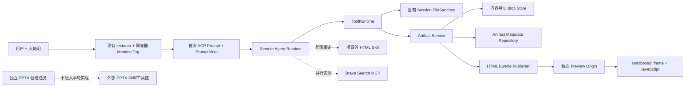
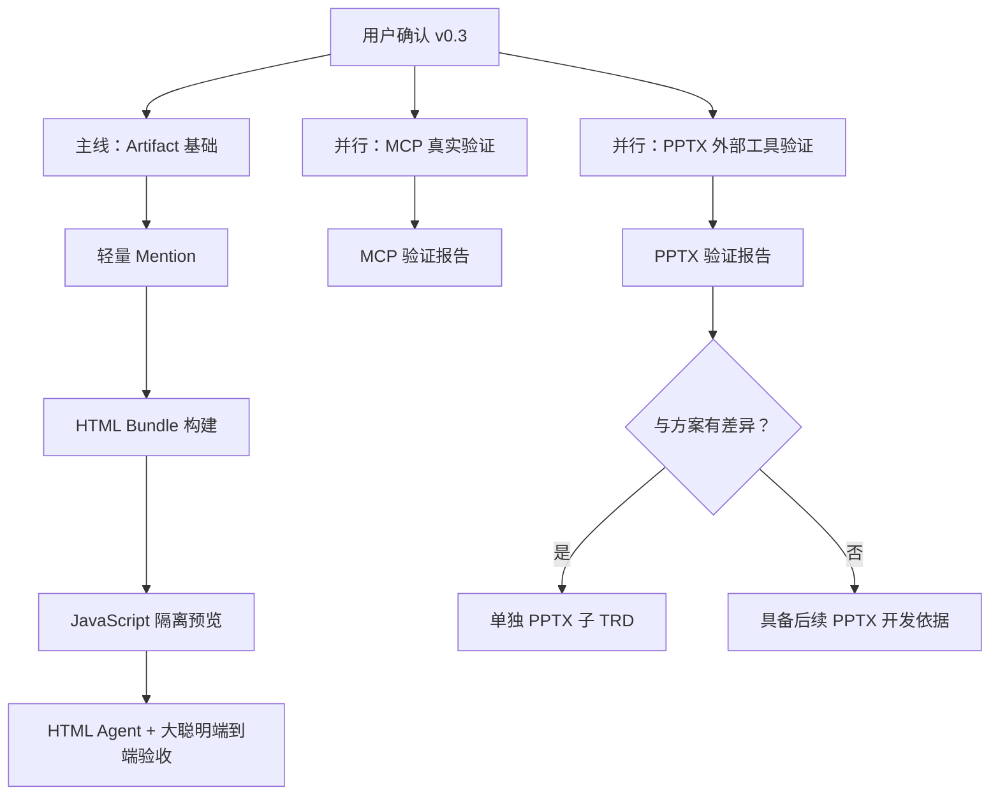

# MK 产物、Mention 与 HTML 链路升级（含 MCP/PPTX 能力预研）— TRD

> 版本：0.4（待确认）  
> 日期：2026-08-17  
> 状态：只完成方案整理，尚未开始开发、MCP 实测或 PPTX 实测  
> 关联讨论：`01a00dc2-58df-7122-b0ac-981216ae1ba1`、`01a00e17-dbbc-7f23-8647-5d56edb8b982`  
> 实施门禁：**本文件经用户确认后，才开始执行。**

---

## 1. 概要

本轮开发主线只做三件事：完成通用 Artifact 能力、给现有输入框增加轻量 Artifact Mention、跑通允许 JavaScript 动效的 HTML 生成与预览链路。PPTX 生成实现从本轮主线删除；远程 MCP 与外部 PPTX 工具分别建立并行验证任务，先取得真实能力证据，为后续开发做准备。

项目只提供通用技术能力，不内置 HTML/PPT/Imagegen 等业务 Skill，不内置 MCP Server，不创建默认 HTML/PPT Agent。主线完成后，通过 MK 配置外部 Skill、远程 MCP 和 Agent，并且只使用“大聪明”做模型验收。

### 1.1 本轮技术目标

- 新增 owner-scoped Artifact Store，支持普通文件与 HTML Bundle 的发布、查询、下载、归档和恢复。
- Blob 采用内容寻址，同一内容只保存一次；Mention 既有 Artifact 时可以直接读取并复用既有 Blob。
- 保留当前 `textarea`，通过 `@` 搜索和 Composer 输入区域内的 Tag 标签实现 Mention，不开发 Composer Editor。
- Prompt、Session、`load`、`resume` 都能携带稳定的 Artifact ID，不用文件名或文本位置判断身份。
- 跑通 HTML/CSS/JavaScript/图片/字体等 Bundle 资源的生成、发布和隔离预览，JavaScript 动效可运行。
- 构建 HTML 时不增加单独的“构建并发布”确认框。
- 所有新增协议行为都有测试，不破坏 ACP、Session、ToolRuntime 和 FileSandbox 既有不变量。

### 1.2 并行验证目标

- MCP 验证任务：先测试具体 Server 的连接、能力发现、真实调用、结果结构、效果、错误和安全边界，再决定后续 MCP 产物接入实现。
- PPTX 验证任务：先用真实外部 PPTX Skill/工具链和“大聪明”生成、渲染、检查 PPTX；如果实测与当前设想不一致，另建 PPTX 子 TRD，主文档不临时塞补丁。

### 1.3 非目标

- 本轮不实现 `build_presentation`、PPTX 专用构建服务、PPTX 预览或 PPT Agent。
- 不强制一次 PPT 任务只能产生一个 Artifact，也不拦截用户或 Skill 生成其他文件。
- 未来 PPT 专项首个要开发的格式是 `.pptx` Artifact；PDF、总览图和检查报告不是首个专项能力，但这不是“禁止其他产物”的运行时规则。
- Mention 既有图片时不强制禁止生成新图片；“优先复用”是提示词和验收期望，不是拦截器。
- 不开发 `contenteditable`、富文本 AST、行内 Mention node、光标映射或隐藏 markup 编辑器。
- 不内置 Skill、MCP Server、默认 Agent、固定 MCP URL 或演示数据。
- 不做 Skill 工具名动态映射；外部 Skill 使用能力描述，模型依据当前实际 Tool 描述选择工具。
- 不支持 MCP `AudioContent` 产物化。
- 不做旧 FileReference/旧对话迁移；旧测试对话已经删除。
- 不实现取消后暂存下一条 Prompt；该想法只保留在低优先级待办。
- 不自动重试；需要重试时由用户点击手动重试按钮。
- 不检查或阻断 HTML 外链、CDN 字体、外部图片和脚本是否自包含，避免首版误判。
- 不增加 Workflow/DAG、Planner/Executor、Runtime Event Store、长期记忆、RAG 或产品内多 Agent。

---

## 2. 本轮确认后的产品语义

### 2.1 PPTX 与其他产物

“PPT 最终只发布一个 `.pptx`”只作为典型目标场景，不作为程序级排他规则：

- 本轮主线不开发任何 PPTX 生成能力。
- 后续 PPT 专项首先保证 `.pptx` 能成为可下载 Artifact。
- 不因为当前 Turn 的目标是 PPT 就拒绝其他文件、删除其他 Artifact，或阻止模型生成新的图片。
- 如果用户、外部 Skill 或普通 Artifact 发布流程明确产生其他文件，通用 Artifact 能力仍可处理；是否发布由显式调用决定。

### 2.2 Mention 与 Blob 复用

Mention 表示“用户明确选择了一个自己已有的 Artifact 地址”，不是一句普通文本，也不是强制模型必须使用的指令：

- Remote 使用 `artifactId` 做 owner 校验并解析 `artifact://<artifactId>`。
- 读取的是 Artifact Blob Store，不读取来源 Session 的 Workspace。
- 内容寻址 Blob Store 以 SHA-256 去重；HTML Bundle 再次引用同一图片时，Manifest 指向同一 Blob，不复制内容，也不重新生成。
- 模型可根据任务判断 Mention 是否相关；用户要求新版本、新素材或 Mention 不适用时，可以生成新内容。
- 系统不通过“检测到 Mention 就禁用图片生成工具”来强制复用。

### 2.3 系统提示词语义

Runtime 增加稳定的平台语义，不增加工具别名映射：

```text
用户本轮可能明确引用已有 Artifact。每项引用都包含稳定的 artifactId 和只读 artifact:// 地址。
这些内容是用户已经拥有、可以直接读取或复用的产物；当它适合当前任务时优先复用，
不要仅因为存在生成工具就重复生成。若用户明确要求新版本、新素材，或引用不适用，可以生成新内容。
不要猜测文件名对应哪个产物，也不要尝试读取其他用户或其他 Session 的 Workspace。
```

这段语义只解释 Mention 是什么，不写死 `ask_user` 等外部 Skill 工具名，也不根据 Agent 动态补工具名。

---

## 3. 重新调研结论

### 3.1 textarea 可以保留，同时提供 Tag 标签效果

当前 `Composer.tsx` 是受控 `textarea`，`PromptMeta` 只有 `turnId`。本轮既要保留这个简单输入模型，也要让用户看到明确的 Mention Tag，而不是普通附件列表。

已核对 `/Users/bones/develop/JoyCode-team-studio` 的两套实现：

- `src/aiDesign/components/ChatInput/index.tsx` 把已选项作为 `.ai-chat-input-mention-chip` 渲染在输入组件同一个边框外壳内，标签状态与文本值分开保存。这种视觉和状态设计适合 MK。
- `src/aiDesign/components/ChatInputBase/index.tsx` 把标签真正混排在光标位置，但它依赖 `contenteditable`、Range、零宽字符和 DOM/State 同步，不属于本轮采用方案。
- `react-mentions` 也需要保存行内 markup 和文本索引；本轮没有必要引入。[react-mentions](https://github.com/signavio/react-mentions)
- Slack 的消息格式把稳定 ID 与展示名分开，说明 Tag 外观和 Mention 身份应该分层。[Slack mention formatting](https://docs.slack.dev/messaging/formatting-message-text/#mentioning-users)

本方案采用“textarea + 同容器 Tag”实现：

1. 用户在普通 textarea 中输入 `@`，弹出 Artifact 搜索浮层。
2. 选中后，在 Composer 的同一个边框和背景容器内、textarea 之前显示深色 Mention Tag；Tag 带类型图标、名称、省略号和删除按钮。
3. Tag 采用 flex 换行，多个 Mention 仍表现为标签组；视觉上属于输入框内容，而不是输入框外的附件栏。
4. textarea 仍只保存普通文本，Tag 不能进入光标、不能被文本选区拆开，也不维护行内字符位置。
5. 用户在正文中删除可读的 `@名称` 不会暗中删除 Tag；删除引用必须点击 Tag 删除按钮，避免文本解析误删。
6. 发送时调用 `onSend(text, artifactMentions)`，身份只存在结构化 Meta 中。
7. 历史消息在正文附近显示只读 Mention Tag，不恢复富文本节点。
8. 同名 Artifact 通过来源 Session、时间和短 ID 区分；文件名不参与授权或身份判断。

因此可以实现用户要求的 Mention Tag 样式，同时不引入 `react-mentions`、Lexical 或新的 Composer Editor。

### 3.2 远程 MCP 的实际前置事实

首个业务 Server 选择讨论中已经确定的 Brave Search MCP：

- 目标工具：`brave_web_search`、`brave_image_search`，必要时补测 `brave_llm_context`。
- 官方 2.x 的 `brave_image_search` 返回 URL、尺寸和置信信息，不再返回 Base64 图片。因此“搜索到图片”不等于“已经得到可复用 Blob”。[Brave Search MCP Server](https://github.com/brave/brave-search-mcp-server)
- 官方支持 STDIO 和 HTTP，但 HTTP 默认绑定回环地址且端点无认证；官方明确只建议在可信网络暴露。
- MK 当前管理入口只允许无鉴权 Streamable HTTP 候选；底层配置虽有 Secret/Auth 结构，管理测试与安装流程尚不能录入带认证远程候选。

因此本轮不能先验宣称 Brave 已适合云端公网部署，也不应直接实现所有 MCP Rich Content 产物化。必须先独立验证：

- 本地/可信网络 Streamable HTTP 是否能由 MK 完成测试、安装、发现和调用。
- 图片 URL 的字段、时效、可下载性、重定向、MIME、版权元数据和热链效果。
- 云端部署需要的反向代理认证，是否要求补充 MK 的 Bearer/Header Secret 配置入口。

协议内容类型另用官方 `server-everything` 作为测试夹具，验证 `ImageContent`、`resource_link` 和 Embedded Resource；它不是要交付给用户的业务 MCP。[MCP reference server](https://github.com/modelcontextprotocol/servers/tree/main/src/everything)

### 3.3 外部 PPTX 工具链现状

当前只做了只读环境核对，尚未生成测试 PPTX：

- 外部 PPTX Skill 位于项目外，不进入 MK 仓库。
- Bundled runtime 已有 PptxGenJS、LibreOffice `soffice`、Poppler `pdftoppm`、`python-pptx` 和 `lxml`。
- `markitdown` 当前未安装；如果真实 Skill 把它作为必须的内容检查器，实测时要记录为依赖差异，不能假装链路完整。
- 现有项目边界仍禁止 Skill 依赖自动安装和 Skill 脚本自动执行，后续必须区分“Skill 指令有效”和“MK Runtime 有受控执行能力”。

这些事实足以启动并行验证，但不足以直接确定 `build_presentation` 的输入合同或后端，所以 PPTX 实现从主线删除。

---

## 4. 现状与约束

### 4.1 现有能力

| 位置 | 当前状态 | 本轮影响 |
|---|---|---|
| `apps/web/src/components/composer/Composer.tsx` | 普通 React `textarea` | 在同一 Composer 外壳内增加搜索浮层和 Mention Tag，不替换编辑器 |
| `packages/contracts/src/index.ts` | `PromptMeta` 只有 `turnId` | 增加可选 Artifact Mention |
| `apps/remote/src/files/file-reference-service.ts` | FileReference 已有 owner、session、Blob 和哈希 | 新建 Artifact 模型，不迁移旧数据 |
| `apps/remote/src/capability/runtime-capability-resolver.ts` | 每个 Session 使用独立 FileSandbox | 保持 Workspace 不能跨 Session 读 |
| `apps/remote/src/tools/tool-registry.ts` | Agent 可配置 `allow/ask/deny`；`run_command` 运行时强制逐次询问 | HTML Agent 设 `write_file=allow`、`run_command=ask` |
| `apps/remote/src/mcp/` | 支持 STDIO/Streamable HTTP，管理入口仅无鉴权 HTTP | 先实测具体 Server，再补后续设计 |
| Web File Preview | 静态 HTML 会去掉脚本 | HTML Artifact 改为独立 Origin 隔离预览 |

### 4.2 必须保持的不变量

- Browser 与 Remote 之间只使用官方 ACP，一个页面只有一个 ACP connection owner。
- `load` 完整回放；`resume` 默认零回放，有 Turn 游标时只补断线增量。
- Remote 不保存 Web 投影，Web 不保存 Runtime 状态。
- 每个 Session 同时最多一个 Prompt。
- 文件 Tool 经过 FileSandbox；Workspace 写入继续经过 ACP permission 策略，但策略可以由 Agent 配成 `allow` 而不弹窗。
- AskUser 使用 ACP elicitation，不能拿 permission 代替。
- MCP/Skill 只能从 Remote Runtime 接入，并统一经过 ToolRuntime。
- Secret 不进入日志、Session、Artifact 或评测 Trace。
- 错误直接暴露，不偷偷改走另一条链路。

---

## 5. 总体架构



主线的依赖顺序是 Artifact → Mention/HTML。HTML 与 PPT 不存在相互依赖；本轮没有 PPT 实现阶段。

### 5.1 模块划分

| 模块 | 职责 | 建议目录 |
|---|---|---|
| Artifact contracts | Artifact、BlobRef、Manifest、Mention、错误码 | `packages/contracts/src/artifacts.ts` |
| ArtifactRepository | owner-scoped 元数据、归档、幂等 operation 状态 | `apps/remote/src/artifacts/` |
| ArtifactBlobStore | SHA-256 内容寻址、原子写、校验、流式读 | `apps/remote/src/artifacts/artifact-blob-store.ts` |
| ArtifactPublishService | 从当前 Session Workspace 或既有 Blob 显式发布 | `apps/remote/src/artifacts/artifact-publish-service.ts` |
| ArtifactMentionService | owner 校验、只读物化、模型上下文投影 | `apps/remote/src/artifacts/artifact-mention-service.ts` |
| StaticSiteBuildService | 校验入口和相对路径，生成 HTML Bundle Manifest | `apps/remote/src/html/static-site-build-service.ts` |
| Artifact routes | 列表、详情、内容、Bundle 资源、归档/恢复 | `apps/remote/src/artifacts/artifact-routes.ts` |
| Artifact UI | 我的产物、详情、下载、HTML Preview | `apps/web/src/components/artifacts/` |
| Mention UI | `@` 搜索浮层与同容器 Tag 标签 | `apps/web/src/components/composer/` |

不创建 `presentation/` 模块，不新增 `build_presentation` Tool。

---

## 6. Artifact 设计

### 6.1 数据模型

```ts
type ArtifactKind = "file" | "html_bundle";

interface BlobRef {
  sha256: string;
  byteLength: number;
  mimeType: string;
}

interface ArtifactRecord {
  schemaVersion: 1;
  artifactId: string;
  ownerId: string;
  sourceSessionId: string;
  sourceTurnId: string;
  kind: ArtifactKind;
  displayName: string;
  state: "active" | "archived";
  primary: BlobRef;
  manifest?: HtmlBundleManifest;
  operationId: string;
  createdAt: string;
  updatedAt: string;
}

interface HtmlBundleManifest {
  entryPath: string;
  files: Record<string, BlobRef>;
}
```

### 6.2 Blob 规则

- Blob 物理键使用 SHA-256；重复发布相同字节只增加引用，不重复写内容。
- Artifact 元数据提交成功前，临时 Blob 不对外可见。
- 读取时校验字节数和哈希；损坏直接报错，不自动寻找替代文件。
- Session、ACP 和模型 Tool result 只传 ID、元数据或短 handle，不传大型 Base64。
- 归档只改变 Artifact 状态，不删除 Blob，不破坏历史 Mention。
- Blob 回收不在本轮做；避免误删仍被其他 Artifact 引用的内容。

### 6.3 发布来源

允许两种来源：

1. 当前 Session Workspace 中已经通过 FileSandbox 和既有 permission 写出的文件。
2. 当前 owner 已发布 Artifact 的 BlobRef，经明确 Mention 或 `read_artifact` 选择后复用。

禁止来源：

- 其他用户的 Artifact 或 Blob。
- 其他 Session 的 Workspace 路径。
- 未经 FileSandbox 校验的宿主机路径。
- 由客户端直接提交的 Blob 物理路径或 ownerId。

### 6.4 平台 Tool

首版主线只新增四个模型可见 Tool：

| Tool | 默认权限 | 职责 |
|---|---|---|
| `search_artifacts` | allow | 搜索当前 owner 的 Artifact，返回轻量元数据 |
| `read_artifact` | allow | owner 校验后读取元数据或物化只读输入 |
| `publish_artifact` | allow | 显式发布普通文件或复用既有 Blob |
| `build_static_site` | allow | 从当前 Session 已有输出生成 HTML Bundle Manifest 并发布 |

不新增图片导入、PPT 构建、检查报告等模型 Tool。MCP 测试证据出来前不扩张工具面。

---

## 7. 轻量 Mention 设计

### 7.1 Contract

```ts
interface ArtifactMention {
  mentionId: string;
  artifactId: string;
  displayNameSnapshot: string;
  mimeTypeSnapshot: string;
}

interface PromptMeta {
  schemaVersion: 1;
  turnId: string;
  artifactMentions?: ArtifactMention[];
  retryOperationId?: string;
}
```

- `artifactId` 是唯一身份；两个同名 Artifact 不冲突。
- Snapshot 只用于历史展示，不能用于授权或定位 Blob。
- 不保存字符范围、行内 node、隐藏 markup 或 Composer AST。
- Prompt 到达 Remote 后先校验全部 Mention；任一越权或不存在则拒绝启动 Turn。

### 7.2 Web 交互

- 在普通 textarea 输入 `@` 后打开 Artifact 搜索列表。
- 选中项作为 Mention Tag 加入 Composer 的同一个输入外壳，位于 textarea 之前；Tag 使用深色背景、类型图标、名称和删除按钮。
- Tag 区与 textarea 共用边框、背景和焦点态，因此视觉上是输入框的一部分；多个 Tag 自动换行。
- textarea 仍保存普通文本；可以保留用户键入的可读名称，但身份只来自 Meta。
- Tag 不与正文行内混排，不追踪光标位置；这正是保留 textarea 而不引入富文本编辑器的边界。
- 发送成功后清空正文和已选项；发送失败则都保留。
- 运行中沿用当前禁用/取消规则，不增加 pending Prompt。
- 历史气泡正文附近展示只读 Mention Tag；`load` 和 `resume` 使用 Session 数据重建。

### 7.3 Remote 投影

Remote 把已验证 Mention 投影为单独上下文块，而不是把 ID 混入用户原文：

```text
<artifact_mentions>
- mentionId=m1; artifactId=art_xxx; uri=artifact://art_xxx; name=hero.png; mime=image/png
</artifact_mentions>
```

读取或物化时只从 Artifact Blob Store 创建当前 Session 的只读输入句柄，例如 `.mk/inputs/<artifactId>/...`。这是当前 Session 的受控副本/链接，不是跨 Session Workspace 访问。

---

## 8. HTML 生成与预览

### 8.1 `build_static_site`

输入只接受：

- 当前 Session Workspace 的相对入口路径。
- 可选展示名和同一个 `operationId`。
- 当前 owner 已验证的 Artifact 资源引用。

处理步骤：

1. FileSandbox 校验入口、相对路径、符号链接和容量。
2. 解析并收集当前 Workspace 中的 Bundle 文件。
3. 对 Mention 资源复用既有 BlobRef；其他文件按内容哈希入 Blob Store。
4. 写入 HTML Bundle Manifest 并原子提交 Artifact 元数据。
5. 返回 `artifactId`、预览地址和下载信息。

构建器不做以下事情：

- 不删除 JavaScript，不改写动效逻辑。
- 不检查、警告或阻断普通 HTTP/HTTPS 外链、CDN、字体、图片和脚本。
- 不把所有 `write_file` 输出自动发布为 Artifact。
- 不自动重试，不在失败时发布残缺 Bundle。

### 8.2 JavaScript 隔离预览

- HTML Artifact 由独立 Preview Origin 提供，不与 MK Web 共用 Origin、Cookie 或认证上下文。
- iframe 允许 `allow-scripts`，不授予访问 MK DOM、存储、Workspace 路径和 Secret 的能力。
- Bundle 相对资源只通过 `artifactId + manifest path` 路由读取，并逐次校验 owner。
- JavaScript 报错只影响预览，不影响 Composer、ACP connection owner 或主页面状态。
- 外部热链首版保持可用；风险由 Preview Origin 和 iframe 隔离承接，不做内容判断。

---

## 9. 权限与访问边界

### 9.1 强制隔离矩阵

| 访问 | 是否允许 | 条件 |
|---|---|---|
| 当前用户读取当前 Session Workspace | 允许 | 只能通过该 Session 的 FileSandbox |
| 当前用户读取其他 Session Workspace | **禁止** | 不提供路径入口，不因 Mention 放开 |
| 当前用户读取自己的同 Session Artifact | 允许 | owner 校验 |
| 当前用户读取自己的跨 Session Artifact | 允许 | 只读已发布 Blob，必须由用户选择/Mention 或 owner-scoped 搜索取得 |
| 当前用户读取其他用户 Artifact | **禁止** | 返回统一 404，不泄漏存在性 |
| 当前用户读取其他用户 Workspace | **禁止** | 无任何例外 |
| 客户端指定 ownerId 或 Blob 物理路径 | **禁止** | owner 来自认证 principal |

因此答案是明确的：跨用户 Artifact 读取不能；跨 Session Workspace 读取也不能。允许的跨 Session 复用对象只有“同一用户已经发布的 Artifact Blob”，不是来源 Workspace。

### 9.2 Agent 工具权限配置

“文件写入必须经过 ACP permission”表示调用必须走统一 PermissionGate 并服从 Agent 配置，不等于必须弹询问框。`allow` 本身就是合法权限结果，会直接执行。

HTML Design Agent 使用以下配置：

| Tool | Agent 配置 | 实际交互 |
|---|---|---|
| `list_files`、`read_file` | allow | 不询问 |
| `write_file` | allow | 不询问，但仍经过 FileSandbox 和 PermissionGate |
| `run_command` | ask | 每次询问；当前 Runtime 的 `always_ask` 规则继续生效 |
| `search_artifacts`、`read_artifact` | allow | 不询问，始终校验 owner |
| `publish_artifact` | allow | 不询问 |
| `build_static_site` | allow | 不询问 |
| `ask_user` | allow | 调用时使用 ACP elicitation，不使用 permission 弹窗 |

- 本轮没有 PPTX 构建 Tool。
- 删除 HTML/PPT 的独立“构建并发布”确认，也不实现“一次高层确认覆盖内部步骤”。
- `write_file=allow` 只放开当前 Session 的 FileSandbox 写入，不能扩大到其他 Workspace、宿主机路径或其他用户 Artifact。
- `run_command` 继续逐次询问，因为命令能力比文本写入范围更大。
- 调整 `write_file` 的 Tool 描述，不能再固定宣称“执行前需要用户授权”，应说明按当前 Agent 权限策略执行，避免模型与 UI 误解。

### 9.3 手动重试

- 所有新增链路不自动重试。
- 可原样重试的失败显示手动重试按钮。
- 服务端保存 `operationId + ownerId + sessionId + toolName + 参数指纹`。
- 重试只能重放原参数；成功结果丢失时返回原 Artifact，不重复发布。
- 参数错误、越权、Artifact 已删除等不能原样重试的错误不显示按钮。

---

## 10. MCP 并行能力验证任务

该任务在总方案确认后与 HTML 主线并发启动，但独立保存报告、日志和测试产物。它先验证，不内置 Server，不先写 MCP 产物适配代码。

### 10.1 被测 Server

| Server | 用途 | 运行方式 |
|---|---|---|
| Brave Search MCP 2.x | 真实网页/图片搜索效果 | 官方包独立启动为 Streamable HTTP，通过 MK 配置连接 |
| MCP `server-everything` | Rich Content/Resource 协议夹具 | 独立测试环境，不作为产品依赖或默认配置 |

### 10.2 Brave 测试矩阵

- MK 管理页：候选测试、能力发现、安装、绑定 Agent、禁用/重连/卸载。
- `brave_web_search`：中文/英文查询、数量、safe search、空结果、配额、无效参数和认证错误。
- `brave_image_search`：URL、缩略图、尺寸、来源、置信信息、时效、重定向、MIME 和热链展示。
- `brave_llm_context`：仅在 HTML 素材研究确实受益时补测，不默认扩大 Tool 面。
- 大聪明选择工具的准确性：不依赖 Skill 内硬编码 Agent 工具名，也不由 Runtime 动态映射。
- HTTP transport：连接中断、取消、超时、Server 重启、并发 Turn 隔离。
- 云端安全：无认证端点不得直接暴露公网；验证反向代理 Bearer/Header 后，记录 MK 管理入口缺口。

### 10.3 协议夹具测试

- `ImageContent` 能否被当前 MCP Client、ToolRuntime 和 Session 正确保留。
- `resource_link` 是否能由同一 MCP 连接读取，生命周期是否只在本次连接/Session 内有效。
- Embedded text/blob Resource 的大小、MIME 和错误行为。
- 明确不测试/不实现 Audio 产物化。

### 10.4 输出与决策

输出：

- `远程MCP能力验证报告.md`：版本、部署方式、配置、实际 Tool Schema、输入输出样例摘要、错误、耗时、效果截图/Artifact、结论。
- 原始敏感返回只留在受控测试目录；报告不写 API Key、认证头和完整敏感 URL。

判定：

- Brave 图片 URL 足以直接用于外部热链：HTML 主线无需为了它实现 Base64 产物化。
- 需要稳定本地素材：另行设计安全导入，不把 URL 当 Blob，也不在本轮临时扩工具。
- 云端必须鉴权且 MK UI 无法配置：报告形成后单列远程 MCP 鉴权开发项，不阻塞 HTML 核心链路。
- Rich Content 与真实 Server 输出不一致：以后只实现被真实用例证明需要的类型。

---

## 11. PPTX 并行能力验证任务

该任务与 HTML 主线、MCP 验证并发启动，但只验证外部能力，不修改本轮主线代码。

### 11.1 验证对象

- 项目外的真实 PPTX Skill。
- 大聪明模型，禁止使用 Minimax 或其他模型。
- PptxGenJS 生成、LibreOffice 打开/转 PDF、Poppler 渲染、`python-pptx`/Open XML 结构检查。
- `markitdown` 缺失是否影响 Skill 的必需检查步骤。

### 11.2 测试用例

- 生成一份含中文、图片、图表、母版/布局差异的实际 PPTX。
- Mention 既有图片的场景：验证模型能理解“这是已有 Artifact 地址，可直接使用”，并记录是否复用。
- 新图片场景：允许模型在用户要求时生成或搜索新素材，不用拦截器禁止。
- 打开验证：PowerPoint（环境可用时）或 LibreOffice 能打开，页面数、文本、图片和图表存在。
- 视觉验证：逐页渲染，检查溢出、重叠、缺字、字体替换和图片失真。
- 工具边界：记录 Skill 实际需要的文件读写、命令、图片处理和依赖，不把 Skill 脚本自动执行当成既有产品能力。
- 输出行为：确认 `.pptx` 能单独成为 Artifact；不把“不生成其他文件”作为强制通过条件。

### 11.3 输出与分支条件

输出 `PPTX外部工具能力验证报告.md`，包括：

- 实际 Skill 输入/输出、依赖、命令、文件结构和失败点。
- 大聪明 Tool Trace、生成的 `.pptx`、渲染图和结构检查结果。
- 与本总方案假设的一致项和差异项。

如果出现任一差异，创建：

`product/产物与HTML-PPT生成链路升级-202608171455/PPTX生成链路子方案-trd.md`

差异包括但不限于：需要新的受控执行工具、需要未安装依赖、Skill 只能输出中间 DSL、PPTX 无法直接校验、Mention 资源无法传入、或 Artifact 发布方式不同。子 TRD 重新设计 PPTX 链路，本轮主线不边做边猜。

---

## 12. 性能与容量

首版不设置产品级延迟 SLA、错误率告警阈值、Tool 轮数、Bundle 文件数或自动熔断数字。只保留防止云端磁盘、内存和请求被单个大对象耗尽的宽松、可配置容量值。

| 项目 | 首版默认值 |
|---|---:|
| `write_file` 单个 UTF-8 文本 | 5 MiB |
| `read_file` 单个文本 | 5 MiB；大文本使用范围读取 |
| 单个普通 Artifact 文件 | 100 MiB |
| 单个 HTML Bundle 总大小 | 500 MiB |
| 单 Turn 临时文件与 staging 总量 | 1 GiB |

- 数值来自服务端配置，不写死在 Artifact schema。
- 超限直接说明具体对象，不截断、不降质、不拆分、不自动重试。
- Artifact 正文使用流式读写；ACP、Session、JSON API 和模型上下文不承载大段 Base64。
- 后续根据真实云端规格与用量调整；本轮不凭空增加更多阈值。

容量参考：[Cloudflare Workers limits](https://developers.cloudflare.com/workers/platform/limits/)、[AWS API Gateway quotas](https://docs.aws.amazon.com/general/latest/gr/apigateway.html)、[Amazon S3 quotas](https://docs.aws.amazon.com/general/latest/gr/s3.html)。

---

## 13. 错误处理

| 错误码 | 场景 | 行为 |
|---|---|---|
| `ARTIFACT_NOT_FOUND` | 不存在或不属于当前 owner | 统一 404，不泄漏存在性 |
| `ARTIFACT_CONTENT_UNAVAILABLE` | Blob 缺失或哈希不一致 | 失败并返回 requestId，不找替代文件 |
| `ARTIFACT_PUBLISH_FAILED` | Blob 或元数据提交失败 | 保留 Workspace，显示手动重试 |
| `ARTIFACT_LIMIT_EXCEEDED` | 单文件或总量超限 | 指出超限项，修改输入后再试 |
| `MENTION_INVALID` | Meta 结构非法或重复 | Prompt 拒绝，不启动 Turn |
| `MENTION_ARTIFACT_FORBIDDEN` | 越权 Mention | 统一按不存在处理 |
| `HTML_BUILD_FAILED` | 路径、Bundle 或提交失败 | 不发布残缺 Artifact，可手动重试 |
| `OPERATION_RETRY_MISMATCH` | operationId 与参数不一致 | 拒绝并记录审计事实 |
| `OPERATION_ALREADY_SUCCEEDED` | 成功响应丢失后重试 | 返回原 artifactId |

MCP/PPTX 验证任务记录实际错误，不提前为未实现产品链路固定错误码。

---

## 14. 实现与执行计划

用户确认后，三条任务同时启动。主线连续完成所有阶段，不按 token/时间预算暂停，不在阶段间追问；遇到不影响安全和范围的细节直接按本 TRD 判断。只有外部凭证缺失、需要改变强制安全边界或不可逆外部操作时才报告阻塞。



### 14.1 主线 Phase 0：实施前审计

- 检查工作树与现有改动，逐文件避让用户未提交内容。
- 跑现有 typecheck/test/build 基线并记录失败，不把旧失败算成新回归。
- 冻结本 TRD 中 Artifact/Mention/HTML Contract 测试。

退出条件：开发目标文件和基线已明确；不再询问普通实现细节。

### 14.2 主线 Phase 1：Artifact 基础

- 实现 contracts、Repository、内容寻址 Blob Store、Publish Service、operation 幂等。
- 扩展 FileSandbox 的流式二进制读取与可配置大文件上限。
- 实现四个 Artifact/HTML 平台 Tool 的通用部分。
- 实现列表、详情、内容、Bundle 资源、归档和恢复 API。
- 不迁移旧 FileReference，不把所有文件写入自动变成 Artifact。

退出条件：普通文件和空壳 HTML Bundle 可显式发布、下载、归档；重复 operation 不重复创建。

### 14.3 主线 Phase 2：Tag 风格轻量 Mention

- 保留 textarea，参照 JoyCode Team Studio 的视觉结构，在同一 Composer 外壳内增加 `@` 检索浮层和 Mention Tag。
- Tag 与正文状态分离，不使用 `contenteditable`、Lexical、Range 或零宽字符。
- 扩展 PromptMeta、Session 用户消息和 ACP 回放投影。
- 实现 owner 校验、`artifact://` 投影和当前 Session 只读物化。
- 修正 optimistic reconciliation，不能只按纯文本比较。
- 增加系统提示词的稳定 Artifact 语义，不做工具名动态映射。

退出条件：同名 Artifact 可区分；刷新、`load`、`resume` 不丢 Mention；不能越权或读取其他 Session Workspace。

### 14.4 主线 Phase 3：HTML Bundle 与预览

- 完成 `build_static_site`、Manifest、相对资源路由和既有 Blob 复用。
- 实现独立 Preview Origin 与 sandboxed iframe，允许 JavaScript 动效。
- 不增加 HTML 构建专用确认，不检查外部热链是否自包含。
- 增加 Bundle 下载、详情和运行错误展示。

退出条件：带 HTML/CSS/JS、图片和字体的 Bundle 可发布、下载、刷新后预览；动效运行且不能访问 MK 主页面状态。

### 14.5 主线 Phase 4：Web 与手动重试

- 完成“我的产物”列表、详情、归档、恢复和 HTML 预览入口。
- Tool Block 增加可重试错误按钮，所有新增链路保持零自动重试。
- 清理临时目录只作用于本次 `.mk` 范围，失败时保留可修复 Workspace 输出。

退出条件：UI、Session 和 Artifact 状态一致；重试不扩大参数或产生重复 Artifact。

### 14.6 主线 Phase 5：配置化端到端验收

- 在项目外准备 HTML Design Skill，删除遗留的内部工具名，改成能力描述。
- 通过 MK 配置 Skill 和经验证可用的远程 MCP；不把配置写成默认产品数据。
- 新建 HTML Design Agent，只绑定“大聪明”和完成任务所需的实际能力。
- 将该 Agent 的 `write_file` 配为 `allow`、`run_command` 配为 `ask`，Artifact 与 HTML 构建工具配为 `allow`。
- 运行含 JavaScript 动效、外部/既有图片和 Artifact Mention 的真实 Prompt。
- 完成全量 typecheck/test/build 与浏览器交互验收。

退出条件：大聪明生成可运行 HTML Bundle Artifact；Skill/MCP 未进入仓库；失败没有动态工具映射或静默降级。

---

## 15. 测试策略

| 层级 | 必测内容 |
|---|---|
| Contracts | file/html bundle、BlobRef、Prompt Mention、operationId、非法输入 |
| Repository | owner 隔离、原子提交、归档/恢复、幂等、Blob 损坏 |
| FileSandbox | 路径逃逸、符号链接、范围读取、容量、只清理本次目录 |
| ToolRuntime | `write_file=allow` 无弹窗、`run_command` 逐次询问、构建/发布 allow、无自动重试、手动重试 |
| ACP | Prompt Meta、单 Prompt、`load` 全量、`resume` 增量、取消行为不变 |
| Mention Web | 同容器 Tag 样式、`@` 搜索、键盘/鼠标选择、中文输入法、删除、换行、同名、失败保留、历史回放 |
| 权限 | 跨用户 Artifact 404、跨 Session Workspace 拒绝、同 owner 跨 Session Artifact 可明确选择 |
| HTML | JS/CSS 动效、Bundle 相对资源、Mention Blob 复用、外部热链、Preview Origin 隔离 |
| Artifact UI | 列表、详情、下载、归档/恢复、刷新后打开 |
| MCP 验证 | Brave 真实调用、URL 结构、错误、transport、云端认证差距、reference content types |
| PPTX 验证 | 生成、结构、打开、逐页渲染、中文、图片、图表、依赖和 Tool Trace |

必须保持回归：官方 ACP 生命周期、Agent 固定绑定、Capability snapshot、Context Experiment、Permission/Elicitation 分离、MCP/Skill ToolRuntime 边界和 Secret 隔离。

---

## 16. 验收标准

### 16.1 主线功能

- 普通文件与 HTML Bundle 都能成为 owner-scoped Artifact。
- 相同字节只保存一个 Blob；Mention 既有图片时可直接复用原 BlobRef。
- 没有程序规则强制模型必须复用，也没有规则禁止生成其他文件或新图片。
- Composer 仍是 textarea，但 Mention 以 Tag 标签显示在同一个输入外壳内；没有 contenteditable、行内 AST 或第三方 Mention Editor。
- 用户可从自己的其他 Session 选择已发布 Artifact，但不能读取那个 Session 的 Workspace。
- 任何跨用户 Artifact/Blob 访问都按不存在处理。
- HTML JavaScript 动效正常，预览不能获得 MK Cookie、Token、DOM、Workspace 或 Secret。
- HTML Agent 的 `write_file=allow`，写文件不弹窗；`run_command=ask`，命令仍逐次询问；发布和 HTML 构建均为 allow。
- 所有失败不自动重试；可重试项由用户手动触发。

### 16.2 配置与模型

- 仓库没有新增业务 Skill、MCP Server、固定 MCP URL、默认 HTML/PPT Agent。
- 外部 Skill 使用能力描述，不依赖 Agent 私有工具名，不由 Runtime 动态打补丁。
- HTML 端到端只使用“大聪明”；不存在 Minimax 测试记录。
- 外部能力缺失时直接报告未绑定，不偷偷换模型、换工具或换产物。

### 16.3 并行报告

- MCP 报告必须包含具体 Server、版本、配置、真实调用和输出结构，不以 README 推断代替实测。
- PPTX 报告必须包含真实 `.pptx`、打开/渲染/结构结果和大聪明 Tool Trace。
- PPTX 实测有差异时必须生成独立子 TRD；没有证据前不进入 PPTX 主功能开发。

---

## 17. 部署、数据与回滚

### 17.1 发布顺序

1. Artifact Repository/Blob Store/API 与功能开关。
2. 轻量 Mention 和 Session/ACP 扩展。
3. HTML Bundle 构建、Preview Origin 和 Artifact UI。
4. HTML Design Agent 配置化验收。

MCP/PPTX 验证报告与主线并发产出，不是上述代码发布阶段。

### 17.2 数据策略

- 不迁移旧 FileReference 或已删除对话。
- 新版本从空 Artifact Repository 开始记录新产物。
- Artifact/Blob 使用独立目录；功能回滚不删除用户数据。
- Mention 字段是 Session 消息可选扩展；旧记录不需要回填。

### 17.3 回滚

- 可以关闭新 Artifact 发布和 HTML Preview，但仍保留既有 Blob/元数据供恢复。
- 回滚不覆盖用户 Workspace，不批量重建，不自动重试。
- Preview Origin 可独立关闭，不影响普通 Artifact 下载。
- PPTX 本轮无实现，因此没有 PPTX 功能回滚项。

---

## 18. 风险与处理

| 风险 | 影响 | 处理 |
|---|---|---|
| JavaScript 预览越权 | 高 | 独立 Origin、最小 iframe sandbox、越权测试 |
| Mention 文本与 Tag 状态不一致 | 中 | 身份只认 Meta；删除引用只操作 Tag，不用正文解析授权 |
| 同 owner 跨 Session Artifact 被误当 Workspace | 高 | 始终从 Blob Store 读取，只在当前 Session 物化 |
| Brave 图片只有 URL | 中 | 先测热链与下载边界，不伪装成 Blob |
| Brave HTTP 公网无认证 | 高 | 只在回环/可信网络验证；云端需反代鉴权与 MK 配置补充 |
| PPTX Skill 与运行时不兼容 | 高 | 独立真实验证；有差异就创建 PPTX 子 TRD |
| `markitdown` 缺失 | 中 | 在验证报告中确认是否必需，不自动安装掩盖差异 |
| 外部 Skill 描述不足 | 高 | 用大聪明真实验收，调整项目外 Skill 文案，不加 Runtime 映射补丁 |
| 手动重试重复发布 | 高 | operationId、参数指纹、成功结果幂等返回 |
| 当前工作树已有修改 | 中 | 实施前逐文件审计，避让用户改动，拆分提交 |

---

## 19. 日志与观察

首版记录事实，不设置未经实测的告警阈值：

- Artifact 发布/读取结果、类型、字节、耗时和 operation 幂等命中。
- Blob 哈希失败、内容缺失和复用命中。
- Mention 校验失败类别，不记录用户正文。
- HTML 构建阶段、预览加载和隔离错误。
- 手动重试次数与结果，不自动再次调用。
- MCP/PPTX 验证任务的版本、工具、结果类别和非敏感摘要。

日志不记录 Blob 正文、Prompt、Secret、认证头、API Key 或完整敏感 URL。

---

## 20. 待确认事项

两条批注均已通过代码确认并收敛，不再作为技术疑问：

- Mention 使用 textarea + 同容器 Tag 标签，不开发富文本 Composer。
- HTML Agent 使用 `write_file=allow`、`run_command=ask`；Artifact 发布和 HTML 构建均为 `allow`，没有额外构建确认。

当前只等待用户对 v0.4 总方案的整体确认。确认后直接执行，不再为普通实现细节逐项追问。PPTX 的输入结构、后端和产品 Tool 由并行实测报告/必要时的独立 PPTX 子 TRD 决定。

---

## 21. 变更记录

| 版本 | 日期 | 变更内容 | 作者 |
|---|---|---|---|
| 0.1 | 2026-08-17 | 合并 Artifact/Mention 与 HTML/PPT 生成链；不内置 Skill/MCP；模型改为大聪明 | Codex |
| 0.2 | 2026-08-17 | HTML 执行 JavaScript；移除 Audio、旧迁移、取消后暂存、多格式聚合和自动重试；增加手动重试与宽松容量 | Codex |
| 0.3 | 2026-08-17 | Mention 改为 textarea 外挂选择，不开发 Composer Editor；PPTX 实现移出主线；MCP/PPTX 改为并行真实验证；PPTX 单文件与 Mention 复用改为建议而非拦截；删除构建专用确认；明确跨用户 Artifact 和跨 Session Workspace 禁止 | Codex |
| 0.4 | 2026-08-17 | 参照 JoyCode Team Studio 将 Mention 明确为 Composer 同容器 Tag 标签；纠正权限理解，HTML Agent 配置 `write_file=allow`、`run_command=ask`，Artifact 发布与 HTML 构建均为 `allow` | Codex |
