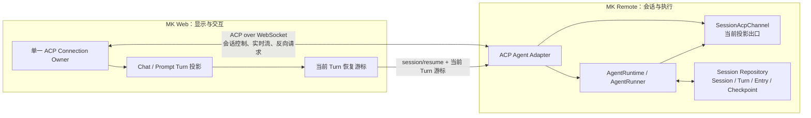
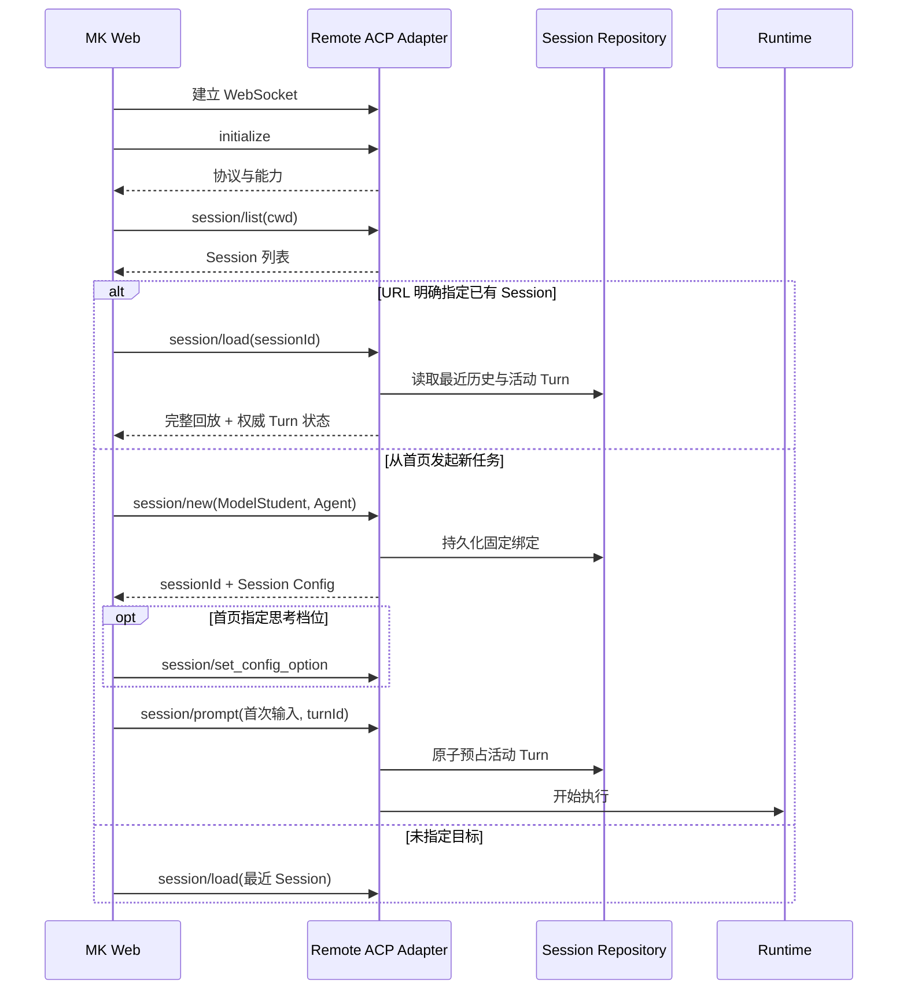
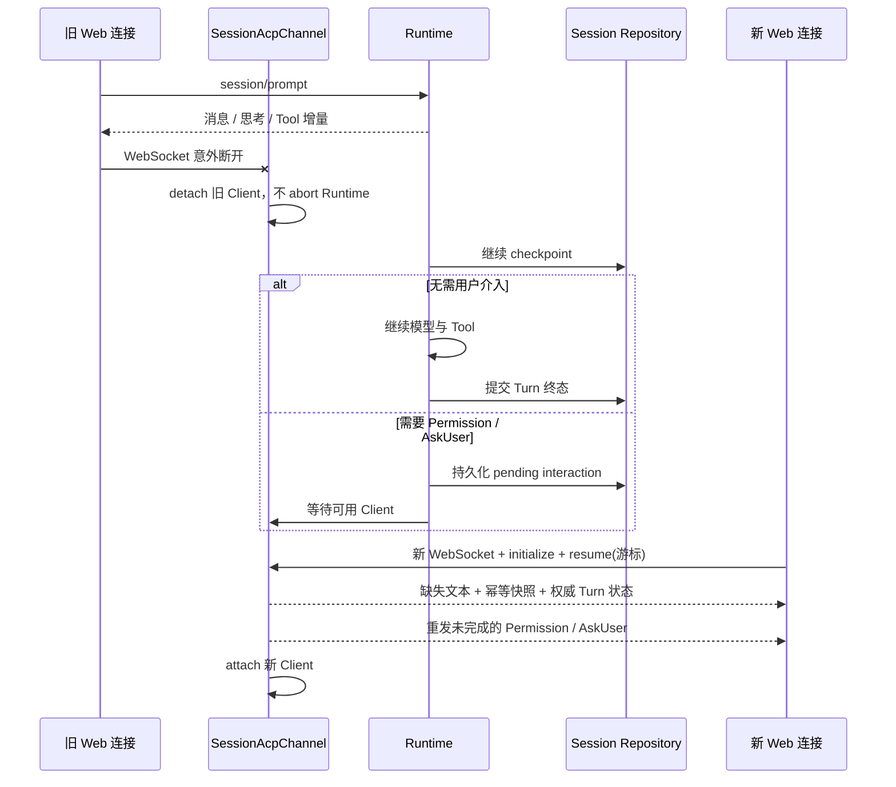

# Models Kindergarten 会话连接策略

## 1. 核心结论

MK Web 是会话的显示与交互端，Remote 是 Session、Prompt Turn 和 Runtime 的执行端。两者通过官方 ACP WebSocket 交互，但生命周期彼此独立：

- WebSocket 断开只代表实时投影通道丢失，不代表 Session 关闭，也不会自动取消正在执行的 Turn。
- Remote 可在 Web 离线时继续模型调用和无需用户介入的 Tool，并把 checkpoint 与终态写入 Session Repository。
- Remote 在离线期间遇到权限审批或 AskUser 时不会擅自决定，而是停在当前 Turn，等待 Web 重连后重新发起交互。
- 只有 Web 发出明确控制语义时才会打断 Remote：停止当前 Turn、取消 AskUser，或显式关闭/切换当前 Session。
- Web 不保存 Runtime 状态，Remote 不保存 Web 投影；重连依靠 Remote 的持久化事实与活动 Turn 投影重建界面。

## 2. 连接架构与所有权

三种生命周期必须分开：

| 对象 | 所有者 | 开始 | 结束 | 关键含义 |
| --- | --- | --- | --- | --- |
| ACP Connection | 当前浏览器页面 | WebSocket + `initialize` 成功 | 传输断开或 Web 主动释放 | 只是传输通道，不拥有 Runtime |
| Session | Remote Repository | `session/new` 持久化成功 | `session/close` 只释放活动执行资源 | 历史长期存在；`close` 不等于删除 |
| Prompt Turn | Remote Runtime | `session/prompt` 预占成功 | `completed / failed / cancelled / interrupted` | 不依赖发起 Prompt 的那条 WebSocket 继续存活 |

每个浏览器页面只有一个 ACP connection owner。所有 `new / list / load / resume / prompt / cancel / close` 及 Permission/Elicitation 回复都经过它，组件不能各自建立连接。

## 3. ACP 会话操作的精确语义

| 操作 | 用途 | 回放语义 | 是否打断活动 Turn |
| --- | --- | --- | --- |
| `initialize` | 协议版本与 Client 能力握手 | 不回放 | 否 |
| `session/list` | 取得当前 cwd 可见的 Session | 不回放 | 否 |
| `session/new` | 用 ModelStudent + Agent 创建固定绑定 Session | 不回放 | 否 |
| `session/load` | 新页面或切换会话时重建历史投影 | 当前首屏范围全量回放 | 否；如有活动 Turn，同时接管其实时出口 |
| `session/resume` | 原页面状态仍在时手动重连 | 默认零回放；带游标时只补当前 Turn 缺口 | 否 |
| `session/prompt` | 开始一个新 Turn | 不回放 | 同一 Session 同时最多一个 Prompt |
| `session/cancel` | 用户点击“停止” | 不回放 | 是；只取消当前 Turn，不关闭 Session 和连接 |
| `session/close` | 明确离开、新建或切换会话 | 不回放 | 是；先取消活动 Turn，再关闭 Session ACP Channel，不删除历史 |

`load` 的“完整回放”是相对 `resume` 的增量语义：首屏回放最近 20 个完整 Turn，更早历史由只读 Control API 分页前插，Web 最多保留 100 个 Turn。Control API 不承载 Prompt、取消、实时流或 Runtime 状态。

## 4. 首次进入与第一轮对话

初始选择顺序是：明确 URL/launch 目标优先，否则打开最近 Session。没有任何 Session 且没有 launch 输入时，Web 保持未选会话，不能在缺少 ModelStudent + Agent 绑定时暗中创建 Session。

明确 sessionId 不存在、cwd 不匹配或无权访问时应直接报错，不自动换成其他会话。Session 创建后 `modelStudentId + agentId` 固定；Agent 或 ModelStudent 后续删除/不可用时，历史仍可 `load`，但新 `prompt` 必须明确拒绝，不偷换其他 Agent 或模型。

## 5. 历史加载与活动 Turn 接管

`session/load` 既可加载已结束会话，也可接管仍在 Remote 执行的 Turn，顺序固定为：

1. Web 清理上一个 Session 的局部投影，为本次 load 建立独立 `operationId`。
2. Remote 将活动 `SessionAcpChannel` 进入接管窗口；窗口内新产生的实时通知暂存，不与历史回放交叉。
3. Remote 按原顺序回放最近历史，再发送活动 Turn 的权威状态。
4. Remote 按序刷出接管窗口内的新增通知，然后把该 Web 连接设为当前实时出口。
5. Web 将已结束 Turn 提交为历史；若 Remote 报告仍在活动，则只把该 Turn 保留在 streaming 投影中。

历史回放、实时增量和只读分页都使用 `messageId / toolCallId / turnId` 等稳定 ID 聚合。重叠到达只覆盖同一对象，不重复创建消息或 Tool 记录。

## 6. Web 离线时 Remote 如何继续

断线期间普通实时通知不无界缓存；Remote 依靠 Session Entry、Turn checkpoint 和活动投影在重连时重建缺口。只在 `load/resume` 的有界接管窗口内暂存新增通知，以保证“缺口快照在前，新增实时流在后”。

## 7. 手动重连策略

Web 不自动重连。意外断线后保留当前 Session、部分消息和 Prompt Turn 投影，界面进入 `disconnected`，只提供明确的“重新连接”操作。

用户点击后：

1. 创建一条新 WebSocket 并重新 `initialize`；旧连接不复用。
2. 从 Web 已收到的当前 Turn 计算游标：`turnId` 及每个 message/thought 的 `textLength + nextChunkIndex`。
3. 发送 `session/resume`。Remote 只处理该 Turn：
   - 文本从 `textLength` 后开始补发；
   - Tool、上下文摘要、Token 用量和上下文窗口用量按稳定 ID 重发幂等快照；
   - 最后发送 Remote 的权威 Turn 状态。
4. 若 Turn 已在离线期间结束，Web 补齐输出后按权威终态提交 streaming 投影。
5. 若 Turn 仍在运行，新 Client 成为实时出口，后续继续流式投影。

没有当前 Turn 游标时，`resume` 只重新挂接通道，不承担历史加载。浏览器刷新、重开页面或局部状态已丢失时必须走 `load`，不能用无游标 `resume` 伪装历史恢复。

`resume` 的 `turnId` 不存在、游标为负数/非整数，或 `textLength` 超过 Remote 文本长度时，Remote 拒绝恢复，不猜测，也不回退到全量重放。用户可重新打开该 Session，通过 `load` 重建投影。

## 8. 什么会打断 Remote，什么不会

| 事件 | 对当前 Turn 的影响 | 对 Session/历史的影响 |
| --- | --- | --- |
| 网络抖动、WebSocket 断开、电脑休眠 | 不取消；Remote 继续或等待用户交互 | 无 |
| 刷新、关闭标签、浏览器崩溃 | 按传输丢失处理；不把 `pagehide` 当成可靠取消指令 | 无；重开后 `load` |
| 用户点“停止” | `session/cancel`，Turn 进入 `cancelled` | Session 和连接保留，可继续下一轮 |
| 用户拒绝 Permission | 当前 Tool 返回 denied；模型可继续选择其他路径 | 无 |
| 用户取消 AskUser | 取消当前 Turn，不伪装成 Tool 错误 | Session 和已有历史保留 |
| 用户明确新建/切换 Session，或在 MK 内离开会话页 | 先 `session/close`，因此取消活动 Turn；完成后再导航 | 历史保留；当前 Session ACP Channel 释放 |
| 模型或 Runtime 发生无法继续的错误 | Turn 进入 `failed` | 已落盘事实保留 |
| Remote 进程重启/崩溃 | 原内存 Runtime 不能续执；启动恢复把遗留 active Turn 收敛为 `interrupted` | 已持久化 Prompt、Entry 和 checkpoint 保留，可重新发送 |

当前 UI 在 Turn 活动期间禁用侧边栏新建和切换，避免把普通浏览误触发为 `session/close`。但只要用户走的是明确离开路径，就以 `close` 的取消语义为准，不能当成普通断线。

## 9. 异常与并发边界

| 边界 | 处理策略 |
| --- | --- |
| 同一 Session 并发两个 `prompt` | 第二个立即拒绝；不排队、不合并 |
| Turn 运行时修改思考档位 | 拒绝；当前 Turn 使用开始时冻结的配置 |
| 断线发生在 Permission/AskUser 已发出后 | Remote 持久化 pending interaction；新 Client attach 后以同一 interactionId 重发，旧页面回复失效 |
| 回放期间又产生实时增量 | 先缓存新增，回放完成后按序刷出，防止历史与实时流交叉 |
| 补发过程中再次断线 | 新 Client 再次 detach；不改变 Runtime，下次用新游标继续 resume |
| ACP 连接容量已满 | WebSocket upgrade 返回 503，不创建半连接、不修改 Session；Web 保持 disconnected，由用户手动重试 |
| `initialize / load / resume` 失败 | 关闭该次新连接，Web 保持 disconnected；不自动创建替代 Session |
| 只读历史分页失败 | 只影响“加载更早历史”，不取消当前 Turn，不污染实时 ACP 流 |
| 同一 Session 被多个页面打开 | D2P-1 不支持多页面并发控制。Remote 只保留一个当前实时出口，后成功 `load/resume` 的页面接管投影；旧页面不应继续发送控制指令 |

## 10. 会话连接不变量

1. Browser 与 Remote 的会话控制和 Agent 交互只使用官方 ACP，不引入 RCS、SSE、EventBus 或第二套消息信封。
2. 一个浏览器页面只有一个 ACP connection owner。
3. 断线只 detach Client，不把 Prompt 请求的传输 AbortSignal 连接到 Runtime AbortController。
4. `load` 负责历史重建；`resume` 负责原页面当前 Turn 的缺口恢复；两者不互相代替。
5. 正常连接下由 `PromptResponse` 提交流式投影；断线恢复后由 Remote 的权威 Turn 终态提交。
6. 断线期间不无界缓存所有通知，也不让 Web 伪造 Runtime 终态。
7. 用户交互必须精确归属 `sessionId + turnId + interactionId/toolCallId`，不跨 Session 广播或串流。
8. 停止、关闭、断线、失败和 Remote 重启分别映射为 `cancelled`、通道释放、继续/等待、`failed` 和 `interrupted`，不混成一个“连接错误”。
